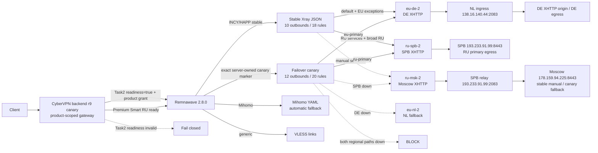
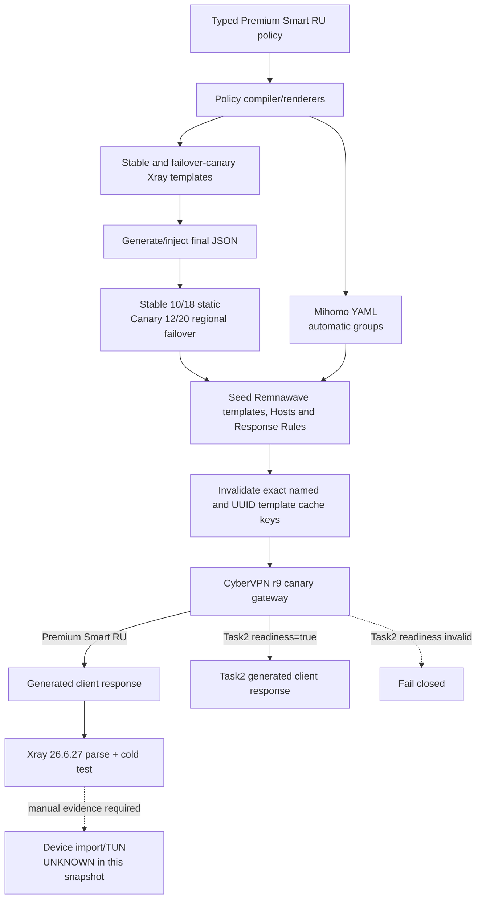
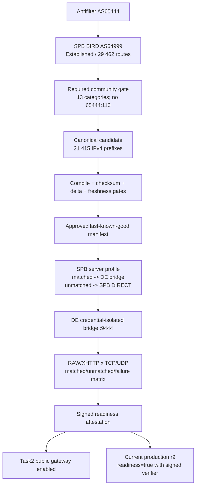
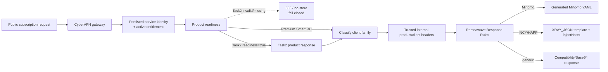

# CyberVPN Premium Smart RU: текущая production-архитектура

> **INTERNAL ONLY.** Документ содержит operational topology production:
> публичные endpoints, relay paths, listener ports, literal bootstrap IP и
> backup location. Не публиковать его в customer tickets, public issues,
> внешних чатах или vendor requests. Для внешней передачи требуется отдельная
> redacted-версия.

> Граница snapshot: основной Premium Smart RU VPN recheck выполнен
> `2026-07-11`; Task2 production activation и финальная live-сверка выполнены
> `2026-07-12`. Для Task2 принят owner contract из 13 Antifilter communities
> без `65444:110`, опубликован active/LKG artifact, поднят IPv6 bridge SPB -> DE,
> пройдена RAW/XHTTP TCP/UDP route matrix, а backend `r9-xray-failover-canary-71728ebe` принимает
> signed readiness. После security recheck customer ingress переведен на
> A-only dedicated IPv4 ports `4443/8444`; Task2 rules больше не охватывают
> preserved Smart RU inbounds. Реальный Task2 account profile прошел отдельный
> Xray RAW/XHTTP data-plane smoke. Для Task1 exact opted-in identity final
> Remnawave-generated canary прошел normal, primary-down, all-down и recovery;
> Remnawave template cache после SQL seed инвалидируется по exact keys.
>
> Документ описывает фактически развернутое post-fix состояние. Target-дизайн,
> исторические проверки и текущий runtime не считаются взаимозаменяемыми
> источниками доказательства.

Sanitized command evidence для later BGP/DNS/backend/firewall/Remnawave recheck
зафиксирован в разделе `Later production recheck` файла
[`stage1-readiness-r3-and-vpn-runtime-20260711.md`](../evidence/releases/task1-task2-20260711/stage1-readiness-r3-and-vpn-runtime-20260711.md).
Его timestamped rows supersede только более ранние `Connect/DOWN` и `NXDOMAIN`
snapshot того же файла.

Карта чтения:

- разделы 1-7: быстрый status, topology, nodes, endpoints и transports;
- разделы 8-9 и 19-20: точные Xray/Mihomo route, DNS, TUN и policy settings;
- раздел 10: Task2 BGP/DNS/bridge/readiness с матрицей LIVE/PASS и fail-closed boundary;
- разделы 11-15: runtime evidence, диагностика, deployment и rollback;
- разделы 16-18 и 21-22: source ownership, Remnawave objects, gateway/security,
  server profiles, failover и cache layers;
- разделы 23-25: список вероятно неправильных настроек, official references и
  operational conclusion.

## 1. Краткий статус

| Область | Текущее состояние | Граница доказательства |
|---|---|---|
| CyberVPN backend | image `r9-xray-failover-canary-71728ebe`, `healthy` на `18080` | signed Task2 readiness=true, Sentry/path redaction, squad isolation, replay guard и exact Smart RU canary selection LIVE; invalid readiness остается fail-closed |
| Remnawave | image `2.8.0-raw-vision-flow.2`, `healthy` | control plane и генерация подписки доступны |
| INCY/HAPP stable Xray JSON | 10 outbounds, 18 rules | нет `routing.balancers`, нет `observatory`; это default для не opted-in identities |
| INCY/HAPP failover canary | 12 outbounds, 20 rules | отдельный XRAY_JSON с четырьмя regional balancers, одним shared observatory и двумя loopback outbounds; включается только exact backend-owned JSON marker |
| Stable default/RU routes | `eu-de-2` / `ru-spb-2` | DE и SPB XHTTP являются статическими primary outbounds |
| Canary default/RU routes | `eu-primary` / `ru-primary` | DE -> NL и SPB -> Moscow; при отказе обоих кандидатов региона используется `BLOCK`, не `DIRECT` и не cross-region |
| Failover runtime | LIVE/PASS для opted-in target identity | official Xray `26.6.27`: normal, primary-down, all-down и recovery прошли на final Remnawave-generated INCY/HAPP body |
| Mihomo | автоматический fallback сохранен | `RU Sites`: SPB -> Moscow, Ozon probe ожидает HTTP `307`, interval `60s` |
| Generated Xray cold test | PASS | Xray `26.6.27`: default DE 5/5, `ozon.ru` 5/5, `www.ozon.ru` 5/5 |
| Phone-side INCY TUN | UNKNOWN | после post-fix rollout на телефоне не проверен |
| RAW transports | присутствуют | ранний 8/8 delay smoke не закрывает надежность; Moscow RAW/Ozon был только 3/5 |
| Task2 BGP | LIVE/PASS | session `Established`, около 29.5k IPv4 routes; все 13 required communities непусты, `65444:110` исключен owner decision |
| Task2 DNS | LIVE/PASS | `spb-exceptions.cyber-vpn.org` возвращает только DNS-only A `193.233.91.99`; customer AAAA удален; generated customer profiles dial literal IPv4 to avoid client-resolver stalls |
| Task2 data plane | LIVE/PASS | active/LKG `0b4748aa...` (21 415 IPv4 prefixes), IPv6 bridge, peer-only firewall и RAW/XHTTP route matrix подтверждены |
| Task2 signed readiness | LIVE/DEGRADED | signature, policy и expiry valid, но JWT содержит manifest hash предыдущего LKG; backend пока не связывает attestation с current active/LKG, а offline signing key отсутствует на app host |
| Monitoring host | maintenance | свежего monitoring/dashboard evidence нет |

Главная граница snapshot: успешный официальный cold test final generated JSON
доказывает server/generated path, transport, route и HTTP outcome в этом тесте,
но не доказывает импорт, cache, DNS и TUN behavior конкретной версии INCY на
телефоне.

## 2. Как читать источники состояния

В документе используются шесть маркеров:

| Маркер | Значение |
|---|---|
| **LIVE** | production DB/API, generated response или реально загруженный runtime после границы snapshot |
| **EVIDENCE** | воспроизводимый результат конкретной проверки; его scope уже, чем production state |
| **SOURCE** | поведение или invariant присутствует в текущем worktree, но этот факт сам по себе не доказывает deployment |
| **TARGET** | требуемое или подготовленное состояние, которое еще не подтверждено как current runtime |
| **SUPERSEDED** | полезная история, которая больше не описывает current production |
| **UNKNOWN** | необходимое доказательство отсутствует |

Пять уровней конфигурации необходимо проверять отдельно:

| Уровень | Владелец состояния | Типичный drift |
|---|---|---|
| Product/backend | CyberVPN catalog, entitlement и readiness gate | readiness может drift-ить; Task2 current readiness=true только при valid attestation в `r9-xray-failover-canary-71728ebe`, иначе выдача fail-closed |
| Remnawave control plane | squads, Hosts, Config Profiles, Response Rules, templates | DB обновлена, а process/cache отдает предыдущий artifact |
| Generated subscription | фактический body для конкретного client family | сохраненный template и injected final JSON структурно различаются |
| Node runtime | загруженные Xray profiles, listeners и relay units | control plane healthy, но relay origin или profile на узле другой |
| Device runtime | INCY/HAPP/Mihomo import, cache, DNS и TUN | server-side cold test проходит, а телефон использует старый artifact или иные runtime semantics |

Правильная цепочка доказательства:

```text
entitlement/readiness
  -> product-scoped gateway
  -> Remnawave Response Rule
  -> generated body
  -> Xray 26.6.27 parse/cold run
  -> selected outbound
  -> terminal egress
  -> HTTP outcome
  -> device-side import/TUN
```

## 3. Форматы подписки и различия клиентов

| Client path | Формат | Текущая маршрутизация | Failover |
|---|---|---|---|
| INCY | один full Xray JSON | stable: 18 static rules; opted-in canary: 20 rules с regional balancers | canary DE -> NL и SPB -> Moscow; stable identity остается static |
| HAPP | один full Xray JSON | тот же stable/canary selection по backend-owned service identity | те же canary semantics; User-Agent или request header не может self-enroll |
| Mihomo | YAML | proxy-groups, providers, client-side policy | automatic fallback сохранен |
| Generic/XRAY_BASE64 | отдельные VLESS links | пользователь выбирает link; server profiles могут добавлять routing | единого client-side automatic failover нет |

Успешный Mihomo fallback не доказывает automatic fallback в stable INCY/HAPP.
Наличие в stable full JSON всех восьми proxy transports также не означает, что
Xray выберет резервный transport автоматически. Отдельный canary artifact
содержит executable balancers и observatory; его наличие не означает opt-in:
выбор выполняет backend по exact JSON `true` в authoritative service identity.

## 4. Текущая topology



Stable Xray JSON намеренно не содержит `routing.balancers` и `observatory`.
Ранний общий observatory с EU-only probe вызывал stalls и был удален из stable
path. Новый isolated canary использует один RU-доступный Ozon probe для всех
четырех XHTTP outbounds. Xray background observatory принимает любой полученный
HTTP response, включая `307`; external runtime harness дополнительно проверяет
selected outbound, terminal HTTP outcome, fail-closed и recovery. Stable users
не затронуты.

## 5. Production inventory

### 5.1. Control plane

| Компонент | Current state | Роль |
|---|---|---|
| Production app | `prod-app-1` (`45.87.41.146`) | CyberVPN backend и product-scoped subscription gateway |
| CyberVPN backend | image tag `r9-xray-failover-canary-71728ebe`, healthy на `18080` | entitlement/readiness enforcement, signed attestation verifier, bearer/Sentry sanitization, squad isolation, exact canary marker и gateway |
| Remnawave | image `2.8.0-raw-vision-flow.2`, healthy | subscription generation, Hosts, squads и node control plane |

Task2 readiness gate является production safety boundary. После live matrix
2026-07-12 он включен (`readiness=true`) только вместе с подписанной Ed25519
attestation, policy version `premium_spb_de_exceptions.v1` и тремя точными
Remnawave squad UUID. Attestation истекает 2026-10-10; отсутствие, просрочка,
отзыв или mismatch снова закрывают provisioning и subscription gateway.

### 5.2. VPN nodes

| Регион | Имя inventory | IPv4 | Роль в current Premium Smart RU |
|---|---|---|---|
| Germany | `combative-sapphi` | `138.124.115.206` | terminal DE egress; default идет через DE XHTTP |
| Netherlands | `netherlands-vpn-node` | `138.16.140.44` | NL transports и public ingress relay к DE |
| Moscow | `gigantic-violet` | `178.159.94.225` | stable manual and canary automatic RU fallback origin |
| Saint Petersburg | `watery-azure` | `193.233.91.99` | production RU primary и public relay ingress к Moscow |

Listener presence, Remnanode connected-state и health status не заменяют VLESS
handshake, route selection, terminal egress или HTTP outcome.

### 5.3. SPB runtime и socket activation

Live recheck около `2026-07-11T21:42+05:00`, дополненный BGP rollout
`2026-07-11T22:53+05:00`, подтвердил на SPB:

| Runtime object | State | Интерпретация |
|---|---|---|
| `cybervpn-msk-relay-reality.socket` | active/listening на `2053` | socket принимает RAW relay connections |
| `cybervpn-msk-relay-xhttp.socket` | active/listening на `2083` | socket принимает XHTTP relay connections |
| triggered relay `.service` units | inactive в idle | **нормально** для socket activation; service запускается при connection и может завершиться после него |
| Docker container `remnawave/node:2.8.0` | Up 46h | это фактический Remnanode runtime |
| systemd unit `remnanode` | inactive | не является outage: Remnanode в current deployment запущен Docker container, а не этим unit |
| `bird` | active, BIRD `2.14` | protocol `antifilter_v4` `Established`, channel `UP`, около 29 451-29 478 imported и 0 exported |
| Antifilter collector timer | active | exporter формирует deterministic 13-community candidate без `65444:110` |
| Antifilter exporter | pass | owner decision 2026-07-12 исключил `65444:110`; safety/category gates принимают feed |
| Antifilter manifest | active/LKG | version `0b4748aaa22e...`, union 21 415 IPv4 prefixes, IPv6 policy `fallback_block` |
| Task2 listener IPv6 address | PASS persistent address | `cybervpn-spb-listener-ipv6.service` enabled/active, ownership marker matches `2a01:e5c0:1368::3/48` |
| Task2 public DNS | LIVE/PASS | Cloudflare DNS-only A `193.233.91.99`; AAAA удален, чтобы customer traffic не попадал на bridge-source IPv6 |
| Task2 bridge firewall на DE | active, IPv6 peer-only | TCP/UDP `9444` разрешен только от SPB `2a01:e5c0:1368::3/128`; остальные источники drop, IPv4 allow удален |
| Task2 bridge listener | active | DE `2a0b:4140:ba84::2:9444`, Shadowsocks AEAD, один изолированный service user; SPB outbound указывает на тот же IPv6 |

Для socket-activated relay нельзя диагностировать outage только по inactive
состоянию triggered `.service`. Проверять нужно active/listening `.socket`,
успешный connection trigger, соответствующий короткоживущий service process и
end-to-end Reality/XHTTP outcome.

## 6. Literal bootstrap и public hostnames

### 6.1. INCY/HAPP injected vnext addresses

Final generated INCY/HAPP JSON использует literal IP в injected VLESS
`vnext[].address`, чтобы bootstrap proxy transport не зависел от DNS до поднятия
VPN:

| Outbound family | Literal `vnext` address | Почему этот IP |
|---|---|---|
| DE (`eu-de`, `eu-de-2`) | `138.16.140.44` | NL public relay ingress к DE |
| NL (`eu-nl`, `eu-nl-2`) | `138.16.140.44` | NL direct public endpoint |
| Moscow (`ru-msk`, `ru-msk-2`) | `193.233.91.99` | SPB public relay ingress к Moscow |
| SPB (`ru-spb`, `ru-spb-2`) | `193.233.91.99` | SPB direct public endpoint |

Literal address меняет только transport bootstrap. Для всех Reality transports
SNI остается `www.yandex.ru`; его нельзя заменять literal IP. Public/generic и
Mihomo configurations продолжают использовать hostnames.

### 6.2. Generic/Mihomo hostname contract

| Назначение | Hostname role | Ports |
|---|---|---|
| DE через NL relay | `de-relay.cyber-vpn.org` | RAW `2053`, XHTTP `2083` |
| NL direct | `nl-4.cyber-vpn.org` | RAW `443`, XHTTP `8443` |
| Moscow через SPB relay | `msk-relay.cyber-vpn.org` | RAW `2053`, XHTTP `2083` |
| SPB direct | `ru-spb-3.cyber-vpn.org` | RAW `443`, XHTTP `8443` |

Эти hostnames сохранены для generic/Mihomo paths и operational readability. Их
наличие в source template не опровергает literal addresses в final injected
INCY/HAPP JSON.

## 7. INCY/HAPP transport contract

Stable final JSON содержит восемь VLESS proxy outbounds и два служебных
outbounds: `direct` (`freedom`) и `block` (`blackhole`). Итого: **10 outbounds**.
Canary дополнительно содержит два loopback outbounds для regional fallback,
итого **12 outbounds**.

| Tag | Регион | Effective INCY/HAPP endpoint | Network | Flow | Current role |
|---|---|---|---|---|---|
| `eu-de` | DE | `138.16.140.44:2053` | RAW/TCP | `xtls-rprx-vision` | присутствует; manual/diagnostic |
| `eu-de-2` | DE | `138.16.140.44:2083` | XHTTP | empty | **static default/final** |
| `eu-nl` | NL | `138.16.140.44:443` | RAW/TCP | `xtls-rprx-vision` | присутствует; manual/diagnostic |
| `eu-nl-2` | NL | `138.16.140.44:8443` | XHTTP | empty | stable manual; canary EU fallback |
| `ru-msk` | Moscow | `193.233.91.99:2053` | RAW/TCP | `xtls-rprx-vision` | присутствует; reliability unresolved |
| `ru-msk-2` | Moscow | `193.233.91.99:2083` | XHTTP | empty | stable manual; canary RU fallback |
| `ru-spb` | SPB | `193.233.91.99:443` | RAW/TCP | `xtls-rprx-vision` | присутствует; manual/diagnostic |
| `ru-spb-2` | SPB | `193.233.91.99:8443` | XHTTP | empty | **static RU primary** |
| `direct` | local/direct | n/a | `freedom` | n/a | local/private and approved direct rules |
| `block` | local | n/a | `blackhole` | n/a | ads/torrent/TOR/selected UDP block |

Все восемь Reality transports сохраняют SNI `www.yandex.ru`. XHTTP использует
empty flow; Vision flow относится к RAW/TCP.

### 7.1. Relay to origin mapping

| Client tag | Public ingress | Origin | Terminal region |
|---|---|---|---|
| `eu-de` | NL `138.16.140.44:2053` | DE `:443` | DE |
| `eu-de-2` | NL `138.16.140.44:2083` | DE `:8443` | DE |
| `eu-nl` | NL `138.16.140.44:443` | direct listener | NL |
| `eu-nl-2` | NL `138.16.140.44:8443` | direct listener | NL |
| `ru-msk` | SPB `193.233.91.99:2053` | Moscow IPv4 `178.159.94.225:443` | Moscow |
| `ru-msk-2` | SPB `193.233.91.99:2083` | Moscow IPv4 `178.159.94.225:8443` | Moscow |
| `ru-spb` | SPB `193.233.91.99:443` | direct listener | SPB |
| `ru-spb-2` | SPB `193.233.91.99:8443` | direct listener | SPB |

SPB public Moscow relay sockets `2053/2083` больше не используют
`msk-origin-v6`. Current upstreams указывают на Moscow IPv4
`178.159.94.225:443/8443`.

Production backup перед этим изменением:

```text
/root/cybervpn-backups/task1-moscow-relay-ipv4-upstream-20260711T1605Z
```

## 8. Final Xray routing

### 8.1. Structural invariants

| Object | Current expectation |
|---|---|
| `outbounds` | exactly `10` |
| `routing.rules` | exactly `18` в stable; exactly `20` в canary |
| `routing.balancers` | absent в stable; exactly `4` в canary |
| `observatory` | absent в stable; exactly one shared object в canary |
| final/default outbound | `eu-de-2` |
| RU services/broad RU outbound | `ru-spb-2` |

Для stable identity generated body с balancers/observatory является ошибкой.
Для opted-in canary обязательны `eu-primary`, `eu-fallback`, `ru-primary`,
`ru-fallback`, exact selectors, Ozon probe и два loopback rules. Старые
`eu-auto`/`ru-auto` и client-controlled opt-in по-прежнему запрещены.

### 8.2. Rule order

Xray применяет первое совпавшее правило. Current 18-rule structure:

| # | Match | Outbound |
|---:|---|---|
| 1 | private geosite | `direct` |
| 2 | private/local IPv4 and IPv6 | `direct` |
| 3 | approved remote-control geosite | `direct` |
| 4 | approved remote-control/VPN processes | `direct` |
| 5 | detected BitTorrent protocol | `block` |
| 6 | torrent client processes | `block` |
| 7 | torrent websites | `block` |
| 8 | ads and trackers | `block` |
| 9 | TOR domains and `.onion` | `block` |
| 10 | TOR processes | `block` |
| 11 | selected UDP `443/853` | `block` |
| 12 | TCP SMTP abuse ports `25/465/587` | `block` |
| 13 | EU exception domains | `eu-de-2` |
| 14 | EU exception IP sets | `eu-de-2` |
| 15 | explicit RU service domains | `ru-spb-2` |
| 16 | broad RU geosite | `ru-spb-2` |
| 17 | RU geoip | `ru-spb-2` |
| 18 | remaining TCP/UDP | `eu-de-2` |

Порядок `EU exceptions -> RU domains -> RU geoip -> final DE` сохраняется.
Широкое RU правило нельзя поднимать выше EU exceptions.

### 8.3. Stable static path и isolated failover canary

Stable production path использует deterministic static XHTTP routes:

```text
default/EU -> eu-de-2
RU         -> ru-spb-2
```

В isolated canary те же policy destinations указывают на `eu-primary` и
`ru-primary`. Primary balancers выбирают DE/SPB и через loopback переходят на
NL/Moscow. Fallback balancers заканчиваются на `block`. Один shared background
observatory проверяет Ozon URL через все четыре XHTTP outbounds. Exact production
proof подтвердил normal, primary-down, all-down и recovery; canary включен только
для target service identity. Stable JSON и stable response rules не изменены.

## 9. Mihomo routing

Mihomo path сохраняет automatic fallback и не должен описываться правилами
current Xray JSON.

Для группы `RU Sites` current ordering:

```text
SPB -> Moscow
```

Health probe для этой группы использует Ozon behavior:

| Setting | Current value |
|---|---|
| Expected HTTP status | `307` |
| Probe interval | `60s` |
| Primary RU choice | SPB |
| Fallback RU choice | Moscow |

Mihomo automatic fallback не переносится автоматически в INCY/HAPP. При
диагностике всегда фиксировать client family и generated format.

## 10. Task2 readiness, live data plane и fail-closed boundary

Task2 (`premium_spb_de_exceptions`) является live production VPN data plane
только при одновременном выполнении signed readiness=true, наличии active/LKG
Antifilter artifact, загруженных SPB/DE profiles, exact peer-only firewall и
успешной route matrix. Любой missing, stale или mismatched элемент снова
закрывает provisioning и subscription gateway fail-closed.

| Control | Current state | Fail-closed condition |
|---|---|---|
| Antifilter BGP/feed | `Established`, около 29.5k IPv4 routes; 13 required communities; artifact active+LKG | empty required category, checksum/freshness/delta failure, empty union или publish/LKG failure |
| DNS/listeners | A-only; dedicated IPv4 RAW `4443`/XHTTP `8444` listeners active and UFW-declared | DNS/listener/profile/firewall mismatch или missing loaded runtime |
| Bridge/firewall | IPv6 SPB `2a01:e5c0:1368::3` -> DE `2a0b:4140:ba84::2:9444`; exact peer-only TCP/UDP firewall | wildcard source, IPv4 fallback, listener missing или wrong peer |
| Runtime matrix | RAW/XHTTP matched/unmatched TCP/UDP и bridge-down fail-closed checks passed | matched DIRECT leak, unmatched SPB regression или transport/UDP mismatch |
| Gateway/readiness | `r9-xray-failover-canary-71728ebe`, signed readiness=true, product entitlement active | invalid/missing/revoked/expired attestation, squad mismatch или entitlement mismatch |

По release contract наличие plan row, invite, entitlement code, automation или
firewall fragment не должно приводить к readiness `true` без полного data-plane
evidence. Этот документ не содержит invite codes.

Running production backend теперь `r9-xray-failover-canary-71728ebe`. Положительное решение
требует одновременно kill switch `true` и валидный EdDSA attestation с
совпадающими product/policy/evidence fields, approval, expiry и revocation
checks. В current runtime kill switch `true`, read-only readiness mount
подключен и signed readiness=true; Task1 path остается отдельным product scope.
Create-grant idempotent replay также повторно проверяет persisted Task2 product
metadata до возврата existing grant; readiness gate нельзя обойти повтором
того же source key. Smart RU и generic non-Task2 replay сохраняют прежнюю
idempotent семантику.

Private signing key на production app host не требуется и не должен там
появляться. Public key и PASS-attestation развернуты read-only после полного
data-plane evidence; один env flag не может открыть Task2 без валидной подписи.

Live rollout установил BIRD2 и exporter, исправил права BIRD config и control
socket. Сейчас `bird=active`, collector timer `active`, BGP `Established`, IPv4
channel `UP`, принимается около 29 451-29 478 routes и экспортируется 0. По
решению владельца продукта от 2026-07-12 `65444:110` не входит в required
contract: authoritative candidate строится из 13 выбранных communities. BGP
session state по-прежнему не заменяет compile/publish gates, backend readiness
или route matrix.

### 10.1. Текущая Antifilter BGP конфигурация и диагноз

| Параметр | Current production/source value | Назначение |
|---|---|---|
| Collector node | SPB `193.233.91.99` | source IP и router id |
| Local ASN | `64999` | ASN, требуемый official Antifilter service |
| Remote peer | `45.148.244.55`, AS `65444` | authoritative IPv4 BGP neighbor |
| Hold timer | `240s` | рекомендован official service |
| eBGP multihop TTL | `32` | исправлено с `5`: production path требует больше 8 hops |
| IPv6 | disabled, product policy `fallback_block` | исключает silent IPv6 bypass до полного IPv6 evidence |
| Route export | `export none` | CyberVPN не анонсирует свои маршруты Antifilter |
| Kernel integration | отсутствует | BIRD не устанавливает received prefixes в host kernel table |
| Import filter | только 13 reviewed communities | посторонние BGP announcements отбрасываются; `65444:110` исключен owner decision |
| Candidate interval | `1h` + random delay до `5min` | production inventory override |
| Candidate location | `/var/lib/cybervpn/antifilter-bgp/candidates` | только candidate; automatic publish/promote отсутствует |
| BIRD config permissions | `root:bird 0640` | BIRD может прочитать config после privilege drop |
| Control socket | `/run/bird/bird.ctl`, `bird:bird 0660` | exporter unit запускается как `root:bird` |

Обязательные communities: `65444:100`, `65444:700`,
`65444:710`, `65444:720`, `65444:730`, `65444:740`, `65444:750`,
`65444:760`, `65444:770`, `65444:780`, `65444:790`, `65444:800` и
`65444:65444`. Candidate считается недействительным, если хотя бы одна
обязательная IPv4 community отсутствует.

Диагностическая последовательность production rollout:

1. Первоначальный BIRD start завершался `Permission denied`, потому что роль
   создавала `/etc/bird/bird.conf` как `root:root 0600`. Исправлено на
   `root:bird 0640` и закреплено focused test.
2. Первоначальный `multihop 5` выпускал SYN с TTL 5. Проверка показала потерю с
   TTL 5, `Time to live exceeded` при TTL 8 и достижение peer при TTL 16.
   Default изменен на 32, validation разрешает только bounded `16..64`.
3. После restart packet capture подтвердил SYN
   `193.233.91.99 -> 45.148.244.55:179` с TTL 32. После provider-side
   registration session перешла в `Established`; source address, ASN, TTL и
   BGP transport теперь подтверждены live.
4. Exporter первоначально не читал `bird.ctl`, потому что unit имел пустой
   capability set и группу `root`. Unit переведен в группу `bird`. После
   rollout ошибка доступа исчезла, и exporter достиг содержательной проверки
   route set.
5. Первый live count после `Established` имел только `:100`, `:700` и
   `:65444`. После повторного provider selection BGP session перезапустилась в
   `23:55:30+05:00`, импорт вырос до 29 439, а `:710..:800` стали непустыми.
6. Повторный count `00:01+05:00`: `:100=21 157`, `:110=0`, `:700=32`,
   `:710=43`, `:720=1 143`, `:730=179`, `:740=453`, `:750=1 732`,
   `:760=289`, `:770=1 325`, `:780=97`, `:790=7`, `:800=3 042`,
   `:65444=72`. Community sets могут пересекаться, поэтому их сумма не обязана
   равняться imported route count.
7. Recheck `00:25+05:00`: imported `29 462`, `:100=21 156`, `:110=0`,
   `:700=32`, `:710=41`, `:720=1 143`, `:730=179`, `:740=453`,
   `:750=1 731`, `:760=289`, `:770=1 352`, `:780=97`, `:790=7`,
   `:800=3 042`, `:65444=72`. BIRD route attributes подтверждают, что filter
   сохраняет communities; `:110` действительно отсутствует в received RIB.
8. Official FAQ связывает `:110` с direct-RKN JSON upstream. Владелец продукта
   явно принял текущий provider feed без этой companion community; локальный
   required contract и документация были синхронизированы с этим решением.
9. Первый accepted candidate `06:03:30Z` содержал 21 407 prefixes и manifest
   SHA-256 `f91c659b...`; это исторический predecessor, а не current pointer.
10. Current candidate `15:26:39Z` содержит 13 category files и 21 415 prefixes,
    version `0b4748aaa22e...`, manifest SHA-256 `dc045130d1a532b7...`.
    Predecessors опубликованы по порядку; current active и LKG совпадают.

Следовательно, отсутствие `65444:110` больше не является blocker или degraded
состоянием. Fail-closed сохраняется для любой из 13 обязательных communities,
ошибки checksum/freshness, пустого union, unsafe delta и publish failure.

### 10.2. Task2 DNS и dedicated listener IPv6

| Проверка | Current state | Граница доказательства |
|---|---|---|
| SPB address | `2a01:e5c0:1368::3/48` присутствует | persistent oneshot unit enabled/active, `Result=success`, owned marker matches |
| External IPv6 reachability | DE <-> SPB, около `33ms` | ICMPv6 и bidirectional TCP payload подтверждены live |
| Desired record | `spb-exceptions.cyber-vpn.org A 193.233.91.99` | DNS-only, TTL `300`, no proxy; no customer AAAA |
| Cloudflare API | token status `active`; ровно один A record, content `193.233.91.99`, TTL `300`, `proxied=false`, expected comment | live read-only API verification from production app network; token и record ID не сохранялись в evidence |
| Public recursive DNS | A возвращается, AAAA отсутствует | DNS boundary PASS; VLESS listener и route outcome подтверждаются отдельно |
| Generated connect address | literal `193.233.91.99` | Cloudflare name остается управляемым alias, но не является critical-path resolver dependency в INCY/HAPP/VLESS profiles |
| Listener on dedicated endpoint | IPv4 RAW `4443` и XHTTP `8444` active | generated subscription и live VLESS flows подтверждены отдельно |

Первый create с Terraform-style DNS tags был отклонен Cloudflare: текущий
account имеет DNS tag quota `0`. Task2 record source исправлен так, чтобы tags
были omitted; focused infra test требует это. Record создан без tags и теперь
публично резолвится. Direct API mutation все еще должна быть принята в canonical
Terraform state через import. Cloudflare token для этого доступен и проверен,
но безопасный import остается заблокирован отсутствующими AWS/S3 credentials и
real backend configuration для `cybervpn-terraform-state`; иначе будущий plan
может предложить duplicate/conflicting operation.

### 10.3. Task2: точная матрица LIVE/PASS и fail-closed evidence

| Слой | Статус | Фактическое состояние |
|---|---|---|
| Backend kill switch | **LIVE/PASS** | running `r9-xray-failover-canary-71728ebe`, boolean `true`; доступ разрешен только после signature/policy/squad verification |
| Signed EdDSA verifier | **LIVE/PASS** | attestation проверена внутри running backend; Task1 остается отдельным product scope |
| Readiness files | **LIVE/DEGRADED** | Ed25519 JWT + public key read-only; signature/expiry valid, но manifest hash относится к предыдущему LKG; private signing key хранится отдельно `0600` |
| Compose mount | **LIVE** | `/srv/cybervpn/readiness/task2 -> /run/cybervpn/readiness/task2`, `rw=false` |
| Backend dependencies | **LIVE/PASS** | `/readiness`: database, Redis, queue `ok`, queue depth `0` |
| BGP transport | **LIVE/PASS** | `Established`, около 29 451-29 478 routes imported, 0 exported |
| BGP policy content | **LIVE/PASS** | все 13 required communities принимаются; `65444:110` исключен owner decision |
| Candidate/manifest | **LIVE/PASS** | active/LKG `0b4748aaa22e...`, union 21 415 IPv4 prefixes |
| Public DNS | **LIVE/PASS** | A `193.233.91.99` возвращается; customer AAAA отсутствует |
| SPB dedicated IPv6 | **LIVE/PASS** | address present/reachable; `cybervpn-spb-listener-ipv6.service` enabled and active with matching ownership marker |
| DE bridge firewall | **LIVE/PASS** | IPv6 TCP/UDP `9444` allow только от `2a01:e5c0:1368::3/128`, затем explicit drop |
| DE bridge listener | **LIVE/PASS** | `2a0b:4140:ba84::2:9444`, AEAD, один service credential, bridge не публикуется как Host |
| SPB customer profile/Host | **LIVE/PASS** | dedicated IPv4 RAW `4443`/XHTTP `8444`; Task2 rules/squad содержат только два Task2 tags; generic/INCY/HAPP/Mihomo проверены |
| XHTTP synchronization | **LIVE/PASS** | public Host и все customer-facing XHTTP inbounds используют общий текущий path `/s1-xhttp-9fec0898` |
| Matched/unmatched route matrix | **LIVE/PASS** | `IPOnDemand` с Xray local DoH (`https+local`); RAW/XHTTP: unmatched -> SPB, matched domain/literal -> DE; TCP и UDP подтверждены |
| Bridge-down behavior | **LIVE/PASS** | matched timeout/fail-closed; unmatched продолжает SPB DIRECT; temporary diagnostic rule удален |

Эта матрица фиксирует границу завершенного server-side rollout. Она не заменяет
ручной долгий phone-side soak в INCY, но доказывает production VLESS transports,
server routing, terminal egress, UDP и fail-closed на сгенерированной подписке.

## 11. Runtime evidence

### 11.1. Current post-fix evidence

Final production-generated INCY JSON прошел cold test официальным Xray
`26.6.27` после перехода на literal bootstrap IP:

| Test | Result | Scope |
|---|---:|---|
| Default DE route | 5/5 | static `eu-de-2`, DE XHTTP path |
| `ozon.ru` | 5/5 | static `ru-spb-2`, SPB XHTTP path |
| `www.ozon.ru` | 5/5 | static `ru-spb-2`, SPB XHTTP path |

Эти результаты supersede прежний Ozon FAIL для final generated server-side
artifact. Они не закрывают phone-side INCY TUN: import, SecureStorage/cache,
platform DNS и TUN behavior остаются **UNKNOWN** до проверки на устройстве.

### 11.2. RAW evidence boundary

RAW transports остаются в generated JSON. Более ранний delay smoke показал
8/8 доступных RAW/XHTTP transports, но это evidence transport availability, а
не repeated destination reliability.

Отдельная повторяемая проверка Moscow RAW с `www.ozon.ru` дала только **3/5**.
Поэтому нельзя утверждать, что RAW reliability закрыта. Current production
default и RU primary используют XHTTP; RAW остается доступным для manual и
diagnostic use.

### 11.3. Monitoring boundary

Monitoring host остается под maintenance. В этом snapshot нет свежего
dashboard/alert evidence. До восстановления monitoring операционные выводы
должны опираться на синхронизированные client/Xray/node logs и точечные runtime
checks; отсутствие alert не является доказательством здоровья.

## 12. Superseded evidence

Полезная история сохраняется только с явным статусом:

| Предыдущее evidence/ожидание | Статус после fix | Как использовать |
|---|---|---|
| Ozon rule matched RU, но browser/cold request падал | **SUPERSEDED** для final generated Xray: post-fix `ozon.ru` и `www.ozon.ru` прошли 5/5 | использовать как регрессионный сценарий, не как current failure |
| Старые Xray `eu-auto`/`ru-auto` balancers и EU-only observatory | **SUPERSEDED** и удалены из stable JSON | не путать с новым isolated canary: exact `eu-primary`/`ru-primary`, RU-safe probe и server-owned opt-in |
| Moscow relay upstream `msk-origin-v6` | **SUPERSEDED** | current SPB relay идет на Moscow IPv4 `178.159.94.225` |
| 8/8 transport delay smoke | **VALID BUT LIMITED** | доказывает наличие transports, не destination reliability и не phone TUN |
| Moscow RAW + `www.ozon.ru` 3/5 | **OPEN RISK** | RAW reliability не считать закрытой |
| Phone-side INCY behavior до final literal-bootstrap fix | **SUPERSEDED/INSUFFICIENT** | выполнить fresh import/refresh и новую device matrix |

## 13. Диагностика

### 13.1. Сначала определить client path

| Наблюдение | Ожидаемый формат |
|---|---|
| INCY/HAPP | один `application/json` full config |
| Mihomo | YAML с proxy-groups/providers |
| Generic client | отдельные VLESS links/Base64 |

Не прикладывать полный subscription body: он содержит customer credentials и
параметры доступа.

### 13.2. Безопасная structural проверка INCY/HAPP JSON

Проверять только sanitized structural summary:

```text
stable: outbounds=10 rules=18 balancers=absent observatory=absent
stable: final=eu-de-2 ru=ru-spb-2
canary: outbounds=12 rules=20 balancers=4 observatory=1
canary: final=eu-primary ru=ru-primary probe=https://www.ozon.ru/
```

Разрешено сохранять tags и counts. Не сохранять UUID, subscription URL,
Reality keys, short IDs, cookies, tokens, email или другие PII.

### 13.3. Route/egress expectations

| Scenario | Expected selected outbound | Expected terminal region | Automatic fallback |
|---|---|---|---|
| INCY/HAPP default destination | `eu-de-2` | DE | нет |
| Opted-in canary default | `eu-primary`: DE, затем NL | DE primary | да, regional only |
| Generic/XRAY_BASE64 | выбранный пользователем VLESS link | регион выбранного link/profile | единого client-side failover нет |
| EU exception | `eu-de-2` | DE | нет |
| RU service / broad RU | `ru-spb-2` | SPB | нет |
| Opted-in canary RU service | `ru-primary`: SPB, затем Moscow | SPB primary | да, regional only |
| Canary оба пути региона недоступны | `block` | нет egress | fail closed |
| Manual Moscow XHTTP test | `ru-msk-2` | Moscow | manual only |
| Mihomo `RU Sites` | SPB, затем Moscow | SPB primary | да, Mihomo only |

Route match без terminal egress и HTTP outcome недостаточен. HTTP outcome без
selected outbound также не доказывает правильный регион.

### 13.4. Симптомы и current expectations

| Симптом | Вероятный слой | Проверить первым | Не считать доказательством |
|---|---|---|---|
| Stable JSON содержит balancers/observatory или canary JSON их не содержит | wrong Response Rule, stale template/cache или неверный opt-in | response profile marker, exact service context, structural fingerprint и cache invalidation | наличие нового source file |
| Counts не `10/18` | injection или stale generation | product, squad, Response Rule, injected Hosts | HTTP `200` |
| Default идет не через `eu-de-2` | stale rules или client mutation | final rule и runtime selected outbound | DE listener health |
| RU/Ozon идет не через `ru-spb-2` | stale rules/geodata/client mutation | rules 14-16 и selected outbound | Ozon открыт через другой регион |
| Generated Ozon 5/5, телефон не открывает | device cache/DNS/TUN | fresh import, INCY version, sanitized device log | server cold-test PASS |
| Moscow XHTTP не работает | SPB relay или Moscow IPv4 origin | SPB `2083` -> `178.159.94.225:8443`, Reality handshake | SPB direct XHTTP PASS |
| Moscow RAW нестабилен | известная reliability boundary | repeated `ru-msk` destination matrix; relay `2053` -> `178.159.94.225:443` | ранний 8/8 delay smoke |
| Relay `.service` inactive, но `.socket` active/listening | normal socket activation | connection trigger и end-to-end relay outcome | inactive idle service как outage |
| systemd `remnanode` inactive, Docker node Up | разные service owners | container `remnawave/node:2.8.0`, node logs и control-plane state | systemd unit name сам по себе |
| Canary ожидается, но body остается stable | Remnawave template cache или marker не exact JSON `true` | backend-owned service context, response profile marker и exact named cache keys | request header/User-Agent |
| Task2 выдается при readiness false | backend fail-closed regression | readiness decision, entitlement side effect и response | наличие plan/invite |
| Нет monitoring alerts | monitoring maintenance | direct runtime checks и logs | отсутствие alert |

### 13.5. Минимальный incident packet

1. UTC timestamp с точностью до минуты, client family/version и OS.
2. Sanitized counts: inbounds, outbounds, rules, наличие/отсутствие balancers и
   observatory.
3. Destination category, selected outbound tag и expected region.
4. RAW или XHTTP, public port и terminal egress region.
5. HTTP result/count, например 5 attempts, без cookies и response body.
6. Совпадающий node/Xray log window с удаленными UUID, keys, client IP и PII.
7. Fingerprint sanitized generated artifact, но не полный subscription body.

## 14. Deployment flow



Task2 проходит отдельную цепочку и не использует Smart RU client-side policy:



В current snapshot вся цепочка завершена. Bridge transport использует IPv6
SPB `2a01:e5c0:1368::3` -> DE `2a0b:4140:ba84::2:9444`; IPv4 bridge fallback
отключен после live packet-loss diagnosis.

После изменения Xray template required checks должны включать:

1. final generated body, а не только source template;
2. stable exact `10/18` без balancers/observatory и canary exact `12/20` с
   четырьмя regional balancers, одним observatory и двумя loopback rules;
3. official Xray `26.6.27` cold parse/run;
4. default DE and RU SPB route/egress matrix;
5. Ozon repeated HTTP outcome;
6. fresh phone-side INCY import/TUN matrix;
7. Mihomo fallback regression отдельно от Xray.

## 15. Rollback

### 15.1. Moscow relay IPv4 upstream

Перед изменением SPB relay upstream создан backup:

```text
/root/cybervpn-backups/task1-moscow-relay-ipv4-upstream-20260711T1605Z
```

Known-good current mapping использует явный Moscow IPv4 для обоих sockets:

```text
SPB :2053 -> 178.159.94.225:443
SPB :2083 -> 178.159.94.225:8443
```

Backup создан **до** перехода на этот known-good IPv4 mapping. Его слепое
восстановление может вернуть superseded `msk-origin-v6`; поэтому backup является
источником rollback data, а не готовой командой восстановления. После restore
обязательно проверить effective `ExecStart` обоих services и не оставлять
смешанное состояние, где только один socket направлен на IPv4.

После rollback listener presence недостаточен: повторить RAW/XHTTP Reality
handshake, selected outbound, terminal Moscow egress и destination matrix.

### 15.2. Xray routing и canary rollback

Старый EU-only observatory нельзя возвращать в stable template: на Xray
`26.6.27` он вызывал XHTTP stalls. Новый RU-safe design остается отдельным
server-owned canary и не переносится в stable body без device TUN soak.

Canary rollback считается успешным только после полной последовательности:

1. удалить exact `premium_smart_ru_xray_failover_canary` marker только из
   authoritative Smart RU service identity;
2. получить INCY и HAPP через gateway и доказать отсутствие trusted upstream
   canary header и response profile `premium_smart_ru_xray_failover_canary`;
3. если template/Response Rules менялись через SQL, выполнить exact named+UUID
   Valkey invalidation либо явный process restart; zero-key/skip path требует
   отдельного final generated-body freshness proof;
4. проверить оба final body: exactly 10 outbounds, 18 rules, no balancers, no
   observatory, final `eu-de-2`, RU `ru-spb-2`;
5. official Xray parse/run должен подтвердить DE default, SPB RU route и zero
   fatal lines; только после этого rollback marker/status можно считать PASS.

При rollback subscription generation сохранять согласованным один change set:
template, injected Hosts, Response Rules, Remnawave cache/process и backend
gateway. Частичное восстановление только DB или marker без final generated
fingerprint не доказывает, что HTTP body стал stable artifact.

## 16. Current evidence and ownership map

| Область | Artifact | Роль |
|---|---|---|
| Product target | [`CyberVPN_Premium_Smart_RU_Workflow_Architecture.md`](../plans/CyberVPN_Premium_Smart_RU_Workflow_Architecture.md) | TARGET; не доказательство deployment |
| Typed policy | [`premium_smart_ru.yaml`](../../scripts/remnawave/policies/premium_smart_ru.yaml) | source для compiler/renderers; сверять с generated production body |
| Generated manifest | [`manifest.json`](../../scripts/remnawave/generated/premium_smart_ru/manifest.json) | artifact integrity/coverage metadata |
| INCY generator | [`generate-premium-smart-ru-incy-xray.py`](../../scripts/remnawave/generate-premium-smart-ru-incy-xray.py) | source генерации final Xray template |
| Xray template | [`cybervpn-premium-smart-ru-incy-xray.json`](../../scripts/remnawave/templates/cybervpn-premium-smart-ru-incy-xray.json) | template; final injected response проверять отдельно |
| Generated Mihomo | [`mihomo.yaml`](../../scripts/remnawave/generated/premium_smart_ru/mihomo.yaml) | deployable compiler artifact; seed runner stages именно этот файл |
| Legacy hand-authored Mihomo template | [`cybervpn-premium-smart-ru.yaml`](../../scripts/remnawave/templates/cybervpn-premium-smart-ru.yaml) | SOURCE drift/reference; не использовать вместо generated artifact без regeneration |
| Subscription gateway | [`routes.py`](../../backend/src/presentation/api/subscription_gateway/routes.py) | product-scoped delivery boundary |
| Gateway resolver | [`resolve.py`](../../backend/src/application/use_cases/subscription_gateway/resolve.py) | persisted grant/service identity resolution and Task2 readiness call |
| Upstream proxy | [`subscription_proxy.py`](../../backend/src/infrastructure/remnawave/subscription_proxy.py) | no-redirect/trust-env-disabled, bounded timeout/body proxy to Remnawave |
| Caddy subscription ingress | [`Caddyfile.stage1.snippet`](../../infra/deploy/stage1/Caddyfile.stage1.snippet) | strips untrusted inbound `X-CyberVPN-*` before backend |
| Readiness service | [`vpn_product_readiness.py`](../../backend/src/application/services/vpn_product_readiness.py) | Task2 fail-closed decision owner |
| Remnawave seed | [`seed-cybervpn-premium-smart-ru-incy-xray.sql`](../../scripts/remnawave/seed-cybervpn-premium-smart-ru-incy-xray.sql) | templates, injected Hosts and Response Rules operator source |
| Server routing operator | [`apply-premium-smart-ru-server-routing.py`](../../scripts/remnawave/apply-premium-smart-ru-server-routing.py) | server profile/routing operator source |
| Relay runbook | [`infra/systemd/README.md`](../../infra/systemd/README.md) | relay unit operational documentation; runtime remains authoritative |
| Antifilter pipeline runbook | [`ANTIFILTER_BGP_ROUTE_PIPELINE.md`](../runbooks/ANTIFILTER_BGP_ROUTE_PIPELINE.md) | Task2 candidate -> compile -> approve -> publish/LKG contract |
| Antifilter exporter | [`export-antifilter-bird-routes.py`](../../scripts/remnawave/export-antifilter-bird-routes.py) | BIRD communities -> canonical candidate; rejects any empty required category |
| Task2 Remnawave seed | [`seed-cybervpn-spb-de-exceptions.sql`](../../scripts/remnawave/seed-cybervpn-spb-de-exceptions.sql) | squads/template isolation; intentionally does not create bridge credentials or public bridge Hosts |
| Task2 routing operator | [`apply-spb-de-exceptions-server-routing.py`](../../scripts/remnawave/apply-spb-de-exceptions-server-routing.py) | validated manifest -> SPB/DE profiles, bridge identity and route rules |
| Task2 bridge automation | [`spb-de-exceptions-bridge.yml`](../../infra/ansible/playbooks/spb-de-exceptions-bridge.yml) | DE peer-only firewall/listener lifecycle; source defaults disabled |
| Task2 rollback | [`SPB_DE_EXCEPTIONS_ROLLBACK.md`](../runbooks/SPB_DE_EXCEPTIONS_ROLLBACK.md) | fail-closed rollback order for readiness, profile, bridge and routes |
| Task2 route registry | [`premium_spb_de_exceptions_v1.yaml`](../../backend/src/application/vpn_testing/route_registry/premium_spb_de_exceptions_v1.yaml) | matched DE, unmatched SPB DIRECT and bridge-down no-DIRECT evidence contract |
| Task2 VPN Tester suite | [`premium_spb_de_exceptions_v1.yaml`](../../backend/src/application/vpn_testing/suites/premium_spb_de_exceptions_v1.yaml) | independent production RAW/XHTTP matrix passed; suite описывает dedicated IPv4 `4443/8444`, но сохраняет `runtime_evidence_status=not_claimed` до собственного tester run |
| Invite operator | parameterized tracked rollout SQL | legacy/task1/task2 codes приходят через psql variables из approved operator channel; values не печатаются |
| Plan-code migration | [`20260711_subscription_plan_code_len.py`](../../backend/alembic/versions/20260711_subscription_plan_code_len.py) | schema prerequisite for distinct long Task2 plan code |
| Task1/Task2 evidence | [`stage1-readiness-r3-and-vpn-runtime-20260711.md`](../evidence/releases/task1-task2-20260711/stage1-readiness-r3-and-vpn-runtime-20260711.md) | historical r3-r7 evidence plus superseding r8 Task2 activation and final account/data-plane audit |
| Task1 TZ | [`TZ_Codex_Task1...md`](../plans/TZ_Codex_Task1_Premium_Smart_RU_Remnawave_2_8_0.md) | requirements source; phone-side proof остается open |
| Task2 TZ | [`TZ_Codex_Task2...md`](../plans/TZ_Codex_Task2_SPB_Default_With_DE_Exceptions_Remnawave_2_8_0.md) | requirements source; current production has accepted 13-community BGP, active/LKG artifact, live IPv6 bridge, passed matrix and readiness=true |

Fresh checkout и production runtime могут расходиться, пока rollout sources
находятся в shared dirty worktree. Для operational решения authoritative
являются final generated body и загруженный node/runtime state, а для следующего
deployment sources должны быть reviewable и version-controlled.

## 17. Security and data handling

Документ намеренно не содержит:

- VLESS/customer UUID;
- Reality public/private keys и short IDs;
- bridge passwords;
- invite codes;
- subscription URLs или short UUID;
- cookies, JWT, provider tokens и SSH private keys;
- customer email, IP association и другую PII.

Public infrastructure IP и ports сохранены, потому что документ internal-only
и они необходимы для диагностики relay topology. Внешний incident packet должен
быть redacted отдельно.

Путь `/api/sub/{short_uuid}` является bearer credential: знание short UUID
эквивалентно возможности запросить подписку в пределах действующих upstream
guards. Поэтому полный path санитизируется так же, как token, в normal request
logger, validation/unhandled exception handlers и Sentry event/transaction
URL. Rate limiter объединяет все case variants `/api/sub/*` в non-secret bucket
`subscription_gateway`; admin invite и Telegram magic-link paths используют
redacted fallback buckets. Это подтверждено focused unit/security и fake-Redis
tests, historical smoke внутри production `r8`, повторным current `r9` gateway
audit и отсутствием synthetic bearer-значения в post-deploy logs.

Для расследований использовать только форму `/api/sub/[REDACTED]`, timestamp,
correlation ID и structural fingerprint body. Нельзя помещать short UUID в
shell history, screenshots, evidence artifacts или issue descriptions.

## 18. Remnawave objects и product-scoped delivery

Статус раздела: object model и guards ниже подтверждены **SOURCE** текущего
worktree. Развернутый backend `r9-xray-failover-canary-71728ebe`, Remnawave `2.8.0` и фактические
Task1/Task2 generated bodies подтверждены **LIVE/EVIDENCE**. Exact production
UUID, customer identifiers и полный DB dump намеренно не приводятся.

### 18.1. Delivery pipeline



Gateway source behavior:

| Step | SOURCE behavior | Operational implication |
|---|---|---|
| Client classification | INCY/HAPP/Mihomo по normalized User-Agent; browser по `Accept: text/html`; остальное generic | Response Rule family не следует угадывать по расширению или UI клиента |
| Product resolution | authoritative persisted grant/service metadata; mismatch считается unavailable | Внешний User-Agent не выбирает продукт |
| Provider squad verification | resolved product сверяется с фактическим Remnawave `externalSquadUuid`; missing/invalid/mismatch возвращает unavailable | stale/manual provider reassignment не может выдать профиль другого продукта |
| Header trust | наружу forward-ится только allowlist client headers; `X-CyberVPN-Product` и `X-CyberVPN-Client-Family` создаются gateway | Входящие пользовательские `X-CyberVPN-*` не являются authority |
| Not found | public `404`, `Cache-Control: no-store` | не раскрывает внутреннюю причину отсутствия identity/entitlement |
| Unavailable/readiness failure | public `503`, `Retry-After: 30`, `Cache-Control: no-store` | Task2 не должен деградировать в nominal subscription |
| Upstream safety | no redirects, `trust_env=false`, bounded timeouts/connections, body limit 8 MiB | Remnawave failure не превращается в unbounded proxy response |
| Response headers | forward только allowlist subscription headers и bounded `X-HWID-*`/`X-CyberVPN-*` | hop-by-hop/provider internals не должны утекать автоматически |

### 18.2. Remnawave object graph

| Object | SOURCE name/shape | Назначение | Live boundary |
|---|---|---|---|
| External squad | `CYBERVPN_PREMIUM_SMART_RU` | template, profile metadata, response headers | существование current object ранее подтверждено; UUID скрыт |
| Internal customer squad | `CYBERVPN_PREMIUM_SMART_RU_NODES` | разрешенные customer inbounds/Hosts | exact current member count не перепроверен после 16:40Z |
| XRAY_JSON template | `CyberVPN Premium Smart RU INCY` | seed body с policy/rules и virtual Host injection | final 10/18 body подтвержден post-fix |
| Mihomo template | compiler artifact `generated/premium_smart_ru/mihomo.yaml` | automatic group path | RU fallback semantics подтверждены source и supplied LIVE fact |
| Hidden injection Hosts | 8: DE/NL/Moscow/SPB x RAW/XHTTP | добавляют customer-specific VLESS outbounds | final body имеет 8 proxy outbounds |
| Visible virtual Host | 1 `CyberVPN Premium Smart RU` | привязывает XRAY_JSON template к одному profile | exact production row не публикуется |
| Bridge squads | forward и reverse, по одному bridge inbound | server-side XRAY_BASE64 compatibility | SOURCE + earlier runtime evidence; latest membership count UNKNOWN |

Task2 использует отдельный object namespace и не должен переиспользовать
customer/bridge squads Premium Smart RU:

| Task2 object | SOURCE name/shape | Current boundary |
|---|---|---|
| External squad | `CYBERVPN_SPB_DE_EXCEPTIONS` | **LIVE count 1**; signed product readiness=true |
| Customer internal squad | `CYBERVPN_SPB_DE_NODES` | **LIVE/PASS**; содержит только два dedicated IPv4 Task2 inbounds; preserved Smart RU и bridge inbounds отсутствуют |
| Bridge internal squad | `CYBERVPN_SPB_DE_BRIDGE` | **LIVE count 1**; изолирован от customer squad, bridge credential не должен попадать клиенту |
| Mihomo template | `CyberVPN Premium SPB DE Exceptions` | **LIVE count 1**; не предлагает `DIRECT` как selectable customer proxy, server profile владеет split routing |
| Bridge inbound | `DE_SPB_EXCEPTIONS_BRIDGE_9444` | **LIVE/PASS**; bridge-only internal path, отсутствует в customer squad/public Hosts; DE listener active на IPv6 `9444` |
| Dedicated public Host | literal connect target `193.233.91.99`; managed alias `spb-exceptions.cyber-vpn.org` | RAW `4443`, XHTTP `8444`; exact generated profiles passed local-network Xray 26.6.27 checks |

Task2 seed сам по себе намеренно не создает bridge credential, public bridge
Host или backend plan wiring. Current production state включает routing
operator rollout поверх seed: validated/published artifact active+LKG, live
bridge credential/listener, SPB/DE profiles, public customer Host и signed
readiness=true. Seed-only SQL больше не описывает current runtime.

### 18.3. Response Rules

Source seed устанавливает product-scoped rules в таком порядке:

```text
existing BROWSER rules
  -> Mihomo Premium Smart RU
  -> HAPP Premium Smart RU Failover Canary
  -> INCY Premium Smart RU Failover Canary
  -> HAPP Premium Smart RU
  -> INCY Premium Smart RU
  -> remaining non-browser/non-Base64 rules
  -> XRAY_BASE64 fallback rules
```

Все пять product rules требуют authoritative product и client family. Две
canary rules дополнительно требуют точный case-sensitive trusted header:

```text
X-CyberVPN-Product = premium_smart_ru
X-CyberVPN-Client-Family = mihomo | happ | incy
X-CyberVPN-Xray-Failover-Canary = 1  # только HAPP/INCY canary rules
```

| Rule | Response type | Modification |
|---|---|---|
| Mihomo | `MIHOMO` | template `CyberVPN Premium Smart RU` |
| HAPP canary | `XRAY_JSON` | template `CyberVPN Premium Smart RU INCY Failover Canary`, stable Host template ignored, canary profile header |
| INCY canary | `XRAY_JSON` | тот же canary template и exact trusted canary condition |
| HAPP | `XRAY_JSON` | template `CyberVPN Premium Smart RU INCY`, Host template ignored, final headers applied |
| INCY | `XRAY_JSON` | тот же XRAY_JSON template и profile marker |

Remnawave вычисляет Response Rules сверху вниз и останавливается на первом
match. Поэтому обе canary rules обязаны стоять перед stable HAPP/INCY; иначе
stable family rule затенит canary. Порядок rules является production contract,
а не косметикой.
HTTP `200` без проверки response type и structural body не доказывает, что
сработало правильное правило.

### 18.4. `injectHosts` и hidden Host isolation

Template содержит четыре selector entries, каждый выбирает hidden Hosts по tag
regex и назначает prefix:

| Selector family | Prefix | Hidden Hosts |
|---|---|---:|
| DE | `eu-de` | RAW + XHTTP |
| NL | `eu-nl` | RAW + XHTTP |
| Moscow | `ru-msk` | RAW + XHTTP |
| SPB | `ru-spb` | RAW + XHTTP |

Seed копирует из source Host transport fields, inbound/profile link и node
links, но переопределяет bootstrap `address` literal IP. Hidden copies исключены
из Mihomo/Clash/Stash/Sing-box/XRAY_BASE64 и существуют для XRAY_JSON injection.
Оригинальные public Hosts, наоборот, исключаются из XRAY_JSON, чтобы final body
не получил duplicate outbounds.

Preflight/validation source требует:

- один XRAY_JSON template;
- восемь hidden injected Hosts;
- один visible virtual Host;
- отсутствие лишнего visible XRAY_JSON Host;
- доступность injected Hosts через `CYBERVPN_PREMIUM_SMART_RU_NODES` без
  host exclusion;
- порядок Mihomo -> HAPP -> INCY до XRAY_BASE64 fallback.

Bridge users не должны состоять в customer squad. Operator source проверяет,
что каждый bridge user имеет только свой bridge squad, bridge squad содержит
только свой inbound, а bridge inbounds не имеют public Hosts.

### 18.5. Invite, entitlement и account provisioning path

Invite literals в этом документе redacted, но ownership path следующий:

Current rollout SQL parameterized: legacy, Task1 и Task2 codes передаются как
обязательные psql variables через approved operator channel. Скрипт не содержит
их literals, не включает code в exception messages и выводит только роли
`legacy/task1/task2`. Production idempotent run подтвердил legacy `revoked` и
оба product invites `active` без вывода значений.

```text
reviewed invite seed
  -> product-specific plan code
  -> invite redemption / entitlement grant
  -> selected subscription write
  -> subscription-scoped service identity
  -> readiness decision
  -> Remnawave user/squad mutation
  -> product-scoped public subscription gateway
```

| Product | Invite/source behavior | Readiness consequence |
|---|---|---|
| `premium_smart_ru` | отдельный replacement invite; legacy rollout invite должен быть revoked | текущий Task1 product уже имеет Remnawave object path |
| `premium_spb_de_exceptions` | отдельный lifetime invite и отдельный plan code; target account provisioned | redemption/selected-subscription/provider mutation разрешены только при Task2 readiness=true; invalid readiness остается fail-closed |

Plan code Task2 длиннее прежнего database limit, поэтому миграция
`20260711_plan_code_len` является schema prerequisite. Catalog entries обоих
premium products сейчас hidden/admin-only и `is_active=true`, но их feature
metadata содержит `price_status=TODO_OWNER_APPROVAL`. Это означает, что
техническое наличие plan/invite не является одобрением цены или public sale.

Sanitized production audit подтверждает два active lifetime product-scoped
grant/identity у target account, `can_deliver=true` и корректный Task2 context.
Email, UUID, short UUID, provider subject и subscription body в документе не
приводятся.

### 18.6. Implementation artifacts, которые не являются runtime evidence

| Artifact | Что он доказывает | Чего он не доказывает |
|---|---|---|
| `generated/premium_smart_ru/xray-client.json` | typed compiler policy: consumer/product/rule order/transport policy | это не executable Xray config и не final injected body |
| INCY/HAPP Xray template | 2 local outbounds и 18 routing rules до injection | не доказывает 8 customer-specific proxy outbounds или live Remnawave cache |
| Generated Mihomo YAML | deterministic deployable source artifact | не доказывает client import, selected group или live health |
| SQL seed | intended idempotent Remnawave object model/guards | не доказывает process cache, loaded node profile или user outcome |
| Task2 operator dry-run placeholder | позволяет строить sanitized plan без реального bridge secret | не является production credential и не может использоваться для listener activation |
| Ansible bridge role/defaults | peer-only firewall/listener lifecycle contract | не доказывает active listener; role default остается disabled |
| Evidence Markdown | point-in-time sanitized record | не заменяет повторный live readback после следующего change |

## 19. Final INCY/HAPP Xray: подробная sanitized схема

Статус: template fields ниже являются **SOURCE**; stable и canary counts,
route targets и failover topology подтверждены **LIVE/EVIDENCE** final generated
body. Transport credentials, Reality keys, UUID и short IDs исключены.

### 19.1. Template и final body

| Стадия | Outbounds | Что находится в artifact |
|---|---:|---|
| Saved stable XRAY_JSON template | 2 | `direct` и `block`; восемь proxy outbounds еще не материализованы |
| Stable Remnawave final generation | 10 | 8 customer-specific injected VLESS + `direct` + `block` |
| Saved canary XRAY_JSON template | 4 | `direct`, `block` и два regional loopback outbounds |
| Canary Remnawave final generation | 12 | stable eight VLESS outbounds + four service/loopback outbounds |

Top-level stable saved template:

```text
remnawave
log
dns
inbounds
outbounds
routing
stats
```

| Object | SOURCE value | Meaning |
|---|---|---|
| `log.loglevel` | `warning` | verbose access/debug logging не включено template |
| `policy` | absent | нет per-user/system stats policy или handshake policy override |
| `stats` | empty object | наличие object не означает активную telemetry pipeline |
| `routing.domainStrategy` | `IPIfNonMatch` | domain rules проверяются до IP resolution fallback |
| `direct` | `freedom`, `domainStrategy=UseIP` | direct path может использовать resolved IP |
| `block` | `blackhole`, response `none` | silent reject at Xray layer |
| `routing.balancers` | stable absent; canary exactly four | canary выполняет two-stage regional fallback и заканчивает каждый регион на `block` |
| `observatory` | stable absent; canary one object | shared Ozon probe, exact selectors, `10s`, concurrency enabled |

Поле `remnawave.routePolicy.regionalHealth` само по себе остается metadata.
В stable Xray оно не исполняет fallback. В canary исполняемыми объектами являются
отдельные `routing.balancers`, loopback rules/outbounds и `observatory`; opt-in
доказывается response profile и backend-owned identity marker, а не metadata.

### 19.2. Local inbounds, sniffing и TUN boundary

| Tag | Listen | Protocol/settings | Sniffing |
|---|---|---|---|
| `socks` | `127.0.0.1:10808` | SOCKS, noauth, UDP enabled | enabled, `routeOnly=true`, HTTP/TLS/QUIC/FakeDNS overrides |
| `http` | `127.0.0.1:10809` | HTTP, transparent disabled | тот же `routeOnly` set |

Template не содержит TUN inbound. INCY/HAPP device layer обязан связать local
proxy inbounds со своей platform VPN/TUN реализацией. Поэтому успешный запуск
official Xray core с этим JSON не доказывает platform permission, packet capture,
per-app routing, DNS interception или kill-switch semantics на телефоне.

`routeOnly=true` использует sniffed destination для выбора rule, но не обязан
переписывать фактический destination. Platform process matching также требует
поддержки process finder; на mobile оно слабее domain/IP matching и остается
device-specific boundary.

### 19.3. DNS

| Setting | SOURCE value |
|---|---|
| Primary DoH | `https://cloudflare-dns.com/dns-query` |
| Secondary DoH | `https://dns.google/dns-query` |
| Bootstrap hosts | Cloudflare -> `1.1.1.1`, `1.0.0.1`; Google -> `8.8.8.8`, `8.8.4.4` |
| `queryStrategy` | `UseIPv4` |
| FakeDNS object | absent |
| Split DNS by RU/EU | absent |
| DNS hijack rule | absent |
| DNS-level ad NXDOMAIN | absent |

Literal proxy bootstrap IP решает только resolution proxy endpoint. Он не
делает Xray DNS policy эквивалентной Mihomo Fake-IP/split-DNS и не доказывает,
что device TUN направляет все DNS запросы в эти DoH servers.

### 19.4. Transport и stream settings

| Family | Network | Path | Mode | Flow | Security |
|---|---|---|---|---|---|
| `eu-de`, `eu-nl`, `ru-msk`, `ru-spb` | TCP/RAW | n/a | n/a | `xtls-rprx-vision` | Reality |
| `eu-de-2`, `eu-nl-2`, `ru-msk-2`, `ru-spb-2` | XHTTP | `[REDACTED_STABLE_XHTTP_PATH]` | inherited from source Host | empty | Reality |

Один общий path является **SOURCE invariant** main seed для всех четырех XHTTP
Hosts, но literal path в этом документе redacted: local VPN Tester также
считает его secret-shaped operational fingerprint. Значение брать только из
approved source/secret channel, не из tickets или evidence.
`xhttp_extra_params`, включая mode, hidden Host копирует из production source
Host. Ранее sanitized evidence показывал `mode=auto`, но post-fix live recheck
не снимал literal mode field отдельно; поэтому `auto` здесь **EVIDENCE**, а не
hard-coded seed invariant. Для инцидента проверять final generated body и
loaded inbound, не предполагать mode по redacted path.

Подтвержденные общие transport facts:

- Reality SNI `www.yandex.ru` сохраняется независимо от literal `vnext` IP;
- fingerprint ранее наблюдался как `chrome`; hidden Host наследует его из
  source Host, поэтому при drift проверяется final body;
- XHTTP flow пустой, RAW использует Vision;
- ALPN, mux, sockopt и дополнительные XHTTP params наследуются из source Host и
  без sanitized final-body dump считаются **UNKNOWN**, а не default values.

### 19.5. Policy behavior

18 rules и их exact targets описаны в разделе 8. Дополнительные ограничения:

- `UseIPv4`/`IPIfNonMatch` уменьшают IPv6 ambiguity, но не равны full IPv6 leak
  prevention на device TUN;
- UDP `443,853` блокируется до regional routes, поэтому QUIC/HTTP3 и DoQ должны
  упасть обратно на TCP/другой DNS transport либо не работать;
- direct process rules обходят regional routing намеренно и образуют отдельную
  leak/trust boundary;
- TOR process/domain и ad matchers являются coverage policy, а не абсолютной
  гарантией блокировки всего трафика соответствующего класса.

## 20. Mihomo: подробная generated схема

### 20.1. Source-of-truth boundary

Deployable **SOURCE** для seed path:
[`generated/premium_smart_ru/mihomo.yaml`](../../scripts/remnawave/generated/premium_smart_ru/mihomo.yaml),
а его checksum/coverage находится в
[`manifest.json`](../../scripts/remnawave/generated/premium_smart_ru/manifest.json).
[`run-premium-smart-ru-seeds.py`](../../scripts/remnawave/run-premium-smart-ru-seeds.py)
стадирует именно generated artifact и проверяет manifest/checksum перед SQL.
После успешного SQL оператор обязан обновить Remnawave process/template cache,
а затем проверить structural fingerprint всех live ответов: Mihomo, INCY, HAPP
и generic/Base64. Rollback требует того же cache refresh после восстановления
DB/template state; успешный exit seed без post-refresh fingerprint не является
доказательством live выдачи.

Hand-authored
[`templates/cybervpn-premium-smart-ru.yaml`](../../scripts/remnawave/templates/cybervpn-premium-smart-ru.yaml)
содержит более старую composition/probe модель и не должен использоваться как
current deployable truth. Это **SOURCE drift**, пока template не regenerated или
не удален из operator path.

### 20.2. Core, TUN и sniffer

| Setting | Generated SOURCE |
|---|---|
| Mode/log | `rule`, `info` |
| Listener | mixed `7890`, loopback bind, `allow-lan=false` |
| Controller | loopback `9090` |
| IPv6 | disabled |
| Process | enabled, `find-process-mode=always` |
| Profile cache | store selected group и Fake-IP state |
| Sniffer | HTTP 80/8080-8880, TLS 443/8443, QUIC 443; private/reserved destinations skipped |
| TUN | enabled, `gvisor`, auto-route, auto-detect-interface, strict-route |
| DNS hijack | UDP/TCP port 53 through TUN |
| TUN exclusions | private, loopback, link-local, CGNAT, multicast/reserved ranges |

TUN exclusions и direct rules нужны для LAN/mesh/remote-control compatibility,
но означают намеренный обход VPN для этих destinations/processes. Fake-IP range
не исключен из TUN.

### 20.3. DNS и Fake-IP

| Setting | Generated SOURCE |
|---|---|
| Enhanced mode | `fake-ip` |
| Fake-IP range | `198.18.0.1/16` |
| Cache | ARC; selected/Fake-IP state сохраняется profile settings |
| Default bootstrap | Yandex/Google/Cloudflare DoH |
| Proxy hostname bootstrap | system + Google/Cloudflare/Yandex DoH |
| Default proxied DNS | Google/Cloudflare through `World / EU` |
| RU DNS policy | Yandex/Google through `RU Sites` |
| EU exception DNS | Google/Cloudflare through `World / EU` |
| Ad/tracker/TOR DNS | `rcode://name_error` для configured sets |
| Private/local names | system resolver; Fake-IP exclusions для LAN/local/NTP/STUN/game checks |

Mihomo DNS policy существенно богаче Xray JSON. Их нельзя называть
эквивалентными только потому, что routing category order похож.

### 20.4. Proxy groups и health

| Group | Type/order | Probe |
|---|---|---|
| `World / EU` | fallback: DE Auto -> NL Auto | gstatic `204`, `300s`, lazy |
| `RU Sites` | fallback: SPB Auto -> Moscow Auto | Ozon `307`, `60s`, lazy |
| DE Auto | url-test filtered DE transports | gstatic `204`, `300s`, tolerance `80` |
| NL Auto | url-test filtered NL transports | gstatic `204`, `300s`, tolerance `80` |
| SPB Auto | url-test filtered SPB transports | Ozon `307`, `60s`, tolerance `120` |
| Moscow Auto | url-test filtered Moscow transports | Ozon `307`, `60s`, tolerance `120` |
| Torrents | select with only `REJECT` | no health probe |
| DIRECT/BLOCK policy | hidden fixed selectors | `DIRECT` / `REJECT`, `REJECT-DROP` |

Group filters depend on Remnawave proxy names containing expected region tokens.
Если naming drift исключит все members, наличие group в YAML не доказывает
работающий fallback.

### 20.5. Providers

Canonical policy/compiler tests описывают 41 sources, из них 29 HTTP. Generated
artifact содержит inline и remote providers следующих классов:

| Класс | Примеры provider roles | Runtime risk |
|---|---|---|
| Private/direct | private IP/geosite, remote-control, approved processes | overly broad direct matcher может обходить VPN |
| Torrent | client processes, trackers, websites, inline domains | новые trackers/WebTorrent/renamed process могут выйти за coverage |
| Ads/privacy | OISD big, ads-all, Windows telemetry, inline trackers | возможны false positive и неполное покрытие in-stream ads |
| TOR | inline domains/process | best-effort; bridges/renamed processes могут не совпасть |
| Global/EU | YouTube, Discord, Telegram, WhatsApp/Meta, AI, GitHub, manual EU, RU-inside/refilter/RU bundle | remote source availability и pinned revision влияют на regeneration |
| RU | inline RU services, RU apps, geosite RU, RU geoip | broad RU match должен оставаться после EU exceptions |

Remote providers имеют pinned revision/checksum в canonical policy/manifest и
обычно `86400s` refresh interval. Наличие URL в YAML не доказывает, что client
успешно скачал provider; для incident packet нужны provider status/error без
сохранения customer config.

### 20.6. Rule order и behavior

Generated first-match order:

```text
private/local DIRECT
  -> approved mesh/remote-control DIRECT
  -> torrent process/providers -> Torrents -> REJECT
  -> ads/trackers -> REJECT
  -> TOR inline/process -> REJECT
  -> QUIC/DoQ -> REJECT
  -> global/manual EU service sets -> World / EU
  -> EU exceptions/refilter/RU-bundle -> World / EU
  -> RU services/apps/geosite/geoip -> RU Sites
  -> MATCH -> World / EU
```

Ad blocking combines DNS `name_error` and routing `REJECT`; это не гарантирует
блокировку YouTube in-stream ads, которые могут использовать content endpoints.
Torrent block combines process/providers and server plugin but remains
coverage-dependent. TOR explicitly remains best-effort. Local/direct behavior
is intentional compatibility, not anonymous-tunnel behavior.

## 21. Server-side node profiles и security boundaries

Статус: operator/profile logic является **SOURCE** и согласуется с более ранним
runtime evidence. Live recheck 16:42Z подтвердил SPB relay sockets и Docker
Remnanode, но не делал новый sanitized dump всех DE/Moscow Config Profiles или
effective firewall rules; такие детали отмечены **UNKNOWN** там, где нужно.

### 21.1. XRAY_BASE64 compatibility profiles

Generic/XRAY_BASE64 links не несут unified client rules. Server profiles
сохраняют compatibility routing:

| Profile | Customer traffic action | Bridge action | SOURCE routing |
|---|---|---|---|
| `S1 DE Smart RU Server` | private/direct and EU -> DE `DIRECT`; block -> `BLOCK` | RU -> dedicated Moscow bridge outbound | `IPIfNonMatch`, rules ограничены customer inbound tags |
| `S1 Moscow Smart Global Server` | RU -> Moscow `DIRECT`; block -> `BLOCK` | EU/default -> dedicated Frankfurt bridge outbound | `IPIfNonMatch`, rules ограничены Moscow customer inbound tags |
| NL/SPB base profile | direct public RAW/XHTTP compatibility | Smart cross-region server routing не добавляется этим operator | latest full profile dump UNKNOWN |

Server renderer пропускает pure process-only rules: remote Xray server не имеет
надежной identity локального process клиента. Поэтому server-side и client-side
policy не могут быть полностью эквивалентны.

Bridge transport source:

- Shadowsocks `chacha20-ietf-poly1305`, TCP+UDP, port `9443`;
- credentials берутся из dedicated service users и никогда не должны попадать
  в docs/logs;
- inbound слушает all interfaces на node, поэтому security зависит от
  service-user/squad isolation и network firewall;
- public Hosts разрешены только для customer RAW/XHTTP inbounds, не bridge;
- customer squad очищается от bridge inbound UUID.

Public SPB -> Moscow `2053/2083` relays являются другой цепочкой и используют
current Moscow IPv4 `178.159.94.225:443/8443`. Их нельзя смешивать с internal
server-profile bridge addresses или rollback manifests.

### 21.2. SPB Moscow relay socket/service security

| Control | Unit SOURCE | LIVE boundary |
|---|---|---|
| Listener ownership | systemd `.socket` on public `2053/2083` | active/listening confirmed |
| Trigger | `systemd-socket-proxyd` service per activity, exit idle `5min` | inactive while idle is normal |
| Upstream | exact Moscow IPv4 `:443/:8443` | current mapping supplied and cold path passed for XHTTP |
| Backlog/connections | backlog `4096`, total `4096`, source declares per-source `256` | effective live per-source limit not re-read at 16:42Z |
| Privilege | `DynamicUser`, `NoNewPrivileges` | source; live unit property dump UNKNOWN |
| Filesystem/device | private temp/devices, protected home, strict system protection | source; live unit property dump UNKNOWN |
| Resource bounds | `LimitNOFILE=16384`, memory `128M`, tasks `512` | source; live cgroup property dump UNKNOWN |
| Address families | IPv4/IPv6 only | source |

Public relay socket is intentionally internet-facing; security is bounded proxy
behavior, exact upstream, resource limits and Reality authentication at origin,
а не source-IP allowlist. Listener `LISTEN` alone does not prove origin handshake.

Для Moscow upstream authoritative SOURCE в current worktree являются сами
`.service` units с `178.159.94.225:443/8443`. Старый текст в
[`infra/systemd/README.md`](../../infra/systemd/README.md) все еще может
упоминать private alias; это documentation drift и не должно переопределять
effective `ExecStart` или supplied LIVE mapping.

### 21.3. Firewall and node API boundaries

| Boundary | SOURCE/TARGET | Live status |
|---|---|---|
| Remnanode API ingress | Ansible rejects wildcard source and installs bounded source/port allow + deny others | latest effective ruleset not captured in 16:42Z recheck |
| Task1 bridge `9443` | expected service-only network path plus squad/user isolation | earlier evidence only; latest firewall counters UNKNOWN |
| Task2 bridge `9444` | peer-only exact SPB IPv6 `/128`, wildcard forbidden, IPv4 fallback removed | firewall и listener **LIVE/PASS** на DE; TCP/UDP accept только от exact SPB peer, затем drop |
| Task2 firewall rollback | refuses removal while bridge listener exists | SOURCE only; not evidence of deployed listener |

### 21.4. Abuse plugin compatibility

Current seed source configures node plugin policy:

| Control | SOURCE behavior | Limitation |
|---|---|---|
| Torrent blocker | enabled, block duration `86400s` | coverage still depends on plugin detection |
| Egress mail ports | block `25`, `465`, `587` | may affect legitimate mail clients; diagnostic impact must be explicit |
| TOR egress lists | named lists exist | lists are empty in seed, so IP-list enforcement is not closed |
| Ingress filter | disabled | ingress security comes from transport/auth/firewall boundaries |
| Connection drop | disabled | no generic connection-drop enforcement from this plugin |

Plugin assignment in source does not prove every node loaded the exact config
after latest restart; validate active plugin and node logs separately.

## 22. Automatic failover и client cache: точные ограничения

### 22.1. Failover matrix

| Client/path | Automatic behavior | What is not automatic |
|---|---|---|
| INCY/HAPP stable Xray | none; rules point directly to `eu-de-2` and `ru-spb-2` | DE -> NL, SPB -> Moscow, RAW <-> XHTTP |
| INCY/HAPP opted-in canary | DE -> NL and SPB -> Moscow, then regional `BLOCK`; recovery returns to primaries | cross-region fallback, `DIRECT`, RAW <-> XHTTP |
| Mihomo EU | `World / EU`: DE -> NL fallback | cross-region RU fallback и generic/Base64 links |
| Mihomo RU | `RU Sites`: SPB -> Moscow fallback | cross-region DE fallback; fallback outside Mihomo |
| Generic/XRAY_BASE64 | user-selected link plus server profile behavior | unified client health/fallback |
| Server profile bridge | deterministic routing by destination category | client transport failover |

Stable renderer intentionally leaves fallback manual. Separate canary renderer
is runtime-proven server-side on Xray `26.6.27`, including recovery and all-down
fail-closed. Physical phone TUN behavior remains a separate acceptance boundary;
it does not invalidate the proven server-generated canary topology.

### 22.2. Cache layers

| Cache/state | Known behavior | Diagnostic action |
|---|---|---|
| Gateway HTTP | forces `Cache-Control: no-store` | verify response header; это не invalidation device state |
| CyberVPN mobile subscription DTO | SOURCE TTL `300s`; отдельный application cache | не путать с public gateway или INCY; проверить key age/invalidation без вывода customer identifier |
| Remnawave template cache | named XRAY_JSON and UUID cache keys have one-hour TTL | Docker INCY/both execution requires cache container; runner invalidates only two exact Smart RU names and resolved UUID keys, zero/skip fails unless an explicit emergency override is paired with external generated-body freshness proof |
| Mihomo profile | generated source enables stored selected group and Fake-IP state | reset selection/Fake-IP cache when testing policy changes |
| INCY local profile/cache | implementation details not present in this repo; current phone state UNKNOWN | use explicit refresh; if stale, remove/re-add profile through UI and fully restart app |
| HAPP local cache | UNKNOWN | fresh import/refresh and sanitized versioned device evidence |

Не вставлять subscription URL в shell history, screenshots или incident logs.
При re-import использовать существующий secure UI flow. После refresh проверять
не display title, а sanitized artifact fingerprint/counts и route matrix.

## 23. Что сейчас потенциально неправильно или рискованно

Раздел перечисляет не доказанные outages, а risk hypotheses и известные gaps.
Каждая строка отделяет evidence от возможного impact.

| Priority | Risk | Evidence/status | Diagnostic impact | Как проверить |
|---|---|---|---|---|
| RESOLVED | Task2 server-side rollout | **LIVE/PASS:** current `r9-xray-failover-canary-71728ebe` readiness=true, 13-community artifact active/LKG, IPv6 bridge, isolated IPv4 RAW/XHTTP `4443/8444` и route matrix passed | regression создаст readiness/gateway/data-plane mismatch | сохранять signed-readiness expiry/revocation, artifact freshness и route matrix в release gate |
| RESOLVED | Antifilter companion community `:110` | owner decision исключил `65444:110`; около 29.5k routes и все 13 required categories принимаются | stale docs/tools могут снова заблокировать корректный feed | не возвращать `:110` в required contract без нового owner decision |
| P1 | Task2 DNS опубликован, но не в Terraform state | **LIVE:** public A отвечает, AAAA удален; narrow API mutation еще не импортирована в canonical state | следующий Terraform plan может предложить duplicate create или конфликт | импортировать A record в production DNS state и проверить no-delete/no-replace plan |
| P1 | Cloudflare DNS tags несовместимы с account quota | **LIVE:** API code `9300`, quota `0`; Task2 source tags removed | plan/apply с tags для новой записи fail; metadata expectation расходится с plan capabilities | не задавать Task2 tags на этом account или повысить quota; focused source test фиксирует omission |
| RESOLVED | Subscription short UUID недостаточно унифицирован как bearer secret | **LIVE/PASS:** historical `r8` evidence и current `r9` gateway audit сохраняют redaction normal, exception и Sentry paths; case-insensitive `/api/sub/*` использует shared `subscription_gateway` bucket | regression снова раскроет bearer path или позволит unique-path bucket spray | сохранять negative redaction/bucket/Sentry tests и production image smoke в release gate |
| RESOLVED canary / P1 stable rollout | Automatic INCY/HAPP failover | **LIVE/PASS for exact opted-in identity:** canonical Remnawave-generated canary passed normal, DE/SPB primary-down, all-down BLOCK and recovery; stable users remain static | массовый rollout без phone soak может перенести client-specific stall/cache risk на всех пользователей | расширять opt-in постепенно; сохранять exact server marker, four-phase runtime gate и rollback by marker removal |
| P1 | Moscow RAW reliability | **EVIDENCE:** repeated `www.ozon.ru` only 3/5; старый 8/8 был delay smoke | manual RAW fallback может быть intermittent, listener/delay PASS даст false confidence | cold repeated RAW handshake + DNS + selected tag + terminal egress + HTTP outcome, сравнить XHTTP |
| P1 | Phone TUN/cache/DNS | **UNKNOWN:** post-fix phone run отсутствует | server 5/5 может не воспроизводиться из-за stale profile, device DNS/TUN или client mutation | fresh import, version/OS, default/RU/EU/BLOCK/local matrix и sanitized device logs |
| P1 | Literal bootstrap operational coupling | **LIVE:** DE/NL tied to `138.16.140.44`, Moscow/SPB to `193.233.91.99` | IP/relay migration без regeneration ломает сразу две region families; DNS failover не поможет | change-impact test для literal IP, generated-body scan, relay/origin health и coordinated rollout/rollback |
| RESOLVED | SMTP abuse block | **LIVE/PASS:** canonical rule генерируется в 18-rule Xray и Mihomo до regional routes; production INCY/HAPP/Mihomo содержат `25,465,587 -> block`; Xray `26.6.27` synthetic TCP/25 probe выбрал `[socks -> block]` без fatal errors | regression может убрать rule из одного renderer или оставить stale Remnawave cache | сохранять compiler drift, seed preflight, generated-subscription checks и synthetic Xray route evidence |
| P2 | Xray `UseIPv4` и отсутствие Mihomo-equivalent split DNS | **SOURCE:** Xray DoH `UseIPv4`, no FakeDNS/split policy; не доказанный outage | IPv6-only/IPv6-preferred destinations и RU/EU DNS locality могут вести себя иначе, чем Mihomo | dual-stack destination matrix, DNS capture в TUN, compare Xray vs Mihomo without claiming parity |
| P2 | UDP `443/853` block | **SOURCE:** rule 11 precedes regional routes | QUIC/HTTP3 and DoQ are forced to fallback or fail; latency/page behavior may differ by app | UDP/TCP A/B, browser netlog, verify TCP fallback and DoH continuity |
| P2 | Direct-process bypass/leak boundary | **SOURCE:** mesh/remote-control processes and private destinations are DIRECT; mobile process finder uncertain | intended compatibility can expose traffic outside VPN or fail to match and create loops | per-process route/egress capture, private/LAN tests, platform-specific process matcher evidence |
| P2 | Ad/TOR coverage may be read as absolute | **SOURCE:** domain/process lists; TOR node lists empty server-side; policy says best-effort | in-stream ads, renamed processes, bridges and new domains can bypass; false positives can break apps | controlled positive/negative domains/processes, provider status, no claim from one sample |
| P2 | Gateway forward-ит HWID/device metadata и client IP в Remnawave | **SOURCE:** allowlist содержит HWID, model, OS/version и `X-Forwarded-For`; это confirmed data flow, не confirmed public leak | stable identifiers коррелируют subscription refresh между backend, proxy и Remnawave logs | определить minimum headers/retention, pseudonymize или opt-in HWID, добавить header/log redaction tests |
| P2 | Third-party DoH privacy/route boundary | **SOURCE:** INCY/HAPP используют Cloudflare и Google DoH; system fallback/runtime capture не доказаны | DNS metadata уходит внешним processors, а DNS egress может расходиться с RU/DE route expectation | controlled DoH или формальная processor policy, pinned DNS egress и device DNS capture без system fallback |
| P2 | Monitoring unavailable | **LIVE:** monitoring host maintenance | no current time-series SLO, failover or saturation proof; absence of alert is meaningless | direct synchronized logs/runtime matrix now; restore monitoring then verify scrape/alerts/dashboard timestamps |
| P3 | Socket unit source/runtime drift | **SOURCE:** per-source `256`; **UNKNOWN:** effective property at 16:42Z | one source may consume shared limit if old unit remains loaded | `systemctl show/cat` sockets, daemon-reload state, connection-limit test without customer impact |

## 24. Official references

Primary references были проверены для текущих механизмов; они объясняют
семантику, но не являются evidence конкретного CyberVPN deployment:

- [Remnawave: advanced Xray JSON and injectHosts](https://docs.rw/learn/xray-json-advanced/):
  hidden Hosts выбираются `injectHosts`, должны быть доступны через squad и
  материализуются в final customer config. Это соответствует модели 2 template
  outbounds -> 8 injected proxy outbounds -> 10 final outbounds.
- [Remnawave: Response Rules](https://docs.rw/learn-en/routing-rules/): rules
  оцениваются сверху вниз до первого match и выбирают response type. Поэтому
  product/client trusted headers и порядок Mihomo -> HAPP -> INCY -> Base64
  являются delivery contract.
- [Mihomo: proxy groups](https://wiki.metacubex.one/en/config/proxy-groups/):
  `url`, `interval` и `expected-status` управляют group health. Current generated
  groups используют EU `204/300s` и RU Ozon `307/60s`.
- [Mihomo: DNS](https://wiki.metacubex.one/en/config/dns/): Fake-IP, bootstrap
  resolvers и nameserver policy объясняют split-DNS behavior generated Mihomo;
  этих semantics нет в current INCY/HAPP Xray JSON.
- [Xray Core routing](https://xtls.github.io/en/config/routing.html): first-match
  rules направляют трафик в exact `outboundTag` или `balancerTag`. Stable config
  использует static `eu-de-2`/`ru-spb-2`, isolated canary - regional balancers.
- [Xray background observatory source, v26.6.27](https://github.com/XTLS/Xray-core/blob/v26.6.27/app/observatory/observer.go#L160-L194):
  redirects не follow-ятся, но status code не проверяется; любой полученный HTTP
  response считается alive. Поэтому Ozon `307` допустим как liveness response,
  а route/HTTP/fail-closed outcome проверяет отдельный external harness.
- [Antifilter BGP enrollment](https://antifilter.network/bgp): current provider
  form связывает первый summarized/RKN option с communities `65444:100` и
  `65444:110`, а остальные выбранные services с `:700..:800` и `:65444`.
- [Antifilter FAQ](https://antifilter.network/faq): `65444:110` описана как
  direct-RKN companion subset. CyberVPN owner decision от `2026-07-12`
  исключил `:110` из local required contract; strict gate применяется к 13
  выбранным communities, checksum/freshness, non-empty union и publish/LKG.

Короткие summaries выше являются paraphrase; длинные verbatim excerpts и
customer configs в этот документ не включаются.

## 25. Operational conclusions

Current Premium Smart RU server/generated path после fix:

```text
INCY/HAPP stable Xray JSON
  -> 10 outbounds, 18 rules, no balancers/observatory
  -> default/EU -> eu-de-2; RU -> ru-spb-2
INCY/HAPP exact opted-in canary
  -> 12 outbounds, 20 rules, four regional balancers, one shared observatory
  -> DE -> NL; SPB -> Moscow; regional all-down -> BLOCK; recovery -> primaries
  -> opt-in only by exact backend-owned JSON true marker
  -> literal bootstrap IP, Reality SNI www.yandex.ru unchanged
```

Official Xray `26.6.27` cold test закрыл прежний generated-config Ozon failure.
Дополнительно canonical canary из final Remnawave response прошел normal,
primary-down, all-down и recovery. Это не закрывает phone-side INCY TUN и не
превращает Moscow RAW 3/5 в reliable RAW path.

Mihomo остается отдельным automatic-fallback client path с RU order
SPB -> Moscow и Ozon probe `307` каждые `60s`. Task2 live: backend
`r9-xray-failover-canary-71728ebe` принимает signed readiness=true; BGP `Established`; все 13
required communities приняты; artifact active+LKG; DNS A-only; IPv6 bridge
SPB -> DE `9444` и peer-only firewall active. RAW `4443` и XHTTP `8444`
работают через dedicated IPv4 inbounds, routing использует `IPOnDemand`,
а matched/unmatched TCP/UDP и bridge-down fail-closed matrix passed. Target
account имеет оба active lifetime product-scoped grant. Monitoring host остается
под maintenance, поэтому monitoring silence не является health evidence.
