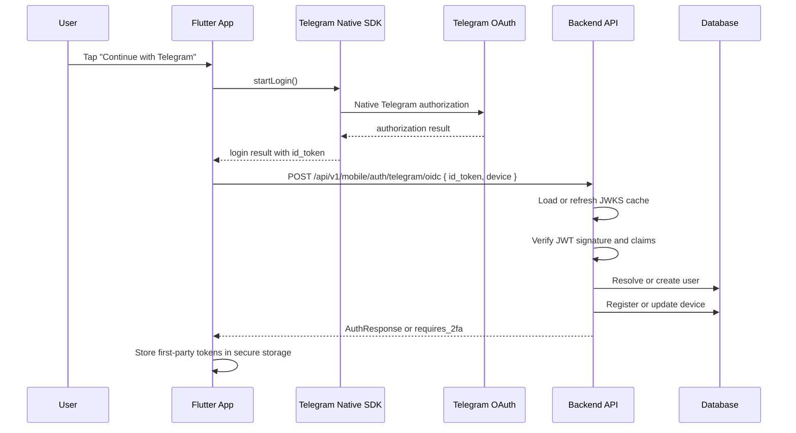

# Target Architecture

## Design Principles

- Backend is the only trust authority for Telegram identity.
- Mobile never creates authenticated local state before backend confirmation.
- Telegram `id_token` is an input to backend verification, not a session for CyberVPN.
- Device-aware mobile sessions remain first-party and unchanged in principle.
- Native App Links / Universal Links are preferred over custom schemes in production.

## Path Convention

Public API examples in this package use full external paths:

- `/api/v1/mobile/auth/telegram/oidc`
- `/api/v1/mobile/auth/2fa/complete`
- `/api/v1/mobile/auth/refresh`
- `/api/v1/mobile/auth/logout`
- `/api/v1/mobile/auth/me`

Internal FastAPI router paths in code may appear as `/mobile/auth/...` because the router is mounted under `/api/v1`.

## Recommended Target Flow



## Responsibility Split

### Mobile Responsibility

- Start official native Telegram SDK flow.
- Receive `id_token`.
- Send `id_token` to backend with device metadata.
- Show pending 2FA UI when backend requires it.
- Store only first-party CyberVPN tokens.

### Backend Responsibility

- Validate Telegram JWT signature and claims.
- Never trust client-decoded claims without verification.
- Resolve or create the internal mobile user.
- Apply linking, conflict and migration rules.
- Apply TOTP policy.
- Issue first-party mobile tokens.

### Telegram Responsibility

- Perform user consent flow.
- Return a signed `id_token`.
- Expose issuer metadata and JWKS.

## Target Backend Entry Points

- `POST /api/v1/mobile/auth/telegram/oidc`
- `POST /api/v1/mobile/auth/2fa/complete`
- `POST /api/v1/mobile/auth/logout`
- `POST /api/v1/mobile/auth/refresh`
- `GET /api/v1/mobile/auth/me`

## Success Contract

For consistency with the existing mobile auth namespace, the success response should reuse the current `AuthResponse` envelope:

```json
{
  "tokens": {
    "access_token": "string",
    "refresh_token": "string",
    "token_type": "Bearer",
    "expires_in": 900
  },
  "user": {
    "id": "uuid",
    "email": "optional-or-synthetic",
    "username": "optional",
    "telegram_id": 123456789,
    "telegram_username": "optional"
  },
  "is_new_user": true
}
```

## Pending 2FA Contract

When the user has TOTP enabled, Telegram OIDC login should return:

```json
{
  "requires_2fa": true,
  "method": "totp",
  "tfa_token": "short-lived-signed-token"
}
```

## Key Architectural Decisions

### Decision 1: Backend Validates `id_token` Only

Recommended Phase 1 design:

- rely on the official native SDKs for the Telegram app flow
- mobile sends only `id_token` to backend
- backend validates `id_token`

This keeps Phase 1 smaller than a custom client-side or backend-side code exchange flow.

### Decision 2: Keep Legacy Endpoint During Migration

- keep `POST /api/v1/mobile/auth/telegram/callback`
- add `POST /api/v1/mobile/auth/telegram/oidc`
- route new app versions to the new endpoint behind a feature flag

### Decision 3: Prefer App Links / Universal Links

- iOS: prefer `https://app{appid}-login.tg.dev`
- Android: prefer `https://app{appid}-login.tg.dev/tglogin`
- custom schemes are fallback only

## ADR — Phase 1 Validation Strategy

### Decision

Phase 1 uses official Telegram Native SDKs.

Mobile receives `id_token` from the SDK result and sends it to backend.

Backend validates `id_token` and issues CyberVPN tokens.

### Not Doing In Phase 1

Backend-side Telegram authorization code exchange is not implemented in Phase 1 unless SDK integration proves insufficient.

### Rationale

- official native SDKs are designed to return `idToken`
- mobile app never stores Telegram token as CyberVPN session
- backend remains the only trust authority
- implementation scope is smaller and safer for first rollout

### Consequences

- backend `Client Secret` may remain optional in the validation-only path
- public SDK examples currently document `clientId`, `redirectUri`, `scopes` and a success `idToken`, but do not document `nonce` or `state`
- Phase 1 therefore treats `nonce` and `state` as unavailable unless later confirmed by official SDK API surface
- replay mitigation relies on strict JWT validation, short token lifetime and operational controls if SDK `nonce` is unavailable

## External References

- Telegram Login docs: <https://core.telegram.org/bots/telegram-login>
- Telegram OIDC discovery: <https://oauth.telegram.org/.well-known/openid-configuration>
