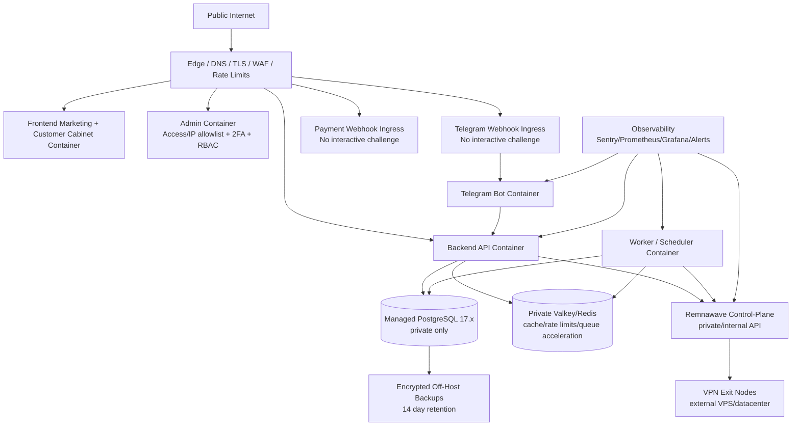

# 120_STAGE1_INFRA_001_PRODUCTION_TOPOLOGY_EVIDENCE

Backlog ID: `S1-INFRA-001`
Status: completed locally as topology diagram/spec; revalidated on 2026-05-09; external staging/production evidence remains required
Date: 2026-05-08
Revalidation date: 2026-05-09
Scope: Stage 1 production topology for Controlled Public Beta

## Decision

Stage 1 uses the owner-approved **Simple Controlled Hybrid Container Topology**.

Meaning:

- application runtime can be containerized: frontend, admin, backend API, Telegram Bot, worker/scheduler and Remnawave control-plane;
- durable state is not container-local: PostgreSQL, Valkey/Redis, backup storage and Remnawave state must be private, separately evidenced and recoverable;
- production-critical components must not run on the home lab because home power outages up to 5 hours are possible;
- staging and production must be separate;
- production deploys must use immutable tag/commit SHA, not floating `main`;
- Kubernetes/Talos/GitOps are not required blockers for S1.

This closes `S1-INFRA-001` as a topology selection and documentation task. It does not prove that production infrastructure is deployed.

## Topology Diagram



## Component Placement

| Component | S1 placement | Public? | Production-critical? | Home lab allowed? |
|---|---|---:|---:|---:|
| Edge / DNS / TLS / WAF | Cloudflare or equivalent external edge | Yes | Yes | No |
| Public site / customer cabinet | Containerized web runtime | Yes | Yes | No |
| Admin workspace | Containerized web runtime behind admin protection | No public unauthenticated access | Yes | No |
| Backend API | Containerized API runtime behind controlled ingress | Partly | Yes | No |
| Telegram Bot | Containerized service runtime | Webhook ingress only | Yes | No |
| Worker/scheduler | Private containerized runtime | No | Yes | No |
| PostgreSQL | Managed PostgreSQL 17.x, private-only | No | Yes | No |
| Valkey/Redis | Dedicated private Valkey/Redis | No | Yes | No |
| Remnawave control-plane | Dedicated production control-plane, private/internal API | No | Yes | No |
| VPN nodes | External datacenter/VPS nodes | VPN transport only | Yes | No |
| Observability | External or production-private observability runtime | No public admin | Yes | No |
| Backup storage | Encrypted off-host backup storage | No | Yes | No |

## Public Ingress

| Ingress | Host(s) | Target | Rule |
|---|---|---|---|
| Public site primary | `cyber-vpn.net`, `www.cyber-vpn.net` | Frontend/customer cabinet | TLS, security headers, WAF/rate-limit where available |
| Public mirror | `cyber-vpn.org`, `www.cyber-vpn.org` | Edge redirect | Redirect-only to `.net`; no independent auth surface |
| Public API | `api.cyber-vpn.net` | Backend API | Only approved public API/webhook paths; Swagger disabled in production |
| OAuth web callbacks | `cyber-vpn.net` | Frontend/web callback path | `https://cyber-vpn.net/api/oauth/callback/google` and GitHub equivalent; no interactive challenge |
| Admin primary | `admin.cyber-vpn.net` | Admin workspace | Cloudflare Access, IP allowlist or equivalent; backend host guard; admin 2FA/RBAC/audit |
| Admin mirror | `admin.cyber-vpn.org` | Edge redirect | Redirect-only to `admin.cyber-vpn.net`; no independent admin session |
| Telegram webhook | `api.cyber-vpn.net` | Telegram Bot or backend webhook receiver | No interactive challenge; secret/provider validation; rate limits that do not break Telegram retries |
| Payment webhooks | `api.cyber-vpn.net` | Backend API | No interactive challenge; provider signature/recheck/idempotency; orphan payment policy |

## Private Dependencies

| From | To | Purpose |
|---|---|---|
| Backend API | Managed PostgreSQL | Auth, payments, subscriptions, support, audit and provisioning state |
| Backend API | Private Valkey/Redis | Cache, rate limits and non-durable queue acceleration |
| Backend API | Remnawave control-plane | VPN provisioning and usage reads through private/internal API |
| Worker/scheduler | Managed PostgreSQL | Durable recovery source for payments, provisioning, expiry and reconciliation jobs |
| Worker/scheduler | Private Valkey/Redis | Queue/cache coordination only |
| Telegram Bot | Backend API | Customer, trial, plan, payment, support and config operations |
| Remnawave control-plane | Managed PostgreSQL | Remnawave state through separate DB/user |
| Observability | Runtime services | Metrics, health, logs, traces and alerts |

## Data Authority

| Data | Source of truth |
|---|---|
| User/auth/payment/subscription/support/audit state | Managed PostgreSQL |
| Critical payment/provisioning jobs | Managed PostgreSQL |
| Cache, throttling, non-durable coordination | Private Valkey/Redis |
| VPN runtime access | Remnawave control-plane |
| Config delivery state | Backend sanitized state + Remnawave |
| Backups | Encrypted off-host backup storage |

Redis/Valkey is explicitly **not** durable source of truth for S1.

## Unknown Until External Infra

The repository still does not prove:

- cloud/hosting provider account;
- exact production/staging regions;
- exact managed PostgreSQL provider;
- exact managed Valkey provider;
- origin public IPs;
- private network CIDR;
- Cloudflare/equivalent zone IDs;
- production container registry and image digests;
- production SSH/deploy user policy.

These remain for `S1-INFRA-002`...`S1-INFRA-005`.

## Local Implementation

Added:

- `infra/topology/stage1-production-topology.json`
- `infra/topology/README.md`
- `scripts/validate_s1_production_topology.py`
- `infra/tests/test_stage1_production_topology.py`

The JSON contract encodes the topology decision, environments, network zones, components, public ingress, private dependencies, data authority, home-lab boundary, out-of-scope runtime and required go-live evidence.

## Production VPN Node Boundary

Stage 1 production VPN nodes are node-only hosts.

Allowed:

- SSH/admin access;
- Remnawave node runtime;
- VLESS/XHTTP transport listeners;
- node control/listener ports required by Remnawave node runtime;
- standard host services such as DNS resolver, time sync and firewall.

Forbidden:

- public web/API/admin probes;
- Prometheus exporters unrelated to the VPN node itself;
- GitLab, Grafana, Loki, Sentry, Alertmanager or other home-observability workloads;
- backend, worker, scheduler, Telegram Bot, payment or support workloads;
- temporary relays for `prod-app-1`.

If home observability cannot reach `prod-app-1` directly, the fix must be a non-node network/edge/ops decision. Production VPN nodes must not be used as generic observability relay hosts.

## Verification

Commands:

```bash
python scripts/validate_s1_production_topology.py

cd backend
uv run pytest ../infra/tests/test_stage1_production_topology.py -q --no-cov
uv run ruff check ../scripts/validate_s1_production_topology.py ../infra/tests/test_stage1_production_topology.py

cd ..
git diff --check -- <touched S1-INFRA-001 files>
rg -n --pcre2 '<high-confidence secret patterns>' <touched S1-INFRA-001 files>
rg -n --pcre2 '<dangerous-code patterns>' <touched S1-INFRA-001 files>
docker ps --format '{{.Names}}\t{{.Status}}'
```

Results:

| Check | Result |
|---|---|
| Static topology validator | PASS: `infra/topology/stage1-production-topology.json` is valid for `S1-INFRA-001` |
| Pytest contract | PASS: 4 passed |
| Ruff on validator/test | PASS |
| JSON parse/format check | PASS: `python -m json.tool infra/topology/stage1-production-topology.json` completed |
| Topology summary check | PASS: 12 components, 8 public ingress entries, 8 private dependencies, 15 required go-live evidence items, no production-critical home-lab components |
| Dependent infra validators | PASS: staging, production, DNS/TLS and protected-ingress contracts still validate against the topology |
| Dependent infra pytest regression | PASS: 24 passed across topology, staging, production, DNS/TLS and protected-ingress contract tests |
| Ruff on dependent validators/tests | PASS |
| Root npm production dependency audit | PASS for high/critical threshold; only moderate Next/PostCSS advisory reported |
| Backend Python dependency audit | PASS: no known vulnerabilities found |
| `git diff --check` on touched tracked files | PASS |
| Secret-pattern scan over S1-INFRA-001 touched files excluding historical combined pack | PASS: no high-confidence matches |
| Dangerous-code pattern scan over S1-INFRA-001 touched files excluding historical combined pack | PASS: no matches |
| Running containers after task | PASS: no running containers reported |

The historical combined pack contains older command transcripts and test placeholders, so broad secret/dangerous scans over that aggregate can match previously documented local examples. The task scan above targets the current S1-INFRA-001 source/evidence files and excludes the historical aggregate.

## DEMO

COMPONENT:

- Command: `python scripts/validate_s1_production_topology.py`
- Result: PASS, `infra/topology/stage1-production-topology.json` remains valid for `S1-INFRA-001`.

FEATURE:

- Command: `cd backend && PYENV_VERSION=3.13.11 uv run pytest ../infra/tests/test_stage1_production_topology.py ../infra/tests/test_stage1_staging_environment.py ../infra/tests/test_stage1_production_environment.py ../infra/tests/test_stage1_dns_tls_contract.py ../infra/tests/test_stage1_protected_ingress.py -q --no-cov`
- Result: PASS, 24 tests proved that production topology, staging contract, production deployability, DNS/TLS and protected ingress contracts still agree.

Feature test status is **partial by design**: live staging/production topology cannot be fully proven until external provider, origin/network, DNS/TLS, protected ingress, image digest and deployment evidence exist.

## What This Closes

| Item | Status |
|---|---|
| `S1-INFRA-001` production topology selection | Closed locally |
| Backend/DB/Redis/frontend/bot/worker/Remnawave placement | Documented |
| Public/private ingress boundary | Documented |
| Home-lab non-critical boundary | Documented |
| Data source-of-truth boundary | Documented |
| S1 out-of-scope runtime boundary | Documented |

## What Remains Open

| Item | Why still open |
|---|---|
| Real staging environment | Requires external host/managed services or accepted staging infrastructure under `S1-INFRA-002` |
| Real production environment | Local deployability contract exists in `122_STAGE1_INFRA_003_PRODUCTION_ENVIRONMENT_EVIDENCE.md`; external production deploy/health evidence still required |
| DNS/TLS | Local contract completed in `123_STAGE1_INFRA_004_DNS_TLS_EVIDENCE.md`; real domain/edge evidence still required |
| Protected ingress | Local contract completed in `124_STAGE1_INFRA_005_PROTECTED_INGRESS_EVIDENCE.md`; real edge/reverse-proxy/firewall/admin-access proof still required |
| Managed PostgreSQL/Valkey proof | Requires provider/private-network/backup/monitoring evidence |
| Remnawave staging/prod proof | Requires separate real Remnawave instances and nodes |
| Observability live proof | Requires live Sentry/dashboard/alert delivery evidence |
| Rollback on final RC artifacts | Requires staging/prod artifact rollout evidence |

## Next ID

Next ID superseded by this 2026-05-09 `S1-INFRA-001` revalidation; current next ID to execute is `S1-OBS-004` - live alert delivery evidence follow-up.
