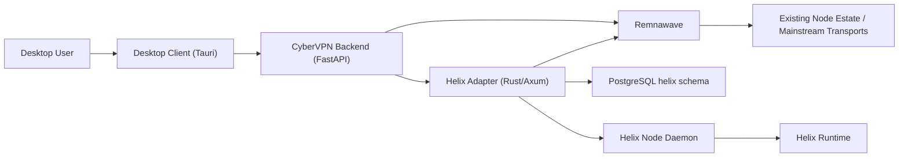
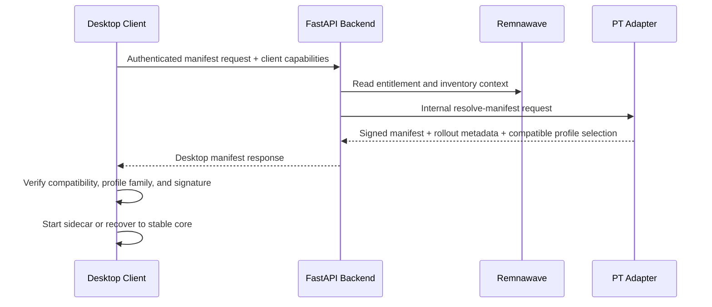
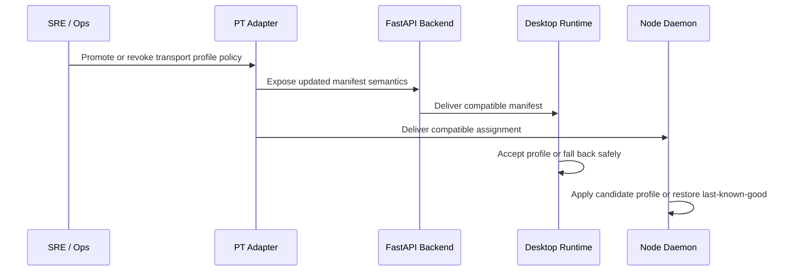
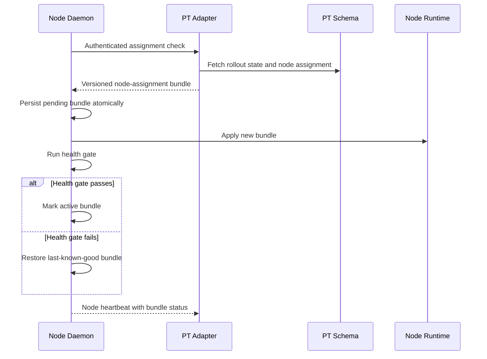

# Helix Architecture

## Purpose

This document defines the component boundaries and runtime flows for CyberVPN's Helix platform.

## System Context

## Authority Boundaries

### Remnawave

Authoritative for:

- users;
- plans and subscriptions;
- billing entitlements;
- node inventory;
- current mainstream transport operations.

### Adapter

Authoritative for:

- Helix manifest issuance;
- Helix node capability registry;
- rollout state and channels;
- manifest and assignment version metadata;
- transport-specific health aggregation.

### Backend

Authoritative public facade for:

- authenticated desktop manifest resolution;
- capability retrieval;
- authenticated admin visibility and rollout actions.

### Node Daemon

Authoritative only for:

- local bundle application state;
- local last-known-good reference;
- local runtime health observation.

## Desktop Manifest Flow

## Protocol Agility Control Loop

## Node Assignment Flow

## Data Ownership Rules

- No transport-specific rollout or manifest state is stored in `Remnawave` tables.
- Remnawave `Node Plugins` can be used only for narrow node-local helpers; Helix ownership does not move into plugin code.
- Adapter-owned state lives under the `helix` schema.
- Desktop stores only what is required for runtime operation, health, and recovery.
- Node daemon stores only local operational state needed for bundle application and rollback.

## Failure and Recovery Model

- Adapter manifest revoke must stop new assignments quickly.
- Adapter profile rotation must prefer compatible profile changes before binary replacement.
- Node daemon must restore last-known-good on failed health gate.
- Desktop must restore a stable core when private runtime startup or health fails.
- Baseline transport operations must remain isolated from Helix failure domains.
