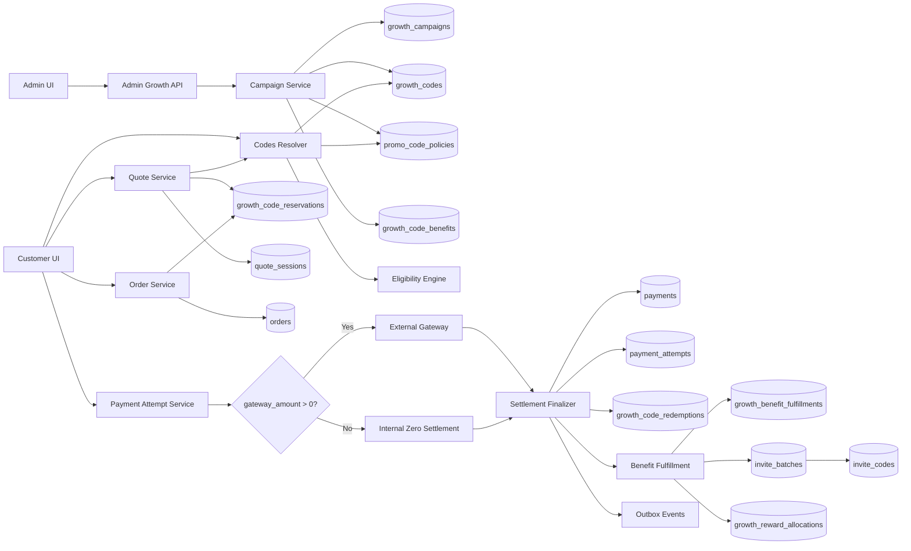
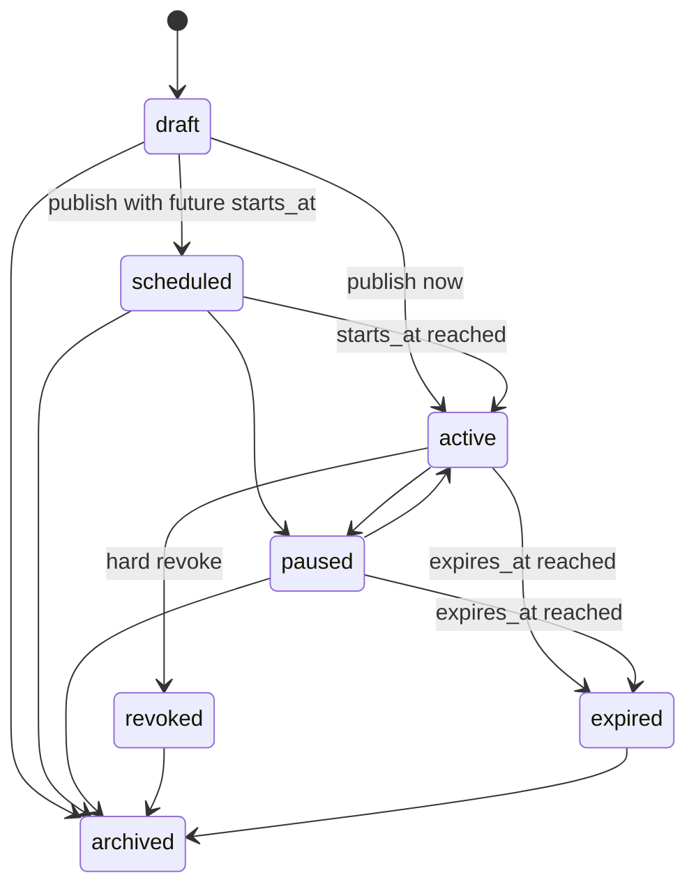
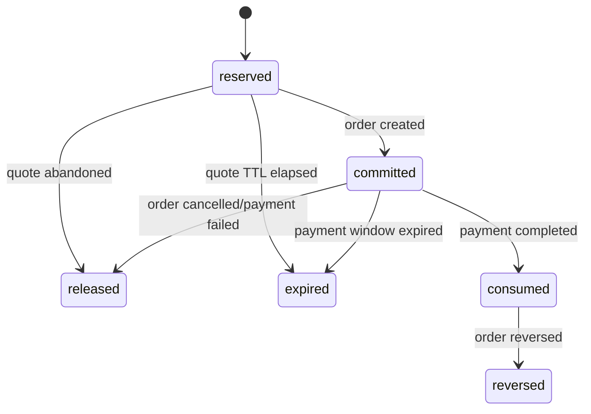
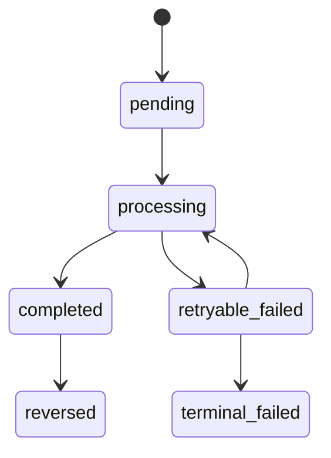
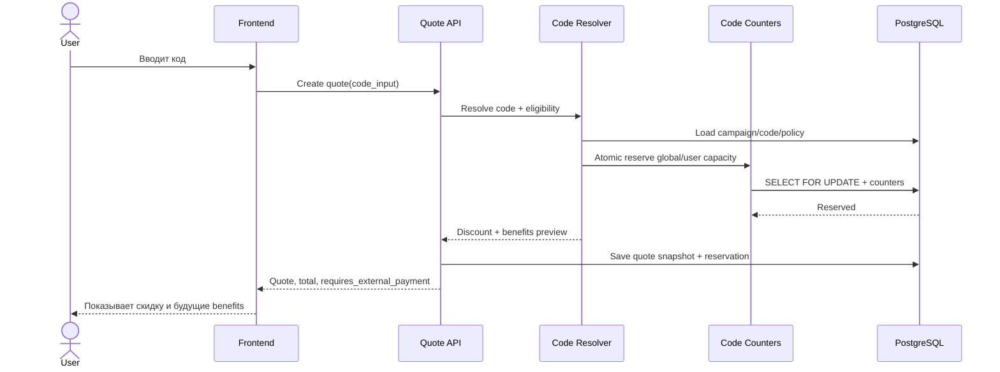
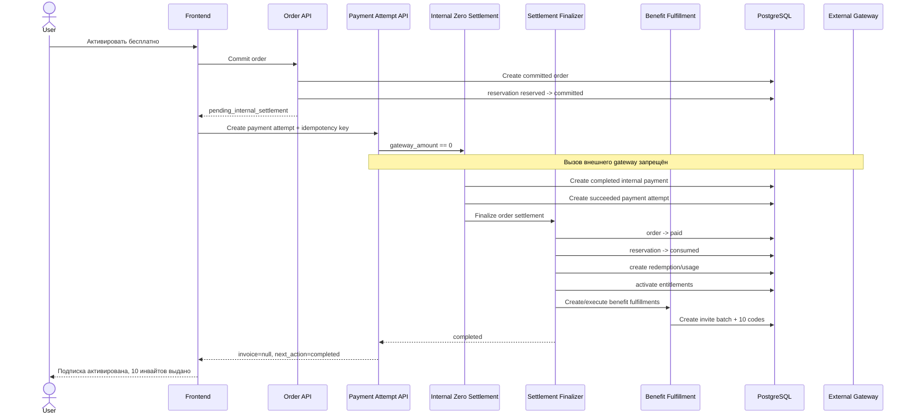

# Техническое задание: Growth Codes v2 для CyberVPN

## Гибкие промокоды, 100% скидка без внешней оплаты, post-payment benefits и управляемые invite-пакеты

| Параметр | Значение |
|---|---|
| Проект | `Beep206/CyberVPN` |
| Целевая ветка | `main` |
| Снимок кода, использованный для анализа | commit `b77d52bccea545029390826321b7c1a056621517` |
| Дата ТЗ | 20 июня 2026 |
| Статус документа | Implementation-ready specification |
| Приоритет | Высокий |
| Основные контуры | `backend`, `admin`, `frontend`, Telegram Mini App |
| Основная БД | PostgreSQL |
| Backend | FastAPI, SQLAlchemy Async, Alembic |
| Frontend/Admin | Next.js, TypeScript, React Query |
| Цель | Полностью закрыть создание, применение, расчёт, zero-payment settlement, выдачу бонусов, управление и аудит промокодов и инвайтов |

---

## 0. Нормативные формулировки

В документе используются следующие термины:

- **MUST / ОБЯЗАТЕЛЬНО** — требование должно быть выполнено для приёмки.
- **MUST NOT / ЗАПРЕЩЕНО** — поведение недопустимо.
- **SHOULD / РЕКОМЕНДУЕТСЯ** — требование желательно выполнить; отклонение должно быть обосновано.
- **MAY / ДОПУСКАЕТСЯ** — допустимый вариант реализации.

Все идентификаторы, денежные значения, статусы, idempotency keys и snapshots должны обрабатываться детерминированно. Нельзя полагаться только на frontend-валидацию.

---

# 1. Цель и ожидаемый бизнес-результат

Необходимо построить единый управляемый механизм growth-кодов, в котором администратор может создать промокод с любым сочетанием следующих характеристик:

1. Бессрочный или ограниченный по времени.
2. Без общего лимита или с общим лимитом применений.
3. С лимитом применений на одного пользователя.
4. Привязанный ко всем планам, одному плану, нескольким планам, семействам планов, offer, checkout mode, storefront и каналам продаж.
5. Со скидкой:
   - процентной;
   - фиксированной;
   - до 100% включительно;
   - с ограничением максимальной суммы скидки;
   - без скидки, но с бонусами.
6. С post-payment benefits:
   - выдача invite-кодов;
   - бонусные дни;
   - wallet credit;
   - gift code;
   - add-on;
   - другие расширяемые награды.
7. С возможностью выдать, например, **10 инвайт-кодов по 7 бесплатных дней после успешного завершения заказа**.
8. С возможностью закрыть скидкой **100% стоимости заказа**, при этом:
   - внешний платёжный шлюз не вызывается;
   - invoice во внешней платёжной системе не создаётся;
   - создаются внутренний completed payment и succeeded payment attempt;
   - заказ становится оплаченным;
   - подписка активируется;
   - применение промокода фиксируется;
   - post-payment benefits исполняются;
   - пользователь получает инвайты;
   - повторный запрос не создаёт второй payment, второй batch или повторные награды.

Целевой механизм должен одинаково работать в:

- официальном web frontend;
- Telegram Mini App;
- Telegram bot checkout;
- будущих desktop/mobile клиентах;
- административной панели.

---

# 2. Текущее состояние и подтверждённые разрывы

## 2.1. Что уже существует

В текущем коде уже присутствуют:

- legacy-таблицы `promo_codes` и `promo_code_usages`;
- nullable `expires_at`, `max_uses`, `plan_ids`;
- percent/fixed скидки;
- checkout code resolver;
- quote и checkout sessions;
- canonical registry `growth_codes`;
- `promo_code_policies`;
- reservations и redemptions;
- `growth_reward_allocations`;
- invite codes;
- генерация invite bundle после покупки плана;
- gift code subsystem;
- post-payment orchestration;
- zero-gateway local payment;
- admin UI промокодов;
- admin UI ручной выдачи инвайтов;
- customer rewards hub;
- единое поле ввода code в checkout/redeem.

## 2.2. Ключевые технические проблемы

| № | Разрыв | Последствие |
|---|---|---|
| 1 | `PromoCodeResponse` не возвращает полный scope | Админка не может показать `plan_ids`, `min_amount`, `description` и другие настройки |
| 2 | Update промокода разрешает менять лишь часть полей | Нельзя полноценно управлять созданным промокодом |
| 3 | Инвайты после оплаты читаются только из `plan.invite_bundle` | Нельзя выдать 10 инвайтов именно за конкретный промокод |
| 4 | `plan_id` invite-кода фактически не определяет entitlement при redeem | «Привязка инвайта к плану» не реализована как бизнес-смысл |
| 5 | Canonical `PromoCodePolicyModel` богаче legacy-модели, но checkout использует legacy поля | Два параллельных источника истины |
| 6 | Reservation считается consumed при создании order | Usage lifecycle не соответствует факту успешной оплаты |
| 7 | Legacy usage увеличивается только post-payment | Canonical и legacy счётчики расходятся по моменту потребления |
| 8 | Increment usage не защищён условием лимита | Возможен oversubscription при параллельных оплатах |
| 9 | Нет уникальности usage по payment | Повторная post-payment обработка может создать дубликат |
| 10 | Генерация plan invites не имеет уникального fulfillment key | Повторный webhook может повторно выдать пакет |
| 11 | Invite redemption проверяет и изменяет состояние раздельно | Возможна гонка при одновременном redeem |
| 12 | Zero-gateway order помечается paid до payment attempt | Унифицированный order/payment flow разрывается |
| 13 | Zero-gateway post-payment может запускаться до создания payment attempt | Post-payment не видит order linkage |
| 14 | `snapshot_adapter` теряет code resolution и reservation context | Payment attempt не восстанавливает полную growth-семантику заказа |
| 15 | `CompleteZeroGatewayUseCase` использует provider=`wallet` | Аудит неверно трактует бесплатный заказ как wallet payment |
| 16 | `commission_base_amount` равен base price даже при 100% скидке | Возможна денежная комиссия при нулевой выручке |
| 17 | Нет invite batch | Нельзя управлять 10 кодами как одной выдачей |
| 18 | Admin invites page — create-only | Нет общего списка, revoke, продления, source tracing |
| 19 | Нет полноценной versioning policy | Изменение акции может ретроактивно влиять на незавершённые процессы |
| 20 | Код может существовать в разных legacy namespaces | Unified input может разрешить неоднозначный тип |

## 2.3. Файлы, определяющие текущее поведение

### Backend

- `backend/src/infrastructure/database/models/promo_code_model.py`
- `backend/src/infrastructure/database/repositories/promo_code_repo.py`
- `backend/src/application/use_cases/promo_codes/admin_manage_promo.py`
- `backend/src/application/use_cases/promo_codes/validate_promo.py`
- `backend/src/presentation/api/v1/promo_codes/routes.py`
- `backend/src/presentation/api/v1/promo_codes/schemas.py`
- `backend/src/infrastructure/database/models/growth_code_model.py`
- `backend/src/application/use_cases/growth_codes/registry.py`
- `backend/src/application/use_cases/growth_codes/resolve_code.py`
- `backend/src/application/use_cases/growth_codes/reservations.py`
- `backend/src/application/use_cases/payments/checkout.py`
- `backend/src/application/use_cases/payments/commit_checkout.py`
- `backend/src/application/use_cases/payments/complete_zero_gateway.py`
- `backend/src/application/use_cases/payments/post_payment.py`
- `backend/src/application/use_cases/orders/create_order_from_checkout.py`
- `backend/src/application/use_cases/payment_attempts/create_payment_attempt.py`
- `backend/src/application/use_cases/payment_attempts/snapshot_adapter.py`
- `backend/src/application/use_cases/commerce_sessions/quote_serialization.py`
- `backend/src/application/use_cases/invites/generate_invites.py`
- `backend/src/application/use_cases/invites/admin_create_invite.py`
- `backend/src/application/use_cases/invites/redeem_invite.py`
- `backend/src/infrastructure/database/models/invite_code_model.py`
- `backend/src/infrastructure/database/models/growth_reward_allocation_model.py`

### Admin

- `admin/src/features/growth/components/promo-codes-console.tsx`
- `admin/src/features/growth/components/invite-codes-console.tsx`
- `admin/src/features/commerce/components/plan-editor-modal.tsx`
- `admin/src/lib/api/growth.ts`

### Customer frontend

- `frontend/src/lib/api/codes.ts`
- `frontend/src/lib/api/invites.ts`
- `frontend/src/features/customer-growth/hooks/useCustomerGrowth.ts`
- `frontend/src/features/customer-growth/lib/checkout-code-resolution.ts`
- `frontend/src/app/[locale]/(dashboard)/subscriptions/components/PurchaseConfirmModal.tsx`
- `frontend/src/widgets/referral-cabinet/referral-cabinet-dashboard.tsx`
- `frontend/src/app/[locale]/miniapp/rewards/RewardsClient.tsx`

---

# 3. Границы проекта

## 3.1. В scope

В рамках реализации ОБЯЗАТЕЛЬНО выполнить:

- canonical campaign/code/policy management;
- 100% discount;
- zero-payment settlement;
- post-payment benefits;
- promo-driven invite batches;
- plan/offer/promo benefit composition;
- atomic limits and reservations;
- idempotent payment and benefit fulfillment;
- admin CRUD/versioning/publish flow;
- customer preview and inventory;
- audit, metrics, logs and outbox events;
- migration legacy данных;
- backward compatibility;
- automated tests;
- rollout и rollback.

## 3.2. Не является обязательным в первой поставке

Следующие возможности допускается отложить, но архитектура не должна их блокировать:

- визуальный rule-builder произвольной сложности;
- A/B testing;
- ML-based anti-fraud;
- автоматическая конвертация fixed discount между валютами;
- несколько одновременно введённых пользователем кодов;
- налоговый движок;
- внешний coupon provider.

---

# 4. Термины

| Термин | Определение |
|---|---|
| Campaign | Маркетинговая кампания, объединяющая один или несколько кодов, policy и benefits |
| Growth code | Каноническая запись кода: promo, invite, gift, referral или partner |
| Promo policy | Правила скидки, eligibility, usage и stacking |
| Benefit | Награда или действие, связанное с кодом |
| Fulfillment | Идемпотентное фактическое исполнение benefit |
| Invite batch | Одна логическая выдача набора invite-кодов |
| Reservation | Временное удержание доступного использования кода |
| Committed reservation | Использование привязано к order, но ещё не оплачено |
| Consumed usage | Использование окончательно подтверждено completed payment |
| Zero-gateway order | Заказ с `gateway_amount == 0`, не требующий внешней оплаты |
| Internal zero payment | Внутренняя completed payment-запись для zero-gateway заказа |
| Policy version | Неизменяемая опубликованная версия правил |
| Snapshot | Копия правил и расчёта, сохранённая в quote/order/payment |
| Net paid amount | Реально оплаченная пользователем сумма после скидок |
| Commissionable amount | Сумма, от которой допустимо считать денежные referral/partner выплаты |

---

# 5. Архитектурные принципы

## ARCH-001. Единый источник истины

`growth_codes` и связанные versioned policies становятся canonical source of truth.

Legacy `promo_codes`, `promo_code_usages`, `invite_codes` сохраняются на переходный период как compatibility layer. Новая логика не должна добавлять очередной независимый JSON `promo.invite_bundle` в legacy-таблицу.

## ARCH-002. Benefit не является частью скидки

Скидка и выдача инвайтов — разные эффекты одного кода:

```text
Promo code
├── price effect: 100% discount
└── post-settlement benefit: issue 10 invites
```

Они должны иметь отдельные состояния, idempotency keys и аудит.

## ARCH-003. Бесплатный заказ остаётся полноценным order/payment событием

При сумме к оплате `0` внешний provider не вызывается, но система ОБЯЗАНА создать:

- order;
- internal completed payment;
- succeeded payment attempt;
- settlement event;
- code redemption/usage;
- benefits fulfillment;
- entitlement/provisioning;
- audit trail.

## ARCH-004. Payment completion — единственная точка окончательного consumption

Создание quote и order не должно окончательно расходовать промокод.

Окончательное использование фиксируется только после:

- успешного внешнего платежа;
- или успешного internal zero settlement.

## ARCH-005. Все side effects идемпотентны

Повторный webhook, retry API, повторный task execution или network retry не должен создавать:

- второй payment;
- второй payment attempt;
- второй usage;
- второй invite batch;
- повторную entitlement activation;
- повторную notification.

## ARCH-006. Order исполняется по snapshot

Fulfillment должен использовать policy/benefits snapshot, сохранённый в order, а не текущее состояние campaign.

## ARCH-007. Денежные расчёты только через Decimal

В application/domain слоях запрещено использовать `float` для расчётов скидки, лимитов и final amount.

## ARCH-008. Pessimistic locking для ограниченных ресурсов

Global/per-user caps должны защищаться транзакционными блокировками и атомарными counters.

---

# 6. Целевая компонентная схема



---

# 7. Функциональные требования

## 7.1. Campaign и promo management

### FR-CAMPAIGN-001

Администратор должен иметь возможность создать campaign в статусе `draft`.

### FR-CAMPAIGN-002

Campaign должна поддерживать:

- `campaign_key`;
- локализуемое/административное название;
- описание;
- `starts_at`;
- `expires_at`;
- бессрочный режим;
- priority;
- stacking mode;
- status;
- audit metadata.

### FR-CAMPAIGN-003

Одна campaign может иметь один или несколько кодов.

### FR-CAMPAIGN-004

После публикации редактирование бизнес-правил должно создавать новую policy version. Уже созданные order используют прежний snapshot.

### FR-CAMPAIGN-005

Должны поддерживаться состояния:

```text
draft
scheduled
active
paused
expired
archived
revoked
```

### FR-CAMPAIGN-006

`paused` запрещает новые reservations, но не аннулирует уже committed orders.

### FR-CAMPAIGN-007

`revoked` является hard stop и может аннулировать ещё не consumed reservations согласно reason code.

## 7.2. Promo code

### FR-PROMO-001

Код нормализуется на backend:

```python
normalized = code.strip().upper()
```

### FR-PROMO-002

Допустимый alphabet для автоматически генерируемых кодов:

```text
23456789ABCDEFGHJKLMNPQRSTUVWXYZ
```

### FR-PROMO-003

Human-readable custom code должен проходить валидацию:

- длина 4–64;
- только разрешённые символы;
- отсутствие leading/trailing whitespace;
- глобальная уникальность в customer-input namespace.

### FR-PROMO-004

Промокод может быть:

- без даты окончания;
- с `starts_at`;
- с `expires_at`;
- без общего лимита;
- с global cap;
- с per-user cap.

### FR-PROMO-005

Поддерживаемые discount types:

```text
percent
fixed
none
```

`none` означает benefit-only code.

### FR-PROMO-006

Процентная скидка:

```text
0 < discount_value <= 100
```

### FR-PROMO-007

`100%` является валидным значением.

### FR-PROMO-008

Fixed discount должен быть больше нуля и иметь currency.

### FR-PROMO-009

Fixed discount без явной conversion policy применяется только при совпадении валюты.

### FR-PROMO-010

Поддерживаются discount scopes:

```text
subscription_only
addons_only
order_total
selected_items
```

Для полного закрытия заказа 100% промокодом должен использоваться `order_total`.

### FR-PROMO-011

Скидка всегда ограничивается discountable amount:

```text
discount_amount <= discountable_amount
```

### FR-PROMO-012

Итоговые суммы не могут быть отрицательными.

### FR-PROMO-013

Промокод может содержать `max_discount_amount`.

### FR-PROMO-014

Eligibility должна поддерживать:

- plan IDs;
- plan families;
- durations;
- offer IDs/keys;
- storefront IDs/keys;
- channels;
- checkout modes;
- add-on codes;
- geos;
- minimum pre-discount order amount;
- new customer only;
- first completed order only;
- first net-paid order only;
- no active subscription;
- allowlist/denylist users;
- auth realm;
- risk ruleset.

### FR-PROMO-015

Промокод может быть настроен без скидки и только с benefit.

### FR-PROMO-016

Frontend preview не расходует usage.

### FR-PROMO-017

Quote создаёт reservation только после полной eligibility проверки.

## 7.3. 100% скидка и zero-payment

### FR-ZERO-001

Если после скидки и wallet calculation:

```text
gateway_amount == 0
```

система MUST NOT обращаться к внешнему payment provider.

### FR-ZERO-002

Не должен создаваться внешний invoice.

### FR-ZERO-003

Должен создаваться internal payment:

```text
status = completed
provider = internal_zero
final_amount = 0
```

### FR-ZERO-004

Должен создаваться succeeded payment attempt:

```text
status = succeeded
provider = internal_zero
invoice = null
```

### FR-ZERO-005

Order должен переходить в `settlement_status = paid` только после успешного internal settlement.

### FR-ZERO-006

Нельзя помечать order как paid до создания payment и payment attempt.

### FR-ZERO-007

Post-payment orchestration запускается только после того, как payment связан с order через payment attempt или прямой canonical order reference.

### FR-ZERO-008

Для 100% promo wallet usage должен быть автоматически clamped до `0`. Wallet не замораживается и не дебетуется.

### FR-ZERO-009

100% discount order считается:

- успешным order conversion;
- consumed promo usage;
- qualifying event для явно разрешённых promo benefits;
- не является cash payment;
- по умолчанию не является основанием для cash referral/partner payout.

### FR-ZERO-010

По умолчанию:

```text
commissionable_amount = 0
```

для zero-payment заказа.

### FR-ZERO-011

Система должна хранить отдельно:

- gross/displayed amount;
- discount amount;
- wallet amount;
- gateway amount;
- net paid amount;
- commissionable amount.

### FR-ZERO-012

Клиентский UI должен показывать CTA:

```text
Активировать бесплатно
```

или локализованный эквивалент вместо «Перейти к оплате».

### FR-ZERO-013

После успешной zero-payment активации frontend не открывает новое окно и не ожидает webhook.

### FR-ZERO-014

Zero-payment endpoint должен быть защищён idempotency key.

### FR-ZERO-015

Повтор запроса с тем же key возвращает тот же payment/order result.

## 7.4. Benefits

### FR-BENEFIT-001

Промокод может иметь 0..N benefits.

### FR-BENEFIT-002

Типы первой версии:

```text
issue_invites
bonus_days
wallet_credit
issue_gift
grant_addon
```

### FR-BENEFIT-003

Каждый benefit имеет trigger:

```text
quote_preview
order_committed
payment_completed
first_payment_completed
renewal_completed
```

### FR-BENEFIT-004

`issue_invites` выполняется только после settlement completion.

### FR-BENEFIT-005

Benefit может разрешать или запрещать zero-net-payment order:

```json
{
  "allow_zero_net_payment": true
}
```

### FR-BENEFIT-006

Для сценария «100% скидка + 10 инвайтов» это поле обязательно `true`.

### FR-BENEFIT-007

Каждый fulfillment имеет уникальный idempotency key.

### FR-BENEFIT-008

Ошибки fulfillment не должны откатывать уже подтверждённый external payment. Они должны попадать в retry queue.

### FR-BENEFIT-009

Для internal zero settlement рекомендуется выполнять payment finalization и создание fulfillment records в одной транзакции, а тяжёлые внешние side effects — через outbox/worker.

### FR-BENEFIT-010

Benefit config snapshot сохраняется в order.

### FR-BENEFIT-011

Изменение campaign после order не меняет количество уже обещанных инвайтов.

### FR-BENEFIT-012

Поддерживаются merge modes:

```text
append
replace_same_type
max
exclusive
```

### FR-BENEFIT-013

Если plan bundle и promo benefit оба выдают инвайты:

- создаются отдельные invite batches;
- source сохраняется отдельно;
- итог зависит от merge mode;
- повторное выполнение каждого source независимо идемпотентно.

## 7.5. Invite batches

### FR-INVITE-001

Выдача нескольких invite-кодов создаёт одну запись `invite_batches`.

### FR-INVITE-002

Batch хранит:

- владельца;
- campaign/code/benefit source;
- order/payment source;
- количество;
- friend days;
- entitlement source;
- expiry policy;
- status;
- idempotency key.

### FR-INVITE-003

Поддерживаются expiry modes:

```text
none
relative
absolute
```

### FR-INVITE-004

`none` создаёт бессрочные invite-коды с `expires_at = NULL`.

### FR-INVITE-005

`relative` рассчитывает expiry от момента issuance.

### FR-INVITE-006

`absolute` использует фиксированную дату.

### FR-INVITE-007

Привязка invite к плану должна иметь реальный смысл.

Поддерживаются entitlement modes:

```text
profile_key
plan_snapshot
custom_snapshot
```

### FR-INVITE-008

Для `plan_snapshot` при issuance сохраняется immutable entitlement snapshot выбранного plan/offer.

### FR-INVITE-009

Redeem использует сохранённый snapshot, а не текущую версию плана.

### FR-INVITE-010

Batch можно:

- просмотреть;
- экспортировать;
- revoke;
- продлить;
- повторно отправить владельцу;
- отфильтровать по source/status.

### FR-INVITE-011

По умолчанию revoke batch отзывает только неиспользованные коды.

### FR-INVITE-012

Отзыв уже redeemed invite и entitlement допускается только отдельным privileged action.

### FR-INVITE-013

Invite redemption должен быть атомарным.

### FR-INVITE-014

Self-redemption должен оставаться запрещённым, если policy не указывает иное.

## 7.6. Клиентский UX

### FR-CLIENT-001

До подтверждения заказа frontend должен показать:

- код принят;
- размер скидки;
- новая итоговая сумма;
- необходимость внешней оплаты;
- список benefits после settlement.

### FR-CLIENT-002

Пример:

```text
Скидка: 100%
К оплате: $0.00
После активации вы получите 10 инвайт-кодов,
каждый на 7 дней доступа.
```

### FR-CLIENT-003

При zero-payment не должно быть редиректа на gateway.

### FR-CLIENT-004

После завершения должны быть invalidated query keys:

```text
orders
payments/history
current-entitlements
current-service-state
subscriptions
growth/invites
growth/gifts
growth/rewards
growth/notifications
growth/notifications/counters
```

### FR-CLIENT-005

Invite inventory должен группироваться по batch.

### FR-CLIENT-006

Должны отображаться:

- source label;
- campaign/promo label;
- count;
- active/used/expired/revoked;
- friend days;
- plan/profile;
- expiry;
- copy/share one;
- copy/share all.

### FR-CLIENT-007

Backend отдаёт machine-readable `message_key` и `message_params`. Нельзя хардкодить business errors только на английском.

---

# 8. Нефункциональные требования

## NFR-001. Идемпотентность

Каждая операция с финансовыми или reward side effects должна иметь deterministic key.

## NFR-002. Конкурентная безопасность

Два параллельных заказа не могут одновременно использовать последнее доступное применение.

## NFR-003. Транзакционность

Order, payment, payment attempt, reservation transition и fulfillment creation должны иметь чёткие transaction boundaries.

## NFR-004. Производительность

- resolve p95: не более 250 ms без внешних интеграций;
- quote p95: не более 500 ms;
- zero settlement p95: не более 1 s без provisioning provider;
- list campaigns: pagination обязательна.

## NFR-005. Масштабирование

Нельзя загружать все usages или reservations в память для проверки caps.

## NFR-006. Аудит

Все admin mutations и zero-value activations логируются.

## NFR-007. Наблюдаемость

Для каждой стадии должны быть metrics, structured logs и outbox events.

## NFR-008. Backward compatibility

Старые клиенты, использующие `/promo/validate`, не должны перестать работать во время migration window.

## NFR-009. Безопасность

Полный raw code не должен попадать в application logs, traces или error reporting.

## NFR-010. Типизация

OpenAPI, Python schemas и TypeScript types должны совпадать.

---
# 9. Целевая модель данных

## 9.1. `growth_campaigns`

```python
class GrowthCampaignModel(Base):
    __tablename__ = "growth_campaigns"

    id: Mapped[UUID] = mapped_column(primary_key=True, default=uuid4)

    campaign_key: Mapped[str] = mapped_column(String(80), unique=True, index=True)
    name: Mapped[str] = mapped_column(String(160))
    description: Mapped[str | None] = mapped_column(Text)

    status: Mapped[str] = mapped_column(String(20), index=True)
    priority: Mapped[int] = mapped_column(Integer, default=0)

    starts_at: Mapped[datetime | None] = mapped_column(DateTime(timezone=True))
    expires_at: Mapped[datetime | None] = mapped_column(DateTime(timezone=True))

    stacking_mode: Mapped[str] = mapped_column(String(30), default="exclusive")
    stacking_group: Mapped[str | None] = mapped_column(String(80))

    current_version: Mapped[int] = mapped_column(Integer, default=1)

    created_by_admin_id: Mapped[UUID] = mapped_column(
        ForeignKey("admin_users.id", ondelete="RESTRICT")
    )
    updated_by_admin_id: Mapped[UUID | None] = mapped_column(
        ForeignKey("admin_users.id", ondelete="SET NULL")
    )

    published_at: Mapped[datetime | None]
    paused_at: Mapped[datetime | None]
    archived_at: Mapped[datetime | None]

    created_at: Mapped[datetime]
    updated_at: Mapped[datetime]
```

### Constraints

```sql
CHECK (expires_at IS NULL OR starts_at IS NULL OR expires_at > starts_at);
CHECK (priority >= 0);
```

## 9.2. Изменения `growth_codes`

Добавить или уточнить:

```python
campaign_id: UUID | None  # FK growth_campaigns.id
reserved_uses: int = 0
last_used_at: datetime | None
code_namespace: str = "customer_input"
```

### Constraints

```sql
CHECK (uses_count >= 0);
CHECK (reserved_uses >= 0);
CHECK (max_uses IS NULL OR uses_count <= max_uses);
CHECK (
    max_uses IS NULL
    OR uses_count + reserved_uses <= max_uses
);
```

### Уникальность

Для всех кодов, вводимых в единое customer input:

```sql
UNIQUE (code_namespace, code_hash)
```

Нельзя допускать один и тот же normalized code одновременно как promo и invite. До добавления индекса миграция должна обнаружить и вывести collision report между promo, invite, gift, referral и partner кодами.

## 9.3. Versioned promo policy

Существующую `promo_code_policies` расширить:

```python
currency_code: str | None
discount_scope: str
discountable_addon_codes: list[str]

minimum_order_amount: Decimal | None
max_discount_amount: Decimal | None

allow_zero_amount_order: bool

new_customer_only: bool
first_completed_order_only: bool
first_net_paid_order_only: bool
require_no_active_access: bool

commission_basis: str
include_wallet_in_commission_base: bool

policy_version: int
is_current: bool
published_at: datetime | None
```

Существующие поля сохранить:

- `eligible_plan_ids`;
- `eligible_plan_families`;
- `eligible_durations`;
- `eligible_addons`;
- `allowed_checkout_modes`;
- `allowed_channels`;
- `allowed_geos`;
- `usage_cap_per_user`;
- `global_usage_cap`;
- `policy_snapshot`.

### `commission_basis`

Допустимые значения:

```text
none
net_gateway_paid
net_customer_paid
base_price
```

Default:

```text
net_gateway_paid
```

Для кампании с 100% скидкой рекомендуется:

```text
commission_basis = none
```

## 9.4. `growth_code_benefits`

```python
class GrowthCodeBenefitModel(Base):
    __tablename__ = "growth_code_benefits"

    id: Mapped[UUID] = mapped_column(primary_key=True, default=uuid4)

    growth_code_id: Mapped[UUID] = mapped_column(
        ForeignKey("growth_codes.id", ondelete="CASCADE"),
        index=True,
    )
    policy_version_id: Mapped[UUID | None] = mapped_column(
        ForeignKey("policy_versions.id", ondelete="SET NULL"),
        index=True,
    )

    benefit_type: Mapped[str] = mapped_column(String(40), index=True)
    trigger_type: Mapped[str] = mapped_column(String(40), index=True)
    merge_mode: Mapped[str] = mapped_column(String(30), default="append")

    config: Mapped[dict] = mapped_column(JSONB)
    eligibility: Mapped[dict] = mapped_column(JSONB, default=dict)

    sort_order: Mapped[int] = mapped_column(Integer, default=0)
    is_active: Mapped[bool] = mapped_column(Boolean, default=True)

    created_at: Mapped[datetime]
    updated_at: Mapped[datetime]
```

### Config для `issue_invites`

```json
{
  "count": 10,
  "friend_days": 7,
  "expiry_mode": "relative",
  "expiry_days": 30,
  "absolute_expires_at": null,

  "entitlement_mode": "profile_key",
  "entitlement_profile_key": "invite_limited_access_v1",
  "plan_id": null,
  "entitlement_snapshot": null,

  "allow_zero_net_payment": true,
  "minimum_net_paid_amount": 0,

  "owner_mode": "buyer",
  "reversal_mode": "revoke_unredeemed"
}
```

Для каждого `benefit_type` должна существовать отдельная Pydantic schema. Произвольный непроверенный JSON запрещён.

## 9.5. `growth_benefit_fulfillments`

```python
class GrowthBenefitFulfillmentModel(Base):
    __tablename__ = "growth_benefit_fulfillments"

    id: Mapped[UUID] = mapped_column(primary_key=True, default=uuid4)

    benefit_id: Mapped[UUID] = mapped_column(
        ForeignKey("growth_code_benefits.id", ondelete="RESTRICT"),
        index=True,
    )
    growth_code_id: Mapped[UUID] = mapped_column(
        ForeignKey("growth_codes.id", ondelete="RESTRICT"),
        index=True,
    )

    user_id: Mapped[UUID] = mapped_column(
        ForeignKey("mobile_users.id", ondelete="RESTRICT"),
        index=True,
    )
    order_id: Mapped[UUID] = mapped_column(
        ForeignKey("orders.id", ondelete="RESTRICT"),
        index=True,
    )
    payment_id: Mapped[UUID] = mapped_column(
        ForeignKey("payments.id", ondelete="RESTRICT"),
        index=True,
    )

    idempotency_key: Mapped[str] = mapped_column(
        String(200),
        unique=True,
        index=True,
    )

    status: Mapped[str] = mapped_column(String(20), index=True)
    attempt_count: Mapped[int] = mapped_column(Integer, default=0)

    config_snapshot: Mapped[dict] = mapped_column(JSONB)
    result_payload: Mapped[dict] = mapped_column(JSONB, default=dict)

    error_code: Mapped[str | None] = mapped_column(String(120))
    error_message: Mapped[str | None] = mapped_column(Text)

    started_at: Mapped[datetime | None]
    completed_at: Mapped[datetime | None]
    next_retry_at: Mapped[datetime | None]

    created_at: Mapped[datetime]
    updated_at: Mapped[datetime]
```

Idempotency key:

```text
growth-benefit:{benefit_id}:payment:{payment_id}
```

## 9.6. `invite_batches`

```python
class InviteBatchModel(Base):
    __tablename__ = "invite_batches"

    id: Mapped[UUID] = mapped_column(primary_key=True, default=uuid4)

    owner_user_id: Mapped[UUID] = mapped_column(
        ForeignKey("mobile_users.id", ondelete="RESTRICT"),
        index=True,
    )

    campaign_id: Mapped[UUID | None] = mapped_column(
        ForeignKey("growth_campaigns.id", ondelete="SET NULL"),
        index=True,
    )
    source_growth_code_id: Mapped[UUID | None] = mapped_column(
        ForeignKey("growth_codes.id", ondelete="SET NULL"),
        index=True,
    )
    source_benefit_id: Mapped[UUID | None] = mapped_column(
        ForeignKey("growth_code_benefits.id", ondelete="SET NULL"),
        index=True,
    )
    source_order_id: Mapped[UUID | None] = mapped_column(
        ForeignKey("orders.id", ondelete="SET NULL"),
        index=True,
    )
    source_payment_id: Mapped[UUID | None] = mapped_column(
        ForeignKey("payments.id", ondelete="SET NULL"),
        index=True,
    )

    source_type: Mapped[str] = mapped_column(String(40), index=True)

    requested_count: Mapped[int]
    issued_count: Mapped[int]

    friend_days: Mapped[int]

    expiry_mode: Mapped[str]
    expiry_days: Mapped[int | None]
    expires_at: Mapped[datetime | None]

    entitlement_mode: Mapped[str]
    entitlement_profile_key: Mapped[str | None]
    plan_id: Mapped[UUID | None]
    entitlement_snapshot: Mapped[dict] = mapped_column(JSONB, default=dict)

    status: Mapped[str] = mapped_column(String(20), index=True)
    idempotency_key: Mapped[str] = mapped_column(String(200), unique=True)

    revoked_at: Mapped[datetime | None]
    revoked_by_admin_id: Mapped[UUID | None]
    revoked_reason: Mapped[str | None]

    created_at: Mapped[datetime]
    updated_at: Mapped[datetime]
```

### Constraints

```sql
CHECK (requested_count > 0);
CHECK (issued_count >= 0);
CHECK (issued_count <= requested_count);
CHECK (friend_days > 0);
CHECK (expiry_mode IN ('none', 'relative', 'absolute'));
```

## 9.7. Изменения `invite_codes`

Добавить:

```python
batch_id: UUID | None
source_growth_code_id: UUID | None
source_benefit_id: UUID | None

status: str
code_hash: str | None
code_prefix: str | None

entitlement_mode: str | None
entitlement_profile_key: str | None
entitlement_snapshot: dict

revoked_at: datetime | None
revoked_by_admin_id: UUID | None
revoked_reason: str | None
```

Legacy поля `is_used`, `used_by_user_id`, `used_at` сохранить на переходный период.

`plan_id` должен стать реальным FK:

```python
ForeignKey("subscription_plans.id", ondelete="SET NULL")
```

## 9.8. `growth_code_user_counters`

Для атомарного per-user cap:

```python
class GrowthCodeUserCounterModel(Base):
    __tablename__ = "growth_code_user_counters"

    growth_code_id: UUID
    user_id: UUID

    reserved_uses: int
    consumed_uses: int

    created_at: datetime
    updated_at: datetime

    __table_args__ = (
        PrimaryKeyConstraint("growth_code_id", "user_id"),
    )
```

Constraints:

```sql
CHECK (reserved_uses >= 0);
CHECK (consumed_uses >= 0);
```

## 9.9. Изменения reservation

Статусы:

```text
reserved
committed
consumed
released
expired
reversed
```

Добавить:

```python
committed_at: datetime | None
consumed_at: datetime | None
consumed_payment_id: UUID | None
```

`consumed_order_id` недостаточен, потому что order commit не равен payment completion.

## 9.10. Изменения redemption

Добавить в `growth_code_redemptions`:

```python
payment_id: UUID | None
reservation_id: UUID | None
usage_number: int | None
```

Для promo redemption запись создаётся только при settlement completion.

## 9.11. Transitional constraints для legacy usage

Добавить:

```sql
UNIQUE (promo_code_id, payment_id)
```

в `promo_code_usages`.

Для existing duplicates перед constraint требуется migration cleanup и отчёт.

## 9.12. Рекомендуемые индексы

```sql
CREATE INDEX ix_growth_campaigns_status_schedule
    ON growth_campaigns(status, starts_at, expires_at);

CREATE INDEX ix_growth_codes_campaign_status
    ON growth_codes(campaign_id, status);

CREATE INDEX ix_growth_reservations_code_status_expiry
    ON growth_code_reservations(growth_code_id, status, expires_at);

CREATE INDEX ix_growth_fulfillments_status_retry
    ON growth_benefit_fulfillments(status, next_retry_at);

CREATE INDEX ix_invite_batches_owner_created
    ON invite_batches(owner_user_id, created_at DESC);

CREATE INDEX ix_invite_codes_batch_status
    ON invite_codes(batch_id, status);
```

---

# 10. Денежный расчёт

## 10.1. Формулы

```text
gross_amount =
    plan_price
  + addon_amount
  + allowed_partner_markup

discountable_amount =
    amount согласно discount_scope

raw_discount =
    percent:
        discountable_amount * discount_value / 100
    fixed:
        discount_value
    none:
        0

discount_amount =
    min(
        raw_discount,
        discountable_amount,
        max_discount_amount если задан
    )

after_discount =
    max(gross_amount - discount_amount, 0)

wallet_amount =
    min(
        requested_wallet_amount,
        available_wallet_amount,
        after_discount
    )

gateway_amount =
    max(after_discount - wallet_amount, 0)

net_customer_paid_amount =
    wallet_amount + gateway_amount
```

## 10.2. 100% пример

```text
gross_amount = 99.00
discount_type = percent
discount_value = 100
discount_scope = order_total
max_discount_amount = null

discount_amount = 99.00
after_discount = 0
wallet_amount = 0
gateway_amount = 0
```

Результат:

```text
requires_external_payment = false
settlement_mode = internal_zero
```

## 10.3. Fixed discount, полностью закрывающий заказ

```text
gross_amount = 20.00
fixed discount = 50.00

discount_amount = 20.00
gateway_amount = 0
```

Zero-payment определяется итоговой суммой, а не только значением `100%`.

## 10.4. Округление

Использовать currency metadata:

- USD: 2 знака;
- RUB: 2 знака;
- XTR: целое значение;
- остальные валюты — через единый currency registry.

Округление:

```python
ROUND_HALF_UP
```

На всех шагах используется `Decimal`.

## 10.5. Поля checkout result

Расширить `CheckoutResult`:

```python
gross_amount: Decimal
discountable_amount: Decimal
discount_amount: Decimal
after_discount_amount: Decimal
wallet_amount: Decimal
gateway_amount: Decimal
net_customer_paid_amount: Decimal
commissionable_amount: Decimal

requires_external_payment: bool
settlement_mode: str

growth_code_id: UUID | None
campaign_id: UUID | None
policy_version_id: UUID | None
benefits_preview: list[ResolvedBenefit]
```

Существующие поля можно сохранить как compatibility aliases.

---

# 11. Комиссии и 100% скидка

## 11.1. Обязательное правило

Zero-payment promo MUST NOT автоматически создавать денежную referral или partner commission от исходной цены.

## 11.2. Расчёт

```text
commissionable_amount =
    commission_basis == none:
        0

    commission_basis == net_gateway_paid:
        gateway_amount

    commission_basis == net_customer_paid:
        gateway_amount + wallet_cash_component

    commission_basis == base_price:
        base_price
```

`base_price` разрешается только для специальных funded campaigns с отдельным budget control.

## 11.3. Conversion semantics

Для zero-payment заказа хранить отдельно:

```json
{
  "is_order_conversion": true,
  "is_net_paid_conversion": false,
  "qualifies_for_campaign_benefits": true,
  "qualifies_for_cash_referral_reward": false,
  "qualifies_for_cash_partner_reward": false
}
```

## 11.4. Изменение текущего post-payment

Текущий `PostPaymentProcessingUseCase` не должен использовать исходный `base_price` как commission base без policy evaluation. Он должен получать `commissionable_amount` из order/payment snapshot и проверять zero-payment flags.

---

# 12. Lifecycle и state machines

## 12.1. Campaign



## 12.2. Reservation



## 12.3. Fulfillment



## 12.4. Invite batch

```text
active
partially_redeemed
fully_redeemed
expired
revoked
```

Статус batch может вычисляться либо обновляться projection worker.

---
# 13. Quote flow и snapshots



## 13.1. Resolve и reserve не должны дублироваться

Обычный `/codes/resolve` используется как preview и не создаёт reservation.

Reservation создаётся только внутри canonical quote flow, когда backend уже знает:

- authenticated user;
- plan;
- offer;
- storefront;
- channel;
- checkout mode;
- price;
- add-ons;
- partner binding;
- wallet request;
- policy version.

Это устраняет ситуацию, при которой frontend сначала успешно валидирует код, а quote затем считает его иначе.

## 13.2. Quote snapshot

В quote обязательно сохраняется:

```json
{
  "growth_effects": {
    "growth_code_id": "...",
    "campaign_id": "...",
    "policy_version_id": "...",
    "reservation_id": "...",

    "normalized_code_hash": "...",
    "code_type": "promo",

    "discount": {
      "type": "percent",
      "value": "100",
      "scope": "order_total",
      "discountable_amount": "99.00",
      "discount_amount": "99.00"
    },

    "benefits": [
      {
        "benefit_id": "...",
        "type": "issue_invites",
        "trigger": "payment_completed",
        "merge_mode": "replace_same_type",
        "config_snapshot": {
          "count": 10,
          "friend_days": 7,
          "allow_zero_net_payment": true
        }
      }
    ],

    "settlement": {
      "gross_amount": "99.00",
      "net_customer_paid_amount": "0.00",
      "commissionable_amount": "0.00",
      "gateway_amount": "0.00",
      "requires_external_payment": false,
      "settlement_mode": "internal_zero"
    }
  }
}
```

## 13.3. Order snapshot

`build_order_snapshots()` должен перенести `growth_effects` без потери данных в:

```text
order.pricing_snapshot.quote.growth_effects
order.policy_snapshot.growth_effects
```

Дублирование в policy snapshot допускается как immutable execution contract.

## 13.4. Payment snapshot

Payment metadata должна содержать:

```json
{
  "order_id": "...",
  "growth_code_id": "...",
  "campaign_id": "...",
  "policy_version_id": "...",
  "reservation_id": "...",
  "growth_effects_snapshot": {},
  "commissionable_amount": "0.00",
  "settlement_mode": "internal_zero"
}
```

---

# 14. Order и payment flow

## 14.1. Изменение order creation

Текущее поведение «если gateway amount 0, сразу поставить order paid» необходимо убрать.

При создании order:

```text
order_status = committed
settlement_status =
    pending_internal_settlement, если gateway_amount == 0
    pending_payment, если gateway_amount > 0
```

Reservation переводится:

```text
reserved -> committed
```

но не `consumed`.

## 14.2. Payment attempt как единая точка

Frontend может всегда вызывать `create payment attempt`.

Backend:

```text
if order.gateway_amount > 0:
    create external invoice
    payment_attempt = pending
else:
    do not call gateway
    create internal completed payment
    payment_attempt = succeeded
    finalize settlement
```

Это сохраняет единый клиентский flow и снижает количество специальных веток.

## 14.3. Zero-payment sequence



## 14.4. External-payment sequence

Для `gateway_amount > 0`:

1. Создать pending payment и pending payment attempt.
2. Создать invoice.
3. Вернуть payment URL.
4. Webhook переводит payment/attempt в completed/succeeded.
5. Тот же `FinalizeCompletedPaymentUseCase` завершает order, usage и benefits.
6. Повторный webhook должен быть idempotent.

## 14.5. Wallet-only order

Если discount не закрывает order, но wallet закрывает остаток:

- external gateway также не вызывается;
- provider может быть `wallet`, если wallet amount > 0;
- settlement mode — `wallet_only`;
- payment status — completed;
- все остальные шаги совпадают с zero settlement.

Нужно различать:

```text
internal_zero: customer paid 0, wallet used 0
wallet_only: customer gateway paid 0, wallet used >0
```

---

# 15. Settlement orchestration

## 15.1. Новый use case

Создать:

```text
FinalizeCompletedPaymentUseCase
```

Вход:

```python
payment_id: UUID
payment_attempt_id: UUID
order_id: UUID
idempotency_key: str
```

Порядок:

1. Заблокировать payment/order.
2. Проверить idempotency.
3. Убедиться, что payment completed.
4. Убедиться, что payment attempt связан с order.
5. Перевести order в paid.
6. Consume reservation.
7. Создать promo redemption и legacy usage.
8. Активировать entitlement.
9. Рассчитать referral/partner eligibility по `commissionable_amount`.
10. Создать fulfillment rows.
11. Исполнить синхронные безопасные benefits.
12. Создать outbox events.
13. Commit.
14. Тяжёлые retryable действия продолжить worker-ом.

## 15.2. Запрещённый порядок

Нельзя:

```text
create completed payment
-> run post_payment
-> only afterward create payment_attempt
```

Post-payment должен видеть canonical order linkage.

## 15.3. Изменение `CommitCheckoutUseCase`

`CommitCheckoutUseCase` не должен самостоятельно запускать `PostPaymentProcessingUseCase` до создания payment attempt.

Рекомендуемый контракт:

```python
CommitCheckoutUseCase.execute(...) -> CommitCheckoutResult
```

Он:

- создаёт payment;
- создаёт invoice при необходимости;
- не исполняет order side effects.

Caller:

- создаёт payment attempt;
- связывает order/payment;
- вызывает finalizer, если payment completed.

## 15.4. Internal provider

Для полностью бесплатного order:

```text
provider = internal_zero
external_id = zero:{order_id}
```

Уникальность:

```sql
UNIQUE(provider, external_id)
```

## 15.5. Payment fields

Для бесплатного order:

```text
amount = gross/displayed amount
discount_amount = gross amount
wallet_amount_used = 0
final_amount = 0
status = completed
provider = internal_zero
```

---

# 16. Atomic reservation и caps

## 16.1. Lock order

Во избежание deadlock использовать единый порядок:

1. `growth_codes` row;
2. `growth_code_user_counters` row;
3. active reservation;
4. quote/order.

## 16.2. Reserve algorithm

```python
async with transaction:
    code = await repo.get_for_update(code_id)

    if code.status != "active":
        reject("code_not_active")

    if code.max_uses is not None:
        if code.uses_count + code.reserved_uses >= code.max_uses:
            reject("code_exhausted")

    user_counter = await counters.get_or_create_for_update(
        code_id=code.id,
        user_id=user_id,
    )

    if per_user_cap is not None:
        if user_counter.consumed_uses + user_counter.reserved_uses >= per_user_cap:
            reject("user_usage_cap_reached")

    code.reserved_uses += 1
    user_counter.reserved_uses += 1

    reservation = create(status="reserved")
```

## 16.3. Commit algorithm

При создании order:

```python
reservation = get_for_update(reservation_id)

if reservation.status != "reserved":
    reject("reservation_not_active")

if reservation.expires_at <= now:
    expire_and_release()
    reject("reservation_expired")

reservation.status = "committed"
reservation.committed_at = now
reservation.consumed_order_id = order_id
```

Counters не изменяются.

## 16.4. Consume algorithm

```python
async with transaction:
    code = get_for_update(...)
    user_counter = get_for_update(...)
    reservation = get_for_update(...)

    assert reservation.status in {"reserved", "committed"}

    code.reserved_uses -= 1
    code.uses_count += 1
    code.last_used_at = now

    user_counter.reserved_uses -= 1
    user_counter.consumed_uses += 1

    reservation.status = "consumed"
    reservation.consumed_at = now
    reservation.consumed_payment_id = payment_id
```

## 16.5. Release algorithm

```text
reserved_uses уменьшается;
uses_count не увеличивается;
release_reason обязателен.
```

## 16.6. Reconciliation

Добавить scheduled reconciliation:

- negative counters;
- mismatch counters/reservations;
- consumed reservation без redemption;
- payment completed без consumed promo;
- fulfillment missing;
- invite batch count mismatch;
- legacy/canonical counter mismatch.

---

# 17. Benefit fulfillment

## 17.1. Dispatcher

Создать:

```python
class FulfillGrowthBenefitsUseCase:
    async def execute(
        self,
        *,
        order_id: UUID,
        payment_id: UUID,
        user_id: UUID,
        growth_effects_snapshot: dict,
    ) -> list[FulfillmentResult]:
        ...
```

## 17.2. Handler registry

```python
BENEFIT_HANDLERS = {
    "issue_invites": IssueInviteBatchBenefitHandler,
    "bonus_days": GrantBonusDaysBenefitHandler,
    "wallet_credit": GrantWalletCreditBenefitHandler,
    "issue_gift": IssueGiftBenefitHandler,
    "grant_addon": GrantAddonBenefitHandler,
}
```

## 17.3. `issue_invites`

Алгоритм:

1. Построить deterministic fulfillment key.
2. Получить или создать fulfillment.
3. Если `completed` — вернуть существующий result.
4. Проверить zero-payment eligibility.
5. Создать invite batch с unique idempotency key.
6. Сгенерировать N уникальных кодов с retry.
7. Создать legacy invite rows и canonical growth codes.
8. Создать aggregate reward allocation.
9. Создать одно агрегированное notification.
10. Завершить fulfillment.
11. Записать result payload.

Пример result:

```json
{
  "invite_batch_id": "...",
  "issued_count": 10,
  "invite_code_ids": ["...", "..."]
}
```

## 17.4. Code generation

Генератор:

- использует `secrets`;
- генерирует не менее 50 bits entropy;
- исключает неоднозначные символы;
- normalizes;
- создаёт hash;
- делает retry при unique violation;
- ограничивает число retries;
- при исчерпании retries помечает fulfillment `retryable_failed`.

## 17.5. Merge plan/offer/promo benefits

Источники:

```text
plan default benefits
offer override benefits
promo code benefits
```

Порядок разрешения:

1. Plan.
2. Offer override.
3. Promo.
4. Admin/manual overrides.

Каждый effect сохраняет source.

### `append`

Выдать все независимые batches.

### `replace_same_type`

Promo `issue_invites` заменяет plan/offer invite bundle.

### `max`

Выбрать benefit с максимальным count; при равенстве — higher priority.

### `exclusive`

При конфликте quote отклоняется.

## 17.6. Failure policy

- Payment/order не откатываются из-за временной ошибки notification.
- Ошибка создания DB batch в той же транзакции откатывает fulfillment и переводит его в retryable состояние.
- Ошибка внешнего provisioning после internal settlement должна иметь recoverable status и support visibility.
- Retry не должен повторять уже completed шаги.

---

# 18. Invite entitlement semantics

## 18.1. `profile_key`

Redeem создаёт entitlement по заранее определённому профилю.

## 18.2. `plan_snapshot`

На issuance:

1. Загрузить plan/offer.
2. Построить entitlement snapshot.
3. Сохранить snapshot в batch и canonical invite policy.
4. На redeem использовать snapshot.
5. Не читать актуальную версию plan для уже выданного кода.

## 18.3. `custom_snapshot`

Разрешается только admin с отдельным permission и строгой schema validation.

## 18.4. Active-access policy

Invite benefit config задаёт:

```text
redeem_access_policy:
    no_active_access
    extend_current_access
    create_secondary_subscription
```

Для первой версии default:

```text
no_active_access
```

Текущее ограничение сохраняется, пока отдельный режим явно не реализован.

## 18.5. Atomic redeem

Рекомендуемый SQL:

```sql
UPDATE invite_codes
SET
    status = 'redeemed',
    is_used = TRUE,
    used_by_user_id = :user_id,
    used_at = NOW()
WHERE id = :invite_id
  AND status = 'active'
  AND is_used = FALSE
  AND revoked_at IS NULL
  AND (expires_at IS NULL OR expires_at > NOW())
RETURNING *;
```

Только запрос, получивший строку, продолжает entitlement activation.

---

# 19. API: Admin

## 19.1. Создание campaign

```http
POST /api/v1/admin/growth/campaigns
```

### Request

```json
{
  "campaign_key": "pro-free-invites-2026",
  "name": "PRO 100% + 10 invites",
  "description": "Internal QA / marketing campaign",

  "schedule": {
    "starts_at": null,
    "expires_at": null
  },

  "priority": 100,
  "stacking": {
    "mode": "exclusive",
    "group": "checkout_discount"
  },

  "codes": [
    {
      "code": "PROFREE10",
      "max_uses": 500,
      "usage_cap_per_user": 1
    }
  ],

  "eligibility": {
    "plan_ids": ["11111111-1111-1111-1111-111111111111"],
    "plan_families": [],
    "durations": [],
    "offer_keys": [],
    "storefront_keys": ["official"],
    "channels": ["web", "miniapp"],
    "checkout_modes": ["new_purchase"],
    "geos": [],
    "new_customer_only": true,
    "first_completed_order_only": true,
    "require_no_active_access": false
  },

  "discount": {
    "type": "percent",
    "value": "100",
    "currency": null,
    "scope": "order_total",
    "max_discount_amount": null,
    "minimum_order_amount": null,
    "allow_zero_amount_order": true
  },

  "settlement_policy": {
    "commission_basis": "none",
    "include_wallet_in_commission_base": false,
    "counts_as_order_conversion": true,
    "counts_as_net_paid_conversion": false
  },

  "benefits": [
    {
      "type": "issue_invites",
      "trigger": "payment_completed",
      "merge_mode": "replace_same_type",
      "config": {
        "count": 10,
        "friend_days": 7,

        "expiry_mode": "relative",
        "expiry_days": 30,
        "absolute_expires_at": null,

        "entitlement_mode": "profile_key",
        "entitlement_profile_key": "invite_limited_access_v1",
        "plan_id": null,

        "allow_zero_net_payment": true,
        "minimum_net_paid_amount": "0",

        "owner_mode": "buyer",
        "reversal_mode": "revoke_unredeemed"
      }
    }
  ]
}
```

## 19.2. Список

```http
GET /api/v1/admin/growth/campaigns
```

Query:

```text
status
code
campaign_key
plan_id
channel
starts_before
expires_after
has_zero_amount_discount
benefit_type
offset
limit
sort
```

## 19.3. Detail

```http
GET /api/v1/admin/growth/campaigns/{campaign_id}
```

Ответ включает:

- current version;
- codes;
- policy;
- benefits;
- counters;
- active reservations;
- consumed usages;
- fulfillment stats;
- invite batches;
- audit trail summary.

## 19.4. Update draft

```http
PATCH /api/v1/admin/growth/campaigns/{campaign_id}
```

Для active campaign endpoint создаёт новую draft version, а не мутирует текущий snapshot.

## 19.5. Publish

```http
POST /api/v1/admin/growth/campaigns/{campaign_id}/publish
```

Обязательные проверки:

- code uniqueness;
- valid schedule;
- valid plans/offers;
- percent <= 100;
- fixed currency;
- 100% requires `allow_zero_amount_order=true`;
- high-risk permission;
- valid benefits;
- valid entitlement profile;
- cap consistency;
- no impossible stacking;
- no negative/minimum conflicts.

## 19.6. Pause/Resume/Archive/Revoke

```http
POST /api/v1/admin/growth/campaigns/{id}/pause
POST /api/v1/admin/growth/campaigns/{id}/resume
POST /api/v1/admin/growth/campaigns/{id}/archive
POST /api/v1/admin/growth/campaigns/{id}/revoke
```

Для revoke обязателен `reason_code`.

## 19.7. Simulation

```http
POST /api/v1/admin/growth/campaigns/{id}/simulate
```

### Request

```json
{
  "user_id": "...",
  "plan_id": "...",
  "offer_key": "official-pro",
  "storefront_key": "official",
  "channel": "web",
  "checkout_mode": "new_purchase",
  "currency": "USD",
  "base_amount": "99.00",
  "addons": []
}
```

### Response

```json
{
  "accepted": true,
  "reasons": [],
  "amounts": {
    "gross": "99.00",
    "discount": "99.00",
    "wallet": "0.00",
    "gateway": "0.00"
  },
  "requires_external_payment": false,
  "commissionable_amount": "0.00",
  "benefits_preview": [
    {
      "type": "issue_invites",
      "count": 10,
      "friend_days": 7
    }
  ]
}
```

## 19.8. Fulfillment operations

```http
GET  /api/v1/admin/growth/fulfillments
GET  /api/v1/admin/growth/fulfillments/{id}
POST /api/v1/admin/growth/fulfillments/{id}/retry
POST /api/v1/admin/growth/fulfillments/{id}/cancel
```

## 19.9. Invite batches

```http
GET  /api/v1/admin/invite-batches
GET  /api/v1/admin/invite-batches/{id}
POST /api/v1/admin/invite-batches/{id}/revoke
POST /api/v1/admin/invite-batches/{id}/extend
POST /api/v1/admin/invite-batches/{id}/resend
GET  /api/v1/admin/invite-batches/{id}/export
```

## 19.10. Campaign usage

```http
GET /api/v1/admin/growth/campaigns/{id}/usage
```

Ответ:

- global consumed;
- global reserved;
- per-user distribution;
- acceptance/rejection reasons;
- zero-payment count;
- revenue before discount;
- discount total;
- net paid;
- invite batches issued;
- benefit failures.

---

# 20. API: Customer

## 20.1. Расширенный resolver

Сохранить:

```http
POST /api/v1/codes/resolve
```

### Response v2

```json
{
  "accepted": true,
  "code_type": "promo",
  "result": "accepted",

  "growth_code_id": "...",
  "campaign_id": "...",
  "policy_version_id": "...",

  "discount_preview": {
    "type": "percent",
    "value": "100",
    "amount": "99.00",
    "currency": "USD",
    "scope": "order_total"
  },

  "benefits_preview": [
    {
      "type": "issue_invites",
      "trigger": "payment_completed",
      "count": 10,
      "friend_days": 7,
      "message_key": "growth.benefits.invites_after_activation",
      "message_params": {
        "count": 10,
        "days": 7
      }
    }
  ],

  "settlement_preview": {
    "gross_amount": "99.00",
    "net_paid_amount": "0.00",
    "gateway_amount": "0.00",
    "requires_external_payment": false,
    "settlement_mode": "internal_zero"
  },

  "message_key": "growth.codes.accepted",
  "message_params": {}
}
```

`growth_code_id` уже присутствует в internal outcome и должен быть добавлен в public response schema.

## 20.2. Quote response

Добавить:

```json
{
  "requires_external_payment": false,
  "settlement_mode": "internal_zero",
  "next_action": "commit_and_activate",
  "growth_effects": {
    "discount": {},
    "benefits_preview": []
  }
}
```

## 20.3. Payment attempt response

Для zero payment:

```json
{
  "payment_attempt": {
    "id": "...",
    "status": "succeeded",
    "provider": "internal_zero",
    "gateway_amount": 0
  },
  "payment_id": "...",
  "invoice": null,
  "next_action": "completed",
  "order": {
    "id": "...",
    "settlement_status": "paid"
  }
}
```

## 20.4. My invites v2

```http
GET /api/v1/invites/my?group_by=batch
```

### Response

```json
{
  "batches": [
    {
      "id": "...",
      "source": {
        "type": "promo",
        "campaign_name": "PRO 100% + 10 invites",
        "code_label": "PROFREE10",
        "order_id": "...",
        "payment_id": "..."
      },
      "requested_count": 10,
      "issued_count": 10,
      "active_count": 8,
      "redeemed_count": 2,
      "friend_days": 7,
      "expires_at": "2026-07-20T12:00:00Z",
      "status": "partially_redeemed",
      "codes": [
        {
          "id": "...",
          "code": "ABCD2345",
          "status": "active",
          "expires_at": "2026-07-20T12:00:00Z"
        }
      ]
    }
  ]
}
```

Legacy flat list можно сохранить параметром:

```text
group_by=none
```

## 20.5. API pagination

Все list endpoints должны возвращать:

```json
{
  "items": [],
  "total": 0,
  "offset": 0,
  "limit": 50
}
```

Нельзя возвращать непагинированные массивы для admin reporting.

---

# 21. Machine-readable ошибки

Backend должен возвращать:

```json
{
  "detail": {
    "code": "promo_user_usage_cap_reached",
    "message_key": "growth.errors.user_usage_cap_reached",
    "message_params": {},
    "retryable": false
  }
}
```

Обязательные error codes:

```text
code_not_found
code_not_active
code_not_started
code_expired
code_exhausted
user_usage_cap_reached
code_not_eligible_for_plan
code_not_eligible_for_offer
code_not_eligible_for_channel
code_not_eligible_for_checkout_mode
minimum_order_amount_not_met
fixed_discount_currency_mismatch
code_conflicts_with_partner
code_conflicts_with_referral
reservation_expired
reservation_already_consumed
zero_amount_not_allowed
benefit_configuration_invalid
benefit_fulfillment_failed
invite_batch_already_issued
invite_already_redeemed
invite_revoked
invite_expired
invite_self_redemption_blocked
external_gateway_not_allowed_for_zero_amount
```

HTTP mapping:

| Ошибка | HTTP |
|---|---:|
| not found | 404 |
| inactive/ineligible | 422 |
| exhausted/cap | 409 |
| expired | 410 |
| permission | 403 |
| invalid config | 422 |
| idempotency conflict | 409 |
| retryable infrastructure failure | 503 |

---
# 22. Admin UI

## 22.1. Навигация

Создать единый Growth Campaigns console:

```text
Growth
├── Campaigns
├── Codes
├── Invite batches
├── Fulfillments
├── Redemptions
├── Abuse signals
└── Reporting
```

Legacy страницы допускается оставить как redirects/adapters до завершения migration.

## 22.2. Wizard создания campaign

### Шаг 1. Основное

Поля:

- Campaign name.
- Campaign key.
- Description.
- Internal tags.
- Code:
  - custom;
  - auto-generate.
- Draft status.

### Шаг 2. Период

Явные toggles:

```text
[✓] Начать сразу
[✓] Без срока окончания
```

Пустое поле не должно быть единственным способом задать бессрочность.

### Шаг 3. Scope

- Все планы / выбранные планы.
- Plan families.
- Offers.
- Storefronts.
- Channels.
- Checkout modes.
- New customer only.
- First completed order only.
- First net-paid order only.
- Active access policy.
- Optional allowlist/denylist.

### Шаг 4. Скидка

```text
○ Без скидки
○ Процент
○ Фиксированная
```

При `100%` показать high-risk warning:

> Этот код может полностью закрыть стоимость заказа. Внешний платёжный шлюз не будет вызван. Будет создан внутренний completed payment с итогом 0.

Потребовать:

- permission;
- повторное подтверждение;
- reason;
- simulation;
- явное `allow_zero_amount_order`.

### Шаг 5. Benefits

Кнопка:

```text
+ Добавить benefit
```

Для invite:

- count;
- friend days;
- expiry mode;
- plan/profile;
- allow zero payment;
- merge mode;
- reversal policy.

### Шаг 6. Usage

- global cap;
- unlimited;
- per-user cap;
- reservation TTL;
- priority.

### Шаг 7. Stacking

- exclusive;
- allow wallet;
- partner policy;
- referral policy;
- automatic discounts.

### Шаг 8. Simulation и publish

Показать минимум три сценария:

- eligible plan;
- ineligible plan;
- zero-payment result.

## 22.3. Campaign list

Колонки:

- name/code;
- status;
- schedule;
- scope;
- discount;
- benefits;
- uses/reserved/cap;
- zero-payment flag;
- created by;
- updated;
- actions.

Фильтры:

- status;
- type;
- plan;
- benefit;
- creator;
- active date;
- exhausted;
- zero-payment;
- code search.

## 22.4. Detail

Tabs:

```text
Overview
Policy
Codes
Benefits
Reservations
Usages
Fulfillments
Invite batches
Audit
```

## 22.5. Version comparison

Для active campaign admin должен видеть diff:

```text
Current published version
Draft version
Changed fields
Affected future orders
Existing orders unaffected
```

## 22.6. Invite management

Заменить raw `user_id` input на searchable user selector:

- email;
- username;
- Telegram username;
- UUID.

Admin должен видеть source chain:

```text
campaign -> promo code -> order -> payment -> fulfillment -> batch -> invite
```

Действия:

- revoke one;
- revoke batch;
- extend expiry;
- resend;
- copy/export;
- inspect redeemer;
- inspect entitlement;
- manual issue.

## 22.7. Fulfillment console

Показывать:

- status;
- attempt count;
- next retry;
- error;
- source order/payment;
- config snapshot;
- result payload;
- retry/cancel actions;
- related invite batch.

---

# 23. Customer frontend

## 23.1. Checkout code panel

После apply:

```text
Промокод применён
Скидка 100%: −$99.00
Итого: $0.00

После активации:
• 10 инвайт-кодов
• 7 дней доступа для каждого друга
• Использовать до 20 июля 2026
```

## 23.2. CTA state

| Условие | CTA |
|---|---|
| `gateway_amount > 0` | Перейти к оплате |
| `gateway_amount == 0` | Активировать бесплатно |
| quote expired | Обновить расчёт |
| benefit-only code, payment > 0 | Перейти к оплате |
| zero order processing | Активируем подписку |
| completed | Подписка активирована |

## 23.3. No redirect rule

При `invoice == null` frontend:

- не вызывает `window.open`;
- не вызывает Telegram invoice;
- показывает success;
- обновляет caches;
- предлагает открыть invites.

## 23.4. Rewards hub

Группировать по batch и показывать источник:

```text
10 инвайтов за активацию PROFREE10
```

Добавить:

- copy all;
- share all;
- download text/CSV;
- active filter;
- status counters;
- plan/profile label;
- batch source;
- order date.

## 23.5. Cache invalidation

После completed settlement:

```typescript
await Promise.all([
  queryClient.invalidateQueries({ queryKey: ['orders'] }),
  queryClient.invalidateQueries({ queryKey: ['payments', 'history'] }),
  queryClient.invalidateQueries({ queryKey: ['current-entitlements'] }),
  queryClient.invalidateQueries({ queryKey: ['current-service-state'] }),
  queryClient.invalidateQueries({ queryKey: ['subscriptions'] }),
  queryClient.invalidateQueries({ queryKey: ['growth', 'invites'] }),
  queryClient.invalidateQueries({ queryKey: ['growth', 'gifts'] }),
  queryClient.invalidateQueries({ queryKey: ['growth', 'rewards'] }),
  queryClient.invalidateQueries({ queryKey: ['growth', 'notifications'] }),
  queryClient.invalidateQueries({
    queryKey: ['growth', 'notifications', 'counters'],
  }),
]);
```

## 23.6. Localized errors

`getGrowthCodeResolutionMessage()` не должен быть единственным источником английского текста.

Frontend должен получать:

```text
message_key
message_params
```

и использовать `next-intl`.

---

# 24. Permissions и безопасность

## 24.1. Permissions

Добавить:

```text
growth.campaigns.read
growth.campaigns.write
growth.campaigns.publish
growth.campaigns.pause
growth.campaigns.revoke
growth.codes.reveal
growth.zero_amount_promos.manage
growth.fulfillments.retry
growth.invites.issue
growth.invites.revoke
growth.invites.reverse_redeemed
growth.reporting.read
```

100% promo publish требует:

```text
growth.zero_amount_promos.manage
```

## 24.2. Raw code handling

- В logs только prefix/hash.
- В API list по умолчанию masked code.
- Full reveal — отдельный endpoint/permission.
- Admin reveal audit обязателен.
- Code input не писать в traces.
- Raw code может храниться encrypted только там, где это нужно для admin/customer display.
- Hash должен строиться после единой normalization.

## 24.3. Anti-abuse для 100%

По умолчанию wizard предлагает:

- per-user cap = 1;
- new customer only;
- first completed order only;
- rate limiting;
- risk ruleset;
- no cash referral payout;
- no partner payout.

Администратор может снять ограничения только с отдельным permission и подтверждением.

## 24.4. Rate limits

Минимально:

```text
/codes/resolve:
    20/min per user
    60/min per IP hash

/invites/redeem:
    10/min per user
    30/min per IP hash
```

## 24.5. Audit context

Каждая privileged mutation должна сохранять:

- admin ID;
- auth realm;
- request IP;
- user agent;
- old value;
- new value;
- reason code;
- correlation ID;
- timestamp.

---

# 25. Audit и observability

## 25.1. Audit actions

```text
growth_campaign.created
growth_campaign.updated
growth_campaign.version_created
growth_campaign.published
growth_campaign.paused
growth_campaign.resumed
growth_campaign.revoked
growth_campaign.archived
growth_code.revealed
growth_fulfillment.retried
invite_batch.revoked
invite_batch.extended
invite_redemption.reversed
zero_amount_promo.published
```

## 25.2. Domain/outbox events

```text
growth_code.reserved
growth_code.reservation_committed
growth_code.released
growth_code.consumed
promo.applied_to_order
payment.completed
zero_payment.completed
order.finalized
growth_benefit.fulfillment.started
growth_benefit.fulfillment.completed
growth_benefit.fulfillment.failed
invite.batch.issued
invite.batch.revoked
invite.code.redeemed
```

## 25.3. Metrics

```text
growth_code_resolve_total{type,result,reason}
growth_code_resolve_duration_seconds
growth_code_reservations_active{type}
growth_code_reservation_release_total{reason}
growth_code_usage_total{type,campaign}
zero_payment_orders_total{campaign,channel}
zero_payment_settlement_duration_seconds
external_gateway_calls_total{provider}
growth_benefit_fulfillment_total{type,status}
growth_benefit_fulfillment_retry_total{type}
invite_batches_issued_total{source}
invite_codes_issued_total{source}
invite_codes_redeemed_total{source}
growth_counter_reconciliation_mismatch_total
```

Критическая метрика:

```text
external_gateway_calls_total
```

не должна увеличиваться для zero-payment order.

## 25.4. Structured logs

Каждый log содержит:

- correlation_id;
- user_id;
- order_id;
- payment_id;
- campaign_id;
- growth_code_id;
- policy_version_id;
- reservation_id;
- fulfillment_id;
- invite_batch_id;
- result/reason;
- без raw code.

## 25.5. Alerts

Создать alerts:

- zero payment вызвал gateway;
- duplicate fulfillment;
- negative counter;
- reservation stuck committed;
- completed payment without finalized order;
- completed payment without consumed promo;
- invite batch issuance failed;
- fulfillment terminal failure;
- abnormal spike 100% promo usage.

---

# 26. Reversal, refund и cancellation

## 26.1. Внешний refund

При refund paid order:

1. Пометить payment refunded.
2. Создать reversal event.
3. Применить benefit reversal policy.
4. По умолчанию revoke unredeemed invites.
5. Не отзывать уже redeemed friend access без explicit policy.
6. Reconcile usage согласно campaign policy:
   - usage remains consumed;
   - либо usage restored, если явно разрешено.

Default:

```text
usage remains consumed
```

## 26.2. Zero-payment cancellation

Для internal zero order используется admin cancellation/reversal, а не refund provider.

## 26.3. Revoked campaign

Revocation campaign не должна автоматически отзывать уже активированные подписки. Это отдельная privileged операция.

## 26.4. Reversal idempotency

```text
benefit-reversal:{fulfillment_id}:{reversal_event_id}
```

---

# 27. Backward compatibility

## 27.1. Legacy endpoints

Сохранить:

```text
POST /api/v1/promo/validate
POST /api/v1/admin/promo-codes
GET  /api/v1/admin/promo-codes
PUT  /api/v1/admin/promo-codes/{id}
DELETE /api/v1/admin/promo-codes/{id}
```

Они становятся adapters к canonical model.

## 27.2. Legacy response

Расширить `PromoCodeResponse`, не удаляя текущие поля:

```text
plan_ids
min_amount
description
created_by
updated_at
starts_at
max_discount_amount
usage_cap_per_user
benefits_summary
campaign_id
growth_code_id
policy_version_id
```

## 27.3. Legacy usages

Во время dual-write:

- canonical redemption/usage;
- legacy `current_uses`;
- legacy usage row;
- unique payment constraint.

## 27.4. Legacy invites

Новые batches всё ещё создают `invite_codes`, чтобы старые endpoints продолжали работать.

## 27.5. Legacy admin create promo

Старый request без benefits создаёт:

- campaign;
- one promo growth code;
- one discount policy;
- zero benefits.

Если `expires_at = null`, промокод бессрочный.

---

# 28. Миграция данных

## 28.1. Alembic migration A

Создать:

- `growth_campaigns`;
- `growth_code_benefits`;
- `growth_benefit_fulfillments`;
- `invite_batches`;
- `growth_code_user_counters`.

## 28.2. Alembic migration B

Alter:

- `growth_codes`;
- `promo_code_policies`;
- `growth_code_reservations`;
- `growth_code_redemptions`;
- `invite_codes`;
- `promo_code_usages`;
- при необходимости `orders`, `payments`, `payment_attempts`.

## 28.3. Backfill promos

Для каждого legacy promo:

1. Нормализовать code.
2. Создать/найти growth code.
3. Создать campaign `legacy-promo-{id}`.
4. Проставить campaign_id.
5. Создать versioned policy.
6. Перенести:
   - discount;
   - currency;
   - max uses;
   - per-user flag;
   - plan IDs;
   - minimum amount;
   - expires;
   - description.
7. Сверить counters.

## 28.4. Backfill invites

Для существующих invite:

- создать shadow growth code;
- создать batch по source payment или admin issuance;
- одиночные коды без общего source объединять осторожно;
- не изменять raw code;
- сохранить used status;
- сохранить current entitlement semantics.

## 28.5. Collision report

До глобального unique index сформировать отчёт кодов, совпадающих между:

- promo;
- invite;
- gift;
- referral;
- partner.

Конфликты должны быть разрешены до cutover.

## 28.6. Migration idempotency

Backfill должен использовать stable source keys:

```text
legacy-promo:{promo_id}
legacy-invite-batch:payment:{payment_id}
legacy-invite-batch:admin:{owner_id}:{created_window}
```

Повторный запуск не создаёт duplicates.

## 28.7. Rollback

Rollback schema не должен удалять legacy данные. Новые таблицы отключаются feature flag, а старые endpoints продолжают работу.

---

# 29. Feature flags и rollout

Добавить:

```text
growth_campaigns_v2_enabled
growth_promo_policy_v2_enabled
growth_benefits_enabled
growth_invite_batches_enabled
growth_zero_payment_v2_enabled
growth_canonical_usage_enabled
growth_legacy_dual_write_enabled
growth_customer_batch_ui_enabled
```

Rollout:

1. Schema only.
2. Shadow write.
3. Admin read-only.
4. Internal test campaign.
5. Zero-payment test users.
6. 1% пользователей.
7. 10%.
8. 100%.
9. Disable legacy source-of-truth.
10. Remove deprecated paths отдельным релизом.

Rollback triggers:

- duplicate fulfillment;
- counter mismatch;
- unexpected gateway call on zero;
- paid order without entitlement;
- zero order with cash commission;
- P1 checkout regression.

---

# 30. Изменения backend по файлам

## 30.1. Новые модели

```text
backend/src/infrastructure/database/models/growth_campaign_model.py
backend/src/infrastructure/database/models/growth_code_benefit_model.py
backend/src/infrastructure/database/models/growth_benefit_fulfillment_model.py
backend/src/infrastructure/database/models/invite_batch_model.py
backend/src/infrastructure/database/models/growth_code_user_counter_model.py
```

## 30.2. Новые repositories

```text
backend/src/infrastructure/database/repositories/growth_campaign_repo.py
backend/src/infrastructure/database/repositories/growth_code_benefit_repo.py
backend/src/infrastructure/database/repositories/growth_benefit_fulfillment_repo.py
backend/src/infrastructure/database/repositories/invite_batch_repo.py
backend/src/infrastructure/database/repositories/growth_code_counter_repo.py
```

## 30.3. Новые use cases/services

```text
backend/src/application/use_cases/growth_campaigns/admin_create.py
backend/src/application/use_cases/growth_campaigns/admin_update.py
backend/src/application/use_cases/growth_campaigns/publish.py
backend/src/application/use_cases/growth_campaigns/simulate.py

backend/src/application/use_cases/growth_benefits/resolve.py
backend/src/application/use_cases/growth_benefits/fulfill.py
backend/src/application/use_cases/growth_benefits/retry.py
backend/src/application/use_cases/growth_benefits/reverse.py

backend/src/application/use_cases/invites/issue_batch.py
backend/src/application/use_cases/invites/revoke_batch.py

backend/src/application/use_cases/settlement/finalize_completed_payment.py
backend/src/application/use_cases/settlement/complete_internal_zero_payment.py
```

## 30.4. Изменить

```text
backend/src/application/use_cases/growth_codes/resolve_code.py
backend/src/application/use_cases/growth_codes/registry.py
backend/src/application/use_cases/growth_codes/reservations.py

backend/src/application/use_cases/payments/checkout.py
backend/src/application/use_cases/payments/commit_checkout.py
backend/src/application/use_cases/payments/complete_zero_gateway.py
backend/src/application/use_cases/payments/post_payment.py

backend/src/application/use_cases/orders/create_order_from_checkout.py
backend/src/application/use_cases/payment_attempts/create_payment_attempt.py
backend/src/application/use_cases/payment_attempts/snapshot_adapter.py
backend/src/application/use_cases/commerce_sessions/quote_serialization.py

backend/src/application/use_cases/invites/generate_invites.py
backend/src/application/use_cases/invites/admin_create_invite.py
backend/src/application/use_cases/invites/redeem_invite.py

backend/src/presentation/api/v1/codes/routes.py
backend/src/presentation/api/v1/codes/schemas.py
backend/src/presentation/api/v1/promo_codes/routes.py
backend/src/presentation/api/v1/promo_codes/schemas.py
backend/src/presentation/api/v1/invites/routes.py
backend/src/presentation/api/v1/invites/schemas.py
backend/src/presentation/api/v1/admin/growth.py
backend/src/presentation/api/v1/admin/growth_schemas.py
```

## 30.5. Обязательное изменение snapshot adapter

`build_checkout_result_from_order` должен восстанавливать:

- `code_input`;
- `code_resolution`;
- `growth_code_id`;
- `campaign_id`;
- `policy_version_id`;
- `reservation_id`;
- discounts;
- benefits snapshot;
- settlement policy.

Нельзя восстанавливать только price fields.

## 30.6. Database transaction tests

Для каждого нового repository/use case должны быть tests с настоящей PostgreSQL, поскольку SQLite не воспроизводит `SELECT FOR UPDATE`, partial indexes и concurrency semantics.

---

# 31. Изменения admin

## 31.1. Новые компоненты

```text
admin/src/features/growth/campaigns/
    campaign-list.tsx
    campaign-detail.tsx
    campaign-wizard.tsx
    campaign-simulation.tsx
    benefit-editor.tsx
    invite-benefit-editor.tsx
    campaign-audit.tsx

admin/src/features/growth/invite-batches/
    invite-batch-list.tsx
    invite-batch-detail.tsx

admin/src/features/growth/fulfillments/
    fulfillment-list.tsx
    fulfillment-detail.tsx
```

## 31.2. API types

После backend OpenAPI изменений регенерировать TypeScript types и не поддерживать вручную дублирующие типы, если операция присутствует в generated OpenAPI.

## 31.3. Form validation

Frontend validation дублирует backend, но backend остаётся authority.

## 31.4. Existing promo console

До удаления legacy console:

- убрать `writeOnlyHint`;
- показывать plan scope;
- показывать min amount;
- показывать description;
- показывать benefits summary;
- явно показывать `No expiry`;
- явно показывать `Unlimited uses`;
- добавить link на canonical campaign detail.

---

# 32. Изменения customer frontend

## 32.1. API

Обновить:

```text
frontend/src/lib/api/codes.ts
frontend/src/lib/api/invites.ts
frontend/src/lib/api/commerce.ts
```

## 32.2. Hooks

Обновить:

```text
frontend/src/features/customer-growth/hooks/useCustomerGrowth.ts
```

Добавить:

```text
useInviteBatches
useGrowthBenefitsPreview
```

## 32.3. Checkout

Обновить:

```text
frontend/src/app/[locale]/(dashboard)/subscriptions/components/PurchaseConfirmModal.tsx
frontend/src/app/[locale]/miniapp/plans/*
```

Правило:

```typescript
if (paymentAttempt.invoice?.payment_url) {
  openPaymentPage();
} else if (paymentAttempt.status === 'succeeded') {
  showActivatedState();
}
```

## 32.4. Rewards

Обновить:

```text
frontend/src/widgets/referral-cabinet/referral-cabinet-dashboard.tsx
frontend/src/app/[locale]/miniapp/rewards/RewardsClient.tsx
```

## 32.5. Surface consistency

Web и Mini App должны использовать одни и те же:

- API contracts;
- message keys;
- benefit preview models;
- status enums;
- query key conventions.

---
# 33. Тестирование

## 33.1. Unit tests: pricing

Обязательные тесты:

1. Percent 1%.
2. Percent 99%.
3. Percent 100%.
4. Percent >100 rejected.
5. Percent 100 + max discount меньше total.
6. Fixed меньше total.
7. Fixed равен total.
8. Fixed больше total.
9. Fixed currency mismatch.
10. Discount scope subscription only.
11. Discount scope order total.
12. Add-on excluded.
13. Decimal rounding USD.
14. Decimal rounding RUB.
15. XTR integer rounding.
16. Negative final amount impossible.
17. Wallet clamped to zero after 100% discount.
18. Commissionable amount zero.
19. Benefit-only code не меняет цену.
20. Minimum order amount проверяется до discount.
21. Maximum discount корректно ограничивает 100% promo.
22. Partner markup не скидируется, если policy это запрещает.
23. Empty plan scope означает all plans.
24. Empty expiry означает no expiry.

## 33.2. Unit tests: eligibility

1. Бессрочный код.
2. Future start.
3. Expired.
4. All plans.
5. One plan.
6. Multiple plans.
7. Wrong plan.
8. Wrong channel.
9. Wrong checkout mode.
10. New customer.
11. Existing customer.
12. First completed order.
13. First net-paid order.
14. Active access restriction.
15. Zero amount allowed.
16. Zero amount forbidden.
17. Storefront mismatch.
18. Auth realm mismatch.
19. Geo allowlist.
20. User denylist.
21. Paused campaign.
22. Revoked campaign.
23. Existing reservation under pause.
24. Hard revoke invalidates reservation.

## 33.3. Unit tests: benefits

1. Invite config valid.
2. Count zero rejected.
3. Friend days zero rejected.
4. Relative expiry without days rejected.
5. Absolute expiry without date rejected.
6. None expiry.
7. Plan snapshot.
8. Profile key.
9. Zero-payment benefit allowed.
10. Zero-payment benefit forbidden.
11. Merge append.
12. Merge replace.
13. Merge max.
14. Merge exclusive.
15. Idempotency key deterministic.
16. Invalid entitlement profile rejected.
17. Snapshot immutable.
18. Reversal mode valid.
19. Minimum net paid amount.
20. One aggregate notification per batch.

## 33.4. Integration tests: admin

1. Create draft.
2. Publish.
3. Publish invalid 101%.
4. Publish 100% without permission.
5. Publish 100% without zero flag.
6. Update active creates version.
7. Pause.
8. Resume.
9. Revoke.
10. Simulation.
11. Full detail returns scope and benefits.
12. Audit records.
13. Reveal code permission.
14. Duplicate code rejected globally.
15. Invalid plan rejected.
16. Invalid offer rejected.
17. Unlimited expiry/use represented correctly.
18. Clone campaign.
19. Pagination/filtering.
20. Version diff.

## 33.5. Integration tests: reservation

1. Preview does not reserve.
2. Quote reserves.
3. Quote expiry releases.
4. Order commit marks committed.
5. Payment failure releases.
6. Payment success consumes.
7. Global cap.
8. Per-user cap.
9. Two concurrent requests for last slot — only one succeeds.
10. Reconciliation no mismatch.
11. Repeated quote replacement releases old reservation.
12. User abandons checkout.
13. Scheduled cleanup expires reservation.
14. Pause blocks new reservation.
15. Existing committed reservation remains usable.
16. Revoke blocks committed reservation according to policy.

## 33.6. Integration tests: zero payment

Критический сценарий:

1. Создать plan price 100.
2. Создать 100% promo.
3. Привязать benefit 10 invites.
4. Создать quote.
5. Проверить:
   - discount 100;
   - gateway 0;
   - external payment false.
6. Создать checkout session.
7. Создать order.
8. Проверить order `pending_internal_settlement`, а не `paid`.
9. Создать payment attempt.
10. Проверить:
    - external gateway mock call count = 0;
    - payment completed;
    - provider `internal_zero`;
    - final amount 0;
    - payment attempt succeeded;
    - invoice null;
    - order paid;
    - reservation consumed;
    - one promo redemption;
    - one legacy usage;
    - one fulfillment;
    - one invite batch;
    - exactly 10 invite codes;
    - one aggregate notification;
    - entitlement active.
11. Повторить запрос с тем же idempotency key.
12. Убедиться, что все IDs те же и дубликатов нет.
13. Повторно вызвать settlement finalizer.
14. Убедиться, что counters не увеличились.
15. Проверить outbox event uniqueness.
16. Проверить `commissionable_amount = 0`.
17. Проверить отсутствие referral/partner cash payout.

## 33.7. Integration tests: external payment

1. Promo 50%.
2. Gateway amount >0.
3. Invoice создан.
4. Reservation committed до webhook.
5. Failed payment releases reservation.
6. Successful webhook consumes usage.
7. Benefits выдаются после success.
8. Duplicate webhook не создаёт duplicates.
9. Payment/order linkage доступна post-payment.
10. Refund запускает reversal policy.

## 33.8. Integration tests: fulfillment retry

1. Искусственно сломать invite issue handler.
2. Payment/order остаются completed/paid.
3. Fulfillment `retryable_failed`.
4. Retry создаёт один batch.
5. Второй retry возвращает existing completed fulfillment.
6. Notification failure не создаёт второй batch.
7. Terminal failure попадает в admin queue.
8. Manual retry audited.

## 33.9. Invite concurrency

1. Два пользователя одновременно redeem один код.
2. Один получает success.
3. Второй получает conflict.
4. Создан только один entitlement.
5. Создана только одна redemption.
6. Batch counters корректны.
7. Owner self-redeem отклонён.
8. Revoked invite отклонён.
9. No-expiry invite валиден.
10. Plan snapshot используется после изменения plan.

## 33.10. Referral/partner financial safety

Для 100% promo:

- referral cash reward = 0;
- partner cash earning = 0;
- campaign benefit выполняется;
- attribution может сохраняться;
- conversion помечается как non-paid;
- first net-paid conversion не засчитывается;
- first completed order считается согласно campaign policy.

## 33.11. E2E Web

1. Пользователь выбирает plan.
2. Вводит 100% promo.
3. Видит total 0.
4. Видит preview 10 invites.
5. Нажимает «Активировать бесплатно».
6. Не открывается новая вкладка.
7. Появляется success.
8. Подписка активна.
9. Rewards показывает batch из 10 кодов.
10. Повторный double-click не создаёт дубликат.

## 33.12. E2E Mini App

То же поведение без Telegram invoice:

- `openInvoice` не вызывается;
- success state показывается;
- invite batch появляется после cache invalidation.

## 33.13. Regression

Обязательно сохранить:

- обычная покупка без кода;
- обычный percent promo;
- fixed promo;
- wallet-only checkout;
- external payment;
- referral code;
- partner conflict;
- invite redeem;
- gift redeem;
- plan invite bundle;
- upgrade;
- add-ons;
- selected-subscription flows;
- Telegram bot checkout.

## 33.14. Load/concurrency tests

Минимальные сценарии:

- 100 concurrent quotes на promo cap=10;
- 10 concurrent zero settlements одного user/idempotency key;
- 20 concurrent webhook retries;
- 50 concurrent invite redemptions одного кода;
- 10 000 active reservations cleanup.

Проверки:

- cap не превышен;
- duplicates отсутствуют;
- deadlock rate приемлем;
- failed transactions корректно retryable;
- counters reconciled.

---

# 34. Критерии приёмки

Реализация считается принятой только при одновременном выполнении всех пунктов.

## Promo/Campaign

- [ ] Можно создать бессрочный промокод.
- [ ] Можно создать промокод без global cap.
- [ ] Можно задать per-user cap.
- [ ] Можно привязать к одному/нескольким планам.
- [ ] Можно ограничить channel/storefront/checkout mode.
- [ ] Можно изменить scope через новую version.
- [ ] Admin detail возвращает все поля.
- [ ] Можно создать benefit-only code.
- [ ] Можно создать 100% discount.
- [ ] 101% отклоняется.
- [ ] Fixed discount может закрыть весь заказ.
- [ ] Publish защищён permission.
- [ ] Preview не расходует usage.
- [ ] Code globally unique в customer namespace.
- [ ] Активная campaign не мутируется без versioning.

## Zero payment

- [ ] `gateway_amount == 0` не вызывает внешний provider.
- [ ] External invoice не создаётся.
- [ ] Создаётся `internal_zero` payment.
- [ ] Создаётся succeeded payment attempt.
- [ ] Order становится paid после payment/attempt creation.
- [ ] Post-payment видит order linkage.
- [ ] Subscription активируется.
- [ ] Wallet не изменяется.
- [ ] Commissionable amount равен 0.
- [ ] Referral cash payout не создаётся.
- [ ] Partner cash payout не создаётся.
- [ ] Frontend не открывает payment URL.
- [ ] Mini App не открывает invoice.
- [ ] Retry идемпотентен.
- [ ] Double-click идемпотентен.
- [ ] Conversion flags сохранены.

## Benefits/Invites

- [ ] Promo может выдать 10 invite codes.
- [ ] Выдача происходит после completed settlement.
- [ ] Zero-payment order может квалифицироваться.
- [ ] Создаётся один invite batch.
- [ ] Создаётся ровно 10 кодов.
- [ ] Повторный webhook не создаёт второй batch.
- [ ] Batch имеет source code/order/payment.
- [ ] Batch доступен в admin.
- [ ] Batch доступен клиенту.
- [ ] Поддерживается бессрочная invite expiry.
- [ ] Поддерживается relative expiry.
- [ ] Поддерживается plan/profile entitlement.
- [ ] Redeem использует snapshot.
- [ ] Redeem атомарен.
- [ ] Revoke работает.
- [ ] Retry fulfillment не создаёт дубликат.
- [ ] Plan/offer/promo merge mode соблюдается.

## Usage/Concurrency

- [ ] Quote резервирует slot.
- [ ] Order не consume usage.
- [ ] Payment completion consume usage.
- [ ] Failed/expired payment release slot.
- [ ] Global cap не превышается при concurrency.
- [ ] Per-user cap не превышается.
- [ ] Legacy usage уникален по payment.
- [ ] Canonical counters проходят reconciliation.
- [ ] Reservation states не зависают.
- [ ] Hard revoke обрабатывается предсказуемо.

## UX

- [ ] Frontend показывает benefit preview.
- [ ] Frontend показывает zero-payment CTA.
- [ ] Web flow работает без redirect.
- [ ] Mini App работает без invoice.
- [ ] Invites сгруппированы по batch.
- [ ] Ошибки локализуемы через message key.
- [ ] Cache invalidation обновляет подписку и rewards.
- [ ] Admin показывает full scope.
- [ ] Admin simulation показывает zero result.
- [ ] High-risk warning для 100%.

## Operations

- [ ] Audit покрывает admin mutations.
- [ ] Raw code не попадает в logs.
- [ ] Metrics созданы.
- [ ] Alerts настроены.
- [ ] Feature flags созданы.
- [ ] Rollback протестирован.
- [ ] OpenAPI и TypeScript types обновлены.
- [ ] Migration проверена на копии production schema.
- [ ] Unit/integration/E2E tests зелёные.
- [ ] Reconciliation job работает.
- [ ] Support видит failed fulfillment.
- [ ] Production smoke test задокументирован.

---

# 35. Definition of Done

Работа считается завершённой, когда:

1. Все Alembic migrations применяются на чистую и существующую БД.
2. Backfill идемпотентен.
3. Collision report обработан.
4. Rollback path документирован и проверен.
5. Legacy API не сломан.
6. Canonical code resolver используется во всех customer checkout surfaces.
7. 100% promo проходит полный E2E без gateway call.
8. Promo benefit выдаёт 10 invites ровно один раз.
9. Invitation batch доступен admin и customer.
10. Concurrency tests проходят стабильно.
11. Referral/partner cash leakage при zero payment исключена.
12. Все business errors machine-readable.
13. Все новые admin actions audited.
14. Метрики и dashboards доступны.
15. Feature flag rollout завершён.
16. Документация API и support runbook обновлены.
17. Нет P0/P1 defects.
18. Нет известных сценариев duplicate payment/usage/benefit.
19. Production smoke test выполнен.
20. Post-deploy reconciliation показывает zero mismatches.
21. External gateway call counter не меняется в zero-payment smoke.
22. OpenAPI generated clients синхронизированы.
23. Все новые statuses добавлены в enum registry/documentation.
24. Admin и frontend локализации добавлены минимум для `ru-RU` и `en-EN`.

---

# 36. Рекомендуемая декомпозиция реализации

## Epic 1. Schema и canonical campaign

- Campaign model/repository.
- Benefits model.
- Fulfillment model.
- Invite batch.
- Counters.
- Migrations.
- Backfill dry run.
- Collision report.

## Epic 2. Resolver и pricing

- Versioned policy.
- Decimal calculation.
- 100%.
- Discount scopes.
- Eligibility.
- Benefits preview.
- Error contracts.
- Simulation service.

## Epic 3. Reservation lifecycle

- Global/user counters.
- Reserved/committed/consumed.
- Release jobs.
- Reconciliation.
- Concurrency tests.

## Epic 4. Settlement refactor

- Internal zero provider.
- Unified payment attempt.
- `FinalizeCompletedPaymentUseCase`.
- Correct post-payment ordering.
- Order snapshot restoration.
- Commission safety.

## Epic 5. Benefits fulfillment

- Dispatcher.
- Invite handler.
- Idempotency.
- Retry.
- Reversal.
- Notifications.
- Outbox events.

## Epic 6. Invite batch management

- Batch API.
- Admin list/detail/revoke.
- Customer grouped inventory.
- Atomic redeem.
- Entitlement snapshots.
- Export/share.

## Epic 7. Admin UI

- Campaign wizard.
- Simulation.
- Versioning.
- Fulfillment console.
- Invite batch console.
- Permissions/audit.
- High-risk publish flow.

## Epic 8. Customer UI

- Benefits preview.
- Zero-payment CTA.
- No redirect.
- Batch rewards UI.
- Localized messages.
- Cache invalidation.

## Epic 9. Migration и rollout

- Dual-write.
- Shadow validation.
- Metrics.
- Feature flags.
- Gradual cutover.
- Legacy deprecation.
- Production smoke/reconciliation.

---

# 37. Reference campaign: 100% + 10 invites

Ниже итоговая конфигурация, которая является обязательным acceptance fixture.

```json
{
  "campaign_key": "acceptance-free-pro-with-invites",
  "name": "Acceptance: free Pro + 10 invites",
  "status": "active",

  "schedule": {
    "starts_at": null,
    "expires_at": null
  },

  "codes": [
    {
      "code": "FREEPRO10",
      "max_uses": 100,
      "usage_cap_per_user": 1
    }
  ],

  "eligibility": {
    "plan_ids": ["<PRO_PLAN_UUID>"],
    "channels": ["web", "miniapp"],
    "checkout_modes": ["new_purchase"],
    "new_customer_only": true
  },

  "discount": {
    "type": "percent",
    "value": "100",
    "scope": "order_total",
    "max_discount_amount": null,
    "allow_zero_amount_order": true
  },

  "settlement_policy": {
    "commission_basis": "none",
    "counts_as_order_conversion": true,
    "counts_as_net_paid_conversion": false
  },

  "benefits": [
    {
      "type": "issue_invites",
      "trigger": "payment_completed",
      "merge_mode": "replace_same_type",
      "config": {
        "count": 10,
        "friend_days": 7,
        "expiry_mode": "relative",
        "expiry_days": 30,

        "entitlement_mode": "profile_key",
        "entitlement_profile_key": "invite_limited_access_v1",

        "allow_zero_net_payment": true,
        "minimum_net_paid_amount": "0",

        "owner_mode": "buyer",
        "reversal_mode": "revoke_unredeemed"
      }
    }
  ]
}
```

Ожидаемый результат:

```text
Quote:
    gross = plan price
    discount = gross
    gateway = 0
    external payment = false

Order:
    committed
    pending_internal_settlement

Settlement:
    order = paid
    payment = completed/internal_zero
    attempt = succeeded
    invoice = null

Growth:
    usage = consumed once
    fulfillment = completed once
    invite batch = 1
    invite codes = 10

Financial:
    referral cash = 0
    partner cash = 0

Customer:
    subscription active
    invite batch visible immediately
```

---

# 38. Минимальный production smoke test

После deployment:

1. Создать внутреннюю campaign с cap=1 и test-user allowlist.
2. Применить код в web.
3. Убедиться, что quote total=0.
4. Активировать.
5. Проверить:
   - order paid;
   - internal_zero payment;
   - succeeded attempt;
   - no invoice;
   - active entitlement;
   - consumed reservation;
   - usage=1;
   - one fulfillment;
   - one batch;
   - 10 invites.
6. Проверить gateway provider logs — вызова нет.
7. Повторить idempotency request — duplicates нет.
8. Проверить admin detail и customer rewards.
9. Запустить reconciliation.
10. Архивировать test campaign.

---

# 39. Финальное архитектурное решение

Целевой механизм должен выглядеть так:

```text
growth_campaign
    └── growth_code
            ├── versioned promo policy
            ├── discount effect
            ├── eligibility
            ├── usage policy
            └── benefits
                    └── fulfillment after completed settlement
                            └── invite batch
                                    └── invite codes
```

Для zero-payment:

```text
100% discount
    -> gateway_amount = 0
    -> no external invoice
    -> internal completed payment
    -> succeeded attempt
    -> paid order
    -> consumed promo
    -> active subscription
    -> fulfilled benefits
    -> 10 invite codes
```

Ни скидка, ни бесплатный order, ни reward не должны быть реализованы как специальные frontend-исключения. Это должен быть единый backend-controlled, idempotent и auditable settlement flow.
