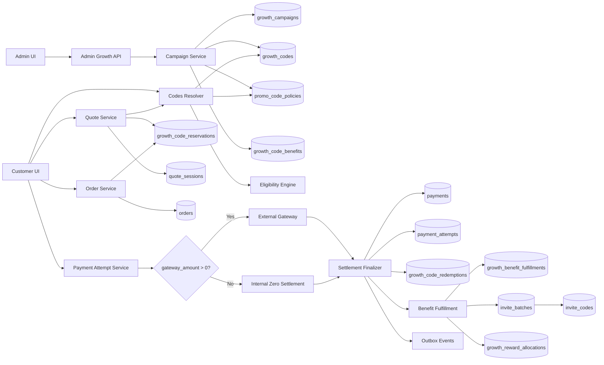
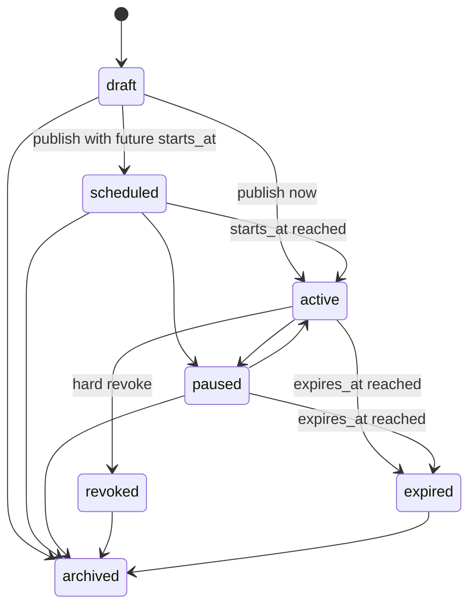
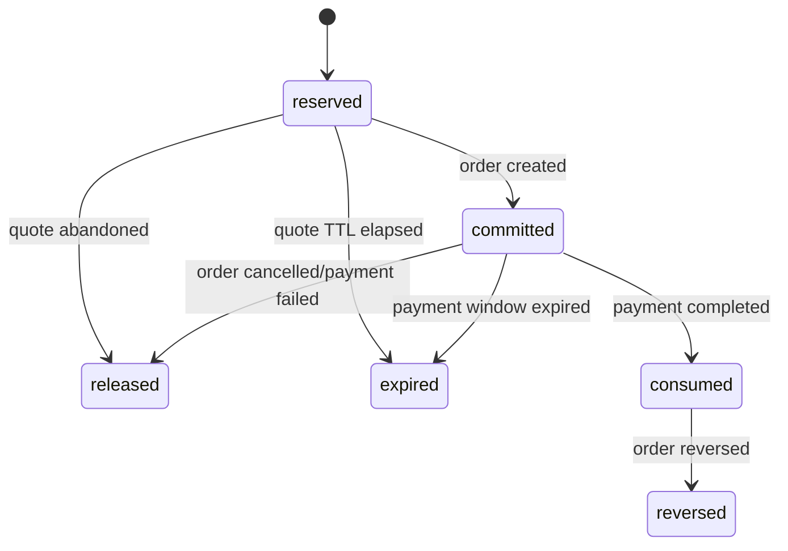
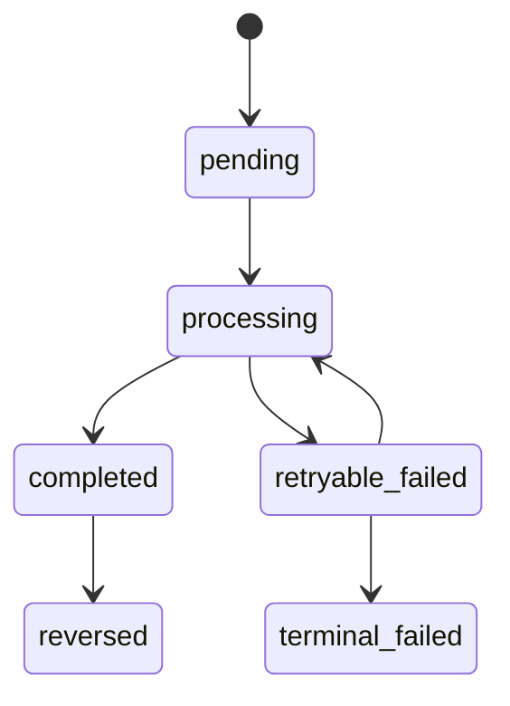
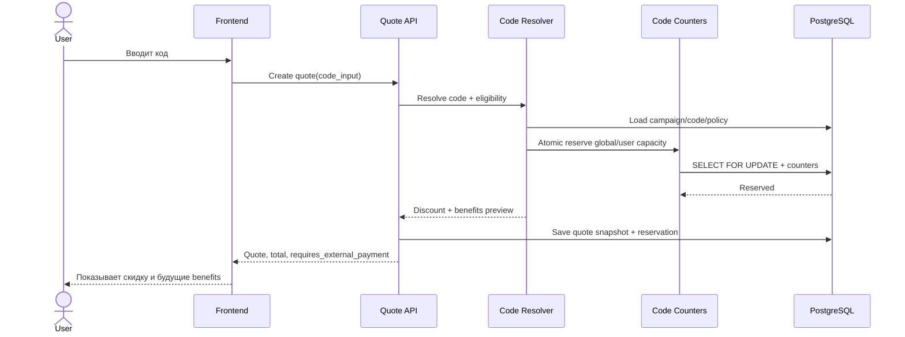
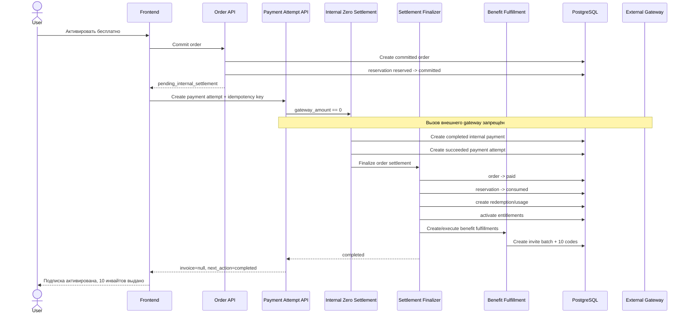

# Техническое задание: Growth Codes v6 для CyberVPN

## Гибкие growth-коды, приватные тарифы, 100% скидка без внешней оплаты, multi-code checkout, visual rule-builder, ML anti-fraud, FX, cabinet-only rollout и post-registration onboarding

| Параметр | Значение |
|---|---|
| Проект | `Beep206/CyberVPN` |
| Целевая ветка | `main` |
| Снимок репозитория | commit `5fa1adf9a71c8d375dd86cc8e037a9d5e84ec860` |
| Дата повторного анализа | 24 июня 2026 |
| Версия документа | `6.0` |
| Статус | Implementation-ready specification; repository refresh |
| Заменяет | Growth Codes v2, v3, v4 и v5 |
| Основные контуры | `backend`, `admin`, `frontend`, Telegram Mini App, task-worker |
| Backend | FastAPI, SQLAlchemy Async, Alembic, PostgreSQL, Redis, outbox |
| Web/Admin | Next.js App Router, TypeScript, TanStack Query, generated OpenAPI clients |
| Ключевое ограничение v6 | Контур тестирования вариантов и внешней продуктовой аналитики отложен в отдельный проект |

---

# 0. Нормативный статус документа

## 0.1. Термины обязательности

В документе используются следующие нормативные обозначения:

- **MUST / ОБЯЗАТЕЛЬНО** — требование является условием приёмки.
- **MUST NOT / ЗАПРЕЩЕНО** — указанное поведение недопустимо.
- **SHOULD / РЕКОМЕНДУЕТСЯ** — отклонение допустимо только с зафиксированным техническим обоснованием.
- **MAY / ДОПУСКАЕТСЯ** — разрешённый, но необязательный вариант.

Frontend-валидация, скрытый UI, route visibility и client state не считаются выполнением backend-инвариантов.
Финансовые значения, identifiers, state transitions, idempotency keys и snapshots должны быть
детерминированными и проверяться на серверной стороне.

## 0.2. Приоритет и замещение предыдущих редакций

Настоящее ТЗ является самостоятельной полной спецификацией и полностью заменяет:

- `CyberVPN_Growth_Codes_v2_Technical_Spec_RU.md`;
- `CyberVPN_Growth_Codes_v3_Technical_Spec_RU.md`;
- `CyberVPN_TZ_Growth_Codes_v4.md`;
- `CyberVPN_Growth_Codes_v5_Technical_Spec_RU.md`.

При конфликте с прежними редакциями применяется v6. Сохранённые в тексте названия API вроде
`/api/v3/...` или snapshot schema `growth-checkout.v3` обозначают версию публичного контракта, а не
версию настоящего документа. Их повышение должно определяться правилами backward compatibility,
а не номером ТЗ.

## 0.3. Зафиксированное исключение из scope

В v6 не требуется реализовывать A/B testing, PostHog или иной контур тестирования вариантов и его внешнюю аналитическую интеграцию.
Не создаются:

- assignment/variant/exposure lifecycle;
- control/variant policies;
- таблицы, repositories, endpoints, workers и admin screens для тестирования вариантов;
- mirrored exposure events;
- зависимости pricing, private access, risk, onboarding или payment flow от сторонней product analytics
  platform.

Будущий контур допускается отдельным ТЗ после готовности аналитической инфраструктуры. Текущая архитектура
не должна его блокировать, но v6 не обязана заранее создавать для него schema или runtime-код.

## 0.4. Повторный аудит перед v6

Повторная проверка выполнена по актуальному `main` на commit:

```text
5fa1adf9a71c8d375dd86cc8e037a9d5e84ec860
```

Базой сравнения являлся commit V5:

```text
ba5b0737eda79463e718172b06ed7088bbedb9cf
```

Между указанными снимками находятся **3 коммита**. Diff затрагивает 17 файлов и относится к
стабилизации backend CI, pip-based mypy gate, test isolation и совместимости тестовых doubles.

Проверены отдельно:

- `.github/workflows/backend-ci.yml`;
- `backend/pyproject.toml` и `backend/uv.lock`;
- `backend/src/application/services/auth_service.py`;
- `backend/src/presentation/api/v1/two_factor/routes.py`;
- `backend/src/shared/async_compat.py`;
- integration/security/load tests, включая Telegram Mini App и codes system flows;
- partner-attribution implementation reports.

В diff **не изменены**:

- canonical/legacy модели promo, invite, gift и growth codes;
- promo/invite/gift resolve, redemption, reservation и fulfillment use cases;
- checkout, quote, order, zero-payment settlement и post-payment orchestration;
- registration, email OTP, Telegram Mini App auth contracts и onboarding response schemas;
- frontend `proxy.ts`, route classification, cabinet-only redirect behavior;
- frontend registration/OTP/Mini App providers и post-registration prompt contracts;
- client capabilities API;
- private tariff catalog/visibility contracts;
- rule-builder, FX, multi-code и ML anti-fraud runtime, поскольку они по-прежнему ещё не реализованы.

Следовательно, изменения репозитория **не требуют пересмотра бизнес-архитектуры V5**. V6 является
полной самостоятельной редакцией с обновлённым repository snapshot и уточнёнными engineering gates.
Она не объявляет требования выполненными и не сокращает scope.

## 0.5. Нормативный delta V6 относительно V5

Функциональные требования V5 сохраняются без изменения, включая:

- бессрочные и ограниченные промокоды;
- private plan access grants;
- 100% discount и internal zero-payment settlement;
- promo-driven invite batches и post-settlement benefits;
- professional visual rule-builder;
- ML-based anti-fraud без зависимости от PostHog;
- immutable FX conversion для fixed discount;
- deterministic multi-code stacking;
- cabinet-only customer site mode;
- optional post-registration promo/invite/gift prompt для Web OTP и Telegram Mini App;
- referral/partner attribution isolation;
- отсутствие A/B testing и PostHog integration в scope.

Новые требования V6 относятся только к качеству поставки:

1. Backend-код, добавляемый по этому ТЗ, ОБЯЗАН проходить текущий pip-based mypy gate.
2. Growth/auth/onboarding tests ОБЯЗАНЫ быть изолированы от Redis DB `0` и использовать выделенную test DB.
3. Новые fixtures и mocks не должны зависеть от случайного порядка запуска полного test suite.
4. Изменения typing не должны менять runtime semantics без отдельного domain test.
5. Любое отклонение от текущего CI command set считается незавершённой поставкой.

## 0.6. Актуальные обязательные engineering gates

### Backend runtime/toolchain

- Python: `3.13.13` в GitHub Actions backend jobs.
- Project requirement: Python `>=3.13`.
- Dependencies для CI устанавливаются командой:

```bash
pip install -e ".[dev]"
```

### Lint и format

```bash
ruff check src/
ruff format --check src/
```

### Type check

```bash
mypy src/ --ignore-missing-imports --no-strict-optional
```

Новые DTO, repositories, protocols, async adapters, rule AST types, risk/FX models и fulfillment handlers
ОБЯЗАНЫ проходить эту команду без локальных blanket exclusions. Точечный `# type: ignore[...]` допускается
только при документированной несовместимости сторонней библиотеки и с узким error code.

### Tests и Redis isolation

Backend CI использует:

```text
REDIS_URL=redis://localhost:6379/15
CYBERVPN_TEST_REDIS_URL=redis://localhost:6379/15
```

Growth Codes V6 MUST NOT:

- очищать Redis DB `0` в тестах;
- полагаться на данные из другого job или локального окружения;
- использовать одинаковые deterministic Redis keys между параллельными tests без namespace;
- оставлять reservations, rate-limit counters, onboarding locks или idempotency keys после test teardown.

Рекомендуемый namespace:

```text
test:{worker_id}:{test_run_id}:{domain}:{key}
```

### Coverage и mandatory jobs

Полная поставка требует успешного завершения:

- `lint`;
- `typecheck`;
- `test`;
- aggregate job `all-checks`.

Наличие зелёных выборочных growth tests при красном полном backend CI не считается выполнением ТЗ.

---

# 1. Цель и ожидаемый бизнес-результат

Необходимо реализовать единый backend-authoritative контур Growth Codes, в котором администратор может
создавать, публиковать, изменять версиями, приостанавливать, отзывать, анализировать и безопасно исполнять
коды с произвольным допустимым сочетанием условий и действий.

После завершения реализации система должна поддерживать:

1. Бессрочные и ограниченные по времени коды.
2. Глобальные, per-user, per-device, per-household/risk-cluster и velocity limits.
3. Привязку к одному, нескольким или всем публичным тарифам.
4. Привязку к приватным тарифам с отдельным secure access grant.
5. Scope по plan family, offer, storefront, country/geogroup, currency, channel и checkout mode.
6. Процентную, fixed и 100% скидку.
7. Автоматическую конвертацию fixed discount в валюту quote по immutable FX snapshot.
8. Несколько одновременно введённых кодов с детерминированным stacking.
9. Post-settlement benefits: invite batch, bonus days, wallet credit, gift code, add-on и расширяемые rewards.
10. 100% оплату промокодом без вызова внешнего payment provider.
11. Professional visual rule-builder без произвольного исполняемого кода.
12. Hybrid rules + ML anti-fraud с model governance, explainability и manual review.
13. Полную идемпотентность quote, reservation, order, payment, redemption, fulfillment и reversal.
14. Cabinet-only customer site mode для private/public beta.
15. Необязательное универсальное окно ввода promo/invite/gift после email OTP и первой регистрации Mini App.
16. Полную сохранность referral и partner attribution.
17. Аудит, observability, reconciliation, staged rollout и rollback.

## 1.1. Обязательные эталонные сценарии

### Сценарий A — 100% скидка и 10 инвайтов

Администратор создаёт бессрочный код `PR-PRO100-INV10`, применимый к `pro_365`. Код покрывает 100%
эффективной стоимости заказа и после internal settlement выдаёт владельцу 10 invite-кодов по 7 дней.
Внешний invoice не создаётся, но order, payment, payment attempt, usage, entitlement и fulfillment
создаются полноценно и идемпотентно.

### Сценарий B — приватный тариф

Код `PR-RU90-ACCESS` открывает конкретному пользователю hidden plan/offer `ru_basic_90`. До успешного
preflight тариф отсутствует в public catalog, не раскрывается по UUID и не становится public. Полученный
grant привязан к user, realm, storefront, channel, policy version и сроку действия.

### Сценарий C — несколько кодов и FX

Пользователь вводит private-access code, percent promo и fixed promo в USD при RUB quote. Backend:

1. классифицирует каждый код;
2. проверяет scope/risk/caps;
3. строит conflict graph;
4. фиксирует FX rate;
5. детерминированно применяет stacking;
6. атомарно резервирует весь accepted code set;
7. возвращает per-code и aggregate breakdown.

### Сценарий D — ML anti-fraud

Новый аккаунт применяет 100% private-plan code. Risk pipeline учитывает account/device velocity,
shared identifiers, graph links, previous redemption history и contextual mismatch. Hard rules имеют
приоритет; ML возвращает score/reasons; versioned decision policy выбирает `allow`, `challenge`, `review`
или `deny`. Решение и feature snapshot сохраняются неизменяемо.

### Сценарий E — cabinet-only private beta

Оператор включает `customer_site_mode=cabinet_only`. Marketing pages на `cyber-vpn.net` получают
временный server-side redirect в `my.cyber-vpn.net/{locale}/dashboard`. Личный кабинет, регистрация,
login, verify, reset, OAuth callbacks, Mini App, checkout, rewards, referral/partner attribution и legal
pages продолжают работать. Возврат в `full_site` выполняется без deployment и без permanent SEO redirect.

### Сценарий F — код после подтверждения email

После успешного `POST /auth/verify-otp` пользователь уже активирован и авторизован, но вместо немедленного
перехода в dashboard получает server-owned onboarding step. Одно поле принимает promo, invite или gift.
Пользователь может применить код либо пропустить шаг. Referral attribution, полученная до регистрации,
должна быть зафиксирована до открытия prompt и не изменяться его действиями.

### Сценарий G — код после регистрации Telegram Mini App

После первого успешного Mini App signup backend сначала разрешает canonical `mobile_users.id`, затем
создаёт onboarding state и возвращает `onboarding.required=true`. Mini App показывает тот же shared prompt
до home screen. Reload и повторная авторизация восстанавливают состояние с backend; transient
`is_new_user` в Zustand не является источником истины.

### Сценарий H — invite-only регистрация и growth invite не смешиваются

Если `registration_invite_required=true`, pre-registration access token обменивается на short-lived
server-side grant и резервируется для конкретной registration attempt. Окончательный consume выполняется
только после успешного создания либо возобновления аккаунта. После activation optional growth prompt
работает независимо. Registration access token нельзя использовать как customer invite code, отображать в
rewards или передавать в universal code resolver.

---

# 2. Повторный аудит актуального репозитория

## 2.1. Что уже существует и должно быть переиспользовано

В текущем репозитории подтверждены следующие основы:

- legacy `promo_codes` и `promo_code_usages`;
- canonical `growth_codes`, issuance, touchpoints, signup attribution, reservations и redemptions;
- `promo_code_policies`, `invite_code_policies`, `gift_code_policies`;
- generic `policy_versions` с approval/effective dating/supersedes;
- `growth_reward_allocations`;
- quote, checkout, order, payment и payment-attempt snapshots;
- zero-gateway local completion;
- public commercial catalog, offers, pricebooks и currencies;
- hidden/private Stage 1 plan families;
- referral attribution cookie/session/claim flow;
- partner attribution, bindings, eligibility и commission snapshots;
- risk graph foundation: subjects, identifiers, links и reviews;
- public `/client/capabilities` contract;
- typed `ConfigService` и audited `system_config` rollout pattern для Mini App;
- Web email OTP activation с cookie session;
- Telegram Mini App auto-registration;
- root/frontend/backend/admin engineering contracts и generated-client workflow.

Эти компоненты следует расширять. Запрещено создавать параллельный pricing, identity, attribution,
configuration, audit или transport stack только для Growth Codes.

## 2.2. Приватные тарифы: фактическое состояние

`SubscriptionPlanModel` содержит `catalog_visibility`, а Stage 1 policy хранит private codes:

```text
start
ru_start
ru_basic
test
development
```

Private plans создаются как `hidden` и `sale_channels=["admin"]`. Public catalog выбирает только public
plans, а `CheckoutUseCase._resolve_plan()` отклоняет hidden plan до code evaluation для non-admin channel.
Следовательно, существующий `promo.plan_ids` не способен открыть приватный тариф. Требуются отдельные:

- pre-catalog code resolution;
- access policy;
- subject-bound grant;
- private catalog endpoint;
- grant-aware context/offer/pricebook resolution;
- повторная проверка grant при quote, checkout и settlement.

## 2.3. Текущий resolver и namespace

`ResolveGrowthCodeUseCase` последовательно ищет legacy invite, legacy promo, canonical gift, referral и
partner code. Это создаёт следующие риски:

- тип определяется порядком lookup, а не global namespace invariant;
- одинаковая строка может существовать в разных legacy namespaces;
- новые onboarding и multi-code surfaces не должны копировать эту цепочку на frontend;
- current response не содержит полный policy/benefit/private-access preview;
- promo resolver всё ещё читает legacy promo fields.

Для новых кодов нужен typed prefix + checksum, но prefix является только hint. Backend обязан проверить
hash/registry и вернуть `CODE_NAMESPACE_AMBIGUOUS`, если legacy fallback неоднозначен.

## 2.4. Multi-code: фактическое состояние

Текущий checkout принимает singular `code_input`, `promo_code`, `partner_code`; `CheckoutResult` хранит
один resolution и один reservation. `discounts` является массивом, но практически заполняется одним
кодом. Quote, checkout, order и adapter также сохраняют singular IDs.

Multi-code требует отдельного `code basket`, per-code applications, conflict graph, aggregate result и
atomic reservation group. Добавление нескольких UI inputs без изменения snapshots и settlement запрещено.

## 2.5. Fixed discount и currencies

Pricebooks currency-specific, однако production FX provider/store/snapshot/reconciliation не обнаружены.
Legacy fixed promo использует `discount_value` как сумму quote currency, даже когда promo currency другая.
Нужно ввести source currency, rate source, timestamp, freshness, rounding, converted amount и immutable
conversion snapshot. `XTR` обрабатывается отдельной managed conversion table, а не обычным fiat rate.

## 2.6. Zero-payment: критический порядок операций

Current `CommitCheckoutUseCase` при `is_zero_gateway` создаёт local completed payment и сразу запускает
`PostPaymentProcessingUseCase`. В order payment-attempt flow payment attempt создаётся после возврата из
commit use case. Поэтому side effects могут выполниться до существования order/payment-attempt linkage.

Дополнительно current zero payment маркируется `provider="wallet"`, даже когда wallet не использовался и
стоимость полностью покрыта promo. Checkout сохраняет `commission_base_amount=base_price`, что может
создать неверную денежную комиссию при нулевой выручке.

V6 требует отдельного atomic settlement finalizer: сначала order + internal payment + succeeded attempt +
reservation consumption, затем outbox и идемпотентные effects.

## 2.7. Invites и benefits

Plan invite generation продолжает читать `plan.invite_bundle` и batch-insert отдельные invite rows.
Нет отдельного promo benefit, invite batch entity и unique fulfillment key по benefit/payment. Redemption
invite должен перейти на conditional update/lock. Promo usage и invite issuance требуют database-enforced
idempotency и concurrency tests.

## 2.8. Cabinet-only routing: фактическое состояние

`frontend/src/proxy.ts` уже знает public/cabinet hosts, cabinet route segments, auth routes, public routes,
`/r/{code}` и `/p/{token}`. Auth намеренно не выполняется в proxy; dashboard защищает `AuthGuard`.

При этом отсутствуют:

- runtime `customer_site_mode`;
- audited admin control;
- dynamic allowlist/redirect matrix;
- mode-aware robots/sitemap/metadata;
- cache/fallback contract между Next.js и backend config;
- tests для redirect loops и attribution preservation.

Реализация должна расширить `proxy.ts`/server routing, не переносить туда auth authorization.

## 2.9. Email OTP onboarding: фактическое состояние

`OtpVerificationForm` после успешного `verifyOtpAndLogin()` устанавливает `success`, а effect сразу делает
`router.push('/dashboard')`. `VerifyOtpResponse` не содержит onboarding state. Backend activation route
создаёт/обновляет customer mobile shadow, устанавливает auth cookies и возвращает user.

Для нового prompt нужно вернуть typed onboarding contract и изменить route decision. При недоступности
onboarding подсистемы уже выданная auth session остаётся действительной; пользователь получает retry/skip,
но не повторную activation.

## 2.10. Telegram Mini App onboarding и identity

`TelegramMiniAppAuthProvider` после auth сразу вызывает `router.replace(miniAppReturnPath)`. Zustand хранит
`isNewTelegramUser`, но это volatile hint. Backend route сначала работает с `AdminUserModel`, а затем
создаёт/находит `MobileUserModel` и выдаёт customer session.

Onboarding state должен создаваться только после окончательного разрешения canonical mobile user. Нельзя
привязывать state к промежуточному admin user или принимать `user_id` от клиента. Возможен случай, когда
admin shadow существовал, а mobile row создаётся впервые; поэтому `result.is_new_user` недостаточен.

## 2.11. Referral claim и новый prompt

Сейчас `ReferralAttributionProvider` после появления authenticated user асинхронно вызывает claim endpoint.
Если prompt начнёт отображаться сразу после OTP/Mini App auth, referral claim и onboarding apply могут
выполняться параллельно.

Нормативный порядок v6:

```text
account activation / Mini App signup
-> canonical mobile subject resolution
-> ensure pending referral attribution claimed or terminally classified
-> initialize onboarding state
-> issue/return onboarding response
-> show optional code prompt
```

Referral failure не должен отменять auth session, но retryable referral state должен быть сохранён и не
может быть перезаписан promo/invite/gift application. Lock order фиксируется в отдельном разделе ТЗ.

## 2.12. Registration access token не является growth invite

Current registration route использует Redis `InviteTokenService` и query parameter `invite_token`, когда
`registration_invite_required=true`. Это security gate до account creation, а не `invite_codes` reward.

Необходимо переименовать transport/domain понятия в документации и новых DTO как
`registration_access_token`, сохранив deprecated alias только при необходимости. Universal prompt не должен
принимать этот токен. Его raw value не хранится в onboarding tables, analytics или URL после consumption.

Текущий route вызывает `validate_and_consume()` до завершения DB registration. Это создаёт риск потери
одноразового допуска при duplicate login, validation error, OTP rate limit или transaction rollback.
Целевой flow обязан использовать `exchange -> reserve -> consume`, а не destructive consume перед записью
пользователя.

## 2.13. Конфликт legacy `?code=` и универсального кода

Referral frontend сейчас рассматривает `ref`, `referral` и generic `code` как referral query keys.
Одновременно universal growth UX естественно может использовать `code`. Без migration policy promo может
быть ошибочно захвачен referral provider.

V6 закрепляет:

- canonical referral entry: `/r/{referral_code}` или `?ref=`;
- canonical partner entry: `/p/{public_token}`;
- generic onboarding/checkout code передаётся в body/state, не как долговечный raw query parameter;
- legacy `?code=` сначала проходит safe server-side classification, затем удаляется из URL;
- raw growth code не попадает в logs/analytics/referrer headers дольше необходимого.

## 2.14. Runtime configuration pattern

В репозитории уже существует typed `MiniAppRuntimeConfig`, `ConfigService`, audited admin system-config,
readiness gates и runtime actions. Site mode и onboarding settings должны использовать тот же архитектурный
паттерн:

- typed dataclass/value object;
- validated system config payload;
- permission + fresh-auth при опасном переключении;
- immutable audit before/after/reason;
- bounded cache;
- deterministic fallback;
- metrics и rollback action.

Нельзя реализовывать production toggle только через `NEXT_PUBLIC_*`, localStorage или ручное изменение
frontend кода.

## 2.15. Client capabilities и server routing

`/client/capabilities` уже возвращает auth, payments, growth, subscriptions и partner capabilities.
Его следует расширить site/onboarding flags для UI, но он не является trust boundary и не должен быть
единственным источником server redirect. Marketing redirect должен выполняться до client render по
server-resolved runtime mode.

## 2.16. Engineering contract и generated artifacts

Изменение auth, onboarding, code-set, admin и capability schemas требует:

1. изменить canonical backend schemas/routes;
2. экспортировать OpenAPI;
3. регенерировать frontend/admin/partner и другие затронутые clients;
4. прогнать consumer typechecks/contract tests;
5. повторить генерацию и получить нулевой diff.

Миграции должны быть PostgreSQL-authoritative, restart-safe, с clean/populated upgrade, downgrade и
re-upgrade tests. Для locks, partial indexes и concurrency SQLite evidence недостаточен.

## 2.17. Сводная таблица подтверждённых разрывов

| № | Подтверждённый разрыв | Требуемое решение v6 |
|---:|---|---|
| 1 | Legacy promo остаётся pricing source | Canonical versioned promo policy |
| 2 | Promo response/update неполные | Full admin DTO и versioned editing |
| 3 | Один code input/application | Code basket и per-code applications |
| 4 | Один reservation | Atomic reservation group |
| 5 | Namespace определяется порядком lookup | Global namespace + ambiguity guard |
| 6 | Нет typed prefix/checksum contract | Единый code format service |
| 7 | Hidden plan rejected до promo | Pre-catalog access resolution |
| 8 | Promo plan scope не выдаёт access | Separate unlock action + grant |
| 9 | Context resolver не принимает grant | Grant-aware offer/pricebook resolution |
| 10 | Нет FX service/snapshot | Rate provider/store/conversion/reconciliation |
| 11 | Нет growth ML pipeline | Hybrid scorer + immutable decision |
| 12 | Zero effects до attempt linkage | Atomic settlement finalizer |
| 13 | Pure promo zero payment=`wallet` | `internal_zero` provider semantics |
| 14 | Commission base может быть ненулевой | Net revenue/commission policy |
| 15 | Plan invites не fulfillment-based | Benefit dispatcher + invite batch |
| 16 | Invite redeem race | Conditional atomic redemption |
| 17 | Promo cap race | Atomic counters/reservations |
| 18 | Нет visual rule-builder | Typed AST/compiler/simulator/UI |
| 19 | Нет runtime site mode | System config + server route gate |
| 20 | Нет mode-aware SEO | Dynamic robots/sitemap/noindex contract |
| 21 | OTP сразу ведёт в dashboard | Onboarding-aware auth response/route |
| 22 | Mini App сразу ведёт в home | Persistent onboarding gate |
| 23 | `is_new_user` transient | Backend state keyed by mobile subject |
| 24 | Referral claim асинхронно конкурирует | Server activation finalizer/lock order |
| 25 | Registration token смешан терминологически | Отдельный access-token lifecycle |
| 26 | Legacy `?code=` захватывается referral | Query migration/classification |
| 27 | Capabilities не содержат site/onboarding | Typed capability extension |
| 28 | Нет cross-device prompt state | `customer_onboarding_states` |
| 29 | Checkout-only promo нельзя consume на signup | Pending code intent |
| 30 | Generated clients не знают новые DTO | OpenAPI regeneration/conformance |
| 31 | Нет support inspector полного code set | Admin explainability view |
| 32 | Нет reconciliation всех новых ledger | Scheduled invariant jobs |
| 33 | Browser OTP/Mini App schema может раскрывать bearer secrets | Разделить cookie и native bearer DTO |
| 34 | `TelegramMiniAppUseCase` делает внутренний commit | Один route/application transaction owner |
| 35 | Registration token consumes до DB success | Exchange/reserve/consume + reconciliation |
| 36 | Нет явной principal-link модели | Canonical customer identity resolver/link ledger |
| 37 | Invite capability объявлена без readiness | Runtime-derived capabilities |
| 38 | Scrubber не знает raw growth-code fields | Расширить Sentry/log/trace sanitization |
| 39 | Referral claim зависит от клиентского effect | Server-side signup finalization |

## 2.18. Основные файлы текущего production path

### Backend

- `backend/src/application/services/config_service.py`
- `backend/src/application/services/public_registration_policy.py`
- `backend/src/application/services/customer_shadow_service.py`
- `backend/src/application/use_cases/auth/verify_otp.py`
- `backend/src/application/use_cases/auth/telegram_miniapp.py`
- `backend/src/application/use_cases/referrals/attribution.py`
- `backend/src/application/use_cases/growth_codes/resolve_code.py`
- `backend/src/application/use_cases/growth_codes/reservations.py`
- `backend/src/application/use_cases/payments/checkout.py`
- `backend/src/application/use_cases/payments/commit_checkout.py`
- `backend/src/application/use_cases/payment_attempts/create_payment_attempt.py`
- `backend/src/application/use_cases/payment_attempts/snapshot_adapter.py`
- `backend/src/application/use_cases/payments/post_payment.py`
- `backend/src/application/use_cases/commerce_sessions/context_resolution.py`
- `backend/src/application/use_cases/commerce_sessions/create_quote_session.py`
- `backend/src/application/use_cases/commerce_sessions/create_checkout_session.py`
- `backend/src/application/use_cases/public_catalog/public_catalog.py`
- `backend/src/application/services/stage1_plan_policy.py`
- `backend/src/infrastructure/database/models/growth_code_model.py`
- `backend/src/infrastructure/database/models/promo_code_model.py`
- `backend/src/infrastructure/database/models/invite_code_model.py`
- `backend/src/infrastructure/database/models/subscription_plan_model.py`
- `backend/src/infrastructure/database/models/pricebook_model.py`
- `backend/src/infrastructure/database/models/policy_version_model.py`
- `backend/src/infrastructure/database/models/risk_*`
- `backend/src/presentation/api/v1/auth/registration.py`
- `backend/src/presentation/api/v1/auth/routes.py`
- `backend/src/presentation/api/v1/client_capabilities/*`
- `backend/src/presentation/api/v1/admin/system_config.py`
- `backend/src/presentation/api/v1/admin/growth.py`

### Customer frontend

- `frontend/src/proxy.ts`
- `frontend/src/app/[locale]/layout.tsx`
- `frontend/src/app/[locale]/(dashboard)/layout.tsx`
- `frontend/src/app/[locale]/(auth)/register/page.tsx`
- `frontend/src/app/[locale]/(auth)/verify/page.tsx`
- `frontend/src/features/auth/components/OtpVerificationForm.tsx`
- `frontend/src/features/auth/components/TelegramMiniAppAuthProvider.tsx`
- `frontend/src/stores/auth-store.ts`
- `frontend/src/features/referral-attribution/provider.tsx`
- `frontend/src/features/referral-attribution/storage.ts`
- `frontend/src/features/client-capabilities/useClientCapabilities.ts`
- `frontend/src/app/robots.ts`
- `frontend/src/app/sitemap.ts`
- `frontend/src/shared/lib/seo-route-policy.ts`

### Admin и contracts

- `admin/src/features/growth/*`
- `admin/src/features/commerce/*`
- `admin/src/lib/api/generated/types.ts`
- `backend/docs/api/openapi.json`
- `AGENTS.md`
- `backend/AGENTS.md`
- `frontend/AGENTS.md`
- `admin/AGENTS.md`

---

# 3. Границы проекта

## 3.1. Обязательный scope

Реализация считается завершённой только при наличии всех следующих блоков:

1. Canonical campaign/code/policy/benefit management.
2. Full admin CRUD, versioning, approval, publish, pause, revoke и audit.
3. 100% discount и internal zero-payment settlement.
4. Promo-driven invite batches и другие idempotent benefits.
5. Public и private tariff targeting.
6. Secure private catalog preflight/grant/quote flow.
7. Professional visual rule-builder.
8. Typed rule AST, validator, compiler, simulator, explain trace и impact preview.
9. Hybrid deterministic rules + ML anti-fraud.
10. Risk model registry, feature snapshots, decisions, challenges и reviews.
11. Automatic fixed-discount FX conversion.
12. Fiat и XTR-specific conversion policies.
13. Multi-code input, evaluation, stacking, reservation и settlement.
14. Deterministic conflict resolution и explainability.
15. Atomic caps/reservations и concurrency safety.
16. Immutable quote/order/payment/fulfillment snapshots.
17. Cabinet-only customer site mode с mode-aware SEO.
18. Post-registration Web OTP и Telegram Mini App universal code prompt.
19. Referral/partner attribution isolation и deterministic activation ordering.
20. Registration access token / growth invite / gift / promo lifecycle separation.
21. Customer preview, private offer rendering, rewards и support inspector.
22. Audit, metrics, logs, alerts, reconciliation и operational runbooks.
23. Legacy migration, backward compatibility, staged rollout и rollback.
24. Unit, property, migration, integration, concurrency, security, E2E, load и smoke tests.
25. OpenAPI export, generated client regeneration и zero-drift contract verification.

## 3.2. Явно вне обязательного scope

Вне данного проекта остаются:

- контур тестирования вариантов и интеграция с внешней product analytics platform;
- полноценный налоговый движок;
- внешний coupon provider;
- персонализированное динамическое ценообразование вне опубликованных policies;
- обучение на raw sensitive PII;
- irreversible automated fraud punishment без review/appeal policy;
- замена всей текущей auth identity architecture отдельным большим migration project.

При этом Growth Codes v6 должен использовать canonical customer subject adapter и не усугублять текущую
двойственность `admin_users`/`mobile_users`.

## 3.3. Необходимые prerequisite decisions

До начала реализации команда должна письменно зафиксировать только следующие значения, не меняя
архитектуру ТЗ:

- final prefixes/alphabet/checksum для новых code types;
- approved FX source(s) и fallback pairs;
- default stacking policy;
- commissionability policy для 100%/sponsored campaigns;
- active-subscription behavior при invite/gift redeem;
- site-mode allowlist legal/status routes;
- onboarding display window и allowed channels;
- ML decision thresholds и fallback по campaign risk class.

Если значение не утверждено, используются безопасные defaults, описанные далее; реализация не должна
подменять отсутствующее решение неявным поведением.

---

# 4. Термины

| Термин | Определение |
|---|---|
| Campaign | Маркетинговая кампания, объединяющая один или несколько кодов, policy и benefits |
| Growth code | Каноническая запись кода: promo, invite, gift, referral или partner |
| Promo policy | Правила скидки, eligibility, usage и stacking |
| Benefit | Награда или действие, связанное с кодом |
| Fulfillment | Идемпотентное фактическое исполнение benefit |
| Invite batch | Одна логическая выдача набора invite-кодов |
| Reservation | Временное удержание доступного использования кода |
| Committed reservation | Использование привязано к order, но ещё не оплачено |
| Consumed usage | Использование окончательно подтверждено completed payment |
| Zero-gateway order | Заказ с `gateway_amount == 0`, не требующий внешней оплаты |
| Internal zero payment | Внутренняя completed payment-запись для zero-gateway заказа |
| Policy version | Неизменяемая опубликованная версия правил |
| Snapshot | Копия правил и расчёта, сохранённая в quote/order/payment |
| Net paid amount | Реально оплаченная пользователем сумма после скидок |
| Commissionable amount | Сумма, от которой допустимо считать денежные referral/partner выплаты |

| Code basket | Нормализованный набор кодов, переданный в один checkout |
| Code application | Результат обработки одного кода внутри code basket |
| Code set evaluation | Совокупный результат resolution, stacking, pricing, risk и reservation |
| Stacking group | Группа совместимости/взаимоисключения кодов или actions |
| Private tariff | Активный hidden plan/offer, отсутствующий в public catalog |
| Private catalog access policy | Правило, разрешающее коду открыть конкретный hidden plan/offer |
| Private catalog grant | Короткоживущее серверное разрешение на просмотр/quote приватного предложения |
| Rule AST | Типизированное JSON-представление условий и действий без исполняемого пользовательского кода |
| Rule compiler | Серверный компонент валидации и компиляции AST в детерминированный evaluation plan |
| Risk feature snapshot | Неизменяемый набор признаков, использованных при fraud decision |
| Risk decision | Итог `allow`, `challenge`, `review` или `deny` с model/rules versions |
| FX rate snapshot | Зафиксированный курс, источник, время и rounding metadata для quote |
| Customer site mode | Runtime-режим `full_site`, `cabinet_only` или `maintenance` для customer web |
| Onboarding flow | Серверное одноразовое состояние optional post-registration шага |
| Registration access token | Короткоживущий Redis-токен допуска к регистрации; не является growth invite |
| Pending code intent | Код, сохранённый после регистрации для повторной полной проверки при checkout |
| Canonical customer subject | Авторизованный `mobile_users.id`, используемый growth/subscription доменом |

---

# 5. Архитектурные принципы

## ARCH-001. Единый источник истины

`growth_codes` и связанные versioned policies становятся canonical source of truth.

Legacy `promo_codes`, `promo_code_usages`, `invite_codes` сохраняются на переходный период как compatibility layer. Новая логика не должна добавлять очередной независимый JSON `promo.invite_bundle` в legacy-таблицу.

## ARCH-002. Benefit не является частью скидки

Скидка и выдача инвайтов — разные эффекты одного кода:

```text
Promo code
├── price effect: 100% discount
└── post-settlement benefit: issue 10 invites
```

Они должны иметь отдельные состояния, idempotency keys и аудит.

## ARCH-003. Бесплатный заказ остаётся полноценным order/payment событием

При сумме к оплате `0` внешний provider не вызывается, но система ОБЯЗАНА создать:

- order;
- internal completed payment;
- succeeded payment attempt;
- settlement event;
- code redemption/usage;
- benefits fulfillment;
- entitlement/provisioning;
- audit trail.

## ARCH-004. Payment completion — единственная точка окончательного consumption

Создание quote и order не должно окончательно расходовать промокод.

Окончательное использование фиксируется только после:

- успешного внешнего платежа;
- или успешного internal zero settlement.

## ARCH-005. Все side effects идемпотентны

Повторный webhook, retry API, повторный task execution или network retry не должен создавать:

- второй payment;
- второй payment attempt;
- второй usage;
- второй invite batch;
- повторную entitlement activation;
- повторную notification.

## ARCH-006. Order исполняется по snapshot

Fulfillment должен использовать policy/benefits snapshot, сохранённый в order, а не текущее состояние campaign.

## ARCH-007. Денежные расчёты только через Decimal

В application/domain слоях запрещено использовать `float` для расчётов скидки, лимитов и final amount.

## ARCH-008. Pessimistic locking для ограниченных ресурсов

Global/per-user caps должны защищаться транзакционными блокировками и атомарными counters.

---

## ARCH-009. Private plan access отделён от discount eligibility

`eligible_plan_ids` отвечает на вопрос «применима ли скидка к плану», но не даёт права получить
hidden plan. Для приватного тарифа требуется отдельное действие `unlock_private_catalog`.

## ARCH-010. Rule-builder создаёт данные, а не исполняемый код

Admin UI формирует типизированный AST по опубликованной JSON Schema. Запрещено хранить или исполнять
произвольный JavaScript, Python, SQL, Jinja либо eval-выражения.

## ARCH-011. Финансовое решение принадлежит backend

Размер скидки, private access, benefit и stacking вычисляются только backend engine и сохраняются в snapshot.

## ARCH-012. Hybrid anti-fraud

Hard deny rules имеют приоритет над ML. ML выдаёт score/reasons, а итоговое действие выбирает
versioned decision policy. Недоступность модели не должна молча превращаться в allow.

## ARCH-013. FX является частью quote contract

Rate, source, timestamp, original amount, converted amount и rounding сохраняются в quote.
После создания quote сумма не пересчитывается по новому курсу.

## ARCH-014. Multi-code результат не зависит от порядка кликов

UI может сохранять порядок ввода для удобства, но backend нормализует набор и применяет
детерминированный evaluation/stacking order. Одинаковый набор при одинаковом context обязан
давать одинаковый результат.

## ARCH-015. Atomic code-set reservation

Нельзя зарезервировать часть ограниченных кодов и вернуть успешный quote как будто весь набор принят.
Reservation group создаётся атомарно либо возвращает объяснимый partial result только если campaign
явно разрешает `partial_acceptance`.

## ARCH-016. Explainability обязательна

Каждый condition, action, risk decision, FX conversion, conflict и ignored code должен иметь
machine-readable reason и trace, пригодный для UI, audit и support.

## ARCH-017. Existing attribution/settlement contracts сохраняются

Multi-code и rule/risk/FX контуры не имеют права обходить:

- pending partner attribution claim;
- commercial binding;
- partner eligibility;
- commission contract snapshot;
- qualifying event policy;
- no-double-payout;
- refund/reversal workflow.
## ARCH-018. Site mode gate выполняется до рендера, но не выполняет auth

Marketing redirect ОБЯЗАН исполняться в `frontend/src/proxy.ts` либо эквивалентном reverse-proxy layer.
Proxy не читает auth cookies и не принимает authorization decisions. `AuthGuard` остаётся единственным
customer dashboard page guard.

## ARCH-019. Onboarding является server-owned state machine

Факт необходимости prompt, его skip/completion и применённый code intent хранятся backend-side. Zustand,
localStorage и `is_new_user` используются только как UX hint, но не как источник истины.

## ARCH-020. Code classification backend-authoritative

Mask/prefix улучшает UX, но тип кода считается установленным только после lookup canonical registry.
Новые коды обязаны иметь type-discriminating prefix; legacy unprefixed codes разрешаются migration adapter.

## ARCH-021. Signup attribution и onboarding code applications независимы

У пользователя может существовать одна signup/referral attribution и одновременно несколько checkout
promo intents/benefits. Promo/invite/gift application не изменяет `referred_by_user_id`, referral cookie или
signup attribution row.

## ARCH-022. Activation не зависит от optional prompt

Email/Mini App account activation и session issuance завершаются до prompt. Ошибка/skip prompt не блокирует
login и не переводит аккаунт обратно в pending. Исключение допускается только отдельной policy с явным
`onboarding_step_required=true`, которая не входит в базовый optional flow.


## ARCH-023. Один transaction owner для signup/onboarding

Нижнеуровневые use cases не выполняют `commit()`. Web OTP, Mini App registration, canonical identity,
referral finalization, onboarding state и session issuance координируются одним application orchestrator.
Внешние best-effort side effects запускаются через outbox после commit.

## ARCH-024. Principal identity разрешается явно

Growth domain принимает только canonical `mobile_users.id`. Связь с `admin_users`, Telegram principal,
OAuth subject, magic-link identity и customer realm session разрешает `ResolveCanonicalCustomerUseCase` и
фиксирует `customer_principal_links`. Принимать `user_id` от клиента запрещено.

## ARCH-025. Registration access использует reserve/consume

Raw registration token обменивается на server-side grant. Grant резервируется по realm, subject hint и
idempotency key, но consumes только после successful create/resume user transaction. Failure освобождает
reservation или допускает deterministic replay.

## ARCH-026. Referral finalization предшествует writable prompt

Client provider может выполнить anonymous capture, но authenticated claim для нового signup завершает
server-side orchestrator до создания onboarding state. Promo/invite/gift application не определяет и не
перезаписывает referral attribution.

## ARCH-027. Browser auth secrets не возвращаются в JavaScript

Cookie-backed browser и Telegram Mini App responses не содержат access/refresh token. Native bearer clients
используют отдельный response contract. Onboarding flow token не заменяет auth session.

## ARCH-028. Capability означает backend readiness

Public capability snapshot вычисляется из config, migrations, dependencies и rollout state. UI support сам
по себе не позволяет объявить функцию доступной. Routing и authorization не доверяют client capability.

# 6. Целевая компонентная схема



---

# 7. Функциональные требования

## 7.1. Campaign и promo management

### FR-CAMPAIGN-001

Администратор должен иметь возможность создать campaign в статусе `draft`.

### FR-CAMPAIGN-002

Campaign должна поддерживать:

- `campaign_key`;
- локализуемое/административное название;
- описание;
- `starts_at`;
- `expires_at`;
- бессрочный режим;
- priority;
- stacking mode;
- status;
- audit metadata.

### FR-CAMPAIGN-003

Одна campaign может иметь один или несколько кодов.

### FR-CAMPAIGN-004

После публикации редактирование бизнес-правил должно создавать новую policy version. Уже созданные order используют прежний snapshot.

### FR-CAMPAIGN-005

Должны поддерживаться состояния:

```text
draft
scheduled
active
paused
expired
archived
revoked
```

### FR-CAMPAIGN-006

`paused` запрещает новые reservations, но не аннулирует уже committed orders.

### FR-CAMPAIGN-007

`revoked` является hard stop и может аннулировать ещё не consumed reservations согласно reason code.

## 7.2. Promo code

### FR-PROMO-001

Код нормализуется на backend:

```python
normalized = code.strip().upper()
```

### FR-PROMO-002

Допустимый alphabet для автоматически генерируемых кодов:

```text
23456789ABCDEFGHJKLMNPQRSTUVWXYZ
```

### FR-PROMO-003

Human-readable custom code должен проходить валидацию:

- длина 4–64;
- только разрешённые символы;
- отсутствие leading/trailing whitespace;
- глобальная уникальность в customer-input namespace.

### FR-PROMO-004

Промокод может быть:

- без даты окончания;
- с `starts_at`;
- с `expires_at`;
- без общего лимита;
- с global cap;
- с per-user cap.

### FR-PROMO-005

Поддерживаемые discount types:

```text
percent
fixed
none
```

`none` означает benefit-only code.

### FR-PROMO-006

Процентная скидка:

```text
0 < discount_value <= 100
```

### FR-PROMO-007

`100%` является валидным значением.

### FR-PROMO-008

Fixed discount должен быть больше нуля и иметь currency.

### FR-PROMO-009

Fixed discount без явной conversion policy применяется только при совпадении валюты.

### FR-PROMO-010

Поддерживаются discount scopes:

```text
subscription_only
addons_only
order_total
selected_items
```

Для полного закрытия заказа 100% промокодом должен использоваться `order_total`.

### FR-PROMO-011

Скидка всегда ограничивается discountable amount:

```text
discount_amount <= discountable_amount
```

### FR-PROMO-012

Итоговые суммы не могут быть отрицательными.

### FR-PROMO-013

Промокод может содержать `max_discount_amount`.

### FR-PROMO-014

Eligibility должна поддерживать:

- plan IDs;
- plan families;
- durations;
- offer IDs/keys;
- storefront IDs/keys;
- channels;
- checkout modes;
- add-on codes;
- geos;
- minimum pre-discount order amount;
- new customer only;
- first completed order only;
- first net-paid order only;
- no active subscription;
- allowlist/denylist users;
- auth realm;
- risk ruleset.

### FR-PROMO-015

Промокод может быть настроен без скидки и только с benefit.

### FR-PROMO-016

Frontend preview не расходует usage.

### FR-PROMO-017

Quote создаёт reservation только после полной eligibility проверки.

## 7.3. 100% скидка и zero-payment

### FR-ZERO-001

Если после скидки и wallet calculation:

```text
gateway_amount == 0
```

система MUST NOT обращаться к внешнему payment provider.

### FR-ZERO-002

Не должен создаваться внешний invoice.

### FR-ZERO-003

Должен создаваться internal payment:

```text
status = completed
provider = internal_zero
final_amount = 0
```

### FR-ZERO-004

Должен создаваться succeeded payment attempt:

```text
status = succeeded
provider = internal_zero
invoice = null
```

### FR-ZERO-005

Order должен переходить в `settlement_status = paid` только после успешного internal settlement.

### FR-ZERO-006

Нельзя помечать order как paid до создания payment и payment attempt.

### FR-ZERO-007

Post-payment orchestration запускается только после того, как payment связан с order через payment attempt или прямой canonical order reference.

### FR-ZERO-008

Для 100% promo wallet usage должен быть автоматически clamped до `0`. Wallet не замораживается и не дебетуется.

### FR-ZERO-009

100% discount order считается:

- успешным order conversion;
- consumed promo usage;
- qualifying event для явно разрешённых promo benefits;
- не является cash payment;
- по умолчанию не является основанием для cash referral/partner payout.

### FR-ZERO-010

По умолчанию:

```text
commissionable_amount = 0
```

для zero-payment заказа.

### FR-ZERO-011

Система должна хранить отдельно:

- gross/displayed amount;
- discount amount;
- wallet amount;
- gateway amount;
- net paid amount;
- commissionable amount.

### FR-ZERO-012

Клиентский UI должен показывать CTA:

```text
Активировать бесплатно
```

или локализованный эквивалент вместо «Перейти к оплате».

### FR-ZERO-013

После успешной zero-payment активации frontend не открывает новое окно и не ожидает webhook.

### FR-ZERO-014

Zero-payment endpoint должен быть защищён idempotency key.

### FR-ZERO-015

Повтор запроса с тем же key возвращает тот же payment/order result.

### FR-ZERO-016. Legal acceptance и receipt

100% discount не отменяет commercial/legal flow. До settlement ОБЯЗАТЕЛЬНО:

- зафиксировать принятый legal document set/version;
- сохранить customer consent snapshot и channel;
- показать final order summary с gross/discount/net amounts;
- создать internal zero-value order receipt/confirmation;
- не маркировать external invoice как созданный;
- передать entitlement/provisioning тот же order snapshot, что и для платного заказа.

### FR-ZERO-017. Accounting classification

Internal zero payment должен иметь отдельные `provider`, `reason_code` и `funding_source`:

```text
provider = internal
reason_code = promotion_fully_funded | wallet_fully_funded | mixed_fully_funded
funding_source = promotion | wallet | promotion_and_wallet
```

Pure 100% promo запрещено классифицировать как wallet payment.

## 7.4. Benefits

### FR-BENEFIT-001

Промокод может иметь 0..N benefits.

### FR-BENEFIT-002

Типы первой версии:

```text
issue_invites
bonus_days
wallet_credit
issue_gift
grant_addon
```

### FR-BENEFIT-003

Каждый benefit имеет trigger:

```text
quote_preview
order_committed
payment_completed
first_payment_completed
renewal_completed
```

### FR-BENEFIT-004

`issue_invites` выполняется только после settlement completion.

### FR-BENEFIT-005

Benefit может разрешать или запрещать zero-net-payment order:

```json
{
  "allow_zero_net_payment": true
}
```

### FR-BENEFIT-006

Для сценария «100% скидка + 10 инвайтов» это поле обязательно `true`.

### FR-BENEFIT-007

Каждый fulfillment имеет уникальный idempotency key.

### FR-BENEFIT-008

Ошибки fulfillment не должны откатывать уже подтверждённый external payment. Они должны попадать в retry queue.

### FR-BENEFIT-009

Для internal zero settlement рекомендуется выполнять payment finalization и создание fulfillment records в одной транзакции, а тяжёлые внешние side effects — через outbox/worker.

### FR-BENEFIT-010

Benefit config snapshot сохраняется в order.

### FR-BENEFIT-011

Изменение campaign после order не меняет количество уже обещанных инвайтов.

### FR-BENEFIT-012

Поддерживаются merge modes:

```text
append
replace_same_type
max
exclusive
```

### FR-BENEFIT-013

Если plan bundle и promo benefit оба выдают инвайты:

- создаются отдельные invite batches;
- source сохраняется отдельно;
- итог зависит от merge mode;
- повторное выполнение каждого source независимо идемпотентно.

## 7.5. Invite batches

### FR-INVITE-001

Выдача нескольких invite-кодов создаёт одну запись `invite_batches`.

### FR-INVITE-002

Batch хранит:

- владельца;
- campaign/code/benefit source;
- order/payment source;
- количество;
- friend days;
- entitlement source;
- expiry policy;
- status;
- idempotency key.

### FR-INVITE-003

Поддерживаются expiry modes:

```text
none
relative
absolute
```

### FR-INVITE-004

`none` создаёт бессрочные invite-коды с `expires_at = NULL`.

### FR-INVITE-005

`relative` рассчитывает expiry от момента issuance.

### FR-INVITE-006

`absolute` использует фиксированную дату.

### FR-INVITE-007

Привязка invite к плану должна иметь реальный смысл.

Поддерживаются entitlement modes:

```text
profile_key
plan_snapshot
custom_snapshot
```

### FR-INVITE-008

Для `plan_snapshot` при issuance сохраняется immutable entitlement snapshot выбранного plan/offer.

### FR-INVITE-009

Redeem использует сохранённый snapshot, а не текущую версию плана.

### FR-INVITE-010

Batch можно:

- просмотреть;
- экспортировать;
- revoke;
- продлить;
- повторно отправить владельцу;
- отфильтровать по source/status.

### FR-INVITE-011

По умолчанию revoke batch отзывает только неиспользованные коды.

### FR-INVITE-012

Отзыв уже redeemed invite и entitlement допускается только отдельным privileged action.

### FR-INVITE-013

Invite redemption должен быть атомарным.

### FR-INVITE-014

Self-redemption должен оставаться запрещённым, если policy не указывает иное.

## 7.6. Клиентский UX

### FR-CLIENT-001

До подтверждения заказа frontend должен показать:

- код принят;
- размер скидки;
- новая итоговая сумма;
- необходимость внешней оплаты;
- список benefits после settlement.

### FR-CLIENT-002

Пример:

```text
Скидка: 100%
К оплате: $0.00
После активации вы получите 10 инвайт-кодов,
каждый на 7 дней доступа.
```

### FR-CLIENT-003

При zero-payment не должно быть редиректа на gateway.

### FR-CLIENT-004

После завершения должны быть invalidated query keys:

```text
orders
payments/history
current-entitlements
current-service-state
subscriptions
growth/invites
growth/gifts
growth/rewards
growth/notifications
growth/notifications/counters
```

### FR-CLIENT-005

Invite inventory должен группироваться по batch.

### FR-CLIENT-006

Должны отображаться:

- source label;
- campaign/promo label;
- count;
- active/used/expired/revoked;
- friend days;
- plan/profile;
- expiry;
- copy/share one;
- copy/share all.

### FR-CLIENT-007

Backend отдаёт machine-readable `message_key` и `message_params`. Нельзя хардкодить business errors только на английском.

---

## 7.7. Привязка к приватным тарифам

### FR-PRIVATE-001. Два независимых типа связи с тарифом

Policy ОБЯЗАНА различать:

```text
eligible_for_plan
unlock_private_plan
```

Первое ограничивает скидку. Второе предоставляет право обнаружить и купить hidden plan/offer.

### FR-PRIVATE-002. Private target types

Кампания может открывать:

- конкретный `subscription_plan_id`;
- конкретный `offer_id`;
- versioned `offer_key`;
- группу приватных plan codes;
- private storefront offer;
- один recommended target из набора.

### FR-PRIVATE-003. Отсутствие утечки

До успешного preflight backend НЕ ДОЛЖЕН возвращать:

- private plan name;
- цену;
- entitlements;
- offer key;
- факт существования конкретного plan id;
- различимые `not found`/`not allowed` ответы.

Наружный ответ для невалидного доступа должен быть унифицированным.

### FR-PRIVATE-004. Pre-catalog evaluation

Должен существовать endpoint, который принимает code basket и минимальный context без `plan_id`,
определяет private-access actions и возвращает только разрешённые private offer previews.

### FR-PRIVATE-005. Access grant

После успешной проверки создаётся `private_catalog_access_grant`, связанный с:

- user id либо anonymous session;
- auth realm;
- storefront;
- sale channel;
- code-set hash;
- campaign/policy version;
- risk decision;
- разрешёнными plan/offer ids;
- TTL;
- max quote conversions.

### FR-PRIVATE-006. Grant token

Клиент получает opaque ID либо подписанный token. Token ОБЯЗАН быть:

- короткоживущим;
- непредсказуемым;
- bound к subject и context;
- одноцелевым;
- не содержащим raw code;
- проверяемым backend;
- отзывным.

JWT без server-side revocation record не рекомендуется.

### FR-PRIVATE-007. Checkout validation

`ResolveQuoteContextUseCase` и `CheckoutUseCase` должны принимать `private_catalog_grant_id`
и разрешать hidden plan только при валидном grant.

Переданный клиентом `plan_id` без grant не даёт право купить private plan.

### FR-PRIVATE-008. Pricebook/offer requirement

Приватный plan должен иметь:

- активный private offer;
- pricebook entry для выбранной currency/storefront;
- legal document set;
- entitlement snapshot;
- sale-channel policy, допускающую `private_grant`.

Нельзя рассчитывать private plan по `subscription_plans.price_usd` в обход commercial context.

### FR-PRIVATE-009. Code semantics

Private-access code может одновременно:

- открыть plan;
- дать discount, включая 100%;
- выдать benefits;
- иметь caps;
- требовать challenge/review.

### FR-PRIVATE-010. Grant lifecycle

```text
issued -> attached_to_quote -> attached_to_checkout -> consumed
                 \-> expired
                 \-> revoked
                 \-> denied_by_risk
```

Grant consume происходит при создании committed order либо по policy; usage кода окончательно consume
только после settlement.

### FR-PRIVATE-011. Revalidation

При переходе quote → checkout backend повторно проверяет:

- grant status/TTL;
- subject binding;
- plan/offer match;
- policy version;
- risk blocking override;
- pricebook/legal drift.

### FR-PRIVATE-012. Admin UI

В plan selector hidden планы должны быть доступны только пользователям с permission
`growth.private_catalog.manage`. Для каждого выбранного hidden plan UI должен требовать явный выбор:

```text
[ ] Только eligibility, без открытия
[x] Открывать тариф пользователю после применения кода
```

Нельзя неявно интерпретировать выбор hidden plan как unlock.

### FR-PRIVATE-013. Test/development plans

Plan codes `test` и `development` по умолчанию запрещены для production campaigns.
Их публикация требует environment guard и отдельного high-risk permission.

### FR-PRIVATE-014. Catalog access class

`catalog_visibility` управляет отображением, но не достаточен для authorization. Ввести:

```text
public
private_code_gated
admin_only
internal_test
```

- `public` может входить в public catalog;
- `private_code_gated` доступен customer только через valid private grant;
- `admin_only` никогда не открывается customer growth-кодом;
- `internal_test` запрещён в production независимо от promo scope;
- неопределённый/legacy hidden plan fail-closed как `admin_only`.

### FR-PRIVATE-015. Явный migration mapping

До включения private grants каждый существующий hidden plan должен получить approved access class. Backfill
по имени/plan code без отчёта и ручного подтверждения запрещён.

---

## 7.8. Профессиональный visual rule-builder

### FR-RULE-001. Назначение

Rule-builder является главным интерфейсом создания eligibility, access, pricing, benefits,
stacking и risk decision policies.

### FR-RULE-002. Typed AST

UI должен сохранять типизированный AST:

```json
{
  "schema_version": "growth-rule.v1",
  "root": {
    "kind": "group",
    "operator": "and",
    "children": [
      {
        "kind": "condition",
        "field": "basket.plan.id",
        "operator": "in",
        "value": ["uuid"]
      }
    ]
  },
  "actions": [
    {
      "type": "discount.percent",
      "params": {"value": "15"}
    }
  ]
}
```

AST валидируется JSON Schema и Pydantic-моделями.

### FR-RULE-003. Запрет произвольного кода

Rule-builder не должен принимать JS/Python/SQL/eval. Все fields, operators и actions берутся из
server-provided registry с version.

### FR-RULE-004. Каталог полей

Минимальные namespaces:

- `subject.*`
  - user id;
  - account age;
  - verified channels;
  - segment;
  - subscription state;
  - lifetime paid amount;
- `session.*`
  - anonymous/session id;
  - device class;
  - risk subject;
- `basket.*`
  - plan;
  - offer;
  - plan family;
  - duration;
  - add-ons;
  - base/net amount;
  - checkout mode;
- `commercial.*`
  - storefront;
  - channel;
  - pricing country;
  - payment country;
  - currency;
  - pricebook;
- `time.*`
  - instant;
  - weekday;
  - local time;
  - campaign window;
- `usage.*`
  - global;
  - per user;
  - per device;
  - per risk cluster;
  - last redemption;
- `attribution.*`
  - partner binding;
  - referral;
  - campaign source;
  - assignment;
- `risk.*`
  - score;
  - level;
  - reason tags;
  - review state.

### FR-RULE-005. Operators

Минимум:

- equals / not_equals;
- in / not_in;
- gt / gte / lt / lte;
- between;
- contains_any / contains_all;
- exists / not_exists;
- starts_with;
- before / after;
- within_last;
- regex только для безопасных заранее разрешённых fields и с timeout;
- segment_matches;
- risk_at_least.

### FR-RULE-006. Actions

Минимум:

- `discount.percent`;
- `discount.fixed`;
- `discount.cap`;
- `catalog.unlock_private`;
- `benefit.issue_invites`;
- `benefit.bonus_days`;
- `benefit.wallet_credit`;
- `benefit.issue_gift`;
- `benefit.grant_addon`;
- `stacking.set_group`;
- `stacking.set_priority`;
- `risk.require_challenge`;
- `risk.require_review`;
- `message.set_preview`.

### FR-RULE-007. UI layout

Обязательная профессиональная компоновка:

1. **Left palette**
   - searchable field/action catalog;
   - templates;
   - favourites/recent.
2. **Center canvas/tree**
   - nested AND/OR groups;
   - drag/drop;
   - compact/full view;
   - collapse;
   - duplicate;
   - disable node.
3. **Right inspector**
   - typed editor;
   - descriptions/examples;
   - validation;
   - impact hints.
4. **Bottom/sticky simulator**
   - context inputs;
   - evaluation trace;
   - price breakdown;
   - conflicts;
   - risk/FX result.

### FR-RULE-008. UX capabilities

ОБЯЗАТЕЛЬНЫ:

- undo/redo;
- keyboard navigation;
- copy/paste node;
- duplicate group;
- templates;
- autosave draft;
- unsaved-change guard;
- validation badges;
- breadcrumb;
- search;
- accessible labels/focus;
- responsive large-screen layout;
- read-only AST preview;
- JSON export/import с schema validation;
- version diff;
- impact preview;
- test fixtures;
- publish checklist.

### FR-RULE-009. Complexity limits

Server-configurable limits:

- max depth: default 8;
- max nodes: default 200;
- max actions: default 30;
- max list values per condition: default 500;
- evaluation time budget;
- regex safeguards;
- no cyclic references.

### FR-RULE-010. Compilation

Publish запускает:

1. schema validation;
2. semantic validation;
3. type checking;
4. forbidden-combination checks;
5. reference resolution;
6. conflict graph build;
7. complexity cost calculation;
8. deterministic execution plan generation;
9. checksum;
10. immutable policy version creation.

### FR-RULE-011. Simulation modes

- synthetic context;
- existing user;
- existing quote/order replay;
- batch impact sample;
- boundary tests;
- private-plan leak test;
- concurrency/cap dry run;
- FX freshness simulation;
- model unavailable simulation.

Simulation не создаёт usage, reservation, entitlement или benefit.

### FR-RULE-012. Explain trace

Для каждого node:

```json
{
  "node_id": "condition-12",
  "result": true,
  "actual": "web",
  "operator": "equals",
  "expected": "web",
  "duration_us": 41
}
```

Sensitive values должны маскироваться согласно permission.

### FR-RULE-013. Approval workflow

Высокорисковые изменения требуют maker-checker approval:

- 100% discount;
- private plan unlock;
- unlimited usage;
- wallet credit;
- fixed FX without cap;
- ML threshold relaxation;
- stacking с partner/referral;

Создатель не может сам утвердить policy при включённом separation-of-duties.

---

## 7.9. ML-based anti-fraud

### FR-RISK-001. Hybrid pipeline

Порядок:

```text
identity/risk-subject resolution
-> hard deny/allow rules
-> feature collection
-> ML scoring
-> decision policy
-> allow | challenge | review | deny
```

Hard deny не может быть снят ML-моделью.

### FR-RISK-002. Точки проверки

Risk evaluation выполняется:

- при private catalog preflight;
- при code-set evaluation;
- перед reservation;
- при quote → checkout;
- перед zero-payment settlement;
- перед benefit fulfillment;
- при invite redemption;
- при suspicious retry/reconciliation.

### FR-RISK-003. Feature categories

Минимальные признаки:

**Account**

- age;
- verified email/Telegram;
- auth methods;
- profile completeness;
- active access;
- prior paid orders;
- refund/chargeback history.

**Velocity**

- code attempts per minute/hour/day;
- distinct accounts per device/IP/ASN;
- distinct codes per account;
- private grants per subject;
- zero-payment orders;
- invite redemptions.

**Graph**

- risk cluster size;
- shared identifiers;
- owner/redeemer links;
- referral/partner self-link;
- device/payment identifier reuse;
- graph distance to denied subjects.

**Commercial**

- discount percentage;
- net paid amount;
- private plan;
- benefit value;
- code scarcity;
- stacking count;
- FX anomaly;

**Context**

- IP/pricing/payment country mismatch;
- ASN/proxy/VPN risk;
- impossible travel;
- user agent/device hash;
- time-of-day anomaly.

### FR-RISK-004. Privacy

Запрещено передавать model service raw:

- email;
- phone;
- Telegram username;
- full IP;
- payment credentials;
- raw code.

Используются stable salted hashes, categorical signals и минимально необходимые previews.

### FR-RISK-005. Model registry

Хранить:

- model key/version;
- artifact checksum/location;
- feature schema version;
- training window;
- metrics;
- calibration;
- approval status;
- deployed mode;
- threshold set;
- created/approved/deployed timestamps.

### FR-RISK-006. Feature snapshot

Каждое решение сохраняет immutable feature snapshot либо encrypted/reference form:

- feature names;
- normalized values;
- missing indicators;
- feature schema version;
- generated_at;
- source freshness.

### FR-RISK-007. Prediction result

```json
{
  "score": "0.8731",
  "risk_band": "high",
  "model_version": "growth-fraud-v6",
  "top_reason_codes": [
    "DEVICE_MULTI_ACCOUNT_VELOCITY",
    "ZERO_PAY_PRIVATE_PLAN",
    "NEW_ACCOUNT_HIGH_VALUE_BENEFIT"
  ]
}
```

### FR-RISK-008. Decision policy

Thresholds задаются versioned policy и bounded global constraints:

- `allow`;
- `challenge`;
- `review`;
- `deny`.

Campaign admin не может установить threshold ниже platform minimum.

### FR-RISK-009. Challenge

Поддержать расширяемые challenge types:

- re-authentication;
- verified email/Telegram;
- CAPTCHA;
- cooldown;
- support/manual verification.

Challenge completion создаёт отдельное signed/audited result.

### FR-RISK-010. Manual review

`review` создаёт `risk_review` с:

- subject;
- code/campaign;
- quote/order;
- model/rules versions;
- reasons;
- masked evidence;
- SLA;
- reviewer;
- outcome;
- notes.

### FR-RISK-011. Model availability

При timeout/error:

- low-risk campaign: rules-only fallback;
- high-risk/100%/private campaign: `challenge` или `review/deny` по policy;
- решение и fallback reason логируются;
- frontend получает нейтральное сообщение без fraud details.

### FR-RISK-012. Shadow/champion/challenger

Новая модель сначала работает в `shadow`, не влияя на решение. Затем:

- champion/challenger comparison;
- calibration check;
- fairness/segment checks;
- rollback-ready deployment.

### FR-RISK-013. Drift

Мониторить:

- feature drift;
- prediction drift;
- approval/deny rate;
- false positive feedback;
- label delay;
- data quality;
- model latency/errors.

### FR-RISK-014. Feedback loop

Labels формируются из:

- confirmed abuse;
- chargebacks;
- refunds;
- manual review;
- account bans;
- invite abuse;
- clean mature transactions.

Training pipeline не входит в synchronous checkout, но model governance и feedback export входят в scope.

### FR-RISK-015. Explainability

Admin/support видят reason codes и top factors. Customer не видит чувствительные detection details.

---

## 7.10. Автоматическая FX-конвертация fixed discount

### FR-FX-001. Source currency

Каждая fixed discount policy ОБЯЗАНА иметь:

- `amount`;
- `source_currency`;
- `conversion_mode`;
- `rounding_mode`;
- optional max discount;
- allowed target currencies.

### FR-FX-002. Conversion modes

Поддержать:

- `same_currency_only`;
- `market_fx`;
- `pricebook_parity`;
- `configured_rate`;
- `xtr_commercial_table`.

### FR-FX-003. Fiat rate source

Для `market_fx` требуется provider abstraction:

- primary provider;
- secondary provider;
- persisted snapshots;
- health check;
- freshness SLA;
- circuit breaker;
- reconciliation.

Конкретный внешний provider выбирается конфигурацией, а не hardcode в domain.

### FR-FX-004. Pricebook parity

Для регионального pricing рекомендуется `pricebook_parity`, где fixed benefit задаётся относительно
reference pricebook/offer, а не волатильного spot FX.

### FR-FX-005. XTR

`XTR` не обрабатывается как стандартная fiat currency. Используется versioned commercial conversion table
или отдельное fixed значение в policy. Market FX для XTR запрещён.

### FR-FX-006. Формула

```text
raw_converted = source_amount * fx_rate
rounded = quantize(raw_converted, target_minor_units, rounding_mode)
applied = min(rounded, eligible_discount_base, optional_max_discount)
```

Все вычисления — `Decimal`.

### FR-FX-007. Minor units

Currency metadata содержит minor units. Нельзя считать все валюты двухзнаковыми.
Для zero-decimal currencies и XTR применяется соответствующий quantization.

### FR-FX-008. Rate snapshot

Quote сохраняет:

- source/target currency;
- source amount;
- rate;
- inverse rate при необходимости;
- provider/source;
- observed_at;
- fetched_at;
- expires_at;
- rate version/id;
- rounding mode;
- minor units;
- converted amount;
- applied amount.

### FR-FX-009. Freshness

Policy задаёт `max_rate_age_seconds`. Устаревший rate:

- не применяется молча;
- использует approved fallback;
- либо отклоняет code с `FX_RATE_UNAVAILABLE`;
- создаёт metric/alert.

### FR-FX-010. No re-rate

После quote order и payment attempt используют snapshot. Изменение курса не вызывает quote drift,
если исходный rate snapshot ещё был валиден в момент создания quote.

### FR-FX-011. Refund/reporting

Refund/reversal опирается на фактически applied target amount. Analytics дополнительно хранит source amount/rate.

### FR-FX-012. Admin preview

Rule-builder должен показывать conversion preview для выбранных currencies и rate source, включая
worst-case staleness/fallback.

---

## 7.11. Несколько одновременно введённых кодов

### FR-MULTI-001. Code basket contract

Frontend отправляет:

```json
{
  "codes": [
    {"code": "PRIVATE90", "client_slot_id": "slot-1"},
    {"code": "SAVE15", "client_slot_id": "slot-2"},
    {"code": "LOYAL10", "client_slot_id": "slot-3"}
  ]
}
```

Default max — 5, platform max — 10.

### FR-MULTI-002. Нормализация

Backend:

- trim;
- Unicode normalization;
- canonical uppercase по policy;
- duplicate removal/rejection;
- namespace lookup;
- stable code-set hash;
- deterministic processing order.

Raw codes не попадают в обычные logs.

### FR-MULTI-003. Роли кодов

Код может иметь одну или несколько ролей:

- `catalog_access`;
- `attribution`;
- `discount`;
- `benefit`;
- `eligibility`;
- `message`.

Invite/gift redeem codes в checkout возвращают wrong-context и не смешиваются с checkout actions.

### FR-MULTI-004. Evaluation phases

Строгий порядок:

1. normalize and identify;
2. resolve subject/risk;
3. evaluate private-access actions;
4. resolve effective catalog/offer/pricebook;
5. evaluate attribution codes/bindings;
6. evaluate eligibility;
7. build conflict graph;
8. calculate discounts;
9. evaluate benefits preview;
10. reserve caps atomically;
11. serialize aggregate result.

### FR-MULTI-005. Stacking policy

Для каждой pricing action:

- `stack_group`;
- `exclusive_group`;
- `priority`;
- `strategy`;
- `base_scope`;
- `max_combined_discount`;
- `allow_with_partner`;
- `allow_with_referral`;
- `allow_with_wallet`;
- `allow_with_same_campaign`.

### FR-MULTI-006. Strategies

Минимум:

- `exclusive`;
- `best_of`;
- `first_by_priority`;
- `additive_percent_capped`;
- `sequential_percent`;
- `fixed_after_percent`;
- `fixed_before_percent`;
- `benefits_only_append`.

Нельзя полагаться на порядок массива от клиента.

### FR-MULTI-007. Recommended default

По умолчанию:

1. private access не влияет на цену;
2. attribution выбирается по existing attribution policy;
3. один primary percent discount;
4. допустимые fixed discounts применяются после percent;
5. итоговая скидка clamp до eligible base;
6. benefits append по merge policy;
7. wallet применяется после discounts.

### FR-MULTI-008. Per-code result

Ответ содержит для каждого кода:

- normalized masked code;
- code type/roles;
- accepted/rejected/conflicted/ignored;
- reason code/message key;
- selected policy version;
- risk decision id;
- discount source/converted/applied;
- benefits preview;
- reservation id/status;
- private unlock summary.

### FR-MULTI-009. Aggregate result

Содержит:

- code-set hash;
- accepted code count;
- aggregate price breakdown;
- conflict graph summary;
- private grant;
- aggregate risk result;
- reservation group id;
- customer message tokens.

### FR-MULTI-010. Partial acceptance

Campaign/platform policy определяет:

- `all_or_nothing` — любой invalid/conflict отклоняет set;
- `accept_valid` — invalid code исключается, остальные применяются;
- `require_roles` — обязательны конкретные роли.

Для 100%/private access рекомендуется `all_or_nothing`.

### FR-MULTI-011. Atomic reservation group

Все ограниченные codes lock/reserve в порядке sorted `growth_code_id`.
При ошибке транзакция откатывает весь group.

### FR-MULTI-012. Limit accounting

Per-user/global limits считаются отдельно по каждому code/application.
Aggregate campaign cap может дополнительно ограничивать весь set.

### FR-MULTI-013. Recalculation

Добавление/удаление кода создаёт новый quote и новый reservation group.
Предыдущая open group release с reason `code_set_replaced`.

### FR-MULTI-014. Idempotency

Fingerprint включает:

- sorted code-set ids/hashes;
- selected policy versions;
- FX snapshots;
- private grant;
- risk decision;
- basket/context.

### FR-MULTI-015. Partner/referral

Partner/referral code не должен терять eligibility/commission snapshot из-за присутствия promo.
Совместимость задаётся явно. Если запрещена — возвращается deterministic conflict, а не silent ignore.

### FR-MULTI-016. 100% combination

Сумма нескольких discounts может дать 100%. Тогда используется тот же zero-payment settlement,
что и для одного 100% promo. External provider не вызывается.

### FR-MULTI-017. Security

Нельзя использовать несколько кодов для обхода:

- per-user caps;
- first-purchase rule;
- private grant;
- risk challenge;
- commission no-double-payout;
- max combined discount.

### FR-MULTI-018. Customer UX

UI должен позволять:

- добавить несколько codes;
- видеть chips/cards;
- удалить один;
- повторить проверку;
- видеть применённый/отклонённый status;
- видеть итоговый discount breakdown;
- понимать, какой код открыл private plan;
- не видеть sensitive antifraud reason.
## 7.12. Cabinet-only режим клиентского сайта

### FR-SITE-001. Режимы

Ввести enum:

```text
full_site
cabinet_only
maintenance
```

- `full_site`: текущее штатное поведение.
- `cabinet_only`: marketing routes временно redirect в кабинет; кабинет и обязательные исключения работают.
- `maintenance`: отдельный аварийный режим с maintenance page; не является заменой cabinet-only.

### FR-SITE-002. Независимость от registration policy

`customer_site_mode`, `registration_enabled` и `registration_invite_required` — независимые параметры.
Разрешены комбинации:

- cabinet-only + public registration;
- cabinet-only + closed registration;
- full-site + closed registration;
- full-site + public registration.

### FR-SITE-003. Source of truth и fallback

Backend System Config хранит:

```json
{
  "customer_site_mode": "cabinet_only",
  "config_version": 12,
  "effective_from": "2026-06-24T00:00:00Z",
  "reason": "private_beta_content_hold"
}
```

Frontend proxy получает mode через server-only internal backend URL с коротким TTL cache. Обязательный
fallback `CUSTOMER_SITE_MODE_FALLBACK` задаётся environment variable. При timeout backend используется
last-known-good, затем fallback. Client-side capability не является routing authority.

### FR-SITE-004. Host scope

По умолчанию cabinet-only применяется только к:

```text
cyber-vpn.net
www.cyber-vpn.net
```

Не применяется к:

```text
my.cyber-vpn.net
admin.cyber-vpn.net
partner.cyber-vpn.net
```

Host allowlist обязателен; доверять произвольному `X-Forwarded-Host` можно только через уже существующий
trusted proxy policy.

### FR-SITE-005. Redirect target

Marketing request redirect:

```text
https://cyber-vpn.net/{locale}/{marketing-path}
    -> 307
https://my.cyber-vpn.net/{locale}/dashboard
```

Target path configurable, default `/{locale}/dashboard`. Locale сохраняется. Open redirect parameters
запрещены. Допускается безопасный diagnostic parameter `source=site_mode`, но original URL должен
передаваться только как относительный sanitized path либо hash, а не как произвольный absolute URL.

### FR-SITE-006. Route matrix

До cabinet-only gate ОБЯЗАТЕЛЬНО обрабатываются:

- `/r/{referralCode}`;
- `/p/{partnerPublicToken}`;
- canonical host redirects;
- locale normalization.

Разрешённые без redirect routes в cabinet-only:

- auth: login/register/verify/magic-link/oauth/reset/telegram-link;
- legal: terms, privacy-policy, cookie-policy, acceptable-use, refund-policy;
- attribution: `/r/*`, `/p/*`, required callback routes;
- `/.well-known/*` при наличии;
- API/static/Next assets, уже исключённые matcher;
- health/status routes, если они являются public operational contract;
- Telegram widget/Mini App routes согласно host policy.

Все marketing content routes (`/`, features, pricing, compare, devices, guides, network, download и т.д.)
перенаправляются.

### FR-SITE-007. Referral/UTM preservation

Redirect обязан сохранять допустимые campaign params. Для `ref`/`referral` target должен позволить
`ReferralAttributionProvider` выполнить capture до потери query. Рекомендуемый flow:

```text
public marketing URL with ref
  -> canonical cabinet /register or /dashboard with ref + UTM
  -> root ReferralAttributionProvider captures
  -> removes query
  -> claim after auth
```

Legacy generic query `code` как referral alias объявляется deprecated из-за конфликта с universal code.
На transition backend классифицирует его либо переводит в `ref`; новые ссылки используют только `ref`.

### FR-SITE-008. SEO

При `cabinet_only`:

- marketing pages не должны рендериться до redirect;
- redirect только временный (`307` предпочтительно);
- `robots.txt` закрывает неготовые marketing routes от индексации либо весь public marketing namespace;
- sitemap исключает временно недоступные marketing URLs;
- legal pages могут оставаться indexable/nonindex согласно отдельной policy;
- canonical/alternate metadata не должны указывать на redirect loop;
- после возврата в `full_site` sitemap/robots восстанавливаются автоматически по mode version.

### FR-SITE-009. No redirect loops

Обязательные guards:

- cabinet host никогда не redirect на самого себя из-за cabinet-only;
- dashboard route на public host сначала canonical redirect на cabinet host;
- auth route на public host redirect на тот же auth route cabinet host, а не всегда в dashboard;
- special attribution paths не проходят повторную обработку;
- malformed locale нормализуется один раз.

### FR-SITE-010. Admin control

Admin System Config должен позволять:

- увидеть effective mode и config version;
- запланировать `effective_from`;
- включить/выключить cabinet-only;
- указать reason/ticket;
- preview route matrix;
- выполнить dry-run URL test;
- увидеть propagation status frontend instances;
- rollback на предыдущую версию.

Изменение требует permission `MANAGE_CUSTOMER_SITE_MODE`, audit entry и optional four-eyes approval в
production.

### FR-SITE-011. Fail-safe

Не допускается ситуация, когда timeout config endpoint случайно открывает незаполненный marketing site,
если deploy fallback задан `cabinet_only`. Конкретная production fallback policy фиксируется runbook.

### FR-SITE-012. Observability

Для каждого redirect логируются только безопасные поля:

```text
mode
config_version
source_host
route_class
locale
result
```

Не логировать полный query/referral code.

### FR-SITE-013. Dynamic robots/sitemap

`frontend/src/app/robots.ts` и `frontend/src/app/sitemap.ts` используют тот же effective site mode, что и
proxy. После mode change выполняется cache/tag invalidation. В `cabinet_only` marketing URLs исключаются из
sitemap и закрываются robots policy; legal/required operational routes сохраняют отдельную policy.

### FR-SITE-014. Server config bridge

Proxy не делает неограниченный backend call на каждый request. Нужен server-only resolver с:

- short TTL и last-known-good;
- bounded timeout/circuit breaker;
- service-authenticated internal config endpoint;
- startup fallback `CUSTOMER_SITE_MODE_FALLBACK`;
- explicit invalidation event после admin publish.

### FR-SITE-015. Registration access links

Raw registration token запрещено переносить между public/cabinet hosts обычным query forwarding. Entry route
выполняет server-side exchange либо одноразовый signed handoff. После установки host-bound HttpOnly cookie
URL очищается.

## 7.13. Post-registration universal code prompt

### FR-ONBOARD-001. Точки показа

Обязательные точки:

1. Web email/password после успешного `POST /auth/verify-otp`.
2. Telegram Mini App после первой успешной auto-registration (`is_new_user=true`).

Архитектура должна позволять тем же state machine подключить:

- username-only registration после первого login;
- magic-link auto-registration;
- OAuth first signup;
- Telegram Web/Bot first signup;
- mobile native registration.

### FR-ONBOARD-002. Feature configuration

Ввести конфигурацию:

```json
{
  "post_registration_code_prompt_enabled": true,
  "channels": ["web_email_otp", "telegram_miniapp"],
  "skippable": true,
  "display_window_hours": 168,
  "max_prompt_displays": 3,
  "allow_types": ["promo", "invite", "gift"],
  "allow_referral_input": false,
  "auto_open_private_offer": true
}
```

Feature может быть выключена без изменения auth flow. При выключении backend возвращает
`onboarding.required=false`, и frontend идёт в обычный destination.

### FR-ONBOARD-003. Один input

UI содержит одно поле без selector типа. Поле поддерживает paste, trim, uppercase normalization,
max length 64, clear и submit. Placeholder не должен обещать тип до resolver:

```text
Промокод, инвайт или подарочный код
```

### FR-ONBOARD-004. Mask/prefix

Для новых кодов ввести type-discriminating форматы, например:

```text
PR-XXXX-XXXX     promo
IN-XXXX-XXXX     invite
GF-XXXX-XXXX     gift
RF-XXXX-XXXX     referral (не принимается prompt по умолчанию)
PT-XXXX-XXXX     partner (не принимается prompt)
```

Конкретный alphabet и checksum задаются global namespace spec. Frontend может показать type hint по prefix,
но backend повторно классифицирует через canonical registry/hash. Legacy unprefixed codes проходят fallback
resolver. Совпадение legacy кода в нескольких namespace блокируется как `CODE_NAMESPACE_AMBIGUOUS`.

### FR-ONBOARD-005. Backend state

После создания/активации canonical customer backend создаёт state:

```text
pending -> shown -> submitted -> completed
                 \-> skipped
                 \-> expired
```

State уникален для `(mobile_user_id, onboarding_flow_key, version)` и переживает reload, logout/login,
смену устройства и повторный auth response.

### FR-ONBOARD-006. Skippable

Кнопка «Пропустить» обязательна при `skippable=true`. Skip:

- не деактивирует аккаунт;
- не очищает referral/partner attribution;
- не consumes code;
- не создаёт entitlement;
- фиксирует `skipped_at` и policy version;
- переводит пользователя в requested/default destination.

### FR-ONBOARD-007. Auth response contract

`VerifyOtpResponse` и `TelegramMiniAppResponse` расширяются:

```json
{
  "onboarding": {
    "required": true,
    "flow_key": "post_registration_growth_code_v1",
    "state": "pending",
    "skippable": true,
    "allowed_code_types": ["promo", "invite", "gift"],
    "flow_token": "opaque-short-lived-token",
    "expires_at": "2026-07-01T00:00:00Z"
  }
}
```

Raw internal ids не обязательны клиенту. `flow_token` подписан, short-lived, user/realm/channel-bound и не
заменяет cookie auth.

### FR-ONBOARD-008. Authoritative state endpoint

Добавить:

```text
GET /api/v1/customer/onboarding/current
```

Endpoint возвращает effective pending step. Frontend ОБЯЗАН вызывать его после session restore, поэтому
prompt не зависит от одного `is_new_user` в памяти.

### FR-ONBOARD-009. Apply endpoint

Добавить:

```text
POST /api/v1/customer/onboarding/growth-code/apply
Idempotency-Key: UUID
```

Request:

```json
{
  "flow_token": "...",
  "code": "GF-ABCD-EFGH",
  "channel": "web"
}
```

Response содержит resolved type, action, state, safe message key, entitlement/private-offer summary и
next destination. Raw policy internals не возвращаются.

### FR-ONBOARD-010. Skip endpoint

```text
POST /api/v1/customer/onboarding/growth-code/skip
Idempotency-Key: UUID
```

Повторный skip возвращает тот же terminal state.

### FR-ONBOARD-011. Promo semantics

При promo code backend определяет trigger:

1. `signup` / `account_activated`: выполнить разрешённый signup benefit через idempotent fulfillment.
2. `private_catalog_access`: выдать scoped private access grant; при policy разрешении вернуть private offer destination.
3. `checkout`: создать `pending_code_intent`, но НЕ increment usage, НЕ consume reservation и НЕ обещать скидку
   без выбранного plan/amount/currency. На первом checkout код повторно полностью валидируется.
4. mixed promo: выполнить signup actions и сохранить checkout intent раздельными application records.

### FR-ONBOARD-012. Invite semantics

Invite code:

- проходит canonical resolve в `REDEEM` context;
- атомарно marks used через conditional update/lock;
- создаёт entitlement/grant;
- создаёт redemption/allocation/outbox;
- инвалидирует customer subscriptions/rewards caches;
- возвращает safe entitlement summary;
- double-click/retry не создаёт второй entitlement.

### FR-ONBOARD-013. Gift semantics

Gift code обрабатывается аналогично существующему canonical gift redeem:

- owner/transferability/expiry/status/risk checks;
- atomic redemption;
- entitlement grant activation;
- immutable policy snapshot;
- idempotent response.

### FR-ONBOARD-014. Unsupported types

Referral/partner/unknown code не должны ошибочно обрабатываться как promo. По умолчанию:

- referral: `REFERRAL_CODE_USE_REFERRAL_FLOW` либо `REFERRAL_ALREADY_ATTRIBUTED`;
- partner: `PARTNER_CODE_USE_CHECKOUT_FLOW`;
- ambiguous legacy: `CODE_NAMESPACE_AMBIGUOUS`;
- unknown: generic `CODE_NOT_FOUND` без namespace leakage.

### FR-ONBOARD-015. Next destination

После terminal state:

- private promo с grant: private catalog/offer route;
- invite/gift entitlement: subscriptions/dashboard с success receipt;
- checkout promo intent: subscriptions/plans с code staged;
- skip: original safe return path либо default dashboard;
- Mini App: `/miniapp/home` либо `/miniapp/plans` согласно action.

Destination определяется backend response из allowlisted relative route keys; клиент не принимает arbitrary URL.

### FR-ONBOARD-016. Prompt presentation

Web рекомендуется отдельный authenticated route `/{locale}/onboarding/code`, а не modal внутри OTP page.
Mini App использует full-screen sheet/gate до основного home content. Оба используют общий domain contract,
но адаптированный responsive UI.

### FR-ONBOARD-017. Accessibility/i18n

Обязательно:

- keyboard/focus trap;
- screen-reader labels и aria-live results;
- no color-only status;
- localized message keys;
- RTL support;
- loading state без double submit;
- clipboard paste;
- понятная кнопка skip.

### FR-ONBOARD-018. Canonical customer subject

Перед созданием state/apply backend разрешает canonical customer identity:

```text
current customer realm session -> mobile_users.id
```

Запрещено принимать `user_id` из request body. Для Mini App использовать mobile user, созданного/найденного
после `_ensure_miniapp_mobile_user()`. Для Web OTP использовать mobile shadow после
`ensure_customer_web_mobile_shadow()`.

### FR-ONBOARD-019. Lifecycle reset

Admin может reset onboarding только с permission и reason. Изменение feature version может создать новый
flow только при явной migration policy; обычное включение/выключение не должно повторно показывать prompt
всем completed/skipped пользователям.

## 7.14. Referral isolation и совместимость attribution

### FR-ATTR-ONBOARD-001. Не заменять referral

Ни promo, ни invite, ни gift, ни skip не могут изменять:

- `mobile_users.referred_by_user_id`;
- `referral_source_code_id`;
- `referral_attribution_session_id`;
- `growth_signup_attributions`;
- referral cookie/localStorage.

### FR-ATTR-ONBOARD-002. Lock order

Если referral claim и onboarding apply выполняются параллельно, использовать единый lock order:

```text
mobile_user row
-> signup attribution row/session
-> onboarding state
-> growth code / reservation / redemption
-> entitlement
```

Это предотвращает deadlock и accidental overwrite.

### FR-ATTR-ONBOARD-003. Existing referral UI

Если pending/applied referral существует, prompt показывает нейтральный badge «Приглашение уже учтено».
Badge не подставляет referral code в universal input и не делает его removable.

### FR-ATTR-ONBOARD-004. Promo/referral stacking

Наличие referral attribution не запрещает ввод promo автоматически. Решение принимает canonical stacking/
commercial binding policy. При конфликте backend возвращает объяснимую ошибку, но referral остаётся intact.

### FR-ATTR-ONBOARD-005. Registration access token separation

Pre-registration `registration_access_token` используется только для допуска к созданию аккаунта. Сначала
создаётся bounded reservation, а окончательный consume выполняется после успешной registration transaction.
Токен никогда не передаётся в onboarding apply, не создаёт invite redemption и не отображается в rewards.

### FR-ATTR-ONBOARD-006. Query naming migration

Новые referral links используют `/r/{code}` или `?ref=`. Generic `?code=` выводится из referral capture,
поскольку зарезервирован для generic growth UX. Backward compatibility должна сначала server-side resolve
legacy parameter и не допускать silent reinterpretation.

## 7.15. Auth-channel parity

### FR-AUTH-ONBOARD-001

Email OTP route после успешной верификации должен создать/обновить mobile shadow, разрешить canonical
customer, финализировать pending referral attribution, создать onboarding state и только затем сформировать
response. Нельзя перенаправлять на dashboard до получения authoritative state.

### FR-AUTH-ONBOARD-002

Telegram Mini App route должен удалить внутренний use-case commit, разрешить окончательный mobile user,
финализировать referral state, создать onboarding state и customer session в одной orchestration boundary.
`is_new_user` остаётся compatibility hint, но `onboarding.required` — authoritative response.

### FR-AUTH-ONBOARD-003

Magic link/OAuth/Telegram Web новые аккаунты должны быть готовы к подключению через общий
`EnsurePostRegistrationOnboardingUseCase`; даже если UI activation для них отложен, нельзя создавать
отдельную несовместимую state model.

### FR-AUTH-ONBOARD-004

Onboarding failure после уже выданной auth session не должен отменять session. Endpoint возвращает retryable
state; пользователь может skip либо продолжить позже.

## 7.16. Auth, registration access и identity hardening

### FR-V6-AUTH-001. Безопасный browser OTP response

Customer browser `POST /auth/verify-otp` и cookie-backed Telegram Mini App auth устанавливают HttpOnly
cookies и возвращают user/realm/onboarding summary, но не access/refresh tokens в JSON. Native bearer flow
использует отдельный DTO.

### FR-V6-AUTH-002. Atomic signup finalization

Добавить `FinalizeCustomerSignupUseCase`, который в одной DB transaction:

1. разрешает canonical `mobile_users.id`;
2. создаёт/проверяет principal link;
3. финализирует pending referral attribution либо фиксирует retryable terminal state;
4. создаёт onboarding state;
5. пишет audit/outbox;
6. возвращает deterministic onboarding summary.

Внешнее provisioning/notifications выполняются после commit через outbox.

### FR-V6-AUTH-003. Mini App transaction ownership

Удалить внутренний `session.commit()` из `TelegramMiniAppUseCase`. Route/orchestrator commit выполняется только
после final mobile identity, customer session и onboarding state. Retry не создаёт второго пользователя.

### FR-V6-AUTH-004. Registration access exchange

Raw token используется только в:

```text
POST /api/v1/auth/registration-access/exchange
```

Endpoint проверяет token, создаёт host-bound server session/grant, устанавливает Secure HttpOnly SameSite
cookie и возвращает masked metadata. URL очищается. Browser `POST /auth/register` использует cookie/grant,
а не raw token body/query. Legacy `invite_token` допускается только exchange adapter-ом.

### FR-V6-AUTH-005. Registration access lifecycle

```text
issued -> exchanged -> reserved -> consumed
              |          \-> released
              \-> expired/revoked
```

Consume выполняется только после успешного create/resume user transaction. Validation, duplicate, OTP rate
limit и DB error не должны безвозвратно сжигать grant. Reservation привязана к realm, attempt и
`Idempotency-Key`; stale reservations освобождаются reconciliation job.

### FR-V6-AUTH-006. Referral-before-prompt ordering

До writable prompt backend фиксирует referral state: `claimed`, `already_claimed`, `no_pending`,
`blocked_conflict` или `temporarily_pending`. Prompt не очищает attribution. При transient pending apply
исполняется по deterministic policy, а не гонке клиентских effects.

### FR-V6-AUTH-007. Canonical principal links

Один canonical customer может иметь Web, Telegram, OAuth, magic-link и mobile principals. Один provider
principal не может быть связан с двумя active customers одного realm.

### FR-V6-AUTH-008. Account link/merge continuity

При link/merge ОБЯЗАТЕЛЬНО сохранить completed/skipped onboarding, pending intents, private grants,
redemptions, entitlements и referral attribution; deduplicate по source/idempotency keys и записать audit.

### FR-V6-AUTH-009. Synthetic Telegram contact

`tg{id}@telegram.local` не считается verified email для high-risk 100%/private policy. Risk snapshot отдельно
фиксирует Telegram verification и verified real email.

### FR-V6-AUTH-010. Atomic invite/gift claim

Обычный redeem и onboarding используют один handler. Conditional claim/row lock и unique redemption shell
создаются ДО entitlement side effects. Только победивший request продолжает; replay получает deterministic
результат.

### FR-V6-AUTH-011. Raw-code privacy

Запрещены raw promo/invite/gift/referral/registration tokens в logs, traces, Sentry и analytics. В
`src/shared/observability.py` добавить markers `growth_code`, `promo_code`, `invite_code`, `gift_code`,
`referral_code`, `raw_code`, `code_input`, `registration_access_token`, `onboarding_flow_token`. Допустимы
только type, normalized hash, masked prefix, entity/policy id, result и reason code.

### FR-V6-AUTH-012. Runtime capabilities

`/client/capabilities` расширяется typed blocks `site` и `onboarding`. `growth.invites` и остальные flags
вычисляются из реальной runtime readiness, а не задаются hardcoded. Capability помогает UX, но не является
routing/authorization authority.

### FR-V6-AUTH-013. Prompt после session restore

После reload клиент восстанавливает cookie session, затем вызывает `/customer/onboarding/current`.
`success`, `is_new_user` и Zustand state не являются source of truth.

### FR-V6-AUTH-014. Registration resume

Resume существующей unverified email registration не создаёт второй onboarding state. State создаётся только
после первой успешной activation/finalization и unique по `(canonical_user_id, flow_key, version)`.

# 8. Нефункциональные требования

## NFR-001. Идемпотентность

Каждая операция с финансовыми или reward side effects должна иметь deterministic key.

## NFR-002. Конкурентная безопасность

Два параллельных заказа не могут одновременно использовать последнее доступное применение.

## NFR-003. Транзакционность

Order, payment, payment attempt, reservation transition и fulfillment creation должны иметь чёткие transaction boundaries.

## NFR-004. Производительность

- resolve p95: не более 250 ms без внешних интеграций;
- quote p95: не более 500 ms;
- zero settlement p95: не более 1 s без provisioning provider;
- list campaigns: pagination обязательна.

## NFR-005. Масштабирование

Нельзя загружать все usages или reservations в память для проверки caps.

## NFR-006. Аудит

Все admin mutations и zero-value activations логируются.

## NFR-007. Наблюдаемость

Для каждой стадии должны быть metrics, structured logs и outbox events.

## NFR-008. Backward compatibility

Старые клиенты, использующие `/promo/validate`, не должны перестать работать во время migration window.

## NFR-009. Безопасность

Полный raw code не должен попадать в application logs, traces или error reporting.

## NFR-010. Типизация

OpenAPI, Python schemas и TypeScript types должны совпадать.

---
## NFR-011. Детерминизм code set

Одинаковые:

- subject;
- basket;
- commercial context;
- code set;
- policy versions;
- risk/FX snapshots

должны давать идентичный pricing result и trace.

## NFR-012. Latency budgets

Целевые server-side бюджеты без network клиента:

| Операция | p95 | p99 |
|---|---:|---:|
| single-code identify | 50 ms | 100 ms |
| code-set rule evaluation без ML | 120 ms | 250 ms |
| FX lookup из cache/DB | 20 ms | 50 ms |
| synchronous ML scoring | 150 ms | 350 ms |
| full quote с 5 codes | 450 ms | 900 ms |
| private catalog preflight | 300 ms | 700 ms |

External risk/FX calls не должны выполняться без timeout/circuit breaker.

## NFR-013. Rule evaluation safety

- bounded complexity;
- no recursion loops;
- no unbounded DB query per node;
- compiled query plan;
- batched data loading;
- deterministic time source;
- typed null semantics.

## NFR-014. Availability/fallback

Для каждого dependency должны быть contract-defined fallback:

- ML scoring;
- FX provider;
- notification;
- analytics;
- external payment provider.

Pricing и entitlement не могут зависеть от frontend analytics availability.

## NFR-015. Privacy

- raw code не логируется;
- IP хранится только в approved hashed/truncated form;
- retention risk feature snapshots задаётся policy;
- export требует permission и audit.

## NFR-016. Accessibility rule-builder

Admin rule-builder должен соответствовать WCAG 2.1 AA для основных операций:

- keyboard-only authoring;
- visible focus;
- accessible labels/errors;
- non-color status indicators;
- screen-reader tree semantics.

## NFR-017. Explainability retention

Evaluation trace хранится в полном либо compact виде не меньше operational retention периода.
Для долгосрочной аналитики допустим агрегат, но policy/risk/FX ids сохраняются.

## NFR-018. Model reproducibility

По `risk_decision_id` должна быть возможность восстановить:

- model artifact;
- feature schema;
- feature snapshot;
- threshold policy;
- fallback path;
- final action.

## NFR-019. FX correctness

- Decimal end-to-end;
- currency minor units registry;
- rate freshness;
- no double conversion;
- no float;
- invariant `0 <= applied_discount <= eligible_base`.

## NFR-020. Multi-code scalability

Сложность conflict/stack evaluation должна быть bounded. При max 10 codes допускается pairwise graph,
но нельзя делать unbounded rule cross-product.
## NFR-021. Redirect performance

Cabinet-only decision p95 overhead не более 25 ms при cache hit и не более 150 ms при controlled config refresh.
Backend config timeout не более 100 ms; request не должен зависать из-за недоступного config service.

## NFR-022. Onboarding availability

Недоступность onboarding service не должна блокировать уже активированного пользователя. UI показывает
retry/skip согласно last-known policy; backend auth session остаётся действительной. Apply/redeem при
неопределённом состоянии fail closed, skip может быть retryable.

## NFR-023. Privacy

Raw growth codes, referral codes, flow tokens и registration access tokens запрещены в Sentry, analytics,
logs и audit details. Разрешены hash, prefix, code type и internal code id.

## NFR-024. Cross-device consistency

Onboarding terminal state должен быть виден на другом устройстве не позднее следующего API read; local cache
инвалидируется по response/event, но не является source of truth.

## NFR-025. Route policy testability

Route classification должна быть pure typed function с table-driven unit tests, а не набором разрозненных
условий в proxy body.


## NFR-026. Registration access fail-closed

При недоступности grant store закрытая регистрация возвращает retryable error и не fail-open. Stale
reservations обнаруживаются и release reconciliation job.

## NFR-027. Identity merge consistency

Canonical identity merge выполняется с lock/idempotency key и reconciliation report. Нельзя оставить active
growth/onboarding ownership одновременно на двух customer IDs.

## NFR-028. Browser secret minimization

Browser auth/onboarding responses после установки HttpOnly cookies не содержат bearer secrets/raw access
grant. Referrer-Policy, CSP и scrubbers предотвращают URL leakage.

# 9. Целевая модель данных

## 9.1. `growth_campaigns`

```python
class GrowthCampaignModel(Base):
    __tablename__ = "growth_campaigns"

    id: Mapped[UUID] = mapped_column(primary_key=True, default=uuid4)

    campaign_key: Mapped[str] = mapped_column(String(80), unique=True, index=True)
    name: Mapped[str] = mapped_column(String(160))
    description: Mapped[str | None] = mapped_column(Text)

    status: Mapped[str] = mapped_column(String(20), index=True)
    priority: Mapped[int] = mapped_column(Integer, default=0)

    starts_at: Mapped[datetime | None] = mapped_column(DateTime(timezone=True))
    expires_at: Mapped[datetime | None] = mapped_column(DateTime(timezone=True))

    stacking_mode: Mapped[str] = mapped_column(String(30), default="exclusive")
    stacking_group: Mapped[str | None] = mapped_column(String(80))

    current_version: Mapped[int] = mapped_column(Integer, default=1)

    created_by_admin_id: Mapped[UUID] = mapped_column(
        ForeignKey("admin_users.id", ondelete="RESTRICT")
    )
    updated_by_admin_id: Mapped[UUID | None] = mapped_column(
        ForeignKey("admin_users.id", ondelete="SET NULL")
    )

    published_at: Mapped[datetime | None]
    paused_at: Mapped[datetime | None]
    archived_at: Mapped[datetime | None]

    created_at: Mapped[datetime]
    updated_at: Mapped[datetime]
```

### Constraints

```sql
CHECK (expires_at IS NULL OR starts_at IS NULL OR expires_at > starts_at);
CHECK (priority >= 0);
```

## 9.2. Изменения `growth_codes`

Добавить или уточнить:

```python
campaign_id: UUID | None  # FK growth_campaigns.id
reserved_uses: int = 0
last_used_at: datetime | None
code_namespace: str = "customer_input"
```

### Constraints

```sql
CHECK (uses_count >= 0);
CHECK (reserved_uses >= 0);
CHECK (max_uses IS NULL OR uses_count <= max_uses);
CHECK (
    max_uses IS NULL
    OR uses_count + reserved_uses <= max_uses
);
```

### Уникальность

Для всех кодов, вводимых в единое customer input:

```sql
UNIQUE (code_namespace, code_hash)
```

Нельзя допускать один и тот же normalized code одновременно как promo и invite. До добавления индекса миграция должна обнаружить и вывести collision report между promo, invite, gift, referral и partner кодами.

## 9.3. Versioned promo policy

Существующую `promo_code_policies` расширить:

```python
currency_code: str | None
discount_scope: str
discountable_addon_codes: list[str]

minimum_order_amount: Decimal | None
max_discount_amount: Decimal | None

allow_zero_amount_order: bool

new_customer_only: bool
first_completed_order_only: bool
first_net_paid_order_only: bool
require_no_active_access: bool

commission_basis: str
include_wallet_in_commission_base: bool

policy_version: int
is_current: bool
published_at: datetime | None
```

Существующие поля сохранить:

- `eligible_plan_ids`;
- `eligible_plan_families`;
- `eligible_durations`;
- `eligible_addons`;
- `allowed_checkout_modes`;
- `allowed_channels`;
- `allowed_geos`;
- `usage_cap_per_user`;
- `global_usage_cap`;
- `policy_snapshot`.

### `commission_basis`

Допустимые значения:

```text
none
net_gateway_paid
net_customer_paid
base_price
```

Default:

```text
net_gateway_paid
```

Для кампании с 100% скидкой рекомендуется:

```text
commission_basis = none
```

## 9.4. `growth_code_benefits`

```python
class GrowthCodeBenefitModel(Base):
    __tablename__ = "growth_code_benefits"

    id: Mapped[UUID] = mapped_column(primary_key=True, default=uuid4)

    growth_code_id: Mapped[UUID] = mapped_column(
        ForeignKey("growth_codes.id", ondelete="CASCADE"),
        index=True,
    )
    policy_version_id: Mapped[UUID | None] = mapped_column(
        ForeignKey("policy_versions.id", ondelete="SET NULL"),
        index=True,
    )

    benefit_type: Mapped[str] = mapped_column(String(40), index=True)
    trigger_type: Mapped[str] = mapped_column(String(40), index=True)
    merge_mode: Mapped[str] = mapped_column(String(30), default="append")

    config: Mapped[dict] = mapped_column(JSONB)
    eligibility: Mapped[dict] = mapped_column(JSONB, default=dict)

    sort_order: Mapped[int] = mapped_column(Integer, default=0)
    is_active: Mapped[bool] = mapped_column(Boolean, default=True)

    created_at: Mapped[datetime]
    updated_at: Mapped[datetime]
```

### Config для `issue_invites`

```json
{
  "count": 10,
  "friend_days": 7,
  "expiry_mode": "relative",
  "expiry_days": 30,
  "absolute_expires_at": null,

  "entitlement_mode": "profile_key",
  "entitlement_profile_key": "invite_limited_access_v1",
  "plan_id": null,
  "entitlement_snapshot": null,

  "allow_zero_net_payment": true,
  "minimum_net_paid_amount": 0,

  "owner_mode": "buyer",
  "reversal_mode": "revoke_unredeemed"
}
```

Для каждого `benefit_type` должна существовать отдельная Pydantic schema. Произвольный непроверенный JSON запрещён.

## 9.5. `growth_benefit_fulfillments`

```python
class GrowthBenefitFulfillmentModel(Base):
    __tablename__ = "growth_benefit_fulfillments"

    id: Mapped[UUID] = mapped_column(primary_key=True, default=uuid4)

    benefit_id: Mapped[UUID] = mapped_column(
        ForeignKey("growth_code_benefits.id", ondelete="RESTRICT"),
        index=True,
    )
    growth_code_id: Mapped[UUID] = mapped_column(
        ForeignKey("growth_codes.id", ondelete="RESTRICT"),
        index=True,
    )

    user_id: Mapped[UUID] = mapped_column(
        ForeignKey("mobile_users.id", ondelete="RESTRICT"),
        index=True,
    )
    order_id: Mapped[UUID] = mapped_column(
        ForeignKey("orders.id", ondelete="RESTRICT"),
        index=True,
    )
    payment_id: Mapped[UUID] = mapped_column(
        ForeignKey("payments.id", ondelete="RESTRICT"),
        index=True,
    )

    idempotency_key: Mapped[str] = mapped_column(
        String(200),
        unique=True,
        index=True,
    )

    status: Mapped[str] = mapped_column(String(20), index=True)
    attempt_count: Mapped[int] = mapped_column(Integer, default=0)

    config_snapshot: Mapped[dict] = mapped_column(JSONB)
    result_payload: Mapped[dict] = mapped_column(JSONB, default=dict)

    error_code: Mapped[str | None] = mapped_column(String(120))
    error_message: Mapped[str | None] = mapped_column(Text)

    started_at: Mapped[datetime | None]
    completed_at: Mapped[datetime | None]
    next_retry_at: Mapped[datetime | None]

    created_at: Mapped[datetime]
    updated_at: Mapped[datetime]
```

Idempotency key:

```text
growth-benefit:{benefit_id}:payment:{payment_id}
```

## 9.6. `invite_batches`

```python
class InviteBatchModel(Base):
    __tablename__ = "invite_batches"

    id: Mapped[UUID] = mapped_column(primary_key=True, default=uuid4)

    owner_user_id: Mapped[UUID] = mapped_column(
        ForeignKey("mobile_users.id", ondelete="RESTRICT"),
        index=True,
    )

    campaign_id: Mapped[UUID | None] = mapped_column(
        ForeignKey("growth_campaigns.id", ondelete="SET NULL"),
        index=True,
    )
    source_growth_code_id: Mapped[UUID | None] = mapped_column(
        ForeignKey("growth_codes.id", ondelete="SET NULL"),
        index=True,
    )
    source_benefit_id: Mapped[UUID | None] = mapped_column(
        ForeignKey("growth_code_benefits.id", ondelete="SET NULL"),
        index=True,
    )
    source_order_id: Mapped[UUID | None] = mapped_column(
        ForeignKey("orders.id", ondelete="SET NULL"),
        index=True,
    )
    source_payment_id: Mapped[UUID | None] = mapped_column(
        ForeignKey("payments.id", ondelete="SET NULL"),
        index=True,
    )

    source_type: Mapped[str] = mapped_column(String(40), index=True)

    requested_count: Mapped[int]
    issued_count: Mapped[int]

    friend_days: Mapped[int]

    expiry_mode: Mapped[str]
    expiry_days: Mapped[int | None]
    expires_at: Mapped[datetime | None]

    entitlement_mode: Mapped[str]
    entitlement_profile_key: Mapped[str | None]
    plan_id: Mapped[UUID | None]
    entitlement_snapshot: Mapped[dict] = mapped_column(JSONB, default=dict)

    status: Mapped[str] = mapped_column(String(20), index=True)
    idempotency_key: Mapped[str] = mapped_column(String(200), unique=True)

    revoked_at: Mapped[datetime | None]
    revoked_by_admin_id: Mapped[UUID | None]
    revoked_reason: Mapped[str | None]

    created_at: Mapped[datetime]
    updated_at: Mapped[datetime]
```

### Constraints

```sql
CHECK (requested_count > 0);
CHECK (issued_count >= 0);
CHECK (issued_count <= requested_count);
CHECK (friend_days > 0);
CHECK (expiry_mode IN ('none', 'relative', 'absolute'));
```

## 9.7. Изменения `invite_codes`

Добавить:

```python
batch_id: UUID | None
source_growth_code_id: UUID | None
source_benefit_id: UUID | None

status: str
code_hash: str | None
code_prefix: str | None

entitlement_mode: str | None
entitlement_profile_key: str | None
entitlement_snapshot: dict

revoked_at: datetime | None
revoked_by_admin_id: UUID | None
revoked_reason: str | None
```

Legacy поля `is_used`, `used_by_user_id`, `used_at` сохранить на переходный период.

`plan_id` должен стать реальным FK:

```python
ForeignKey("subscription_plans.id", ondelete="SET NULL")
```

## 9.8. `growth_code_user_counters`

Для атомарного per-user cap:

```python
class GrowthCodeUserCounterModel(Base):
    __tablename__ = "growth_code_user_counters"

    growth_code_id: UUID
    user_id: UUID

    reserved_uses: int
    consumed_uses: int

    created_at: datetime
    updated_at: datetime

    __table_args__ = (
        PrimaryKeyConstraint("growth_code_id", "user_id"),
    )
```

Constraints:

```sql
CHECK (reserved_uses >= 0);
CHECK (consumed_uses >= 0);
```

## 9.9. Изменения reservation

Статусы:

```text
reserved
committed
consumed
released
expired
reversed
```

Добавить:

```python
committed_at: datetime | None
consumed_at: datetime | None
consumed_payment_id: UUID | None
```

`consumed_order_id` недостаточен, потому что order commit не равен payment completion.

## 9.10. Изменения redemption

Добавить в `growth_code_redemptions`:

```python
payment_id: UUID | None
reservation_id: UUID | None
usage_number: int | None
```

Для promo redemption запись создаётся только при settlement completion.

## 9.11. Transitional constraints для legacy usage

Добавить:

```sql
UNIQUE (promo_code_id, payment_id)
```

в `promo_code_usages`.

Для existing duplicates перед constraint требуется migration cleanup и отчёт.

## 9.12. Рекомендуемые индексы

```sql
CREATE INDEX ix_growth_campaigns_status_schedule
    ON growth_campaigns(status, starts_at, expires_at);

CREATE INDEX ix_growth_codes_campaign_status
    ON growth_codes(campaign_id, status);

CREATE INDEX ix_growth_reservations_code_status_expiry
    ON growth_code_reservations(growth_code_id, status, expires_at);

CREATE INDEX ix_growth_fulfillments_status_retry
    ON growth_benefit_fulfillments(status, next_retry_at);

CREATE INDEX ix_invite_batches_owner_created
    ON invite_batches(owner_user_id, created_at DESC);

CREATE INDEX ix_invite_codes_batch_status
    ON invite_codes(batch_id, status);
```

---

## 9.13. `growth_rule_definitions`

Rule AST рекомендуется хранить в `policy_versions.payload`, но для operational indexing и compilation
добавить definition record:

```text
id                          UUID PK
policy_version_id           UUID FK policy_versions UNIQUE
schema_version              varchar(40)
ast_payload                 jsonb
compiled_plan_payload       jsonb
compiled_checksum           varchar(128)
complexity_score            integer
node_count                  integer
max_depth                   integer
validation_status           varchar(20)
validation_errors           jsonb
compiled_at                 timestamptz null
created_at                  timestamptz
updated_at                  timestamptz
```

AST immutable после publish. Draft может изменяться через новую policy version/draft revision.

## 9.14. `growth_rule_catalog_versions`

```text
id                          UUID PK
catalog_version             varchar(40) UNIQUE
fields_schema               jsonb
operators_schema            jsonb
actions_schema              jsonb
status                      varchar(20)
checksum                    varchar(128)
created_at                  timestamptz
activated_at                timestamptz null
retired_at                  timestamptz null
```

Published policy ссылается на конкретный catalog version.

## 9.15. Private catalog access policy

```text
growth_private_catalog_policies
--------------------------------
id                          UUID PK
policy_version_id           UUID FK policy_versions
growth_code_id              UUID FK growth_codes
unlock_mode                 varchar(30)
target_plan_ids             jsonb
target_offer_ids            jsonb
target_offer_keys           jsonb
auto_select_target_id       UUID null
allowed_storefront_ids      jsonb
allowed_channels            jsonb
grant_ttl_seconds           integer
max_quote_conversions       integer
consume_mode                varchar(30)
requires_auth               boolean
requires_risk_action_below  varchar(20)
is_active                   boolean
created_at                  timestamptz
updated_at                  timestamptz
```

`unlock_mode`:

- `none`;
- `reveal`;
- `reveal_and_quote`;
- `direct_select`.

## 9.16. `private_catalog_access_grants`

```text
id                          UUID PK
policy_id                   UUID FK
policy_version_id           UUID FK
growth_code_id              UUID FK
code_set_hash               varchar(128)
user_id                     UUID null
anonymous_session_id        varchar(120) null
risk_subject_id             UUID null
auth_realm_id               UUID FK
storefront_id               UUID FK
sale_channel                varchar(30)
allowed_plan_ids            jsonb
allowed_offer_ids           jsonb
risk_decision_id            UUID null
status                      varchar(24)
max_quote_conversions       integer
quote_conversions_count     integer
issued_at                   timestamptz
expires_at                  timestamptz
attached_quote_session_id   UUID null
attached_checkout_session_id UUID null
consumed_order_id           UUID null
revoked_at                  timestamptz null
revoked_reason              varchar(120) null
metadata                    jsonb
created_at                  timestamptz
updated_at                  timestamptz
```

Constraints:

- должен присутствовать `user_id` либо `anonymous_session_id`;
- status transition через compare-and-set;
- index по subject/status/expires;
- token hash UNIQUE, если используется opaque token.

## 9.17. `checkout_code_sets`

```text
id                          UUID PK
code_set_hash               varchar(128)
user_id                     UUID null
anonymous_session_id        varchar(120) null
auth_realm_id               UUID
storefront_id               UUID null
sale_channel                varchar(30)
action_context              varchar(20)
status                      varchar(24)
acceptance_mode             varchar(24)
aggregate_result            jsonb
risk_snapshot               jsonb
private_access_grant_id     UUID null
quote_session_id            UUID null
checkout_session_id         UUID null
order_id                    UUID null
payment_id                  UUID null
created_at                  timestamptz
updated_at                  timestamptz
```

## 9.18. `checkout_code_applications`

```text
id                          UUID PK
code_set_id                 UUID FK checkout_code_sets
position_entered            integer
canonical_order             integer
growth_code_id              UUID null
legacy_code_type            varchar(20) null
legacy_code_id              UUID null
masked_code                 varchar(32)
roles                       jsonb
resolution_status           varchar(24)
reject_reason               varchar(80) null
conflict_code               varchar(80) null
policy_version_id           UUID null
rule_definition_id          UUID null
risk_decision_id            UUID null
fx_conversion_id            UUID null
reservation_id              UUID null
discount_snapshot           jsonb
benefits_snapshot           jsonb
private_access_snapshot     jsonb
evaluation_trace            jsonb
created_at                  timestamptz
updated_at                  timestamptz
```

Unique:

```text
UNIQUE(code_set_id, growth_code_id)
```

для canonical codes. Legacy collision обрабатывается migration adapter.

## 9.19. `growth_code_reservation_groups`

```text
id                          UUID PK
code_set_id                 UUID FK
status                      varchar(20)
user_id                     UUID null
quote_session_id            UUID null
checkout_session_id         UUID null
order_id                    UUID null
payment_id                  UUID null
reserved_at                 timestamptz
expires_at                  timestamptz
committed_at                timestamptz null
consumed_at                 timestamptz null
released_at                 timestamptz null
release_reason              varchar(80) null
idempotency_key             varchar(160) UNIQUE
created_at                  timestamptz
updated_at                  timestamptz
```

Existing `growth_code_reservations` получает `reservation_group_id`.

## 9.20. `order_code_applications`

Финальный immutable ledger кодов заказа:

```text
id                          UUID PK
order_id                    UUID FK
code_set_id                 UUID
growth_code_id              UUID
policy_version_id           UUID
application_role            varchar(30)
application_status          varchar(24)
discount_amount             numeric(20,8)
currency_code               varchar(12)
source_amount               numeric(20,8) null
source_currency_code        varchar(12) null
fx_conversion_id            UUID null
reservation_id              UUID null
risk_decision_id            UUID null
application_snapshot        jsonb
created_at                  timestamptz
```

`OrderModel.promo_code_id` остаётся transitional convenience only.

## 9.21. `risk_model_versions`

```text
id                          UUID PK
model_key                   varchar(100)
version                     varchar(80)
artifact_uri                text
artifact_checksum           varchar(128)
feature_schema_version      varchar(60)
model_type                  varchar(40)
training_window_start       timestamptz null
training_window_end         timestamptz null
metrics                     jsonb
calibration                 jsonb
deployment_mode             varchar(20)
approval_state              varchar(20)
status                      varchar(20)
created_by                  UUID null
approved_by                 UUID null
created_at                  timestamptz
deployed_at                 timestamptz null
retired_at                  timestamptz null
```

## 9.22. `risk_feature_snapshots`

```text
id                          UUID PK
risk_subject_id             UUID
feature_schema_version      varchar(60)
features_encrypted_or_json  jsonb/encrypted
feature_hash                varchar(128)
source_freshness            jsonb
generated_at                timestamptz
expires_at                  timestamptz null
created_at                  timestamptz
```

Raw PII запрещена.

## 9.23. `growth_risk_decisions`

```text
id                          UUID PK
risk_subject_id             UUID
code_set_id                 UUID null
growth_code_id              UUID null
private_grant_id            UUID null
quote_session_id            UUID null
order_id                    UUID null
action_context              varchar(30)
rules_policy_version_id     UUID
model_version_id            UUID null
feature_snapshot_id         UUID null
rules_outcome               varchar(20)
ml_score                    numeric(8,6) null
risk_band                   varchar(20)
final_action                varchar(20)
reason_codes                jsonb
fallback_mode               varchar(30) null
decision_trace              jsonb
decided_at                  timestamptz
created_at                  timestamptz
```

Решение immutable. Override оформляется отдельной governance action/review.

## 9.24. `fx_rate_snapshots`

```text
id                          UUID PK
base_currency               varchar(12)
quote_currency              varchar(12)
rate                        numeric(30,14)
inverse_rate                numeric(30,14) null
source_type                 varchar(30)
provider_key                varchar(80)
provider_rate_id            varchar(160) null
observed_at                 timestamptz
fetched_at                  timestamptz
valid_until                 timestamptz
status                      varchar(20)
metadata                    jsonb
created_at                  timestamptz
```

Unique provider/source timestamp policy и индексы по pair/freshness.

## 9.25. `fx_discount_conversions`

```text
id                          UUID PK
code_application_id         UUID null
growth_code_id              UUID
policy_version_id           UUID
source_amount               numeric(20,8)
source_currency             varchar(12)
target_currency             varchar(12)
conversion_mode             varchar(30)
fx_rate_snapshot_id         UUID null
configured_rate_version     varchar(80) null
raw_converted_amount        numeric(20,8)
rounded_amount              numeric(20,8)
applied_amount              numeric(20,8)
target_minor_units          integer
rounding_mode               varchar(30)
created_at                  timestamptz
```

## 9.26. Изменения существующих session/order/payment моделей

Добавить nullable FK/JSON compatibility fields:

```text
quote_sessions.code_set_id
checkout_sessions.code_set_id
orders.code_set_id
payments.code_set_id
payment_attempts.code_set_id

quote_sessions.private_catalog_access_grant_id
checkout_sessions.private_catalog_access_grant_id
orders.private_catalog_access_grant_id

orders.risk_snapshot
orders.fx_snapshot
payments.growth_snapshot
```

Canonical details находятся в дочерних ledger tables, JSON — immutable operational snapshot.

## 9.27. Global code namespace

Для всех customer-entered codes создать canonical uniqueness registry:

```text
growth_code_namespaces
----------------------
normalized_code_hash        varchar(128) PK
canonical_growth_code_id    UUID
code_type                   varchar(20)
status                      varchar(20)
legacy_source_type          varchar(30) null
legacy_source_id            UUID null
created_at                  timestamptz
```

Один normalized code не может одновременно означать promo/invite/referral/partner/gift.
Migration collision report обязателен.

## 9.28. Audit tables

Все create/update/publish/approve/risk/FX operations должны попадать в существующий
`audit_logs` либо dedicated append-only audit ledger с before/after, reason и actor context.
## 9.29. `customer_onboarding_states`

```text
id UUID PK
mobile_user_id UUID FK mobile_users NOT NULL
flow_key VARCHAR(80) NOT NULL
flow_version INTEGER NOT NULL
source_channel VARCHAR(30) NOT NULL
status VARCHAR(20) NOT NULL
skippable BOOLEAN NOT NULL
policy_version_id UUID NULL
first_eligible_at TIMESTAMPTZ NOT NULL
first_shown_at TIMESTAMPTZ NULL
last_shown_at TIMESTAMPTZ NULL
display_count INTEGER NOT NULL DEFAULT 0
submitted_at TIMESTAMPTZ NULL
completed_at TIMESTAMPTZ NULL
skipped_at TIMESTAMPTZ NULL
expires_at TIMESTAMPTZ NULL
result_code_application_id UUID NULL
result_payload JSONB NOT NULL DEFAULT '{}'
created_at TIMESTAMPTZ NOT NULL
updated_at TIMESTAMPTZ NOT NULL
```

Constraints:

```text
UNIQUE(mobile_user_id, flow_key, flow_version)
CHECK(status IN ('pending','shown','submitted','completed','skipped','expired','failed_retryable'))
CHECK(display_count >= 0)
```

## 9.30. `customer_code_intents`

Используется для promo/private-access code, введённого без достаточного checkout context.

```text
id UUID PK
mobile_user_id UUID FK mobile_users NOT NULL
growth_code_id UUID FK growth_codes NOT NULL
onboarding_state_id UUID FK customer_onboarding_states NULL
intent_type VARCHAR(30) NOT NULL
status VARCHAR(20) NOT NULL
policy_version_id UUID NULL
source_channel VARCHAR(30) NOT NULL
private_access_grant_id UUID NULL
consumed_by_quote_session_id UUID NULL
consumed_by_order_id UUID NULL
expires_at TIMESTAMPTZ NULL
idempotency_key VARCHAR(120) NOT NULL
metadata JSONB NOT NULL DEFAULT '{}'
created_at TIMESTAMPTZ NOT NULL
updated_at TIMESTAMPTZ NOT NULL
```

`intent_type`:

```text
checkout_promo
private_catalog_access
signup_benefit
mixed
```

Checkout promo intent не увеличивает usage до successful reservation/settlement согласно policy.

## 9.31. `customer_onboarding_code_applications`

Каждый submit получает immutable attempt/application record:

```text
id UUID PK
onboarding_state_id UUID FK NOT NULL
mobile_user_id UUID FK NOT NULL
growth_code_id UUID NULL
resolved_code_type VARCHAR(20) NULL
action_context VARCHAR(30) NOT NULL
result VARCHAR(30) NOT NULL
reject_reason VARCHAR(80) NULL
policy_version_id UUID NULL
risk_decision_id UUID NULL
redemption_id UUID NULL
fulfillment_id UUID NULL
code_intent_id UUID NULL
idempotency_key VARCHAR(120) NOT NULL
code_hash VARCHAR(128) NOT NULL
code_prefix VARCHAR(12) NOT NULL
safe_result_snapshot JSONB NOT NULL DEFAULT '{}'
created_at TIMESTAMPTZ NOT NULL
```

Constraints:

```text
UNIQUE(mobile_user_id, idempotency_key)
```

Raw code не хранится.

## 9.32. Site mode configuration

Не требуется отдельная бизнес-таблица, если используется versioned System Config, но effective snapshot
обязан содержать:

```text
mode
config_version
effective_from
effective_to
allowed_route_policy_version
target_route_key
reason
created_by
approved_by
```

Frontend cache key включает `config_version`.

## 9.33. Изменения auth/client capability DTO

Добавить typed blocks:

```json
{
  "site": {
    "mode": "cabinet_only",
    "config_version": 12,
    "marketing_available": false
  },
  "onboarding": {
    "post_registration_code_prompt": true,
    "allowed_code_types": ["promo", "invite", "gift"],
    "skippable": true
  }
}
```

Public capabilities не возвращают internal reason, unpublished schedule и secrets.


## 9.34. Изменения `subscription_plans`

Добавить:

```text
catalog_access_class varchar(30) NOT NULL default 'admin_only'
```

Allowed values: `public`, `private_code_gated`, `admin_only`, `internal_test`. DB check constraint обязателен.
`catalog_visibility` не заменяет authorization class. Hidden plans backfill-ятся явной mapping migration.

## 9.35. `customer_principal_links`

```text
id                         UUID PK
canonical_mobile_user_id   UUID FK mobile_users NOT NULL
principal_type             varchar(40) NOT NULL
principal_id               varchar(160) NOT NULL
auth_realm_id              UUID null
provider                   varchar(40) null
status                     varchar(20) NOT NULL
linked_at                  timestamptz NOT NULL
verified_at                timestamptz null
revoked_at                 timestamptz null
metadata                   jsonb NOT NULL
```

Unique active `(principal_type, principal_id, auth_realm_id)`.

## 9.36. `registration_access_grants`

```text
id                           UUID PK
token_hash                   varchar(128) UNIQUE NOT NULL
status                       varchar(24) NOT NULL
created_by_admin_user_id     UUID null
role_key                     varchar(40) NOT NULL
email_hint_hash              varchar(128) null
auth_realm_id                UUID null
issued_at                    timestamptz NOT NULL
expires_at                   timestamptz NOT NULL
exchanged_at                 timestamptz null
exchange_session_hash        varchar(128) null
reserved_at                  timestamptz null
reservation_key              varchar(120) null
registration_idempotency_key varchar(120) null
consumed_at                  timestamptz null
consumed_user_id             UUID null
released_at                  timestamptz null
release_reason               varchar(80) null
revoked_at                   timestamptz null
metadata                     jsonb NOT NULL default '{}'
```

Statuses: `issued`, `exchanged`, `reserved`, `consumed`, `released`, `expired`, `revoked`. Raw token не
хранится. PostgreSQL является durable audit/source; Redis допускается как exchange/session cache.

## 9.37. Дополнение onboarding records

`customer_onboarding_states` и `customer_onboarding_code_applications` дополнить:

```text
signup_finalization_id      UUID null
referral_terminal_state     varchar(30) null
canonical_identity_link_id  UUID null
auth_channel                varchar(40) NOT NULL
return_route_key            varchar(60) null
```

Unique application key включает onboarding state и request idempotency key.

# 10. Денежный расчёт

## 10.1. Формулы

```text
gross_amount =
    plan_price
  + addon_amount
  + allowed_partner_markup

discountable_amount =
    amount согласно discount_scope

raw_discount =
    percent:
        discountable_amount * discount_value / 100
    fixed:
        discount_value
    none:
        0

discount_amount =
    min(
        raw_discount,
        discountable_amount,
        max_discount_amount если задан
    )

after_discount =
    max(gross_amount - discount_amount, 0)

wallet_amount =
    min(
        requested_wallet_amount,
        available_wallet_amount,
        after_discount
    )

gateway_amount =
    max(after_discount - wallet_amount, 0)

net_customer_paid_amount =
    wallet_amount + gateway_amount
```

## 10.2. 100% пример

```text
gross_amount = 99.00
discount_type = percent
discount_value = 100
discount_scope = order_total
max_discount_amount = null

discount_amount = 99.00
after_discount = 0
wallet_amount = 0
gateway_amount = 0
```

Результат:

```text
requires_external_payment = false
settlement_mode = internal_zero
```

## 10.3. Fixed discount, полностью закрывающий заказ

```text
gross_amount = 20.00
fixed discount = 50.00

discount_amount = 20.00
gateway_amount = 0
```

Zero-payment определяется итоговой суммой, а не только значением `100%`.

## 10.4. Округление

Использовать currency metadata:

- USD: 2 знака;
- RUB: 2 знака;
- XTR: целое значение;
- остальные валюты — через единый currency registry.

Округление:

```python
ROUND_HALF_UP
```

На всех шагах используется `Decimal`.

## 10.5. Поля checkout result

Расширить `CheckoutResult`:

```python
gross_amount: Decimal
discountable_amount: Decimal
discount_amount: Decimal
after_discount_amount: Decimal
wallet_amount: Decimal
gateway_amount: Decimal
net_customer_paid_amount: Decimal
commissionable_amount: Decimal

requires_external_payment: bool
settlement_mode: str

growth_code_id: UUID | None
campaign_id: UUID | None
policy_version_id: UUID | None
benefits_preview: list[ResolvedBenefit]
```

Существующие поля можно сохранить как compatibility aliases.

---

## 10.6. Multi-code pricing pipeline

Расчёт выполняется только после определения effective offer/pricebook и private-access authorization.

```text
catalog_base
+ addon_amount
+ allowed_partner_markup
= displayed_price

displayed_price
- ordered_discount_applications
= amount_after_codes

amount_after_codes
- wallet_amount
= gateway_amount
```

### 10.6.1. Eligible discount base

Каждая action задаёт `base_scope`:

- `base_plan`;
- `base_plus_addons`;
- `displayed_price`;
- `remaining_after_previous`;
- `selected_items`.

Неявное использование разных bases запрещено.

### 10.6.2. Canonical application order

Default:

1. published price/offer override, если его разрешает effective policy;
2. partner markup;
3. primary percent discount;
4. stackable percent discounts;
5. fixed discounts после FX;
6. wallet;
7. clamp/zero gateway.

Порядок может изменяться только опубликованной stacking policy.

### 10.6.3. Percent composition

Для `additive_percent_capped`:

```text
combined_pct = min(sum(percent_values), max_combined_percent)
discount = eligible_base * combined_pct / 100
```

Для `sequential_percent`:

```text
remaining_1 = base * (1 - p1)
remaining_2 = remaining_1 * (1 - p2)
discount = base - remaining_n
```

Strategy и order сохраняются в snapshot.

### 10.6.4. Fixed composition

Каждый fixed discount:

1. конвертируется в target currency;
2. округляется;
3. ограничивается собственным cap;
4. ограничивается remaining eligible base;
5. записывается отдельной line.

### 10.6.5. Инварианты

```text
discount_line >= 0
total_discount >= 0
total_discount <= displayed_price
wallet_amount <= amount_after_codes
gateway_amount >= 0
```

Нельзя использовать float.

## 10.7. FX example

Policy:

```text
10.00 USD fixed
market_fx
USD/RUB = 92.375
RUB minor units = 2
ROUND_HALF_UP
```

```text
raw = 10.00 * 92.375 = 923.75000 RUB
rounded = 923.75 RUB
applied = min(923.75, remaining_base)
```

Snapshot хранит все значения строками Decimal.

## 10.8. Pricebook parity example

Если `10 USD` означает маркетинговый эквивалент, а plan в US pricebook стоит 50 USD,
можно задать ratio:

```text
reference_discount_ratio = 10 / 50 = 0.20
target_discount = target_offer_price * 0.20
```

Это является отдельным `pricebook_parity` mode, а не market FX.

## 10.9. XTR conversion

Для XTR policy обязана ссылаться на commercial table:

```json
{
  "version": "xtr-promo-2026-06",
  "source_currency": "USD",
  "target_currency": "XTR",
  "mapping": [
    {"source_amount": "5.00", "target_amount": "250"},
    {"source_amount": "10.00", "target_amount": "500"}
  ]
}
```

Interpolation запрещён по умолчанию.

## 10.10. 100% через несколько кодов

Если итог:

```text
amount_after_codes == 0
```

то:

- `is_zero_gateway = true`;
- wallet не списывается;
- external invoice не создаётся;
- internal payment provider = `internal_zero`;
- zero reason = `growth_codes`;
- все contributing applications входят в settlement snapshot.

## 10.11. Rounding reconciliation

Обязательны два уровня:

1. line-level rounding;
2. total reconciliation.

Если сумма rounded lines отличается от rounded aggregate на minor unit, adjustment line
назначается deterministic rule, например последней eligible fixed line. Adjustment аудитируется.

## 10.12. Discount caps

Поддержать:

- per-action max;
- per-code max;
- campaign max;
- code-set max;
- percentage ceiling;
- minimum net amount;
- minimum non-zero gateway amount, если policy требует реальную оплату.

100% разрешается только при `allow_zero_gateway=true`.

## 10.13. Commission base с multi-code

Для каждой discount action сохраняется `commission_basis`:

- `pre_discount`;
- `net_paid`;
- `exclude_from_commission`;
- `fixed_basis`.

Aggregate commission evaluator:

1. применяет platform no-double-payout;
2. учитывает partner/referral attribution;
3. учитывает zero-payment;
4. создаёт immutable commission basis snapshot;
5. не использует только `promo_code_id`.

При `net_paid == 0` денежные partner/referral выплаты по умолчанию равны нулю.

# 11. Комиссии и 100% скидка

## 11.1. Обязательное правило

Zero-payment promo MUST NOT автоматически создавать денежную referral или partner commission от исходной цены.

## 11.2. Расчёт

```text
commissionable_amount =
    commission_basis == none:
        0

    commission_basis == net_gateway_paid:
        gateway_amount

    commission_basis == net_customer_paid:
        gateway_amount + wallet_cash_component

    commission_basis == base_price:
        base_price
```

`base_price` разрешается только для специальных funded campaigns с отдельным budget control.

## 11.3. Conversion semantics

Для zero-payment заказа хранить отдельно:

```json
{
  "is_order_conversion": true,
  "is_net_paid_conversion": false,
  "qualifies_for_campaign_benefits": true,
  "qualifies_for_cash_referral_reward": false,
  "qualifies_for_cash_partner_reward": false
}
```

## 11.4. Изменение текущего post-payment

Текущий `PostPaymentProcessingUseCase` не должен использовать исходный `base_price` как commission base без policy evaluation. Он должен получать `commissionable_amount` из order/payment snapshot и проверять zero-payment flags.

---

# 12. Lifecycle и state machines

## 12.1. Campaign



## 12.2. Reservation



## 12.3. Fulfillment



## 12.4. Invite batch

```text
active
partially_redeemed
fully_redeemed
expired
revoked
```

Статус batch может вычисляться либо обновляться projection worker.

---
# 13. Quote flow и snapshots



## 13.1. Resolve и reserve не должны дублироваться

Обычный `/codes/resolve` используется как preview и не создаёт reservation.

Reservation создаётся только внутри canonical quote flow, когда backend уже знает:

- authenticated user;
- plan;
- offer;
- storefront;
- channel;
- checkout mode;
- price;
- add-ons;
- partner binding;
- wallet request;
- policy version.

Это устраняет ситуацию, при которой frontend сначала успешно валидирует код, а quote затем считает его иначе.

## 13.2. Quote snapshot

В quote обязательно сохраняется:

```json
{
  "growth_effects": {
    "growth_code_id": "...",
    "campaign_id": "...",
    "policy_version_id": "...",
    "reservation_id": "...",

    "normalized_code_hash": "...",
    "code_type": "promo",

    "discount": {
      "type": "percent",
      "value": "100",
      "scope": "order_total",
      "discountable_amount": "99.00",
      "discount_amount": "99.00"
    },

    "benefits": [
      {
        "benefit_id": "...",
        "type": "issue_invites",
        "trigger": "payment_completed",
        "merge_mode": "replace_same_type",
        "config_snapshot": {
          "count": 10,
          "friend_days": 7,
          "allow_zero_net_payment": true
        }
      }
    ],

    "settlement": {
      "gross_amount": "99.00",
      "net_customer_paid_amount": "0.00",
      "commissionable_amount": "0.00",
      "gateway_amount": "0.00",
      "requires_external_payment": false,
      "settlement_mode": "internal_zero"
    }
  }
}
```

## 13.3. Order snapshot

`build_order_snapshots()` должен перенести `growth_effects` без потери данных в:

```text
order.pricing_snapshot.quote.growth_effects
order.policy_snapshot.growth_effects
```

Дублирование в policy snapshot допускается как immutable execution contract.

## 13.4. Payment snapshot

Payment metadata должна содержать:

```json
{
  "order_id": "...",
  "growth_code_id": "...",
  "campaign_id": "...",
  "policy_version_id": "...",
  "reservation_id": "...",
  "growth_effects_snapshot": {},
  "commissionable_amount": "0.00",
  "settlement_mode": "internal_zero"
}
```

---

## 13.5. V6 two-phase quote flow

Для публичного plan:

```text
code-set preflight optional
-> public catalog selection
-> full code-set evaluation
-> quote
```

Для private plan:

```text
code-set preflight without plan id
-> identify catalog_access action
-> risk evaluation
-> issue private grant
-> return sanitized private offer preview
-> client selects allowed private offer
-> full context resolution with grant
-> full code-set evaluation
-> quote
```

Нельзя сначала передать hidden `plan_id` в обычный public quote и надеяться, что promo разрешит его позже.

## 13.6. V6 quote snapshot

Минимальный snapshot:

```json
{
  "snapshot_version": "growth-checkout.v3",
  "code_set": {
    "id": "uuid",
    "hash": "sha256",
    "acceptance_mode": "all_or_nothing",
    "applications": [
      {
        "growth_code_id": "uuid",
        "masked_code": "SAVE••••",
        "roles": ["discount"],
        "status": "accepted",
        "policy_version_id": "uuid",
        "rule_checksum": "sha256",
        "discount": {
          "source_amount": "10.00",
          "source_currency": "USD",
          "target_amount": "923.75",
          "target_currency": "RUB",
          "applied_amount": "923.75"
        },
        "benefits": [],
        "reservation_id": "uuid",
        "risk_decision_id": "uuid"
      }
    ]
  },
  "private_catalog": {
    "grant_id": "uuid",
    "allowed_plan_id": "uuid",
    "allowed_offer_id": "uuid",
    "policy_version_id": "uuid"
  },
  "risk": {
    "aggregate_action": "allow",
    "decision_ids": ["uuid"]
  },
  "fx": {
    "conversion_ids": ["uuid"]
  },
  "pricing": {
    "base_price": "10000.00",
    "discount_lines": [],
    "total_discount": "10000.00",
    "wallet_amount": "0.00",
    "gateway_amount": "0.00",
    "currency": "RUB"
  },
  "reservation_group_id": "uuid"
}
```

## 13.7. Drift rules v3

Quote → checkout drift comparison должен учитывать:

- active policy version/checksum;
- private grant validity;
- risk decision expiry/recheck requirement;
- FX snapshot validity at quote creation, но не новый spot rate;
- code-set composition;
- reservation group;
- partner attribution/commission snapshot;
- pricebook/legal/offer versions.

Нельзя сравнивать ephemeral ids как business drift. Для этого `_sanitize_quote_snapshot` должен
иметь versioned canonicalization.

## 13.8. Snapshot adapter v3

`build_checkout_result_from_order()` обязан восстанавливать:

- code set;
- all applications;
- all discount lines;
- reservation group;
- private grant;
- policy versions;
- risk decisions;
- FX conversions;
- partner commission snapshot;
- benefits preview;
- original `is_zero_gateway`.

Текущий singular adapter подлежит замене. Потеря любого из этих полей должна приводить к fail-closed,
а не к silent checkout без кода.

## 13.9. Snapshot integrity

Для quote/order/payment snapshot хранить:

- schema version;
- canonical JSON checksum;
- created_at;
- producer service/version.

При commit checksum проверяется. Несовпадение — `SNAPSHOT_INTEGRITY_ERROR`.

## 13.10. Private grant snapshot

Raw token не сохраняется. Сохраняются:

- grant id;
- policy/code ids;
- subject/context binding;
- allowed target;
- expiry/consume mode;
- risk references;
- status at snapshot time.

# 14. Order и payment flow

## 14.1. Изменение order creation

Текущее поведение «если gateway amount 0, сразу поставить order paid» необходимо убрать.

При создании order:

```text
order_status = committed
settlement_status =
    pending_internal_settlement, если gateway_amount == 0
    pending_payment, если gateway_amount > 0
```

Reservation переводится:

```text
reserved -> committed
```

но не `consumed`.

## 14.2. Payment attempt как единая точка

Frontend может всегда вызывать `create payment attempt`.

Backend:

```text
if order.gateway_amount > 0:
    create external invoice
    payment_attempt = pending
else:
    do not call gateway
    create internal completed payment
    payment_attempt = succeeded
    finalize settlement
```

Это сохраняет единый клиентский flow и снижает количество специальных веток.

## 14.3. Zero-payment sequence



## 14.4. External-payment sequence

Для `gateway_amount > 0`:

1. Создать pending payment и pending payment attempt.
2. Создать invoice.
3. Вернуть payment URL.
4. Webhook переводит payment/attempt в completed/succeeded.
5. Тот же `FinalizeCompletedPaymentUseCase` завершает order, usage и benefits.
6. Повторный webhook должен быть idempotent.

## 14.5. Wallet-only order

Если discount не закрывает order, но wallet закрывает остаток:

- external gateway также не вызывается;
- provider может быть `wallet`, если wallet amount > 0;
- settlement mode — `wallet_only`;
- payment status — completed;
- все остальные шаги совпадают с zero settlement.

Нужно различать:

```text
internal_zero: customer paid 0, wallet used 0
wallet_only: customer gateway paid 0, wallet used >0
```

---

## 14.6. V6 zero-payment ordering requirement

Для order-based checkout обязательный порядок:

```text
1. Validate quote, code set, private grant, risk and reservations.
2. Create checkout session.
3. Create committed order.
4. Create internal completed payment.
5. Create succeeded payment attempt linked to order/payment.
6. Mark order paid.
7. Consume reservation group.
8. Persist order code applications.
9. Publish payment.completed/order.finalized.
10. Provision entitlement.
11. Fulfill benefits.
12. Publish analytics/notifications.
```

`PostPaymentProcessingUseCase` НЕ ДОЛЖЕН запускаться до шага 5 в order flow.

## 14.7. Internal payment semantics

Для 100% discount без wallet:

```text
provider = internal_zero
completion_reason = growth_codes
external_id = null
final_amount = 0
wallet_amount_used = 0
status = completed
```

Для wallet-only:

```text
provider = wallet
completion_reason = wallet
```

Для mixed promo+wallet, закрывающего остаток:

```text
provider = wallet
completion_reason = growth_codes_plus_wallet
```

## 14.8. Zero-payment risk gate

Перед internal completion для high-risk campaign выполняется final risk gate.
Если action = `challenge/review/deny`, completed payment не создаётся.

## 14.9. Replays

Повторный commit с тем же idempotency key возвращает существующие:

- order;
- payment;
- attempt;
- code-set applications;
- benefit fulfillments.

Никакие counters или benefits повторно не изменяются.

# 15. Settlement orchestration

## 15.1. Новый use case

Создать:

```text
FinalizeCompletedPaymentUseCase
```

Вход:

```python
payment_id: UUID
payment_attempt_id: UUID
order_id: UUID
idempotency_key: str
```

Порядок:

1. Заблокировать payment/order.
2. Проверить idempotency.
3. Убедиться, что payment completed.
4. Убедиться, что payment attempt связан с order.
5. Перевести order в paid.
6. Consume reservation.
7. Создать promo redemption и legacy usage.
8. Активировать entitlement.
9. Рассчитать referral/partner eligibility по `commissionable_amount`.
10. Создать fulfillment rows.
11. Исполнить синхронные безопасные benefits.
12. Создать outbox events.
13. Commit.
14. Тяжёлые retryable действия продолжить worker-ом.

## 15.2. Запрещённый порядок

Нельзя:

```text
create completed payment
-> run post_payment
-> only afterward create payment_attempt
```

Post-payment должен видеть canonical order linkage.

## 15.3. Изменение `CommitCheckoutUseCase`

`CommitCheckoutUseCase` не должен самостоятельно запускать `PostPaymentProcessingUseCase` до создания payment attempt.

Рекомендуемый контракт:

```python
CommitCheckoutUseCase.execute(...) -> CommitCheckoutResult
```

Он:

- создаёт payment;
- создаёт invoice при необходимости;
- не исполняет order side effects.

Caller:

- создаёт payment attempt;
- связывает order/payment;
- вызывает finalizer, если payment completed.

## 15.4. Internal provider

Для полностью бесплатного order:

```text
provider = internal_zero
external_id = zero:{order_id}
```

Уникальность:

```sql
UNIQUE(provider, external_id)
```

## 15.5. Payment fields

Для бесплатного order:

```text
amount = gross/displayed amount
discount_amount = gross amount
wallet_amount_used = 0
final_amount = 0
status = completed
provider = internal_zero
```

---

# 16. Atomic reservation и caps

## 16.1. Lock order

Во избежание deadlock использовать единый порядок:

1. `growth_codes` row;
2. `growth_code_user_counters` row;
3. active reservation;
4. quote/order.

## 16.2. Reserve algorithm

```python
async with transaction:
    code = await repo.get_for_update(code_id)

    if code.status != "active":
        reject("code_not_active")

    if code.max_uses is not None:
        if code.uses_count + code.reserved_uses >= code.max_uses:
            reject("code_exhausted")

    user_counter = await counters.get_or_create_for_update(
        code_id=code.id,
        user_id=user_id,
    )

    if per_user_cap is not None:
        if user_counter.consumed_uses + user_counter.reserved_uses >= per_user_cap:
            reject("user_usage_cap_reached")

    code.reserved_uses += 1
    user_counter.reserved_uses += 1

    reservation = create(status="reserved")
```

## 16.3. Commit algorithm

При создании order:

```python
reservation = get_for_update(reservation_id)

if reservation.status != "reserved":
    reject("reservation_not_active")

if reservation.expires_at <= now:
    expire_and_release()
    reject("reservation_expired")

reservation.status = "committed"
reservation.committed_at = now
reservation.consumed_order_id = order_id
```

Counters не изменяются.

## 16.4. Consume algorithm

```python
async with transaction:
    code = get_for_update(...)
    user_counter = get_for_update(...)
    reservation = get_for_update(...)

    assert reservation.status in {"reserved", "committed"}

    code.reserved_uses -= 1
    code.uses_count += 1
    code.last_used_at = now

    user_counter.reserved_uses -= 1
    user_counter.consumed_uses += 1

    reservation.status = "consumed"
    reservation.consumed_at = now
    reservation.consumed_payment_id = payment_id
```

## 16.5. Release algorithm

```text
reserved_uses уменьшается;
uses_count не увеличивается;
release_reason обязателен.
```

## 16.6. Reconciliation

Добавить scheduled reconciliation:

- negative counters;
- mismatch counters/reservations;
- consumed reservation без redemption;
- payment completed без consumed promo;
- fulfillment missing;
- invite batch count mismatch;
- legacy/canonical counter mismatch.

---

## 16.7. Reservation group algorithm

```text
BEGIN

1. Normalize code applications.
2. Sort reservable applications by growth_code_id.
3. Acquire advisory/row locks in sorted order.
4. Lock campaign aggregate counters.
5. Lock per-user/per-risk-subject counters.
6. Validate all caps including existing active reservations.
7. Create reservation_group.
8. Create/update child reservations.
9. Increment reserved counters.
10. Bind private grant if required.

COMMIT
```

При любой ошибке откатывается вся транзакция.

## 16.8. Deadlock prevention

Единый lock order:

1. campaign ids;
2. growth code ids;
3. user counter ids;
4. risk subject counter ids;
5. private grant id;
6. reservation group.

Все use cases обязаны использовать один helper.

## 16.9. Replacement

При изменении code basket:

1. создаётся новый evaluation;
2. новый group резервируется;
3. только после успеха предыдущий group release;
4. если новый reserve не удался, старый quote остаётся либо явно инвалидируется по API contract.

## 16.10. Capacity accounting

```text
available =
global_cap
- consumed_count
- active_reserved_count
```

Committed-but-unpaid order может считаться reserved или committed capacity по policy, но не consumed.

## 16.11. Risk-cluster caps

Для high-value campaigns поддержать cap на `risk_subject/cluster`, чтобы несколько аккаунтов
с общим device/payment identifier не обходили per-user limit.

## 16.12. Reconciliation invariants

Periodic job проверяет:

```text
reserved counters == active reservation rows
consumed counters == final application ledger
group status compatible with child statuses
expired quote has no active reservations
paid order has consumed group
cancelled/refunded order follows reversal policy
```

# 17. Benefit fulfillment

## 17.1. Dispatcher

Создать:

```python
class FulfillGrowthBenefitsUseCase:
    async def execute(
        self,
        *,
        order_id: UUID,
        payment_id: UUID,
        user_id: UUID,
        growth_effects_snapshot: dict,
    ) -> list[FulfillmentResult]:
        ...
```

## 17.2. Handler registry

```python
BENEFIT_HANDLERS = {
    "issue_invites": IssueInviteBatchBenefitHandler,
    "bonus_days": GrantBonusDaysBenefitHandler,
    "wallet_credit": GrantWalletCreditBenefitHandler,
    "issue_gift": IssueGiftBenefitHandler,
    "grant_addon": GrantAddonBenefitHandler,
}
```

## 17.3. `issue_invites`

Алгоритм:

1. Построить deterministic fulfillment key.
2. Получить или создать fulfillment.
3. Если `completed` — вернуть существующий result.
4. Проверить zero-payment eligibility.
5. Создать invite batch с unique idempotency key.
6. Сгенерировать N уникальных кодов с retry.
7. Создать legacy invite rows и canonical growth codes.
8. Создать aggregate reward allocation.
9. Создать одно агрегированное notification.
10. Завершить fulfillment.
11. Записать result payload.

Пример result:

```json
{
  "invite_batch_id": "...",
  "issued_count": 10,
  "invite_code_ids": ["...", "..."]
}
```

## 17.4. Code generation

Генератор:

- использует `secrets`;
- генерирует не менее 50 bits entropy;
- исключает неоднозначные символы;
- normalizes;
- создаёт hash;
- делает retry при unique violation;
- ограничивает число retries;
- при исчерпании retries помечает fulfillment `retryable_failed`.

## 17.5. Merge plan/offer/promo benefits

Источники:

```text
plan default benefits
offer override benefits
promo code benefits
```

Порядок разрешения:

1. Plan.
2. Offer override.
3. Promo.
4. Admin/manual overrides.

Каждый effect сохраняет source.

### `append`

Выдать все независимые batches.

### `replace_same_type`

Promo `issue_invites` заменяет plan/offer invite bundle.

### `max`

Выбрать benefit с максимальным count; при равенстве — higher priority.

### `exclusive`

При конфликте quote отклоняется.

## 17.6. Failure policy

- Payment/order не откатываются из-за временной ошибки notification.
- Ошибка создания DB batch в той же транзакции откатывает fulfillment и переводит его в retryable состояние.
- Ошибка внешнего provisioning после internal settlement должна иметь recoverable status и support visibility.
- Retry не должен повторять уже completed шаги.

---

# 18. Invite entitlement semantics

## 18.1. `profile_key`

Redeem создаёт entitlement по заранее определённому профилю.

## 18.2. `plan_snapshot`

На issuance:

1. Загрузить plan/offer.
2. Построить entitlement snapshot.
3. Сохранить snapshot в batch и canonical invite policy.
4. На redeem использовать snapshot.
5. Не читать актуальную версию plan для уже выданного кода.

## 18.3. `custom_snapshot`

Разрешается только admin с отдельным permission и строгой schema validation.

## 18.4. Active-access policy

Invite benefit config задаёт:

```text
redeem_access_policy:
    no_active_access
    extend_current_access
    create_secondary_subscription
```

Для первой версии default:

```text
no_active_access
```

Текущее ограничение сохраняется, пока отдельный режим явно не реализован.

## 18.5. Atomic redeem

Рекомендуемый SQL:

```sql
UPDATE invite_codes
SET
    status = 'redeemed',
    is_used = TRUE,
    used_by_user_id = :user_id,
    used_at = NOW()
WHERE id = :invite_id
  AND status = 'active'
  AND is_used = FALSE
  AND revoked_at IS NULL
  AND (expires_at IS NULL OR expires_at > NOW())
RETURNING *;
```

Только запрос, получивший строку, продолжает entitlement activation.

---

# 19. API: Admin

## 19.1. Создание campaign

```http
POST /api/v1/admin/growth/campaigns
```

### Request

```json
{
  "campaign_key": "pro-free-invites-2026",
  "name": "PRO 100% + 10 invites",
  "description": "Internal QA / marketing campaign",

  "schedule": {
    "starts_at": null,
    "expires_at": null
  },

  "priority": 100,
  "stacking": {
    "mode": "exclusive",
    "group": "checkout_discount"
  },

  "codes": [
    {
      "code": "PROFREE10",
      "max_uses": 500,
      "usage_cap_per_user": 1
    }
  ],

  "eligibility": {
    "plan_ids": ["11111111-1111-1111-1111-111111111111"],
    "plan_families": [],
    "durations": [],
    "offer_keys": [],
    "storefront_keys": ["official"],
    "channels": ["web", "miniapp"],
    "checkout_modes": ["new_purchase"],
    "geos": [],
    "new_customer_only": true,
    "first_completed_order_only": true,
    "require_no_active_access": false
  },

  "discount": {
    "type": "percent",
    "value": "100",
    "currency": null,
    "scope": "order_total",
    "max_discount_amount": null,
    "minimum_order_amount": null,
    "allow_zero_amount_order": true
  },

  "settlement_policy": {
    "commission_basis": "none",
    "include_wallet_in_commission_base": false,
    "counts_as_order_conversion": true,
    "counts_as_net_paid_conversion": false
  },

  "benefits": [
    {
      "type": "issue_invites",
      "trigger": "payment_completed",
      "merge_mode": "replace_same_type",
      "config": {
        "count": 10,
        "friend_days": 7,

        "expiry_mode": "relative",
        "expiry_days": 30,
        "absolute_expires_at": null,

        "entitlement_mode": "profile_key",
        "entitlement_profile_key": "invite_limited_access_v1",
        "plan_id": null,

        "allow_zero_net_payment": true,
        "minimum_net_paid_amount": "0",

        "owner_mode": "buyer",
        "reversal_mode": "revoke_unredeemed"
      }
    }
  ]
}
```

## 19.2. Список

```http
GET /api/v1/admin/growth/campaigns
```

Query:

```text
status
code
campaign_key
plan_id
channel
starts_before
expires_after
has_zero_amount_discount
benefit_type
offset
limit
sort
```

## 19.3. Detail

```http
GET /api/v1/admin/growth/campaigns/{campaign_id}
```

Ответ включает:

- current version;
- codes;
- policy;
- benefits;
- counters;
- active reservations;
- consumed usages;
- fulfillment stats;
- invite batches;
- audit trail summary.

## 19.4. Update draft

```http
PATCH /api/v1/admin/growth/campaigns/{campaign_id}
```

Для active campaign endpoint создаёт новую draft version, а не мутирует текущий snapshot.

## 19.5. Publish

```http
POST /api/v1/admin/growth/campaigns/{campaign_id}/publish
```

Обязательные проверки:

- code uniqueness;
- valid schedule;
- valid plans/offers;
- percent <= 100;
- fixed currency;
- 100% requires `allow_zero_amount_order=true`;
- high-risk permission;
- valid benefits;
- valid entitlement profile;
- cap consistency;
- no impossible stacking;
- no negative/minimum conflicts.

## 19.6. Pause/Resume/Archive/Revoke

```http
POST /api/v1/admin/growth/campaigns/{id}/pause
POST /api/v1/admin/growth/campaigns/{id}/resume
POST /api/v1/admin/growth/campaigns/{id}/archive
POST /api/v1/admin/growth/campaigns/{id}/revoke
```

Для revoke обязателен `reason_code`.

## 19.7. Simulation

```http
POST /api/v1/admin/growth/campaigns/{id}/simulate
```

### Request

```json
{
  "user_id": "...",
  "plan_id": "...",
  "offer_key": "official-pro",
  "storefront_key": "official",
  "channel": "web",
  "checkout_mode": "new_purchase",
  "currency": "USD",
  "base_amount": "99.00",
  "addons": []
}
```

### Response

```json
{
  "accepted": true,
  "reasons": [],
  "amounts": {
    "gross": "99.00",
    "discount": "99.00",
    "wallet": "0.00",
    "gateway": "0.00"
  },
  "requires_external_payment": false,
  "commissionable_amount": "0.00",
  "benefits_preview": [
    {
      "type": "issue_invites",
      "count": 10,
      "friend_days": 7
    }
  ]
}
```

## 19.8. Fulfillment operations

```http
GET  /api/v1/admin/growth/fulfillments
GET  /api/v1/admin/growth/fulfillments/{id}
POST /api/v1/admin/growth/fulfillments/{id}/retry
POST /api/v1/admin/growth/fulfillments/{id}/cancel
```

## 19.9. Invite batches

```http
GET  /api/v1/admin/invite-batches
GET  /api/v1/admin/invite-batches/{id}
POST /api/v1/admin/invite-batches/{id}/revoke
POST /api/v1/admin/invite-batches/{id}/extend
POST /api/v1/admin/invite-batches/{id}/resend
GET  /api/v1/admin/invite-batches/{id}/export
```

## 19.10. Campaign usage

```http
GET /api/v1/admin/growth/campaigns/{id}/usage
```

Ответ:

- global consumed;
- global reserved;
- per-user distribution;
- acceptance/rejection reasons;
- zero-payment count;
- revenue before discount;
- discount total;
- net paid;
- invite batches issued;
- benefit failures.

---

## 19.11. Rule catalog

```http
GET /api/v3/admin/growth/rule-catalog
```

Response:

- schema version;
- fields/operators/actions;
- value source endpoints;
- permissions;
- complexity limits;
- deprecated nodes.

## 19.12. Draft rule validation

```http
POST /api/v3/admin/growth/policies/validate
```

Request:

```json
{
  "schema_version": "growth-rule.v1",
  "ast": {},
  "actions": [],
  "context": {
    "campaign_id": null,
    "environment": "production"
  }
}
```

Response:

```json
{
  "valid": false,
  "errors": [
    {
      "node_id": "action-4",
      "code": "PRIVATE_UNLOCK_REQUIRES_RISK_POLICY",
      "message_key": "growth.rule.privateUnlockRequiresRisk"
    }
  ],
  "warnings": [],
  "complexity": {
    "node_count": 42,
    "max_depth": 4,
    "score": 71
  },
  "compiled_checksum": null
}
```

## 19.13. Compile и impact preview

```http
POST /api/v3/admin/growth/policies/compile
POST /api/v3/admin/growth/policies/impact-preview
```

Impact preview принимает sample definition и возвращает counts/segments без раскрытия PII.

## 19.14. Policy version lifecycle

```http
POST /api/v3/admin/growth/campaigns/{id}/policy-versions
POST /api/v3/admin/growth/policy-versions/{id}/submit
POST /api/v3/admin/growth/policy-versions/{id}/approve
POST /api/v3/admin/growth/policy-versions/{id}/reject
POST /api/v3/admin/growth/policy-versions/{id}/publish
POST /api/v3/admin/growth/policy-versions/{id}/rollback
GET  /api/v3/admin/growth/policy-versions/{id}/diff/{other_id}
```

## 19.15. Private tariff targets

```http
GET /api/v3/admin/growth/private-catalog/targets
```

Возвращает hidden plans/offers только с permission. Поля:

- plan/offer id;
- code/name;
- environment classification;
- pricebook coverage;
- sale channels;
- legal coverage;
- entitlement readiness;
- production eligibility;
- warnings.

## 19.16. Private grants operations

```http
GET  /api/v3/admin/growth/private-grants
GET  /api/v3/admin/growth/private-grants/{id}
POST /api/v3/admin/growth/private-grants/{id}/revoke
```

Нельзя вручную менять allowed targets после issuance; нужно revoke/reissue.

## 19.17. Code-set simulation

```http
POST /api/v3/admin/growth/code-sets/simulate
```

Request включает:

- codes;
- user/session;
- storefront/channel/country/currency;
- plan либо `pre_catalog`;
- basket/addons;
- checkout mode;
- model availability override;
- FX timestamp/source override;
- `dry_run=true`.

Response включает полный explain trace.

## 19.18. Risk models и decisions

```http
GET  /api/v3/admin/growth/risk/models
POST /api/v3/admin/growth/risk/models
POST /api/v3/admin/growth/risk/models/{id}/approve
POST /api/v3/admin/growth/risk/models/{id}/deploy-shadow
POST /api/v3/admin/growth/risk/models/{id}/promote
POST /api/v3/admin/growth/risk/models/{id}/rollback

GET  /api/v3/admin/growth/risk/decisions
GET  /api/v3/admin/growth/risk/decisions/{id}
GET  /api/v3/admin/growth/risk/reviews
POST /api/v3/admin/growth/risk/reviews/{id}/resolve
```

Model artifact upload должен использовать approved artifact storage/scanner, не raw DB blob.

## 19.19. FX operations

```http
GET  /api/v3/admin/growth/fx/status
GET  /api/v3/admin/growth/fx/rates
POST /api/v3/admin/growth/fx/configured-rates
POST /api/v3/admin/growth/fx/xtr-tables
POST /api/v3/admin/growth/fx/simulate
POST /api/v3/admin/growth/fx/providers/{key}/disable
POST /api/v3/admin/growth/fx/providers/{key}/enable
```

Manual rate change требует reason/approval/audit.

## 19.20. Code applications support view

```http
GET /api/v3/admin/growth/code-sets/{id}
GET /api/v3/admin/growth/code-applications/{id}
GET /api/v3/admin/growth/orders/{order_id}/code-applications
```

Support view показывает sanitized trace, snapshots, reservation/fulfillment links.

## 19.21. Bulk operations

Разрешены:

- bulk pause campaigns;
- bulk revoke unused batches;
- export masked applications;
- re-evaluate impact.

Запрещено bulk-edit опубликованных policy versions.

## 19.22. API concurrency

Update draft использует optimistic locking:

```http
If-Match: "<version-etag>"
```

Conflict → `409 POLICY_VERSION_CONFLICT`.

# 20. API: Customer

## 20.1. Расширенный resolver

Сохранить:

```http
POST /api/v1/codes/resolve
```

### Response v2

```json
{
  "accepted": true,
  "code_type": "promo",
  "result": "accepted",

  "growth_code_id": "...",
  "campaign_id": "...",
  "policy_version_id": "...",

  "discount_preview": {
    "type": "percent",
    "value": "100",
    "amount": "99.00",
    "currency": "USD",
    "scope": "order_total"
  },

  "benefits_preview": [
    {
      "type": "issue_invites",
      "trigger": "payment_completed",
      "count": 10,
      "friend_days": 7,
      "message_key": "growth.benefits.invites_after_activation",
      "message_params": {
        "count": 10,
        "days": 7
      }
    }
  ],

  "settlement_preview": {
    "gross_amount": "99.00",
    "net_paid_amount": "0.00",
    "gateway_amount": "0.00",
    "requires_external_payment": false,
    "settlement_mode": "internal_zero"
  },

  "message_key": "growth.codes.accepted",
  "message_params": {}
}
```

`growth_code_id` уже присутствует в internal outcome и должен быть добавлен в public response schema.

## 20.2. Quote response

Добавить:

```json
{
  "requires_external_payment": false,
  "settlement_mode": "internal_zero",
  "next_action": "commit_and_activate",
  "growth_effects": {
    "discount": {},
    "benefits_preview": []
  }
}
```

## 20.3. Payment attempt response

Для zero payment:

```json
{
  "payment_attempt": {
    "id": "...",
    "status": "succeeded",
    "provider": "internal_zero",
    "gateway_amount": 0
  },
  "payment_id": "...",
  "invoice": null,
  "next_action": "completed",
  "order": {
    "id": "...",
    "settlement_status": "paid"
  }
}
```

## 20.4. My invites v2

```http
GET /api/v1/invites/my?group_by=batch
```

### Response

```json
{
  "batches": [
    {
      "id": "...",
      "source": {
        "type": "promo",
        "campaign_name": "PRO 100% + 10 invites",
        "code_label": "PROFREE10",
        "order_id": "...",
        "payment_id": "..."
      },
      "requested_count": 10,
      "issued_count": 10,
      "active_count": 8,
      "redeemed_count": 2,
      "friend_days": 7,
      "expires_at": "2026-07-20T12:00:00Z",
      "status": "partially_redeemed",
      "codes": [
        {
          "id": "...",
          "code": "ABCD2345",
          "status": "active",
          "expires_at": "2026-07-20T12:00:00Z"
        }
      ]
    }
  ]
}
```

Legacy flat list можно сохранить параметром:

```text
group_by=none
```

## 20.5. API pagination

Все list endpoints должны возвращать:

```json
{
  "items": [],
  "total": 0,
  "offset": 0,
  "limit": 50
}
```

Нельзя возвращать непагинированные массивы для admin reporting.

---

## 20.6. Private catalog preflight

```http
POST /api/v3/growth/code-sets/preflight
```

Request:

```json
{
  "codes": [
    {"code": "RU_PRIVATE_90", "client_slot_id": "slot-1"}
  ],
  "storefront_key": "official",
  "channel": "web",
  "currency": "RUB",
  "anonymous_session_id": null
}
```

Response:

```json
{
  "code_set_id": "uuid",
  "code_set_hash": "sha256",
  "status": "accepted",
  "applications": [
    {
      "client_slot_id": "slot-1",
      "masked_code": "RU_P••••",
      "status": "accepted",
      "roles": ["catalog_access", "discount"],
      "message_key": "growth.code.privateOfferUnlocked"
    }
  ],
  "private_catalog_grant": {
    "id": "opaque",
    "expires_at": "2026-06-22T12:00:00Z"
  },
  "private_offers": [
    {
      "plan_id": "uuid",
      "offer_id": "uuid",
      "display_name": "RU Basic",
      "duration_days": 90,
      "price": {"amount": "2990.00", "currency": "RUB"},
      "entitlement_summary": {},
      "quote_handoff": {
        "private_catalog_grant_id": "opaque"
      }
    }
  ],
  "risk": {
    "action": "allow"
  }
}
```

При failure `private_offers=[]`; private identifiers не возвращаются.

## 20.7. Code-set evaluation для quote

```http
POST /api/v3/growth/code-sets/evaluate
```

Request:

```json
{
  "codes": [
    {"code": "PRIVATE90", "client_slot_id": "1"},
    {"code": "SAVE15", "client_slot_id": "2"},
    {"code": "LOYAL10", "client_slot_id": "3"}
  ],
  "private_catalog_grant_id": "opaque-or-null",
  "storefront_key": "official",
  "plan_id": "uuid",
  "offer_key": "private-ru-basic-90",
  "currency": "RUB",
  "channel": "web",
  "checkout_mode": "new_purchase",
  "addons": []
}
```

Response:

```json
{
  "code_set_id": "uuid",
  "status": "accepted",
  "acceptance_mode": "all_or_nothing",
  "applications": [],
  "pricing_preview": {
    "displayed_price": "2990.00",
    "discount_lines": [],
    "total_discount": "2990.00",
    "wallet_amount": "0.00",
    "gateway_amount": "0.00",
    "currency": "RUB",
    "is_zero_gateway": true
  },
  "benefits_preview": [
    {
      "type": "issue_invites",
      "count": 10,
      "friend_days": 7,
      "available_after": "settlement"
    }
  ],
  "reservation_group_id": "uuid",
  "expires_at": "..."
}
```

## 20.8. Quote v3

`POST /api/v3/commerce/quote-sessions` принимает:

```json
{
  "plan_id": "uuid",
  "offer_key": "string",
  "private_catalog_grant_id": "opaque-or-null",
  "codes": [
    {"code": "SAVE15", "client_slot_id": "slot-2"}
  ],
  "code_set_id": "optional-evaluated-id",
  "addons": [],
  "currency": "RUB",
  "channel": "web"
}
```

Backend не доверяет переданному `code_set_id` без revalidation.

## 20.9. Customer response secrecy

Customer response не содержит:

- raw AST;
- ML score;
- model version;
- risk feature;
- private targets, к которым нет grant;
- internal cap values, если это помогает обходу;
- actor/admin ids.

Возвращаются message keys и безопасные summaries.

## 20.10. Challenge flow

Если risk action `challenge`:

```json
{
  "status": "challenge_required",
  "challenge": {
    "id": "opaque",
    "type": "verify_channel",
    "expires_at": "...",
    "message_key": "growth.risk.verificationRequired"
  }
}
```

После успешного challenge клиент повторяет evaluation с challenge result token.

## 20.11. Code removal/replacement

Специальный endpoint не обязателен: клиент создаёт новый quote/code set.
Backend release старых reservations по lifecycle. Для UX MAY быть:

```http
POST /api/v3/growth/code-sets/{id}/release
```

## 20.12. Payment response v3

Для zero gateway:

```json
{
  "status": "completed",
  "payment_required": false,
  "invoice": null,
  "order_id": "uuid",
  "payment_id": "uuid",
  "payment_attempt_id": "uuid",
  "code_set_id": "uuid",
  "benefit_fulfillment_status": "queued_or_completed",
  "message_key": "checkout.activatedWithoutPayment"
}
```

## 20.13. Idempotency

Все mutating customer endpoints принимают `Idempotency-Key`.
Code-set evaluate MAY быть idempotent по request fingerprint и short TTL.

## 20.14. Pagination/filter contracts

Admin/application lists используют cursor pagination для больших event/application tables.
Offset допускается только для небольших справочников.
## 20.15. Runtime site mode

Public endpoint либо расширенный capabilities response:

```text
GET /api/v1/client/runtime
```

Response:

```json
{
  "site_mode": "cabinet_only",
  "config_version": 12,
  "effective_at": "2026-06-24T00:00:00Z",
  "cache_ttl_seconds": 15,
  "marketing_available": false
}
```

Для proxy используется direct internal backend origin, не frontend self-proxy.

## 20.16. Current onboarding

```text
GET /api/v1/customer/onboarding/current
```

Response `204` при отсутствии pending steps либо typed state object.

## 20.17. Apply onboarding code

```text
POST /api/v1/customer/onboarding/growth-code/apply
```

Response example для checkout promo:

```json
{
  "state": "completed",
  "code": {
    "type": "promo",
    "masked": "PR-ABCD-****"
  },
  "action": "staged_for_checkout",
  "message_key": "onboarding.code.promo_staged",
  "private_offer": null,
  "entitlement": null,
  "next_route_key": "subscriptions"
}
```

Response example для invite/gift:

```json
{
  "state": "completed",
  "code": {
    "type": "gift",
    "masked": "GF-ABCD-****"
  },
  "action": "redeemed",
  "message_key": "onboarding.code.gift_redeemed",
  "entitlement": {
    "plan_family": "plus",
    "duration_days": 30
  },
  "next_route_key": "subscriptions"
}
```

## 20.18. Skip onboarding

```text
POST /api/v1/customer/onboarding/growth-code/skip
```

Response:

```json
{
  "state": "skipped",
  "next_route_key": "dashboard"
}
```

## 20.19. Idempotency и CSRF

Apply/skip требуют cookie auth, CSRF protection и `Idempotency-Key`. Повтор с тем же key и payload возвращает
прежний result; reuse key с другим payload — `409 IDEMPOTENCY_KEY_REUSED`.

## 20.20. Auth response compatibility

Новые поля `onboarding` optional для старых клиентов. При отсутствии поддержки клиент продолжает default
route; backend state остаётся pending и может быть показан после обновления клиента. Для mandatory rollout
нужен minimum client capability gate, но базовый prompt optional.

## 20.21. Registration access exchange

```text
POST /api/v1/auth/registration-access/exchange
Idempotency-Key: UUID
```

Browser request body содержит raw token только один раз. Response:

- устанавливает host-bound Secure HttpOnly SameSite cookie;
- возвращает `status`, masked email hint, expiry и registration policy;
- не возвращает raw token/grant hash;
- допускает deterministic replay с тем же key;
- не consume grant.

`POST /auth/register` затем резервирует grant по cookie/session и окончательно consume после user create/resume.

## 20.22. Signup finalization

```text
GET /api/v1/customer/signup/finalization
POST /api/v1/customer/signup/finalization/retry
```

Response возвращает только:

```json
{
  "identity_ready": true,
  "referral_state": "claimed",
  "onboarding": {
    "required": true,
    "state": "pending"
  }
}
```

Internal principal IDs, raw referral/code/token и risk details не возвращаются.

## 20.23. Browser/native auth DTO separation

Browser OTP/Mini App cookie flow и native bearer flow должны иметь разные response schemas либо явный
`delivery_mode`. Browser schema не содержит access/refresh token. Generated clients не должны поощрять
хранение browser bearer tokens.

# 21. Machine-readable ошибки

Backend должен возвращать:

```json
{
  "detail": {
    "code": "promo_user_usage_cap_reached",
    "message_key": "growth.errors.user_usage_cap_reached",
    "message_params": {},
    "retryable": false
  }
}
```

Обязательные error codes:

```text
code_not_found
code_not_active
code_not_started
code_expired
code_exhausted
user_usage_cap_reached
code_not_eligible_for_plan
code_not_eligible_for_offer
code_not_eligible_for_channel
code_not_eligible_for_checkout_mode
minimum_order_amount_not_met
fixed_discount_currency_mismatch
code_conflicts_with_partner
code_conflicts_with_referral
reservation_expired
reservation_already_consumed
zero_amount_not_allowed
benefit_configuration_invalid
benefit_fulfillment_failed
invite_batch_already_issued
invite_already_redeemed
invite_revoked
invite_expired
invite_self_redemption_blocked
external_gateway_not_allowed_for_zero_amount
```

HTTP mapping:

| Ошибка | HTTP |
|---|---:|
| not found | 404 |
| inactive/ineligible | 422 |
| exhausted/cap | 409 |
| expired | 410 |
| permission | 403 |
| invalid config | 422 |
| idempotency conflict | 409 |
| retryable infrastructure failure | 503 |

---
## 21.1. Дополнительные v6 error codes

| Code | HTTP | Назначение |
|---|---:|---|
| `CODE_SET_TOO_LARGE` | 422 | превышен max code count |
| `CODE_SET_DUPLICATE_CODE` | 422 | duplicate normalized code |
| `CODE_NAMESPACE_AMBIGUOUS` | 409 | collision разных code types |
| `CODE_SET_CONFLICT` | 422 | stacking/conflict graph не разрешён |
| `CODE_SET_PARTIAL_REJECTED` | 422 | all-or-nothing set содержит invalid application |
| `RESERVATION_GROUP_EXHAUSTED` | 409 | хотя бы один code cap исчерпан |
| `RESERVATION_GROUP_EXPIRED` | 409 | group истёк |
| `PRIVATE_CATALOG_ACCESS_REQUIRED` | 404/422 | безопасный generic response |
| `PRIVATE_CATALOG_GRANT_INVALID` | 422 | grant невалиден для context |
| `PRIVATE_CATALOG_GRANT_EXPIRED` | 410 | grant истёк |
| `PRIVATE_CATALOG_GRANT_CONSUMED` | 409 | grant уже использован |
| `PRIVATE_OFFER_UNAVAILABLE` | 404 | sanitized private offer failure |
| `RULE_SCHEMA_INVALID` | 422 | AST не соответствует schema |
| `RULE_SEMANTIC_INVALID` | 422 | semantic/type/reference error |
| `RULE_COMPLEXITY_EXCEEDED` | 422 | превышен budget |
| `RULE_VERSION_CONFLICT` | 409 | optimistic locking |
| `POLICY_APPROVAL_REQUIRED` | 409 | нет approval |
| `RISK_CHALLENGE_REQUIRED` | 403 | нужен challenge |
| `RISK_REVIEW_REQUIRED` | 403/202 | manual review |
| `RISK_POLICY_DENIED` | 403 | generic deny |
| `RISK_SCORING_UNAVAILABLE` | 503 | fallback запрещает продолжение |
| `FX_PAIR_UNSUPPORTED` | 422 | pair/mode не поддерживается |
| `FX_RATE_UNAVAILABLE` | 503 | нет допустимого rate |
| `FX_RATE_STALE` | 409/503 | rate старше policy |
| `FX_POLICY_INVALID` | 422 | invalid currency/rounding |
| `SNAPSHOT_INTEGRITY_ERROR` | 409 | checksum/schema mismatch |
| `ZERO_GATEWAY_NOT_ALLOWED` | 422 | policy запрещает 100% |
| `STACKING_MAX_DISCOUNT_EXCEEDED` | 422 | aggregate cap |
| `ATTRIBUTION_STACKING_CONFLICT` | 422 | partner/referral conflict |
| `CHALLENGE_EXPIRED` | 410 | challenge result истёк |

Customer `detail` не должен раскрывать private/risk internals. Admin response может содержать `debug_context`
при наличии permission.
## 21.2. Дополнительные v6 error codes

```text
SITE_MODE_CONFIG_UNAVAILABLE
SITE_MODE_ROUTE_NOT_ALLOWED
ONBOARDING_FLOW_NOT_FOUND
ONBOARDING_FLOW_EXPIRED
ONBOARDING_ALREADY_COMPLETED
ONBOARDING_ALREADY_SKIPPED
ONBOARDING_FLOW_TOKEN_INVALID
ONBOARDING_CODE_TYPE_NOT_ALLOWED
ONBOARDING_CODE_REQUIRES_CHECKOUT
ONBOARDING_CODE_STAGED
CODE_NAMESPACE_AMBIGUOUS
REFERRAL_CODE_USE_REFERRAL_FLOW
REFERRAL_ALREADY_ATTRIBUTED
PARTNER_CODE_USE_CHECKOUT_FLOW
REGISTRATION_ACCESS_TOKEN_REQUIRED
REGISTRATION_ACCESS_TOKEN_INVALID
CANONICAL_CUSTOMER_IDENTITY_NOT_READY
IDEMPOTENCY_KEY_REUSED
```

Все user-facing тексты передаются через `message_key`; internal reason не раскрывает наличие чужого code.


# 22. Admin UI

## 22.1. Навигация

Создать единый Growth Campaigns console:

```text
Growth
├── Campaigns
├── Codes
├── Invite batches
├── Fulfillments
├── Redemptions
├── Abuse signals
└── Reporting
```

Legacy страницы допускается оставить как redirects/adapters до завершения migration.

## 22.2. Wizard создания campaign

### Шаг 1. Основное

Поля:

- Campaign name.
- Campaign key.
- Description.
- Internal tags.
- Code:
  - custom;
  - auto-generate.
- Draft status.

### Шаг 2. Период

Явные toggles:

```text
[✓] Начать сразу
[✓] Без срока окончания
```

Пустое поле не должно быть единственным способом задать бессрочность.

### Шаг 3. Scope

- Все планы / выбранные планы.
- Plan families.
- Offers.
- Storefronts.
- Channels.
- Checkout modes.
- New customer only.
- First completed order only.
- First net-paid order only.
- Active access policy.
- Optional allowlist/denylist.

### Шаг 4. Скидка

```text
○ Без скидки
○ Процент
○ Фиксированная
```

При `100%` показать high-risk warning:

> Этот код может полностью закрыть стоимость заказа. Внешний платёжный шлюз не будет вызван. Будет создан внутренний completed payment с итогом 0.

Потребовать:

- permission;
- повторное подтверждение;
- reason;
- simulation;
- явное `allow_zero_amount_order`.

### Шаг 5. Benefits

Кнопка:

```text
+ Добавить benefit
```

Для invite:

- count;
- friend days;
- expiry mode;
- plan/profile;
- allow zero payment;
- merge mode;
- reversal policy.

### Шаг 6. Usage

- global cap;
- unlimited;
- per-user cap;
- reservation TTL;
- priority.

### Шаг 7. Stacking

- exclusive;
- allow wallet;
- partner policy;
- referral policy;
- automatic discounts.

### Шаг 8. Simulation и publish

Показать минимум три сценария:

- eligible plan;
- ineligible plan;
- zero-payment result.

## 22.3. Campaign list

Колонки:

- name/code;
- status;
- schedule;
- scope;
- discount;
- benefits;
- uses/reserved/cap;
- zero-payment flag;
- created by;
- updated;
- actions.

Фильтры:

- status;
- type;
- plan;
- benefit;
- creator;
- active date;
- exhausted;
- zero-payment;
- code search.

## 22.4. Detail

Tabs:

```text
Overview
Policy
Codes
Benefits
Reservations
Usages
Fulfillments
Invite batches
Audit
```

## 22.5. Version comparison

Для active campaign admin должен видеть diff:

```text
Current published version
Draft version
Changed fields
Affected future orders
Existing orders unaffected
```

## 22.6. Invite management

Заменить raw `user_id` input на searchable user selector:

- email;
- username;
- Telegram username;
- UUID.

Admin должен видеть source chain:

```text
campaign -> promo code -> order -> payment -> fulfillment -> batch -> invite
```

Действия:

- revoke one;
- revoke batch;
- extend expiry;
- resend;
- copy/export;
- inspect redeemer;
- inspect entitlement;
- manual issue.

## 22.7. Fulfillment console

Показывать:

- status;
- attempt count;
- next retry;
- error;
- source order/payment;
- config snapshot;
- result payload;
- retry/cancel actions;
- related invite batch.

---

## 22.8. Новый information architecture

Рекомендуемая навигация:

```text
Growth
├── Campaigns
├── Codes
├── Rule Builder
├── Private Access
├── Invite Batches
├── Benefits / Fulfillments
├── Risk & Reviews
├── FX Rates
├── Simulation Lab
├── Reporting
└── Audit
```

## 22.9. Rule Builder screen

### Header

- campaign/policy name;
- draft/published state;
- version;
- owner;
- environment;
- autosave state;
- validate/simulate/submit/publish actions;
- read-only lock indicator.

### Left palette

Tabs:

- Conditions;
- Actions;
- Templates;
- Variables;
- Recent.

Search supports synonyms and field descriptions.

### Canvas

Tree rows show:

- node icon/type;
- human-readable sentence;
- status;
- drag handle;
- enable/disable;
- duplicate/delete;
- warning/error count.

Nested groups render visually, но не только цветом.

### Inspector

- type-aware controls;
- async entity selectors;
- currency/amount inputs;
- private plan warnings;
- stacking compatibility;
- risk requirement;
- documentation/help.

### Simulator

Split view:

- Input context;
- Result;
- Evaluation trace;
- Pricing lines;
- Private access;
- Risk;
- FX;
- Reservations/benefits dry-run.

### Version diff

Показывать semantic diff:

```text
Plan scope: public only -> public + private ru_basic_90
Discount: 15% -> 100%
Risk policy: standard -> strict_zero_private
Benefit: none -> issue 10 invites
```

Raw JSON diff является дополнительным, не основным.

## 22.10. Campaign wizard v3

После базовых шагов добавить:

### Private access

- target type;
- hidden plan/offer selector;
- unlock mode;
- grant TTL;
- consume mode;
- risk requirement;
- preview secrecy warning.

### Multi-code / stacking

- group;
- exclusivity;
- priority;
- strategy;
- compatible roles;
- partner/referral/wallet rules;
- code-set cap.

### Anti-fraud

- ruleset;
- ML model/threshold policy;
- fallback;
- challenge/review;
- risk-cluster caps.

### FX

- source currency;
- conversion mode;
- target currencies;
- source/table;
- freshness;
- rounding;
- preview.

## 22.11. Risk console

- decision queue;
- manual review queue;
- model health;
- shadow/challenger comparison;
- drift;
- reason breakdown;
- masked graph context;
- override/review actions с reason.

Нельзя показывать raw PII либо давать campaign manager изменить global platform threshold.

## 22.12. FX console

- provider health;
- latest rates/freshness;
- pair coverage;
- XTR tables;
- configured rates;
- stale/circuit-breaker alerts;
- historical chart;
- conversion simulator;
- manual override workflow.

## 22.13. Private access console

- grants list;
- active/expired/consumed/revoked;
- subject masked;
- campaign/code;
- target plan/offer;
- risk decision;
- quote/order link;
- revoke action;
- leak/security audit signals.

## 22.14. Code-set support inspector

Support/admin вводит code set + context либо открывает order и видит:

- canonical application order;
- each code status;
- conflict edges;
- discount bases;
- FX conversions;
- risk decision summary;
- reservation group;
- benefits;
- snapshots/checksums.

## 22.15. Form validation

Client validation улучшает UX, но publish всегда повторяет full server validation.
Ошибки привязываются к node/step и имеют message keys.

## 22.16. Dangerous action controls

Для 100%, private access, unlimited cap, manual FX и threshold relaxation:

- danger summary;
- projected blast radius;
- typed confirmation;
- reason;
- approval requirement;
- audit.
## 22.17. Customer Site Mode console

Добавить экран/секцию:

```text
Operations -> Customer Site Mode
```

Показывать:

- current/effective mode;
- pending scheduled mode;
- target route;
- route allowlist summary;
- config version;
- last propagation check;
- redirect simulator (`host + locale + path + query`);
- SEO effect preview;
- audit history;
- rollback action.

Dangerous activation в production требует reason и confirmation; recommended four-eyes approval.

## 22.18. Post-registration onboarding settings

Admin UI позволяет:

- enable/disable prompt;
- выбрать channels;
- задать allowed code types;
- задать skippable, display window/max displays;
- включить private-offer auto-open;
- посмотреть funnel metrics;
- найти state пользователя;
- reset state с reason;
- просмотреть masked application history без raw codes.

## 22.19. Namespace/prefix preview

При создании promo/invite/gift admin показывает будущую mask/prefix, проверяет global namespace collision и
запрещает ручной code, не соответствующий published format, кроме explicit legacy mode.


# 23. Customer frontend

## 23.1. Checkout code panel

После apply:

```text
Промокод применён
Скидка 100%: −$99.00
Итого: $0.00

После активации:
• 10 инвайт-кодов
• 7 дней доступа для каждого друга
• Использовать до 20 июля 2026
```

## 23.2. CTA state

| Условие | CTA |
|---|---|
| `gateway_amount > 0` | Перейти к оплате |
| `gateway_amount == 0` | Активировать бесплатно |
| quote expired | Обновить расчёт |
| benefit-only code, payment > 0 | Перейти к оплате |
| zero order processing | Активируем подписку |
| completed | Подписка активирована |

## 23.3. No redirect rule

При `invoice == null` frontend:

- не вызывает `window.open`;
- не вызывает Telegram invoice;
- показывает success;
- обновляет caches;
- предлагает открыть invites.

## 23.4. Rewards hub

Группировать по batch и показывать источник:

```text
10 инвайтов за активацию PROFREE10
```

Добавить:

- copy all;
- share all;
- download text/CSV;
- active filter;
- status counters;
- plan/profile label;
- batch source;
- order date.

## 23.5. Cache invalidation

После completed settlement:

```typescript
await Promise.all([
  queryClient.invalidateQueries({ queryKey: ['orders'] }),
  queryClient.invalidateQueries({ queryKey: ['payments', 'history'] }),
  queryClient.invalidateQueries({ queryKey: ['current-entitlements'] }),
  queryClient.invalidateQueries({ queryKey: ['current-service-state'] }),
  queryClient.invalidateQueries({ queryKey: ['subscriptions'] }),
  queryClient.invalidateQueries({ queryKey: ['growth', 'invites'] }),
  queryClient.invalidateQueries({ queryKey: ['growth', 'gifts'] }),
  queryClient.invalidateQueries({ queryKey: ['growth', 'rewards'] }),
  queryClient.invalidateQueries({ queryKey: ['growth', 'notifications'] }),
  queryClient.invalidateQueries({
    queryKey: ['growth', 'notifications', 'counters'],
  }),
]);
```

## 23.6. Localized errors

`getGrowthCodeResolutionMessage()` не должен быть единственным источником английского текста.

Frontend должен получать:

```text
message_key
message_params
```

и использовать `next-intl`.

---

## 23.7. Multi-code component

Создать reusable component:

```text
GrowthCodeBasket
├── CodeInput
├── AppliedCodeList
├── ApplicationStatusCard
├── DiscountBreakdown
├── BenefitsPreview
├── PrivateOfferUnlockCard
└── ChallengePanel
```

State не должен самостоятельно рассчитывать цену.

## 23.8. Interaction

- Enter/add button добавляет code;
- max count visible;
- duplicate prevented;
- each card removable;
- debounce допускается для preflight, но quote создаётся explicit action;
- removal invalidates/replaces quote;
- expired quote prompts refresh;
- error message localised.

## 23.9. Private offer UX

После valid preflight:

- показать только разрешённые private offers;
- пометить как `Доступно по коду`;
- не вставлять их в общую cache public catalog;
- handoff содержит opaque grant;
- refresh/reload восстанавливает grant только через backend;
- expired/revoked grant скрывает offer.

## 23.10. Zero-payment CTA

При `gateway_amount == 0`:

```text
Активировать бесплатно
```

Нельзя показывать:

- payment provider selector;
- payment redirect;
- invoice waiting state.

## 23.11. Multi-code breakdown

Показывать:

```text
Базовая стоимость             2 990 ₽
SAVE15                       −448,50 ₽
LOYAL10 (10 USD → RUB)       −923,75 ₽
PRIVATE90                     Открыт приватный тариф
INV10                         +10 инвайтов после активации
К оплате                      1 617,75 ₽
```

FX source rate можно показывать компактно в details без перегрузки.

## 23.12. Challenge UX

- generic security message;
- supported verification action;
- cooldown;
- retry;
- no disclosure of score/device/IP link.

## 23.13. Cross-surface consistency

Web/Mini App/Bot/mobile/desktop должны использовать один response contract.
Bot может иметь упрощённый UI, но не другой pricing algorithm.

## 23.14. Cache keys

Customer cache/query keys включают:

- storefront;
- pricing country/currency;
- public/private catalog namespace;
- private grant id;
- code-set id/hash;
- selected plan/offer;
- addons.

Private response нельзя кэшировать shared CDN key.

## 23.15. Accessibility

- code statuses не только цветом;
- screen-reader announcements;
- focus on error;
- accessible remove buttons;
- keyboard submission;
- no inaccessible drag-only interaction.

## 23.16. Telemetry

События:

- code_input_started;
- code_added;
- code_removed;
- code_set_evaluated;
- code_application_accepted/rejected;
- private_offer_unlocked;
- challenge_started/completed;
- quote_created;
- zero_gateway_activated.

Raw codes/PII запрещены.
## 23.17. Cabinet-only integration

Изменить `frontend/src/proxy.ts`, сохранив текущий порядок:

```text
canonical host redirects
-> partner token /p
-> short referral /r
-> legacy referral compatibility
-> cabinet route canonicalization
-> cabinet-only marketing gate
-> existing cabinet/public route policy
-> next-intl middleware
```

Route classification вынести в pure helpers, например:

```text
frontend/src/shared/lib/customer-site-mode.ts
frontend/src/shared/lib/customer-route-policy.ts
frontend/src/server/customer-site-runtime.ts
```

Нельзя добавлять auth fetch в proxy.

## 23.18. Web post-verification flow

`OtpVerificationForm` после `verifyOtpAndLogin()`:

1. читает `onboarding` из response либо `GET /customer/onboarding/current`;
2. при required redirect на `/onboarding/code`;
3. при disabled/terminal redirect на `/dashboard`;
4. сохраняет только safe return path;
5. не использует email query как дальнейший identity key.

Новый route находится под authenticated customer layout/guard и получает session from cookies.

## 23.19. Mini App onboarding gate

В Mini App layout добавить:

```text
TelegramMiniAppAuthProvider
  -> PostRegistrationOnboardingGate
    -> CustomerSubscriptionProvider
```

Gate после auth запрашивает authoritative state. При pending показывает full-screen prompt; при terminal
рендерит children. `isNewTelegramUser` используется только для eager fetch/animation, не для принятия решения.

## 23.20. Shared universal code component

Создать общий компонент/domain hook:

```text
PostRegistrationGrowthCodePrompt
usePostRegistrationOnboarding
customerOnboardingApi
```

Web и Mini App разделяют validation/result model, но не обязаны иметь идентичный layout.

## 23.21. Referral indication

Prompt читает referral status только для badge. Он не вызывает clear/save referral functions и не изменяет
`ReferralAttributionProvider`. При pending claim provider продолжает штатную работу в root layout.

## 23.22. Client cache invalidation

После invite/gift redeem инвалидировать:

```text
auth/session (при необходимости)
customer subscriptions
service access/entitlements
growth invites
growth gifts/rewards
growth notifications
private catalog grants/catalog
onboarding current
```

После staged promo — onboarding/current, code intents и quote/catalog relevant caches.

## 23.23. Analytics

Отправлять только event names и safe ids/types:

```text
post_registration_code_prompt_eligible
post_registration_code_prompt_shown
post_registration_code_prompt_skipped
post_registration_code_submitted
post_registration_code_resolved
post_registration_code_redeemed
post_registration_code_staged
post_registration_code_failed
cabinet_only_redirected
```

Raw code и flow token запрещены.


# 24. Permissions и безопасность

## 24.1. Permissions

Добавить:

```text
growth.campaigns.read
growth.campaigns.write
growth.campaigns.publish
growth.campaigns.pause
growth.campaigns.revoke
growth.codes.reveal
growth.zero_amount_promos.manage
growth.fulfillments.retry
growth.invites.issue
growth.invites.revoke
growth.invites.reverse_redeemed
growth.reporting.read
```

100% promo publish требует:

```text
growth.zero_amount_promos.manage
```

## 24.2. Raw code handling

- В logs только prefix/hash.
- В API list по умолчанию masked code.
- Full reveal — отдельный endpoint/permission.
- Admin reveal audit обязателен.
- Code input не писать в traces.
- Raw code может храниться encrypted только там, где это нужно для admin/customer display.
- Hash должен строиться после единой normalization.

## 24.3. Anti-abuse для 100%

По умолчанию wizard предлагает:

- per-user cap = 1;
- new customer only;
- first completed order only;
- rate limiting;
- risk ruleset;
- no cash referral payout;
- no partner payout.

Администратор может снять ограничения только с отдельным permission и подтверждением.

## 24.4. Rate limits

Минимально:

```text
/codes/resolve:
    20/min per user
    60/min per IP hash

/invites/redeem:
    10/min per user
    30/min per IP hash
```

## 24.5. Audit context

Каждая privileged mutation должна сохранять:

- admin ID;
- auth realm;
- request IP;
- user agent;
- old value;
- new value;
- reason code;
- correlation ID;
- timestamp.

---

## 24.6. Дополнительные permissions v3

```text
growth.rules.view
growth.rules.edit
growth.rules.validate
growth.rules.publish
growth.rules.approve

growth.private_catalog.view
growth.private_catalog.manage
growth.private_grants.view
growth.private_grants.revoke


growth.risk.decisions.view
growth.risk.reviews.manage
growth.risk.models.manage
growth.risk.models.approve
growth.risk.thresholds.manage

growth.fx.view
growth.fx.manage
growth.fx.override
growth.fx.approve

growth.code_sets.inspect
growth.code_sets.export
```

Permissions не объединять автоматически с generic promo management.

## 24.7. Separation of duties

Для production high-risk policy:

- author != approver;
- model uploader != production promoter;
- manual FX editor != approver;
- review resolver action аудитируется.

## 24.8. Private catalog threat controls

Защититься от:

- enumeration plan UUID;
- reuse grant другим пользователем;
- grant replay на другом storefront/channel/realm;
- modification target plan;
- shared-cache leakage;
- error timing disclosure;
- log leakage;
- stolen anonymous grant.

Меры:

- opaque token hash;
- short TTL;
- context binding;
- optional device/risk subject binding;
- constant/generic external errors;
- no-store/private cache headers;
- token rotation on auth merge;
- revoke list.

## 24.9. Multi-code abuse controls

- max input count/length;
- rate limits по user/session/IP/risk subject;
- duplicate/collision protection;
- bounded conflict graph;
- atomic caps;
- canonical namespace;
- no client-defined priority/strategy;
- code-set fingerprint;
- replay protection.

## 24.10. Rule-builder security

- server-side registry only;
- schema validation;
- no arbitrary executable payload;
- no hidden HTML/script in labels/descriptions;
- reference permission checks;
- AST size limits;
- safe regex engine/timeout;
- audit of import/export;
- sanitised simulation data.

## 24.11. ML security

- signed/checksummed model artifact;
- artifact scanning;
- authenticated mTLS/service identity;
- strict schema;
- timeout;
- payload minimization;
- no user-controlled feature names;
- model output validation;
- adversarial/poisoning monitoring;
- model rollback;
- training data lineage.

## 24.12. FX security

- provider credentials in secrets manager;
- signed/authenticated responses where available;
- sanity bounds and outlier checks;
- multi-source discrepancy alert;
- manual override approval;
- no client-supplied rate;
- rate id/checksum in snapshot.

## 24.13. 100% + private high-risk baseline

Default mandatory controls:

- authenticated user;
- verified contact;
- per-user and per-risk-cluster cap;
- short campaign duration or explicit reapproval;
- strict risk policy;
- no cash commission;
- benefit cap;
- alerting;
- private grant TTL;
- all-or-nothing code set.

Любое ослабление требует отдельного approved policy version.
## 24.14. Site mode security

- runtime endpoint публично возвращает только безопасный mode/version;
- change endpoint только admin permission;
- host allowlist и trusted proxy handling обязательны;
- redirect target только enum route key/relative allowlist;
- query forwarding имеет allowlist и length limits;
- no auth logic in proxy;
- no permanent redirect during temporary beta;
- config cache защищён от unbounded stale state.

## 24.15. Onboarding code security

- rate limit per user, IP/risk subject и session;
- generic error для unknown/unauthorized codes;
- flow token signed, expiring, bound to user/realm/channel;
- cookie auth + CSRF;
- raw code hash before persistence/logging;
- atomic conditional update for invite/gift;
- risk check для 100%, private access и high-value gift;
- no user-provided target URL/user id;
- idempotency key conflict detection;
- enumeration timing/jitter policy для namespace lookup.

## 24.16. Registration token naming

API docs и UI обязаны использовать `registration_access_token`. Legacy query `invite_token` поддерживается
adapter-ом ограниченное время, но не появляется в новом UI и не принимается onboarding endpoint.


# 25. Audit и observability

## 25.1. Audit actions

```text
growth_campaign.created
growth_campaign.updated
growth_campaign.version_created
growth_campaign.published
growth_campaign.paused
growth_campaign.resumed
growth_campaign.revoked
growth_campaign.archived
growth_code.revealed
growth_fulfillment.retried
invite_batch.revoked
invite_batch.extended
invite_redemption.reversed
zero_amount_promo.published
```

## 25.2. Domain/outbox events

```text
growth_code.reserved
growth_code.reservation_committed
growth_code.released
growth_code.consumed
promo.applied_to_order
payment.completed
zero_payment.completed
order.finalized
growth_benefit.fulfillment.started
growth_benefit.fulfillment.completed
growth_benefit.fulfillment.failed
invite.batch.issued
invite.batch.revoked
invite.code.redeemed
```

## 25.3. Metrics

```text
growth_code_resolve_total{type,result,reason}
growth_code_resolve_duration_seconds
growth_code_reservations_active{type}
growth_code_reservation_release_total{reason}
growth_code_usage_total{type,campaign}
zero_payment_orders_total{campaign,channel}
zero_payment_settlement_duration_seconds
external_gateway_calls_total{provider}
growth_benefit_fulfillment_total{type,status}
growth_benefit_fulfillment_retry_total{type}
invite_batches_issued_total{source}
invite_codes_issued_total{source}
invite_codes_redeemed_total{source}
growth_counter_reconciliation_mismatch_total
```

Критическая метрика:

```text
external_gateway_calls_total
```

не должна увеличиваться для zero-payment order.

## 25.4. Structured logs

Каждый log содержит:

- correlation_id;
- user_id;
- order_id;
- payment_id;
- campaign_id;
- growth_code_id;
- policy_version_id;
- reservation_id;
- fulfillment_id;
- invite_batch_id;
- result/reason;
- без raw code.

## 25.5. Alerts

Создать alerts:

- zero payment вызвал gateway;
- duplicate fulfillment;
- negative counter;
- reservation stuck committed;
- completed payment without finalized order;
- completed payment without consumed promo;
- invite batch issuance failed;
- fulfillment terminal failure;
- abnormal spike 100% promo usage.

---

## 25.6. Дополнительные domain events v3

```text
growth.policy.draft_saved
growth.policy.validation_failed
growth.policy.compiled
growth.policy.submitted
growth.policy.approved
growth.policy.published
growth.policy.rolled_back

growth.code_set.evaluated
growth.code_application.accepted
growth.code_application.rejected
growth.code_application.conflicted
growth.reservation_group.created
growth.reservation_group.consumed
growth.reservation_group.released

growth.private_grant.issued
growth.private_grant.attached
growth.private_grant.consumed
growth.private_grant.expired
growth.private_grant.revoked


growth.risk.scored
growth.risk.decision_made
growth.risk.challenge_required
growth.risk.review_opened
growth.risk.review_resolved
growth.risk.model_fallback

growth.fx.rate_ingested
growth.fx.rate_stale
growth.fx.provider_failed
growth.fx.discount_converted
growth.fx.manual_override
```

## 25.7. Metrics v3

### Rule engine

- evaluation duration;
- node count/complexity;
- compile failures;
- simulation usage;
- policy drift.

### Code sets

- basket size;
- accepted/rejected/conflicted per role;
- stacking strategy usage;
- reservation group failures;
- partial acceptance;
- zero-gateway rate.

### Private access

- grants issued/consumed/expired/revoked;
- invalid grant attempts;
- plan/offer distribution;
- leak-protection generic failures.

### Risk

- score/action distribution;
- model latency/error/fallback;
- challenge/review;
- false-positive feedback;
- drift/data quality;

### FX

- rate age;
- provider latency/error;
- pair coverage;
- conversion count/amount;
- fallback/manual override;
- discrepancy.

## 25.8. Structured log context

Добавить:

```text
code_set_id
code_set_hash
code_application_id
reservation_group_id
private_grant_id
risk_decision_id
model_version_id
fx_conversion_id
fx_rate_snapshot_id
policy_version_id
rule_checksum
```

Raw code, raw feature vector и raw identifiers не логируются.

## 25.9. Alerts v3

- private grant invalid attempts spike;
- 100% zero-gateway spike;
- per campaign cap > threshold;
- reservation reconciliation mismatch;
- guardrail regression;
- risk model timeout/error/drift;
- allow/deny distribution anomaly;
- FX stale/provider disagreement;
- code namespace collision;
- snapshot integrity errors;
- benefit fulfillment backlog;
- private plan rendered without grant — critical.

## 25.10. Dashboards

Минимум:

1. Growth campaign operations.
2. Code-set conversion/stacking.
3. Zero-gateway and revenue impact.
4. Private access security.
5. Risk/model/reviews.
6. FX health/conversions.
7. Benefits/invite fulfillment.
8. Reconciliation/invariants.
## 25.11. V6 events

```text
customer_site_mode.changed
customer_site_mode.propagated
customer_site_mode.redirected
customer_onboarding.eligible
customer_onboarding.shown
customer_onboarding.skipped
customer_onboarding.code_submitted
customer_onboarding.code_staged
customer_onboarding.code_redeemed
customer_onboarding.code_failed
customer_onboarding.completed
```

## 25.12. V6 metrics

```text
customer_site_mode_redirects_total{mode,route_class,locale}
customer_site_mode_runtime_fetch_total{result}
customer_site_mode_runtime_fetch_duration_seconds
customer_onboarding_states_total{channel,status}
customer_onboarding_prompt_total{channel,result}
customer_onboarding_code_apply_total{channel,code_type,result}
customer_onboarding_code_apply_duration_seconds{code_type}
customer_onboarding_skip_total{channel}
customer_onboarding_referral_preservation_failures_total
customer_onboarding_identity_resolution_failures_total{channel}
```

Alerts:

- redirect loop rate > 0;
- runtime config fetch failure above threshold;
- sudden 100% marketing leakage in cabinet-only synthetic checks;
- onboarding apply 5xx spike;
- duplicate redemption/entitlement invariant violation;
- referral preservation failure > 0;
- Mini App canonical identity resolution failure > 0.


# 26. Reversal, refund и cancellation

## 26.1. Внешний refund

При refund paid order:

1. Пометить payment refunded.
2. Создать reversal event.
3. Применить benefit reversal policy.
4. По умолчанию revoke unredeemed invites.
5. Не отзывать уже redeemed friend access без explicit policy.
6. Reconcile usage согласно campaign policy:
   - usage remains consumed;
   - либо usage restored, если явно разрешено.

Default:

```text
usage remains consumed
```

## 26.2. Zero-payment cancellation

Для internal zero order используется admin cancellation/reversal, а не refund provider.

## 26.3. Revoked campaign

Revocation campaign не должна автоматически отзывать уже активированные подписки. Это отдельная privileged операция.

## 26.4. Reversal idempotency

```text
benefit-reversal:{fulfillment_id}:{reversal_event_id}
```

---

## 26.5. Multi-code reversal

Reversal выполняется по каждой `order_code_application`, а не только `order.promo_code_id`.

Для каждого application:

- mark reversed;
- update counters по policy;
- reverse/revoke benefits;
- release/reverse reservation ledger;
- append audit/event.

## 26.6. Private access после cancellation/refund

- grant, уже consumed order, не переиспользуется;
- неиспользованный grant может быть revoked;
- private plan entitlement отменяется по subscription/refund policy;
- public catalog остаётся неизменным;
- customer не получает бессрочное право видеть private offer, если policy этого не предусматривает.

## 26.7. Risk feedback

Подтверждённые abuse/refund/chargeback MAY создавать label candidate. Label проходит quality policy;
не любой refund является fraud.

## 26.8. FX reversal

Используется applied target-currency amount из order/payment snapshot.
Новый FX rate не применяется к историческому refund расчёту, кроме отдельного accounting policy.

## 26.9. Benefit reversal policy

Для каждой benefit action обязателен `reversal_policy`:

- `never`;
- `revoke_if_unused`;
- `reverse_always`;
- `manual_review`;
- `proportional`.

Invite batch по умолчанию `revoke_if_unused`; уже использованный invite требует отдельной entitlement policy.

# 27. Backward compatibility

## 27.1. Legacy endpoints

Сохранить:

```text
POST /api/v1/promo/validate
POST /api/v1/admin/promo-codes
GET  /api/v1/admin/promo-codes
PUT  /api/v1/admin/promo-codes/{id}
DELETE /api/v1/admin/promo-codes/{id}
```

Они становятся adapters к canonical model.

## 27.2. Legacy response

Расширить `PromoCodeResponse`, не удаляя текущие поля:

```text
plan_ids
min_amount
description
created_by
updated_at
starts_at
max_discount_amount
usage_cap_per_user
benefits_summary
campaign_id
growth_code_id
policy_version_id
```

## 27.3. Legacy usages

Во время dual-write:

- canonical redemption/usage;
- legacy `current_uses`;
- legacy usage row;
- unique payment constraint.

## 27.4. Legacy invites

Новые batches всё ещё создают `invite_codes`, чтобы старые endpoints продолжали работать.

## 27.5. Legacy admin create promo

Старый request без benefits создаёт:

- campaign;
- one promo growth code;
- one discount policy;
- zero benefits.

Если `expires_at = null`, промокод бессрочный.

---

## 27.6. Singular fields v3

Поля:

- `promo_code_id`;
- `partner_code_id`;
- `code_input`;
- `code_resolution`;
- `reservation_id`

сохраняются на transition period только как convenience/compatibility:

- если ровно одно соответствующее application — поле заполняется;
- если несколько — canonical truth находится в code-set ledger;
- legacy consumer не должен получать ложный «первый код» без explicit compatibility rule.

## 27.7. API versioning

- существующие `/api/v1` остаются до cutover;
- новые возможности доступны через `/api/v3`;
- v1 adapter может поддерживать только один code;
- private access, ML/FX/multi-code не backport в v1;
- deprecation headers и telemetry обязательны.

## 27.8. Snapshot versions

Readers поддерживают:

- legacy;
- growth-checkout.v2;
- growth-checkout.v3.

Writers после feature activation пишут только v3.
Unknown future version → fail-closed/unsupported, не silent partial parse.

## 27.9. Resolver compatibility

Legacy sequential namespace lookup заменяется global namespace registry.
До миграции adapter обязан detect ambiguous collision и отклонять, а не выбирать первый тип.

## 27.10. Existing partner attribution

Все v6 flows должны сохранять текущие:

- cookie claim;
- touchpoints;
- bindings;
- eligibility;
- commission contract snapshots;
- payment completed publication.

Regression считается release blocker.

# 28. Миграция данных

## 28.1. Alembic migration A

Создать:

- `growth_campaigns`;
- `growth_code_benefits`;
- `growth_benefit_fulfillments`;
- `invite_batches`;
- `growth_code_user_counters`.

## 28.2. Alembic migration B

Alter:

- `growth_codes`;
- `promo_code_policies`;
- `growth_code_reservations`;
- `growth_code_redemptions`;
- `invite_codes`;
- `promo_code_usages`;
- при необходимости `orders`, `payments`, `payment_attempts`.

## 28.3. Backfill promos

Для каждого legacy promo:

1. Нормализовать code.
2. Создать/найти growth code.
3. Создать campaign `legacy-promo-{id}`.
4. Проставить campaign_id.
5. Создать versioned policy.
6. Перенести:
   - discount;
   - currency;
   - max uses;
   - per-user flag;
   - plan IDs;
   - minimum amount;
   - expires;
   - description.
7. Сверить counters.

## 28.4. Backfill invites

Для существующих invite:

- создать shadow growth code;
- создать batch по source payment или admin issuance;
- одиночные коды без общего source объединять осторожно;
- не изменять raw code;
- сохранить used status;
- сохранить current entitlement semantics.

## 28.5. Collision report

До глобального unique index сформировать отчёт кодов, совпадающих между:

- promo;
- invite;
- gift;
- referral;
- partner.

Конфликты должны быть разрешены до cutover.

## 28.6. Migration idempotency

Backfill должен использовать stable source keys:

```text
legacy-promo:{promo_id}
legacy-invite-batch:payment:{payment_id}
legacy-invite-batch:admin:{owner_id}:{created_window}
```

Повторный запуск не создаёт duplicates.

## 28.7. Rollback

Rollback schema не должен удалять legacy данные. Новые таблицы отключаются feature flag, а старые endpoints продолжают работу.

---

## 28.8. Alembic migration C — v6 foundations

Создать:

- growth_rule_catalog_versions;
- growth_rule_definitions;
- growth_private_catalog_policies;
- private_catalog_access_grants;
- checkout_code_sets;
- checkout_code_applications;
- growth_code_reservation_groups;
- order_code_applications;
- growth_code_namespaces.

Добавить nullable FK в quote/checkout/order/payment/attempt.

На этом этапе runtime остаётся legacy.

## 28.9. Alembic migration D — risk/FX

Создать:

- risk_model_versions;
- risk_feature_snapshots;
- growth_risk_decisions;
- fx_rate_snapshots;
- fx_discount_conversions.

## 28.10. Namespace backfill

1. Нормализовать все existing:
   - promo;
   - invite;
   - gift;
   - referral;
   - partner codes.
2. Построить hash.
3. Записать collision report.
4. Не активировать global namespace, пока collisions не разрешены.
5. Для collision:
   - переименовать/rotate code;
   - сохранить alias/deprecation при необходимости;
   - уведомить owners;
   - audit.

## 28.11. Promo policy backfill v3

Для каждого legacy promo:

- создать/синхронизировать growth code;
- создать policy version;
- создать typed rule AST;
- перенести plan ids, amount, expiry, caps;
- fixed currency становится explicit `source_currency`;
- stacking default = exclusive legacy;
- private unlock = false;
- risk policy = legacy baseline;
- checksum.

## 28.12. Existing private plans

- каталогизировать hidden plans/offers;
- классифицировать production/test/development;
- проверить pricebook entries;
- проверить legal/entitlement coverage;
- никакой existing promo не получает unlock автоматически;
- unlock включается только новой approved policy.

## 28.13. Usage/counter backfill

- legacy `current_uses` сверить с usages/payments;
- создать consumed application ledger;
- discrepancy report;
- не уменьшать caps автоматически при конфликте;
- выбрать authoritative reconciliation policy.

## 28.14. Quote/order history

Исторические orders не требуют retroactive v6 application rows, но для аналитики MAY выполнить
best-effort backfill с `source=legacy_inferred` и confidence.

Нельзя притворяться, что исторические FX/risk snapshots существовали.

## 28.15. Dual-write phases

### Phase 1 — shadow

- legacy pricing authoritative;
- v6 evaluator shadow;
- compare results;
- no customer impact.

### Phase 2 — dual write

- legacy response;
- v6 ledgers/snapshots write;
- reconciliation metrics.

### Phase 3 — read v6 for single-code

- one-code quote через v3;
- legacy adapter response;
- benefits/zero payment v3.

### Phase 4 — private/FX

- gated cohorts;
- strict risk;
- no multi-code yet.

### Phase 5 — multi-code

- controlled channels;
- low max code count;
- gradual rollout.

### Phase 6 — ML anti-fraud enforcement

- ML shadow → enforce;
- full operations.

### Phase 7 — legacy retirement

- stop legacy writes;
- remove old source-of-truth;
- keep read adapters for retention.

## 28.16. Migration verification queries

Обязательные reports:

- namespace collisions;
- promo usage discrepancies;
- orphan growth codes/policies;
- hidden plan without offer/pricebook/legal;
- active reservation without quote;
- paid order without consumed usage;
- fixed promo missing source currency;
- policy without checksum;
- private grant without risk decision where required.

## 28.17. Rollback boundaries

Rollback application version не должен удалять v6 rows.

- feature flags revert reads/writes;
- migrations remain additive;
- new policy publish paused;
- reservations safely released;
- active quotes invalidated if reader incompatible;
- audit preserved.

# 29. Feature flags и rollout

Добавить:

```text
growth_campaigns_v2_enabled
growth_promo_policy_v2_enabled
growth_benefits_enabled
growth_invite_batches_enabled
growth_zero_payment_v2_enabled
growth_canonical_usage_enabled
growth_legacy_dual_write_enabled
growth_customer_batch_ui_enabled
```

Rollout:

1. Schema only.
2. Shadow write.
3. Admin read-only.
4. Internal test campaign.
5. Zero-payment test users.
6. 1% пользователей.
7. 10%.
8. 100%.
9. Disable legacy source-of-truth.
10. Remove deprecated paths отдельным релизом.

Rollback triggers:

- duplicate fulfillment;
- counter mismatch;
- unexpected gateway call on zero;
- paid order without entitlement;
- zero order with cash commission;
- P1 checkout regression.

---

## 29.1. Feature flags v3

Нужны backend/platform flags:

```text
growth_v3_shadow_evaluation_enabled
growth_v3_single_code_enabled
growth_v3_private_catalog_enabled
growth_v3_multi_code_enabled
growth_v3_fx_conversion_enabled
growth_v3_ml_risk_shadow_enabled
growth_v3_ml_risk_enforcement_enabled
growth_v3_zero_gateway_enabled
growth_v3_benefits_enabled
growth_v3_legacy_adapter_enabled
```

## 29.2. Rollout cohorts

Минимальная последовательность:

1. internal/admin users;
2. test storefront;
3. low-risk campaign, public plans;
4. single-code 100% with hard cap;
5. private plan cohort;
6. fixed FX limited pairs;
7. multi-code max 2;
8. multi-code max 5;
9. ML enforcement;
10. all eligible traffic.

## 29.3. Kill switches

Dedicated server-side controls:

- pause campaign/policy;
- deny new private grants;
- disable FX pair/provider;
- force risk review;
- disable multi-code;
- disable zero-gateway;
- stop benefit fulfillment.

Kill switch должен иметь audit и safe fallback.

## 29.4. Rollback triggers

- snapshot integrity errors;
- reservation mismatch;
- private catalog leak;
- payment duplication;
- zero-payment over-consumption;
- FX discrepancy;
- ML error/fallback spike;
- partner attribution regression;
- entitlement provisioning regression.

## 29.5. Operational readiness

До каждого rollout stage:

- dashboard;
- alert;
- runbook;
- on-call owner;
- rollback tested;
- reconciliation dry run;
- security review для private/100%;
- data/privacy review для ML.
## 29.6. Feature flags/config v6

```text
CUSTOMER_SITE_MODE_FALLBACK=full_site|cabinet_only|maintenance
CUSTOMER_SITE_RUNTIME_CACHE_TTL_SECONDS=15
POST_REGISTRATION_CODE_PROMPT_ENABLED=false
POST_REGISTRATION_CODE_PROMPT_WEB_OTP_ENABLED=false
POST_REGISTRATION_CODE_PROMPT_MINIAPP_ENABLED=false
POST_REGISTRATION_CODE_PROMPT_ALLOW_REFERRAL=false
GROWTH_CODE_TYPED_PREFIXES_ENABLED=false
GROWTH_CODE_LEGACY_NAMESPACE_FALLBACK_ENABLED=true
```

Business config хранится versioned backend-side; environment flags являются rollout/kill switches и fallback.

## 29.7. Рекомендуемый rollout v6

1. Deploy schema/API с prompt disabled и site mode `full_site`.
2. Включить typed client parsing/OpenAPI, не показывая prompt.
3. Shadow-create onboarding state для test cohort.
4. Включить prompt Web OTP для internal cohort.
5. Включить Mini App для bootstrap cohort.
6. Проверить referral preservation и redemption idempotency.
7. Включить cabinet-only на staging; пройти route/SEO matrix.
8. Включить production cabinet-only с synthetic monitoring.
9. Расширить prompt cohorts.
10. После готовности marketing content вернуть `full_site`, проверить robots/sitemap и убрать временные exemptions.


# 30. Изменения backend по файлам

## 30.1. Новые модели

```text
backend/src/infrastructure/database/models/growth_campaign_model.py
backend/src/infrastructure/database/models/growth_code_benefit_model.py
backend/src/infrastructure/database/models/growth_benefit_fulfillment_model.py
backend/src/infrastructure/database/models/invite_batch_model.py
backend/src/infrastructure/database/models/growth_code_user_counter_model.py
```

## 30.2. Новые repositories

```text
backend/src/infrastructure/database/repositories/growth_campaign_repo.py
backend/src/infrastructure/database/repositories/growth_code_benefit_repo.py
backend/src/infrastructure/database/repositories/growth_benefit_fulfillment_repo.py
backend/src/infrastructure/database/repositories/invite_batch_repo.py
backend/src/infrastructure/database/repositories/growth_code_counter_repo.py
```

## 30.3. Новые use cases/services

```text
backend/src/application/use_cases/growth_campaigns/admin_create.py
backend/src/application/use_cases/growth_campaigns/admin_update.py
backend/src/application/use_cases/growth_campaigns/publish.py
backend/src/application/use_cases/growth_campaigns/simulate.py

backend/src/application/use_cases/growth_benefits/resolve.py
backend/src/application/use_cases/growth_benefits/fulfill.py
backend/src/application/use_cases/growth_benefits/retry.py
backend/src/application/use_cases/growth_benefits/reverse.py

backend/src/application/use_cases/invites/issue_batch.py
backend/src/application/use_cases/invites/revoke_batch.py

backend/src/application/use_cases/settlement/finalize_completed_payment.py
backend/src/application/use_cases/settlement/complete_internal_zero_payment.py
```

## 30.4. Изменить

```text
backend/src/application/use_cases/growth_codes/resolve_code.py
backend/src/application/use_cases/growth_codes/registry.py
backend/src/application/use_cases/growth_codes/reservations.py

backend/src/application/use_cases/payments/checkout.py
backend/src/application/use_cases/payments/commit_checkout.py
backend/src/application/use_cases/payments/complete_zero_gateway.py
backend/src/application/use_cases/payments/post_payment.py

backend/src/application/use_cases/orders/create_order_from_checkout.py
backend/src/application/use_cases/payment_attempts/create_payment_attempt.py
backend/src/application/use_cases/payment_attempts/snapshot_adapter.py
backend/src/application/use_cases/commerce_sessions/quote_serialization.py

backend/src/application/use_cases/invites/generate_invites.py
backend/src/application/use_cases/invites/admin_create_invite.py
backend/src/application/use_cases/invites/redeem_invite.py

backend/src/presentation/api/v1/codes/routes.py
backend/src/presentation/api/v1/codes/schemas.py
backend/src/presentation/api/v1/promo_codes/routes.py
backend/src/presentation/api/v1/promo_codes/schemas.py
backend/src/presentation/api/v1/invites/routes.py
backend/src/presentation/api/v1/invites/schemas.py
backend/src/presentation/api/v1/admin/growth.py
backend/src/presentation/api/v1/admin/growth_schemas.py
```

## 30.5. Обязательное изменение snapshot adapter

`build_checkout_result_from_order` должен восстанавливать:

- `code_input`;
- `code_resolution`;
- `growth_code_id`;
- `campaign_id`;
- `policy_version_id`;
- `reservation_id`;
- discounts;
- benefits snapshot;
- settlement policy.

Нельзя восстанавливать только price fields.

## 30.6. Database transaction tests

Для каждого нового repository/use case должны быть tests с настоящей PostgreSQL, поскольку SQLite не воспроизводит `SELECT FOR UPDATE`, partial indexes и concurrency semantics.

---

## 30.7. Новые backend packages v3

```text
backend/src/application/use_cases/growth_rules/
    catalog.py
    schemas.py
    validate.py
    compile.py
    evaluate.py
    explain.py
    simulate.py
    impact_preview.py

backend/src/application/use_cases/growth_code_sets/
    normalize.py
    identify.py
    evaluate.py
    conflict_graph.py
    stacking.py
    reserve.py
    consume.py
    release.py
    snapshots.py

backend/src/application/use_cases/private_catalog/
    policies.py
    preflight.py
    grants.py
    resolve_targets.py
    validate_grant.py
    revoke.py

backend/src/application/use_cases/growth_risk/
    subject_resolution.py
    features.py
    hard_rules.py
    scoring.py
    decision.py
    challenges.py
    reviews.py
    feedback.py
    model_registry.py

backend/src/application/services/fx/
    contracts.py
    provider.py
    rate_store.py
    conversion.py
    rounding.py
    health.py
    xtr_table.py

backend/src/infrastructure/database/models/
    growth_rule_model.py
    growth_code_set_model.py
    private_catalog_grant_model.py
    growth_risk_decision_model.py
    risk_model_version_model.py
    fx_rate_model.py

backend/src/infrastructure/database/repositories/
    growth_rule_repo.py
    growth_code_set_repo.py
    private_catalog_grant_repo.py
    growth_risk_repo.py
    fx_rate_repo.py
```

## 30.8. Новые API routers

```text
backend/src/presentation/api/v3/growth/
    code_sets.py
    private_catalog.py
    challenges.py

backend/src/presentation/api/v3/admin/growth/
    campaigns.py
    rules.py
    risk.py
    fx.py
    private_catalog.py
    code_sets.py
```

## 30.9. Изменить current checkout path

Обязательно изменить:

- `payments/checkout.py`
  - `codes: list`;
  - code-set evaluator;
  - stacking lines;
  - FX;
  - aggregate risk;
- `commerce_sessions/context_resolution.py`
  - private grant;
  - hidden offer authorization;
- `create_quote_session.py`
  - pre-evaluated code set;
  - reservation group;
  - snapshots;
- `create_checkout_session.py`
  - v6 drift/canonicalization;
  - all grants/reservations;
- `quote_serialization.py`
  - v6 arrays/ledgers;
- `orders/snapshot_builder.py`
  - code-set applications;
- `payment_attempts/snapshot_adapter.py`
  - full v6 reconstruction;
- `payment_attempts/create_payment_attempt.py`
  - zero-payment ordering;
- `payments/commit_checkout.py`
  - internal_zero provider;
  - no early post-processing;
- `payments/post_payment.py`
  - fulfillment dispatcher;
  - no direct plan invite generation;
- `growth_codes/resolve_code.py`
  - adapter to canonical identify/evaluate;
- `growth_codes/reservations.py`
  - groups;
- repositories/models;
- OpenAPI types.

## 30.10. Background workers/jobs

Нужны jobs:

- expire/release reservation groups;
- expire private grants;
- process benefit fulfillments;
- FX rate ingestion;
- FX provider health/reconciliation;
- risk feedback aggregation;
- model drift/data-quality;
- reconciliation code-set/order/payment.

Jobs должны быть idempotent, observable и иметь DLQ/retry policy.

## 30.11. Configuration

Добавить typed settings:

- max codes;
- rule complexity;
- grant TTL;
- risk service timeout/fallback;
- model keys;
- FX providers/freshness;
- XTR table;
- retention;
- rollout flags.

Secrets не хранятся в обычном config table.

## 30.12. API schemas/codegen

После endpoint/schema изменений:

- regenerate OpenAPI;
- regenerate admin/frontend TS types;
- regenerate mobile/desktop clients при наличии codegen;
- contract tests;
- schema compatibility check.
## 30.13. Дополнительные backend изменения v6

Новые modules:

```text
backend/src/application/services/customer_site_mode.py
backend/src/application/use_cases/customer_onboarding/ensure_state.py
backend/src/application/use_cases/customer_onboarding/get_current.py
backend/src/application/use_cases/customer_onboarding/apply_growth_code.py
backend/src/application/use_cases/customer_onboarding/skip.py
backend/src/application/use_cases/customer_onboarding/canonical_identity.py
backend/src/application/use_cases/customer_onboarding/finalize_signup.py
backend/src/application/use_cases/customer_identity/resolve_canonical_customer.py
backend/src/application/use_cases/customer_identity/link_principal.py
backend/src/application/services/registration_access_token_service.py
backend/src/infrastructure/database/models/customer_principal_link_model.py
backend/src/infrastructure/database/models/registration_access_grant_model.py
backend/src/infrastructure/database/models/customer_onboarding_state_model.py
backend/src/infrastructure/database/models/customer_code_intent_model.py
backend/src/infrastructure/database/repositories/customer_onboarding_repo.py
backend/src/presentation/api/v1/customer_onboarding/routes.py
backend/src/presentation/api/v1/customer_onboarding/schemas.py
```

Изменить:

```text
backend/src/presentation/api/v1/auth/routes.py
backend/src/presentation/api/v1/auth/schemas.py
backend/src/application/use_cases/auth/verify_otp.py
backend/src/application/use_cases/auth/telegram_miniapp.py
backend/src/application/services/customer_shadow_service.py
backend/src/presentation/api/v1/client_capabilities/routes.py
backend/src/presentation/api/v1/client_capabilities/schemas.py
backend/src/application/use_cases/growth_codes/resolve_code.py
backend/src/application/use_cases/invites/redeem_invite.py
backend/src/application/use_cases/gifts/service.py
backend/src/application/use_cases/referrals/attribution.py
backend/src/presentation/api/v1/auth/registration.py
backend/src/shared/observability.py
backend/src/config/settings.py
backend/docs/api/openapi.json
frontend/src/lib/api/auth.ts
frontend/src/stores/auth-store.ts
frontend/src/features/auth/components/OtpVerificationForm.tsx
frontend/src/features/auth/components/TelegramMiniAppAuthProvider.tsx
frontend/src/features/referral-attribution/provider.tsx
frontend/src/features/client-capabilities/useClientCapabilities.ts
frontend/src/proxy.ts
```

Auth route должен вызывать `FinalizeCustomerSignupUseCase` после canonical customer identity resolution.
Transaction boundary включает principal link, referral terminal state, onboarding state, customer session и
outbox. Нижнеуровневый Mini App use case не выполняет commit; duplicate state/user/link невозможен.


# 31. Изменения admin

## 31.1. Новые компоненты

```text
admin/src/features/growth/campaigns/
    campaign-list.tsx
    campaign-detail.tsx
    campaign-wizard.tsx
    campaign-simulation.tsx
    benefit-editor.tsx
    invite-benefit-editor.tsx
    campaign-audit.tsx

admin/src/features/growth/invite-batches/
    invite-batch-list.tsx
    invite-batch-detail.tsx

admin/src/features/growth/fulfillments/
    fulfillment-list.tsx
    fulfillment-detail.tsx
```

## 31.2. API types

После backend OpenAPI изменений регенерировать TypeScript types и не поддерживать вручную дублирующие типы, если операция присутствует в generated OpenAPI.

## 31.3. Form validation

Frontend validation дублирует backend, но backend остаётся authority.

## 31.4. Existing promo console

До удаления legacy console:

- убрать `writeOnlyHint`;
- показывать plan scope;
- показывать min amount;
- показывать description;
- показывать benefits summary;
- явно показывать `No expiry`;
- явно показывать `Unlimited uses`;
- добавить link на canonical campaign detail.

---

## 31.5. Новые admin features v3

```text
admin/src/features/growth-rule-builder/
    components/rule-builder-shell.tsx
    components/rule-palette.tsx
    components/rule-tree.tsx
    components/rule-node.tsx
    components/rule-inspector.tsx
    components/rule-simulator.tsx
    components/rule-diff.tsx
    hooks/use-rule-draft.ts
    hooks/use-rule-validation.ts
    lib/ast.ts
    lib/commands.ts
    lib/validation.ts

admin/src/features/growth-risk/
admin/src/features/growth-fx/
admin/src/features/private-catalog/
admin/src/features/growth-code-sets/
```

## 31.6. State management rule-builder

Для complex editor рекомендуется command/reducer store с:

- immutable commands;
- undo/redo stack;
- autosave debounce;
- server revision/etag;
- normalized node map;
- derived validation;
- no mutation of published version.

Конкретная library может быть выбрана командой, но state format должен быть serializable/testable.

## 31.7. Entity selectors

Plan/offer selector:

- разделяет Public / Private / Test;
- показывает readiness;
- permission-aware;
- server-side search;
- не загружает весь production catalog в client.

## 31.8. Admin tests

- component;
- reducer/commands;
- keyboard/accessibility;
- autosave conflict;
- AST import/export;
- version diff;
- simulation;
- dangerous approval;
- risk/FX consoles.
## 31.9. Дополнительные admin modules v6

```text
admin/src/features/operations/customer-site-mode/*
admin/src/features/growth/onboarding-settings/*
admin/src/features/growth/onboarding-inspector/*
admin/src/lib/api/customer-site-mode.ts
admin/src/lib/api/customer-onboarding.ts
```

Добавить permissions, generated types, i18n, route simulator tests и dangerous-action confirmations.


# 32. Изменения customer frontend

## 32.1. API

Обновить:

```text
frontend/src/lib/api/codes.ts
frontend/src/lib/api/invites.ts
frontend/src/lib/api/commerce.ts
```

## 32.2. Hooks

Обновить:

```text
frontend/src/features/customer-growth/hooks/useCustomerGrowth.ts
```

Добавить:

```text
useInviteBatches
useGrowthBenefitsPreview
```

## 32.3. Checkout

Обновить:

```text
frontend/src/app/[locale]/(dashboard)/subscriptions/components/PurchaseConfirmModal.tsx
frontend/src/app/[locale]/miniapp/plans/*
```

Правило:

```typescript
if (paymentAttempt.invoice?.payment_url) {
  openPaymentPage();
} else if (paymentAttempt.status === 'succeeded') {
  showActivatedState();
}
```

## 32.4. Rewards

Обновить:

```text
frontend/src/widgets/referral-cabinet/referral-cabinet-dashboard.tsx
frontend/src/app/[locale]/miniapp/rewards/RewardsClient.tsx
```

## 32.5. Surface consistency

Web и Mini App должны использовать одни и те же:

- API contracts;
- message keys;
- benefit preview models;
- status enums;
- query key conventions.

---
## 32.6. Новые customer modules v3

```text
frontend/src/features/customer-growth-code-basket/
    components/GrowthCodeBasket.tsx
    components/GrowthCodeApplicationCard.tsx
    components/GrowthPricingBreakdown.tsx
    components/PrivateOfferUnlock.tsx
    components/GrowthRiskChallenge.tsx
    hooks/useGrowthCodePreflight.ts
    hooks/useGrowthCodeSet.ts
    hooks/usePrivateCatalogGrant.ts
    lib/messages.ts
    lib/query-keys.ts
```

Аналогичные typed adapters создаются для Mini App, bot, mobile и desktop без копирования pricing logic.

## 32.7. Existing component migration

- `PurchaseConfirmModal.tsx` переводится с `codeInput` на code basket;
- Mini App plans использует общий hook/contract;
- rewards redeem остаётся отдельным context;
- `CodesSection` ведёт к checkout code management, не выполняет partial validate без basket context;
- hardcoded English messages заменяются message keys.

## 32.8. Client security

- private grant хранить только в memory/secure session scope;
- не помещать raw grant/code в analytics URL;
- no shared cache;
- code masking;
- clear state on logout/realm change;
- revalidate on reconnect.

## 32.9. Frontend test fixtures

Создать fixtures:

- one promo;
- 100%;
- private unlock;
- private+100%;
- two stackable codes;
- conflict;
- fixed FX;
- challenge;
- review/deny;
- expired grant;
## 32.10. Дополнительные frontend modules v6

```text
frontend/src/shared/lib/customer-route-policy.ts
frontend/src/shared/lib/customer-site-mode.ts
frontend/src/server/customer-site-runtime.ts
frontend/src/features/customer-onboarding/api.ts
frontend/src/features/customer-onboarding/hooks.ts
frontend/src/features/customer-onboarding/PostRegistrationGrowthCodePrompt.tsx
frontend/src/features/customer-onboarding/PostRegistrationOnboardingGate.tsx
frontend/src/app/[locale]/(dashboard)/onboarding/code/page.tsx
```

Изменить:

```text
frontend/src/proxy.ts
frontend/src/app/robots.ts
frontend/src/app/sitemap.ts
frontend/src/app/[locale]/layout.tsx
frontend/src/app/[locale]/miniapp/layout.tsx
frontend/src/features/auth/components/OtpVerificationForm.tsx
frontend/src/features/auth/components/TelegramMiniAppAuthProvider.tsx
frontend/src/stores/auth-store.ts
frontend/src/lib/api/auth.ts
frontend/src/features/client-capabilities/useClientCapabilities.ts
frontend/src/features/referral-attribution/provider.tsx (только compatibility tests; не смешивать lifecycle)
```


# 33. Тестирование

## 33.1. Unit tests: pricing

Обязательные тесты:

1. Percent 1%.
2. Percent 99%.
3. Percent 100%.
4. Percent >100 rejected.
5. Percent 100 + max discount меньше total.
6. Fixed меньше total.
7. Fixed равен total.
8. Fixed больше total.
9. Fixed currency mismatch.
10. Discount scope subscription only.
11. Discount scope order total.
12. Add-on excluded.
13. Decimal rounding USD.
14. Decimal rounding RUB.
15. XTR integer rounding.
16. Negative final amount impossible.
17. Wallet clamped to zero after 100% discount.
18. Commissionable amount zero.
19. Benefit-only code не меняет цену.
20. Minimum order amount проверяется до discount.
21. Maximum discount корректно ограничивает 100% promo.
22. Partner markup не скидируется, если policy это запрещает.
23. Empty plan scope означает all plans.
24. Empty expiry означает no expiry.

## 33.2. Unit tests: eligibility

1. Бессрочный код.
2. Future start.
3. Expired.
4. All plans.
5. One plan.
6. Multiple plans.
7. Wrong plan.
8. Wrong channel.
9. Wrong checkout mode.
10. New customer.
11. Existing customer.
12. First completed order.
13. First net-paid order.
14. Active access restriction.
15. Zero amount allowed.
16. Zero amount forbidden.
17. Storefront mismatch.
18. Auth realm mismatch.
19. Geo allowlist.
20. User denylist.
21. Paused campaign.
22. Revoked campaign.
23. Existing reservation under pause.
24. Hard revoke invalidates reservation.

## 33.3. Unit tests: benefits

1. Invite config valid.
2. Count zero rejected.
3. Friend days zero rejected.
4. Relative expiry without days rejected.
5. Absolute expiry without date rejected.
6. None expiry.
7. Plan snapshot.
8. Profile key.
9. Zero-payment benefit allowed.
10. Zero-payment benefit forbidden.
11. Merge append.
12. Merge replace.
13. Merge max.
14. Merge exclusive.
15. Idempotency key deterministic.
16. Invalid entitlement profile rejected.
17. Snapshot immutable.
18. Reversal mode valid.
19. Minimum net paid amount.
20. One aggregate notification per batch.

## 33.4. Integration tests: admin

1. Create draft.
2. Publish.
3. Publish invalid 101%.
4. Publish 100% without permission.
5. Publish 100% without zero flag.
6. Update active creates version.
7. Pause.
8. Resume.
9. Revoke.
10. Simulation.
11. Full detail returns scope and benefits.
12. Audit records.
13. Reveal code permission.
14. Duplicate code rejected globally.
15. Invalid plan rejected.
16. Invalid offer rejected.
17. Unlimited expiry/use represented correctly.
18. Clone campaign.
19. Pagination/filtering.
20. Version diff.

## 33.5. Integration tests: reservation

1. Preview does not reserve.
2. Quote reserves.
3. Quote expiry releases.
4. Order commit marks committed.
5. Payment failure releases.
6. Payment success consumes.
7. Global cap.
8. Per-user cap.
9. Two concurrent requests for last slot — only one succeeds.
10. Reconciliation no mismatch.
11. Repeated quote replacement releases old reservation.
12. User abandons checkout.
13. Scheduled cleanup expires reservation.
14. Pause blocks new reservation.
15. Existing committed reservation remains usable.
16. Revoke blocks committed reservation according to policy.

## 33.6. Integration tests: zero payment

Критический сценарий:

1. Создать plan price 100.
2. Создать 100% promo.
3. Привязать benefit 10 invites.
4. Создать quote.
5. Проверить:
   - discount 100;
   - gateway 0;
   - external payment false.
6. Создать checkout session.
7. Создать order.
8. Проверить order `pending_internal_settlement`, а не `paid`.
9. Создать payment attempt.
10. Проверить:
    - external gateway mock call count = 0;
    - payment completed;
    - provider `internal_zero`;
    - final amount 0;
    - payment attempt succeeded;
    - invoice null;
    - order paid;
    - reservation consumed;
    - one promo redemption;
    - one legacy usage;
    - one fulfillment;
    - one invite batch;
    - exactly 10 invite codes;
    - one aggregate notification;
    - entitlement active.
11. Повторить запрос с тем же idempotency key.
12. Убедиться, что все IDs те же и дубликатов нет.
13. Повторно вызвать settlement finalizer.
14. Убедиться, что counters не увеличились.
15. Проверить outbox event uniqueness.
16. Проверить `commissionable_amount = 0`.
17. Проверить отсутствие referral/partner cash payout.

## 33.7. Integration tests: external payment

1. Promo 50%.
2. Gateway amount >0.
3. Invoice создан.
4. Reservation committed до webhook.
5. Failed payment releases reservation.
6. Successful webhook consumes usage.
7. Benefits выдаются после success.
8. Duplicate webhook не создаёт duplicates.
9. Payment/order linkage доступна post-payment.
10. Refund запускает reversal policy.

## 33.8. Integration tests: fulfillment retry

1. Искусственно сломать invite issue handler.
2. Payment/order остаются completed/paid.
3. Fulfillment `retryable_failed`.
4. Retry создаёт один batch.
5. Второй retry возвращает existing completed fulfillment.
6. Notification failure не создаёт второй batch.
7. Terminal failure попадает в admin queue.
8. Manual retry audited.

## 33.9. Invite concurrency

1. Два пользователя одновременно redeem один код.
2. Один получает success.
3. Второй получает conflict.
4. Создан только один entitlement.
5. Создана только одна redemption.
6. Batch counters корректны.
7. Owner self-redeem отклонён.
8. Revoked invite отклонён.
9. No-expiry invite валиден.
10. Plan snapshot используется после изменения plan.

## 33.10. Referral/partner financial safety

Для 100% promo:

- referral cash reward = 0;
- partner cash earning = 0;
- campaign benefit выполняется;
- attribution может сохраняться;
- conversion помечается как non-paid;
- first net-paid conversion не засчитывается;
- first completed order считается согласно campaign policy.

## 33.11. E2E Web

1. Пользователь выбирает plan.
2. Вводит 100% promo.
3. Видит total 0.
4. Видит preview 10 invites.
5. Нажимает «Активировать бесплатно».
6. Не открывается новая вкладка.
7. Появляется success.
8. Подписка активна.
9. Rewards показывает batch из 10 кодов.
10. Повторный double-click не создаёт дубликат.

## 33.12. E2E Mini App

То же поведение без Telegram invoice:

- `openInvoice` не вызывается;
- success state показывается;
- invite batch появляется после cache invalidation.

## 33.13. Regression

Обязательно сохранить:

- обычная покупка без кода;
- обычный percent promo;
- fixed promo;
- wallet-only checkout;
- external payment;
- referral code;
- partner conflict;
- invite redeem;
- gift redeem;
- plan invite bundle;
- upgrade;
- add-ons;
- selected-subscription flows;
- Telegram bot checkout.

## 33.14. Load/concurrency tests

Минимальные сценарии:

- 100 concurrent quotes на promo cap=10;
- 10 concurrent zero settlements одного user/idempotency key;
- 20 concurrent webhook retries;
- 50 concurrent invite redemptions одного кода;
- 10 000 active reservations cleanup.

Проверки:

- cap не превышен;
- duplicates отсутствуют;
- deadlock rate приемлем;
- failed transactions корректно retryable;
- counters reconciled.

---

## 33.15. Rule engine unit/property tests

1. AST schema validation.
2. Type mismatch.
3. Unknown/deprecated field.
4. Invalid operator.
5. Invalid action.
6. Depth/node/action limits.
7. Deterministic compilation checksum.
8. Same input → same trace/result.
9. AND/OR/null semantics.
10. Safe regex timeout.
11. Forbidden private/100% combinations.
12. Import/export round-trip.
13. Version diff semantics.
14. Random generated AST never crashes evaluator.
15. Evaluation respects time budget.

## 33.16. Private catalog security tests

1. Hidden plan absent in public catalog.
2. Hidden plan ID direct quote rejected.
3. Invalid code does not reveal existence.
4. Valid code returns only allowed target.
5. Grant bound to user.
6. Anonymous grant cannot be stolen by another session.
7. Grant wrong realm/storefront/channel rejected.
8. Grant wrong plan rejected.
9. Expired/revoked/consumed grant rejected.
10. Shared cache cannot expose private offer.
11. Test/development plan publish blocked in production.
12. Quote → checkout revalidation.
13. 100% private activation.
14. Risk deny prevents grant.
15. Grant replay concurrency: one allowed lifecycle transition.

## 33.17. Multi-code unit/property tests

1. 0/1/5/max codes.
2. Duplicate normalization.
3. Namespace collision.
4. Entry order permutations produce same result.
5. Exclusive group.
6. Best-of.
7. Additive percent cap.
8. Sequential percent.
9. Fixed after percent.
10. Fixed before percent.
11. Benefit-only append.
12. Private access + discount.
13. Partner/referral compatibility.
14. Wallet interaction.
15. Sum never negative.
16. Total discount never exceeds base.
17. all-or-nothing rollback.
18. accept-valid partial result.
19. deterministic conflict reason.
20. code-set fingerprint changes only on semantic changes.

Property invariants:

```text
gateway_amount >= 0
total_discount <= eligible_base
no code consumed without final settlement
no reservation leak after failed set
permutation(codes) => same canonical result
```

## 33.18. Reservation group concurrency

1. Two baskets contend for last use.
2. Same user parallel quotes.
3. Opposite input orders do not deadlock.
4. Multi-code partial lock failure rolls back all.
5. Expiry during checkout.
6. Replacement group.
7. Payment retry.
8. Reconciliation under injected transaction failures.
9. PostgreSQL isolation/load test.

## 33.19. FX tests

1. Same currency.
2. USD→RUB market.
3. zero-decimal target.
4. high precision rate.
5. rounding modes.
6. cap/remaining base.
7. unsupported pair.
8. stale rate.
9. primary failure→secondary.
10. both unavailable.
11. configured rate.
12. pricebook parity.
13. XTR table exact mapping.
14. XTR missing mapping.
15. no re-rate after quote.
16. refund uses snapshot.
17. provider discrepancy alert.
18. Decimal serialization round-trip.
19. no float in domain result.

## 33.20. ML anti-fraud tests

1. Hard deny overrides low ML score.
2. Hard allow policy where permitted.
3. Score band thresholds.
4. allow/challenge/review/deny.
5. model timeout fallback low-risk.
6. model timeout fallback high-risk.
7. invalid model response.
8. feature schema mismatch.
9. missing features.
10. raw PII exclusion.
11. decision immutable.
12. model version reproducibility.
13. shadow mode no effect.
14. champion/challenger.
15. manual review resolve.
16. challenge completion/replay/expiry.
17. graph/velocity features.
18. risk-cluster cap.
19. drift/data-quality metrics.
20. feedback label policy.

## 33.21. Zero-payment v6 integration

1. One 100% code.
2. Multiple codes total 100%.
3. Private+100%.
4. FX fixed closes remaining amount.
5. no external provider call.
6. provider `internal_zero`.
7. order/payment/attempt links exist before post-settlement effects.
8. attempt succeeded.
9. order paid.
10. reservation group consumed exactly once.
11. application ledger complete.
12. entitlement activated.
13. benefits once.
14. partner/referral cash zero by default.
15. payment.completed/order.finalized once.
16. idempotent replay.
17. risk gate deny before completion.
18. snapshot checksum verified.

## 33.22. Snapshot adapter tests

Для legacy/v2/v3:

- parse supported version;
- preserve all application lines;
- preserve policy/risk/FX/grant;
- fail on checksum mismatch;
- fail on unknown required field/version;
- no silent loss;
- commit fingerprint stability.

## 33.23. Rule-builder UI tests

- add/edit/delete/nest node;
- drag/drop and keyboard move;
- undo/redo;
- autosave;
- optimistic conflict;
- validation anchor;
- server errors;
- import/export;
- simulator;
- version diff;
- accessible tree;
- dangerous publish confirmation.

## 33.24. Customer E2E v3

### Web

- multi-code add/remove;
- private offer unlock;
- expired grant;
- fixed FX breakdown;
- 100% CTA/no redirect;
- challenge;
- conflict message;
- completed activation.

### Mini App

Те же сценарии с Telegram auth/haptic/invoice distinction.

### Bot/mobile/desktop

Contract tests подтверждают одинаковый backend amount/status.

## 33.25. Partner attribution regression

1. Pending cookie claim сохраняется.
2. Explicit partner code in basket creates touchpoint.
3. Eligibility respected.
4. Commission contract snapshot preserved.
5. Promo+partner conflict/compatibility policy.
6. no-double-payout.
7. zero-net cash payout blocked.
8. payment completed publication once.
9. refund reversal.

## 33.26. Security/load/chaos tests

- code brute force/rate limit;
- private enumeration;
- token replay;
- model service timeout;
- FX provider outage;
- DB deadlock contention;
- worker retry/DLQ;
- cache isolation;
- 10-code quote load;
- 100 concurrent last-use attempts;
- snapshot corruption injection;
- model artifact integrity.

## 33.27. Test environments

Нужны:

- unit SQLite where appropriate;
- PostgreSQL integration для locks/JSONB/constraints;
- Docker-backed full stack;
- fake ML service;
- fake FX providers;
- deterministic clock;
- production-like E2E.

SQLite-only тесты не считаются достаточными для reservations/concurrency.
## 33.28. Cabinet-only tests

Unit/table tests минимум:

1. public marketing path -> cabinet dashboard 307;
2. cabinet host dashboard -> no cabinet-only redirect;
3. auth paths remain available/canonical;
4. terms/privacy remain available;
5. `/r/{code}` handled before gate;
6. `/p/{token}` handled before gate;
7. locale preserved;
8. safe UTM/ref query preserved;
9. arbitrary redirect URL dropped;
10. API/static matcher unaffected;
11. config timeout uses expected fallback;
12. no redirect loop across public/www/cabinet;
13. robots/sitemap differ by mode;
14. switching to full_site restores marketing routes;
15. synthetic test confirms marketing body never rendered in cabinet-only.

## 33.29. Post-registration onboarding tests

Backend/integration минимум:

1. Web OTP new user creates canonical mobile shadow and pending state.
2. Existing verified login does not create duplicate state.
3. Mini App new user binds state to `mobile_users.id`.
4. Mini App existing user with completed state does not see prompt.
5. Disabled feature returns `required=false`.
6. Skip is idempotent and leaves referral intact.
7. Promo checkout-only creates intent without usage increment.
8. Signup benefit promo fulfills once.
9. Private promo issues one grant and returns private offer.
10. Invite redeem is atomic under two parallel submits.
11. Gift redeem is atomic under two parallel submits.
12. Unknown code returns generic error.
13. Referral code is recognized but not consumed by prompt.
14. Existing referral claim survives promo/invite/gift submit.
15. Partner binding conflict does not clear referral.
16. Registration access token is rejected by onboarding endpoint.
17. Reused idempotency key + same payload replays; different payload conflicts.
18. Expired/forged flow token rejected.
19. Reload and second device restore same pending/terminal state.
20. Raw code absent from logs/Sentry/analytics fixtures.
21. Risk block on high-value gift/private/100% code.
22. OpenAPI/generated TS contracts contain onboarding block.

Frontend E2E минимум:

1. OTP success -> onboarding page -> skip -> dashboard.
2. OTP success -> promo staged -> subscriptions.
3. OTP success -> gift redeemed -> entitlement visible.
4. Referral landing -> registration -> onboarding promo -> referral still shown/claimed.
5. Mini App first auth -> prompt -> skip -> home.
6. Mini App first auth -> invite redeem -> subscriptions refreshed.
7. Refresh while prompt open restores it.
8. Completed prompt never reopens on ordinary login.
9. Accessibility keyboard/screen-reader checks.


## 33.30. Auth/identity/registration hardening tests

1. Browser OTP response не содержит access/refresh token fields или token-like values.
2. Cookie-backed Mini App response не содержит access/refresh token fields.
3. `TelegramMiniAppUseCase` не вызывает commit напрямую.
4. Failure создания onboarding state откатывает signup transaction либо восстанавливается тем же key без
   duplicate customer/principal link.
5. Registration grant не consumes при validation error, duplicate login, OTP rate limit или DB rollback.
6. Successful replay с тем же idempotency key возвращает тот же user/grant result.
7. Stale registration reservations освобождаются reconciliation job.
8. Web и Telegram principals разрешаются к одному canonical user при подтверждённом linking.
9. Provider-principal conflict с другим user блокируется и audited.
10. Referral terminal state фиксируется до writable onboarding apply.
11. Client referral reconciliation не может перезаписать server-finalized attribution.
12. Sentry sanitizer фильтрует все raw code/token markers и breadcrumbs.
13. `/client/capabilities` возвращает `invites=false` при disabled/unready runtime.
14. Resume unverified email registration создаёт onboarding state ровно после первой activation.
15. Existing user, вошедший новым provider, не получает повторный post-registration prompt.
16. Cabinet-only redirect сохраняет registration access session/referral context и не создаёт open redirect.
17. Generated browser auth types не содержат refresh token storage contract.
18. PostgreSQL migration tests покрывают principal-link uniqueness и registration-grant transitions.

# 34. Критерии приёмки

Реализация считается принятой только при одновременном выполнении всех пунктов.

## Promo/Campaign

- [ ] Можно создать бессрочный промокод.
- [ ] Можно создать промокод без global cap.
- [ ] Можно задать per-user cap.
- [ ] Можно привязать к одному/нескольким планам.
- [ ] Можно ограничить channel/storefront/checkout mode.
- [ ] Можно изменить scope через новую version.
- [ ] Admin detail возвращает все поля.
- [ ] Можно создать benefit-only code.
- [ ] Можно создать 100% discount.
- [ ] 101% отклоняется.
- [ ] Fixed discount может закрыть весь заказ.
- [ ] Publish защищён permission.
- [ ] Preview не расходует usage.
- [ ] Code globally unique в customer namespace.
- [ ] Активная campaign не мутируется без versioning.

## Zero payment

- [ ] `gateway_amount == 0` не вызывает внешний provider.
- [ ] External invoice не создаётся.
- [ ] Создаётся `internal_zero` payment.
- [ ] Создаётся succeeded payment attempt.
- [ ] Order становится paid после payment/attempt creation.
- [ ] Post-payment видит order linkage.
- [ ] Subscription активируется.
- [ ] Wallet не изменяется.
- [ ] Commissionable amount равен 0.
- [ ] Referral cash payout не создаётся.
- [ ] Partner cash payout не создаётся.
- [ ] Frontend не открывает payment URL.
- [ ] Mini App не открывает invoice.
- [ ] Retry идемпотентен.
- [ ] Double-click идемпотентен.
- [ ] Conversion flags сохранены.

## Benefits/Invites

- [ ] Promo может выдать 10 invite codes.
- [ ] Выдача происходит после completed settlement.
- [ ] Zero-payment order может квалифицироваться.
- [ ] Создаётся один invite batch.
- [ ] Создаётся ровно 10 кодов.
- [ ] Повторный webhook не создаёт второй batch.
- [ ] Batch имеет source code/order/payment.
- [ ] Batch доступен в admin.
- [ ] Batch доступен клиенту.
- [ ] Поддерживается бессрочная invite expiry.
- [ ] Поддерживается relative expiry.
- [ ] Поддерживается plan/profile entitlement.
- [ ] Redeem использует snapshot.
- [ ] Redeem атомарен.
- [ ] Revoke работает.
- [ ] Retry fulfillment не создаёт дубликат.
- [ ] Plan/offer/promo merge mode соблюдается.

## Usage/Concurrency

- [ ] Quote резервирует slot.
- [ ] Order не consume usage.
- [ ] Payment completion consume usage.
- [ ] Failed/expired payment release slot.
- [ ] Global cap не превышается при concurrency.
- [ ] Per-user cap не превышается.
- [ ] Legacy usage уникален по payment.
- [ ] Canonical counters проходят reconciliation.
- [ ] Reservation states не зависают.
- [ ] Hard revoke обрабатывается предсказуемо.

## UX

- [ ] Frontend показывает benefit preview.
- [ ] Frontend показывает zero-payment CTA.
- [ ] Web flow работает без redirect.
- [ ] Mini App работает без invoice.
- [ ] Invites сгруппированы по batch.
- [ ] Ошибки локализуемы через message key.
- [ ] Cache invalidation обновляет подписку и rewards.
- [ ] Admin показывает full scope.
- [ ] Admin simulation показывает zero result.
- [ ] High-risk warning для 100%.

## Operations

- [ ] Audit покрывает admin mutations.
- [ ] Raw code не попадает в logs.
- [ ] Metrics созданы.
- [ ] Alerts настроены.
- [ ] Feature flags созданы.
- [ ] Rollback протестирован.
- [ ] OpenAPI и TypeScript types обновлены.
- [ ] Migration проверена на копии production schema.
- [ ] Unit/integration/E2E tests зелёные.
- [ ] Reconciliation job работает.
- [ ] Support видит failed fulfillment.
- [ ] Production smoke test задокументирован.

---

## V6 Private tariffs

- [ ] Hidden plans не появляются в public catalog.
- [ ] Admin может выбрать hidden target и отдельно включить unlock.
- [ ] Valid code выдаёт bound short-lived grant.
- [ ] Invalid code не раскрывает private metadata.
- [ ] Grant проверяется в context resolver и checkout.
- [ ] Direct plan ID без grant отклоняется.
- [ ] Private tariff поддерживает normal/100%/benefits.
- [ ] Production не открывает test/development plans без специального approval.

## V6 Rule Builder

- [ ] Есть typed server-provided field/operator/action catalog.
- [ ] Есть visual nested AND/OR editor.
- [ ] Есть inspector, templates, undo/redo, autosave.
- [ ] Есть validation/compile/checksum.
- [ ] Есть simulator и explain trace.
- [ ] Есть semantic version diff.
- [ ] Нет arbitrary executable code.
- [ ] Publish versioned/approved/audited.
- [ ] WCAG keyboard path проверен.

## V6 ML anti-fraud

- [ ] Existing risk graph переиспользован.
- [ ] Hard rules + ML + decision policy.
- [ ] Model registry/version/checksum.
- [ ] Feature snapshot без raw PII.
- [ ] allow/challenge/review/deny.
- [ ] High-risk fail-closed fallback.
- [ ] Shadow/champion/challenger.
- [ ] Drift/data-quality monitoring.
- [ ] Review workflow и feedback labels.
- [ ] Decision воспроизводим по id.

## V6 FX

- [ ] Fixed policy имеет source currency/mode.
- [ ] Fiat conversion через versioned snapshot.
- [ ] Pricebook parity поддержан.
- [ ] XTR имеет отдельную table.
- [ ] Minor units/rounding корректны.
- [ ] Stale/provider failure policies работают.
- [ ] Quote не re-rate.
- [ ] Refund использует historical applied amount.
- [ ] Admin health/simulator/audit готовы.

## V6 Multi-code

- [ ] API принимает code basket.
- [ ] Max/duplicate/namespace validation.
- [ ] Canonical result не зависит от input order.
- [ ] Stacking groups/strategies работают.
- [ ] Per-code result и aggregate breakdown.
- [ ] Atomic reservation group.
- [ ] all-or-nothing и accept-valid policies.
- [ ] Partner/referral eligibility/commission preserved.
- [ ] Несколько codes могут дать zero gateway.
- [ ] Frontend add/remove/status UX готов.
- [ ] Order/payment имеют полный application ledger.

## V6 Zero payment

- [ ] External provider не вызывается.
- [ ] `internal_zero` semantics.
- [ ] order/payment/attempt созданы до side effects.
- [ ] risk gate выполнен.
- [ ] reservations consume один раз.
- [ ] entitlement/benefits один раз.
- [ ] cash rewards safe.
- [ ] idempotent replay.

## V6 Operations

- [ ] Dashboards/alerts/runbooks.
- [ ] Reconciliation jobs.
- [ ] Namespace collision report.
- [ ] Migration/dual-write comparison.
- [ ] Feature flags/kill switches.
- [ ] Security/privacy reviews.
- [ ] OpenAPI/client codegen.
- [ ] Full regression passed.
## V6 Cabinet-only beta mode

- [ ] Mode переключается versioned backend config и имеет server env fallback.
- [ ] Marketing routes public host получают temporary redirect до render.
- [ ] Dashboard/cabinet полноценно работает.
- [ ] Auth/legal/referral/partner/Mini App/API/static flows не ломаются.
- [ ] Proxy не выполняет auth logic.
- [ ] Нет redirect loops.
- [ ] Referral/UTM preservation подтверждён E2E.
- [ ] robots/sitemap/metadata соответствуют mode.
- [ ] Admin имеет preview/audit/rollback.
- [ ] Synthetic production check отслеживает leakage/loops.

## V6 Post-registration code onboarding

- [ ] Prompt включается/выключается отдельно по Web OTP и Mini App.
- [ ] Prompt skippable и не блокирует активный account/session.
- [ ] Один input принимает promo/invite/gift без type selector.
- [ ] Backend authoritative resolver возвращает code type.
- [ ] Promo checkout-only staged без consumption.
- [ ] Signup/private promo actions исполняются policy-driven.
- [ ] Invite/gift redeem атомарны и идемпотентны.
- [ ] State переживает refresh/logout/device switch.
- [ ] Canonical identity всегда `mobile_users.id`.
- [ ] Referral attribution не очищается и не заменяется.
- [ ] Registration access token отделён от growth invite.
- [ ] Все DTO есть в OpenAPI/generated clients.
- [ ] Raw codes отсутствуют в telemetry.


## V6 Auth, identity и registration hardening

- [ ] Browser OTP и cookie-backed Mini App JSON не раскрывают bearer/refresh secrets.
- [ ] Mini App auth/onboarding имеет одного transaction owner без внутреннего commit.
- [ ] Canonical principal links используются всеми growth/referral/reward writes.
- [ ] Registration access grant реализует exchange/reserve/consume/release/reconcile.
- [ ] Registration failure не сжигает одноразовый допуск.
- [ ] Referral finalization выполняется до writable prompt.
- [ ] `growth.invites`, site и onboarding capabilities отражают backend readiness.
- [ ] Sentry/log/trace scrubbers фильтруют raw codes, registration и onboarding tokens.
- [ ] OpenAPI/generated browser clients не предлагают хранить auth tokens.
- [ ] Auth/identity/concurrency/migration tests зелёные на PostgreSQL.

# 35. Definition of Done

Работа считается завершённой, когда:

1. Все Alembic migrations применяются на чистую и существующую БД.
2. Backfill идемпотентен.
3. Collision report обработан.
4. Rollback path документирован и проверен.
5. Legacy API не сломан.
6. Canonical code resolver используется во всех customer checkout surfaces.
7. 100% promo проходит полный E2E без gateway call.
8. Promo benefit выдаёт 10 invites ровно один раз.
9. Invitation batch доступен admin и customer.
10. Concurrency tests проходят стабильно.
11. Referral/partner cash leakage при zero payment исключена.
12. Все business errors machine-readable.
13. Все новые admin actions audited.
14. Метрики и dashboards доступны.
15. Feature flag rollout завершён.
16. Документация API и support runbook обновлены.
17. Нет P0/P1 defects.
18. Нет известных сценариев duplicate payment/usage/benefit.
19. Production smoke test выполнен.
20. Post-deploy reconciliation показывает zero mismatches.
21. External gateway call counter не меняется в zero-payment smoke.
22. OpenAPI generated clients синхронизированы.
23. Все новые statuses добавлены в enum registry/documentation.
24. Admin и frontend локализации добавлены минимум для `ru-RU` и `en-EN`.

---

## 35.1. Дополнительный Definition of Done v3

Работа НЕ считается завершённой, пока:

### Domain/backend

- canonical code-set evaluator является source of truth;
- singular legacy fields не используются для новых решений;
- private grant проверяется в catalog/context/checkout;
- rule AST versioned/compiled/checksummed;
- FX/risk snapshots immutable;
- zero-payment ordering исправлен;
- all side effects idempotent;
- PostgreSQL constraints/locks проверены.

### Admin

- visual rule builder production-ready;
- private target selector permission-aware;
- risk/FX consoles готовы;
- simulation/explain/diff работают;
- maker-checker approval работает;
- dangerous actions имеют impact/confirmation/audit.

### Customer surfaces

- multi-code UX работает минимум в official web и Mini App;
- остальные surfaces используют совместимый backend contract;
- private offers не кэшируются публично;
- 100% flow не показывает payment redirect;
- challenges/localization/accessibility готовы.

### Data/ML

- model registry и rollback;
- shadow validation;
- feature privacy review;
- feedback/drift monitoring.

### FX

- provider contracts;
- rate persistence;
- XTR policy;
- staleness/circuit breaker;
- reconciliation;
- accounting sign-off.

### Quality/operations

- unit/integration/E2E/security/load/chaos tests;
- OpenAPI/codegen;
- dashboards/alerts/runbooks;
- migration and rollback rehearsal;
- no critical/high security findings;
- performance budgets met;
- audit completeness verified;
- support playbook prepared.
## 35.2. Дополнительный Definition of Done v6

### Site mode

- route policy вынесена в typed pure helpers;
- production mode source/fallback документированы;
- proxy, robots, sitemap и canonical hosts согласованы;
- legal/auth/attribution allowlist зафиксирован тестами;
- admin audit/rollback и runbook готовы.

### Onboarding

- backend state machine, migrations и repositories готовы;
- Web OTP/Mini App вызывают общий ensure-state use case;
- frontend gate не зависит только от Zustand `is_new_user`;
- canonical mobile identity покрыта тестами;
- promo intent, invite/gift redeem и private access работают;
- referral isolation подтверждён concurrency/E2E;
- metrics/alerts/privacy checks включены;
- generated API types синхронизированы.


# 36. Рекомендуемая декомпозиция реализации

## Epic 1. Schema и canonical campaign

- Campaign model/repository.
- Benefits model.
- Fulfillment model.
- Invite batch.
- Counters.
- Migrations.
- Backfill dry run.
- Collision report.

## Epic 2. Resolver и pricing

- Versioned policy.
- Decimal calculation.
- 100%.
- Discount scopes.
- Eligibility.
- Benefits preview.
- Error contracts.
- Simulation service.

## Epic 3. Reservation lifecycle

- Global/user counters.
- Reserved/committed/consumed.
- Release jobs.
- Reconciliation.
- Concurrency tests.

## Epic 4. Settlement refactor

- Internal zero provider.
- Unified payment attempt.
- `FinalizeCompletedPaymentUseCase`.
- Correct post-payment ordering.
- Order snapshot restoration.
- Commission safety.

## Epic 5. Benefits fulfillment

- Dispatcher.
- Invite handler.
- Idempotency.
- Retry.
- Reversal.
- Notifications.
- Outbox events.

## Epic 6. Invite batch management

- Batch API.
- Admin list/detail/revoke.
- Customer grouped inventory.
- Atomic redeem.
- Entitlement snapshots.
- Export/share.

## Epic 7. Admin UI

- Campaign wizard.
- Simulation.
- Versioning.
- Fulfillment console.
- Invite batch console.
- Permissions/audit.
- High-risk publish flow.

## Epic 8. Customer UI

- Benefits preview.
- Zero-payment CTA.
- No redirect.
- Batch rewards UI.
- Localized messages.
- Cache invalidation.

## Epic 9. Migration и rollout

- Dual-write.
- Shadow validation.
- Metrics.
- Feature flags.
- Gradual cutover.
- Legacy deprecation.
- Production smoke/reconciliation.

---

## Epic 10. Global namespace и code-set foundation

- normalized namespace;
- collision report;
- code-set/application models;
- identify/normalize;
- legacy adapters;
- snapshots.

**Depends on:** Epic 1.
**Exit:** один code проходит через v6 shadow без изменения цены.

## Epic 11. Visual rule engine

- rule catalog/schema;
- AST models;
- validate/compile/evaluate/explain;
- simulator;
- admin builder;
- version/approval/diff.

**Depends on:** Epic 1.
**Exit:** campaign policy создаётся и публикуется без ручного JSON/API.

## Epic 12. Private tariff access

- private policies/grants;
- preflight;
- private offer resolver;
- context/checkout validation;
- admin selector;
- customer unlock UI;
- leak/security tests.

**Depends on:** Epics 10–11, catalog readiness.
**Exit:** hidden plan доступен только по valid bound grant.

## Epic 13. Multi-code stacking

- basket API;
- conflict graph;
- stacking algebra;
- aggregate pricing;
- reservation groups;
- order application ledger;
- web/Mini App UI.

**Depends on:** Epics 2–3, 10–11.
**Exit:** 5-code deterministic checkout и concurrency tests.

## Epic 14. FX conversion

- currency metadata;
- provider abstraction;
- rate store/cache;
- configured/XTR tables;
- conversion snapshots;
- admin health/simulator;
- alerts/reconciliation.

**Depends on:** pricing engine and code applications.
**Exit:** fixed cross-currency discount reproducible end-to-end.

## Epic 15. Growth anti-fraud

- risk subject integration;
- features/hard rules;
- model registry/client;
- decision policy;
- challenge/review;
- shadow/enforcement;
- drift/feedback dashboards.

**Depends on:** code sets/private access/events.
**Exit:** high-risk 100% private campaign fail-closed and reproducible.

## Epic 16. Settlement v6 and effects

- internal_zero provider;
- attempt-first ordering;
- application ledger;
- reservation consume;
- benefit dispatcher;
- reversal/reconciliation.

**Depends on:** code set/reservation foundation.
**Exit:** no duplicate payments/usages/benefits under retries.

## Epic 17. Full rollout and legacy retirement

- shadow comparison;
- dual-write;
- cohort rollout;
- runbooks;
- migration reports;
- disable legacy writers;
- deprecation.

**Depends on:** all previous epics.
**Exit:** v6 is source of truth; legacy endpoints are adapters only.

## Epic 18. Cabinet-only customer site mode

- versioned runtime config;
- proxy route policy refactor;
- internal runtime fetch/cache/fallback;
- SEO mode behavior;
- Admin control/simulator;
- monitoring/runbook/tests.

## Epic 19. Post-registration universal code onboarding

- canonical identity resolver;
- onboarding state/intents/applications schema;
- apply/skip/current API;
- Web OTP integration;
- Mini App gate integration;
- promo/invite/gift semantics;
- referral isolation;
- telemetry, tests и rollout.

## Epic 20. Auth/identity/registration hardening

- browser/native auth DTO split;
- Mini App transaction refactor;
- canonical principal-link resolver;
- server-side signup/referral finalization;
- registration access exchange/reserve/consume;
- capability readiness и observability scrubbing;
- migration, reconciliation и security tests.

**Exit:** Web OTP и Mini App создают один canonical customer context и optional prompt без secret leakage,
partial commit, referral race или lost registration token.

## 36.1. Recommended critical path

```text
Schema/namespace
-> policy/rule engine
-> code-set evaluator
-> reservation group
-> settlement v3
-> private access
-> FX
-> multi-code UI
-> ML shadow
-> ML enforcement
-> legacy retirement
```

ML enforcement нельзя делать первым поверх legacy singular checkout.

## 36.2. Ticket sizing rule

Каждый ticket должен иметь:

- schema/API contract;
- migration;
- unit/integration tests;
- metrics/logs;
- feature flag;
- rollback;
- docs/runbook;
- security/privacy notes;
- acceptance evidence.

Большие tickets, одновременно меняющие schema, pricing, settlement и UI без промежуточных invariants,
должны быть разделены.

# 37. Reference campaign: 100% + 10 invites

Ниже итоговая конфигурация, которая является обязательным acceptance fixture.

```json
{
  "campaign_key": "acceptance-free-pro-with-invites",
  "name": "Acceptance: free Pro + 10 invites",
  "status": "active",

  "schedule": {
    "starts_at": null,
    "expires_at": null
  },

  "codes": [
    {
      "code": "FREEPRO10",
      "max_uses": 100,
      "usage_cap_per_user": 1
    }
  ],

  "eligibility": {
    "plan_ids": ["<PRO_PLAN_UUID>"],
    "channels": ["web", "miniapp"],
    "checkout_modes": ["new_purchase"],
    "new_customer_only": true
  },

  "discount": {
    "type": "percent",
    "value": "100",
    "scope": "order_total",
    "max_discount_amount": null,
    "allow_zero_amount_order": true
  },

  "settlement_policy": {
    "commission_basis": "none",
    "counts_as_order_conversion": true,
    "counts_as_net_paid_conversion": false
  },

  "benefits": [
    {
      "type": "issue_invites",
      "trigger": "payment_completed",
      "merge_mode": "replace_same_type",
      "config": {
        "count": 10,
        "friend_days": 7,
        "expiry_mode": "relative",
        "expiry_days": 30,

        "entitlement_mode": "profile_key",
        "entitlement_profile_key": "invite_limited_access_v1",

        "allow_zero_net_payment": true,
        "minimum_net_paid_amount": "0",

        "owner_mode": "buyer",
        "reversal_mode": "revoke_unredeemed"
      }
    }
  ]
}
```

Ожидаемый результат:

```text
Quote:
    gross = plan price
    discount = gross
    gateway = 0
    external payment = false

Order:
    committed
    pending_internal_settlement

Settlement:
    order = paid
    payment = completed/internal_zero
    attempt = succeeded
    invoice = null

Growth:
    usage = consumed once
    fulfillment = completed once
    invite batch = 1
    invite codes = 10

Financial:
    referral cash = 0
    partner cash = 0

Customer:
    subscription active
    invite batch visible immediately
```

---

## 37.1. Reference campaign: private tariff + 100% + strict risk

```json
{
  "campaign": {
    "key": "ru_private_basic_launch_2026",
    "status": "draft",
    "starts_at": "2026-07-01T00:00:00Z",
    "expires_at": "2026-07-31T23:59:59Z"
  },
  "code": {
    "code": "RU-BASIC-PRIVATE",
    "max_uses": 500,
    "usage_cap_per_user": 1
  },
  "rule": {
    "schema_version": "growth-rule.v1",
    "root": {
      "kind": "group",
      "operator": "and",
      "children": [
        {
          "kind": "condition",
          "field": "subject.is_authenticated",
          "operator": "equals",
          "value": true
        },
        {
          "kind": "condition",
          "field": "subject.email_or_telegram_verified",
          "operator": "equals",
          "value": true
        },
        {
          "kind": "condition",
          "field": "commercial.channel",
          "operator": "in",
          "value": ["web", "miniapp"]
        }
      ]
    },
    "actions": [
      {
        "type": "catalog.unlock_private",
        "params": {
          "plan_ids": ["RU_BASIC_90_UUID"],
          "grant_ttl_seconds": 900,
          "consume_mode": "order_commit"
        }
      },
      {
        "type": "discount.percent",
        "params": {
          "value": "100",
          "allow_zero_gateway": true,
          "base_scope": "base_plus_addons"
        }
      },
      {
        "type": "benefit.issue_invites",
        "params": {
          "count": 10,
          "friend_days": 7,
          "expiry_mode": "relative",
          "expiry_days": 30,
          "reversal_policy": "revoke_if_unused"
        }
      }
    ]
  },
  "risk": {
    "ruleset": "strict_zero_private_v1",
    "model_key": "growth-fraud",
    "threshold_policy": "strict-v2",
    "model_unavailable_action": "review"
  },
  "stacking": {
    "exclusive_group": "private_launch",
    "strategy": "exclusive",
    "acceptance_mode": "all_or_nothing"
  }
}
```

Ожидаемый результат:

- private plan отсутствует в public catalog;
- valid preflight выдаёт grant;
- full quote = 0;
- external provider не вызывается;
- internal payment/attempt/order завершены;
- 10 invites выдаются один раз;
- cash commission = 0.

## 37.2. Reference multi-code + FX

Коды:

```text
PRIVATE90  -> unlock private offer
SAVE15     -> 15% primary discount
LOYAL10    -> 10 USD fixed, market_fx, fixed_after_percent
INV6       -> 5 invites, benefits_only_append
```

При quote `2990 RUB`, FX `USD/RUB=92.375`:

```text
SAVE15 = 448.50 RUB
remaining = 2541.50 RUB
LOYAL10 = 923.75 RUB
gateway = 1617.75 RUB
```

`INV6` цену не меняет. Input permutation не меняет результат.

## 37.3. Reference ML decision

```json
{
  "rules_outcome": "continue",
  "ml_score": "0.873100",
  "risk_band": "high",
  "final_action": "review",
  "reason_codes": [
    "DEVICE_MULTI_ACCOUNT_VELOCITY",
    "NEW_ACCOUNT",
    "ZERO_GATEWAY_PRIVATE_PLAN"
  ],
  "fallback_mode": null
}
```

Customer получает только `verification/review required`, без score/reasons.

## 37.4. Reference rule evaluation trace

```json
{
  "policy_version_id": "uuid",
  "compiled_checksum": "sha256",
  "result": "matched",
  "nodes": [
    {
      "node_id": "auth",
      "result": true
    },
    {
      "node_id": "channel",
      "result": true
    }
  ],
  "actions": [
    {
      "action_id": "unlock",
      "status": "selected"
    },
    {
      "action_id": "discount",
      "status": "selected"
    }
  ]
}
```

## 37.5. Reference customer code-set response

```json
{
  "status": "accepted",
  "applications": [
    {
      "client_slot_id": "1",
      "masked_code": "PRIV••••",
      "roles": ["catalog_access"],
      "status": "accepted",
      "message_key": "growth.code.privateOfferUnlocked"
    },
    {
      "client_slot_id": "2",
      "masked_code": "SAVE••••",
      "roles": ["discount"],
      "status": "accepted",
      "discount": {
        "type": "percent",
        "applied_amount": "448.50",
        "currency": "RUB"
      }
    }
  ],
  "pricing_preview": {
    "displayed_price": "2990.00",
    "total_discount": "448.50",
    "gateway_amount": "2541.50",
    "currency": "RUB"
  }
}
```
## 37.6. Reference site mode configuration

```json
{
  "customer_site_mode": "cabinet_only",
  "config_version": 12,
  "target_route_key": "dashboard",
  "allowed_route_policy_version": "customer_routes_v2",
  "effective_from": "2026-06-24T00:00:00Z",
  "reason": "private_beta_content_hold"
}
```

## 37.7. Reference onboarding flow

```text
POST /auth/verify-otp
  -> session issued
  -> mobile shadow ensured
  -> onboarding pending state ensured
  -> response onboarding.required=true
  -> frontend /onboarding/code
  -> POST apply(PR-...)
  -> checkout intent created, no usage consumed
  -> state completed
  -> /subscriptions with staged code
```

Referral in parallel:

```text
referral cookie/pending server session
  -> auth success resolves canonical mobile user
  -> FinalizeCustomerSignupUseCase terminally resolves referral
  -> onboarding state stores referral_terminal_state
  -> promo/invite/gift apply runs afterwards
  -> signup attribution remains immutable
```


# 38. Минимальный production smoke test

После deployment:

1. Создать внутреннюю campaign с cap=1 и test-user allowlist.
2. Применить код в web.
3. Убедиться, что quote total=0.
4. Активировать.
5. Проверить:
   - order paid;
   - internal_zero payment;
   - succeeded attempt;
   - no invoice;
   - active entitlement;
   - consumed reservation;
   - usage=1;
   - one fulfillment;
   - one batch;
   - 10 invites.
6. Проверить gateway provider logs — вызова нет.
7. Повторить idempotency request — duplicates нет.
8. Проверить admin detail и customer rewards.
9. Запустить reconciliation.
10. Архивировать test campaign.

---

## 38.1. Дополнительный v6 smoke

### Private access

1. Public catalog не содержит hidden plan.
2. Preflight valid code возвращает один private offer.
3. Quote с grant создаётся.
4. Quote без grant отклоняется.
5. Grant другого пользователя отклоняется.

### Multi-code

1. Добавить 2 stackable codes.
2. Проверить breakdown.
3. Поменять порядок — результат тот же.
4. Удалить code — старый reservation group released.
5. Commit — applications persisted.

### FX

1. Применить fixed cross-currency.
2. Проверить snapshot rate/amount.
3. Отключить provider — fallback/ошибка соответствует policy.
4. Existing quote остаётся неизменным.

### Risk

1. Low-risk allow.
2. High-risk challenge/review.
3. Model timeout для 100% private — не allow.
4. Review видна в admin.

### Zero payment

1. Code set закрывает 100%.
2. Нет invoice/external call.
3. Есть internal payment и succeeded attempt.
4. Entitlement/benefits один раз.
5. Replay не создаёт дубли.
## 38.2. V6 production smoke

### Cabinet-only

1. Open public `/features` -> 307 to cabinet dashboard.
2. Open cabinet dashboard authenticated -> works.
3. Open cabinet dashboard unauthenticated -> AuthGuard/login works.
4. Open public terms/privacy -> readable.
5. Open referral `/r/CODE` -> register/capture works.
6. Open partner `/p/TOKEN` -> attribution works.
7. Verify robots/sitemap mode.
8. Switch full_site -> public landing renders.

### Onboarding

1. Register via email + OTP -> prompt shown.
2. Skip -> dashboard and no repeat after relogin.
3. New test user + checkout promo -> code staged, usage unchanged.
4. New test user + gift -> entitlement once.
5. New test user + invite -> entitlement once.
6. Referral user + promo -> referral remains claimed.
7. Mini App new user -> prompt shown and canonical mobile id used.
8. Replay apply idempotency key -> no duplicate side effects.


# 39. Финальное архитектурное решение

Целевой Growth Codes v6 должен быть реализован как единый коммерческий decision/fulfillment layer:

```text
Admin Visual Rule Builder
        |
        v
Versioned Policy AST + Approval + Compiler
        |
        v
Global Code Namespace
        |
        v
Code Basket / Code-Set Preflight
        |
        +--> Private Catalog Access Grant
        +--> Hybrid Risk Decision
        |
        v
Commercial Context + Offer + Pricebook
        |
        v
Code-Set Eligibility + Conflict Graph + Stacking
        |
        +--> FX Conversion Snapshots
        +--> Benefits Preview
        |
        v
Atomic Reservation Group
        |
        v
Immutable Quote Snapshot
        |
        v
Checkout -> Order -> Payment Attempt
        |
        +--> External payment, если gateway_amount > 0
        |
        +--> Internal zero completion, если gateway_amount == 0
        |
        v
Settlement
        |
        +--> Consume all code applications
        +--> Provision entitlement
        +--> Fulfill benefits/invite batches
        +--> Attribution/commission policy
        +--> Risk feedback
        |
        v
Audit + Events + Metrics + Reconciliation
```

## 39.1. Ключевые окончательные решения

1. `growth_codes` + versioned policies являются canonical source of truth.
2. Legacy `promo_codes`/singular fields остаются только adapters на период миграции.
3. Private tariff unlock является отдельным access action/grant.
4. UI rule-builder сохраняет typed AST, не исполняемый код.
5. Anti-fraud гибридный: hard rules + ML + decision policy + review.
6. Fixed cross-currency discount требует immutable FX snapshot.
7. Несколько кодов обрабатываются code-set engine с deterministic stacking.
8. Reservations создаются атомарной group.
9. 100% discount не вызывает external payment provider.
10. Order/payment/attempt создаются до entitlement/benefit side effects.
11. Snapshots полностью восстанавливают решение без обращения к изменившейся policy.
12. Existing partner attribution/commission/no-double-payout сохраняются.
13. Каждый результат объясним, аудитируем и воспроизводим.
14. Production rollout выполняется поэтапно с shadow/dual-write/reconciliation.

## 39.2. Запрещённые упрощения

Не считается выполнением ТЗ:

- просто добавить array `codes` и последовательно вызывать старый resolver;
- открыть hidden plan по одному `plan_id` без grant;
- хранить rules только как произвольный JSON без schema/compiler;
- считать ML score без model/feature/decision snapshots;
- конвертировать fixed discount текущим online rate без snapshot;
- резервировать codes по одному без общей транзакции;
- считать first matching namespace приемлемым при collision;
- маркировать pure promo zero-payment как wallet payment;
- запускать post-payment effects до создания linked payment attempt;
- сохранять только aggregate discount без per-code applications.

## 39.3. Результат после реализации

Администратор сможет в профессиональном интерфейсе создать, проверить, согласовать и опубликовать
кампанию любой требуемой комбинации:

- public/private tariff;
- one/multiple codes;
- percent/fixed/100% discount;
- automatic FX;
- strict ML/rule anti-fraud;
- invite/gift/credit/add-on benefits;
- caps/stacking/schedule;
- zero/external payment.

Пользователь получит единый, понятный и безопасный flow, а backend — полную транзакционную,
финансовую, риск- и audit-корректность.


---

## Примечание об актуальности снимка

Документ сформирован по ветке `main` на commit `5fa1adf9a71c8d375dd86cc8e037a9d5e84ec860`
(24 июня 2026) после сравнения с V5 baseline `ba5b0737eda79463e718172b06ed7088bbedb9cf`.
Перед началом реализации исполнитель ОБЯЗАН повторно зафиксировать HEAD, сравнить diff с указанным commit
и обновить file/ticket matrix, если growth/auth/routing/commerce contracts изменились.
