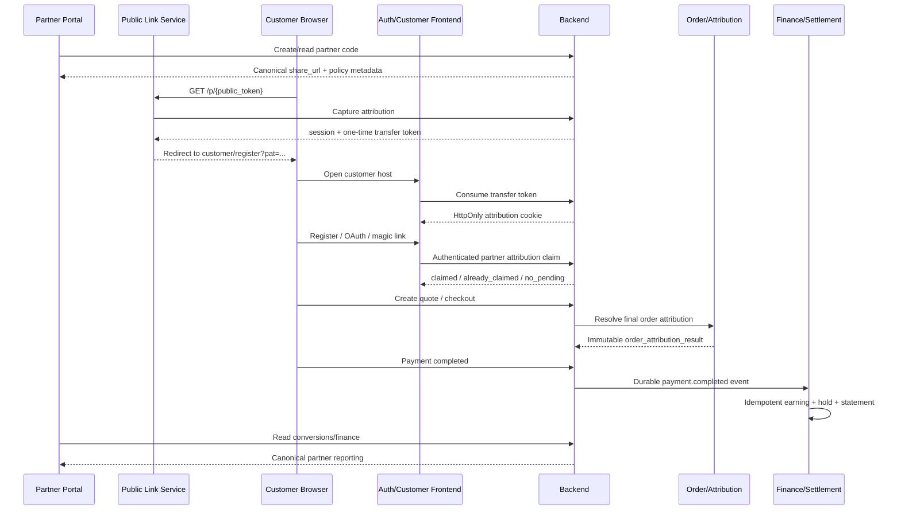

# Техническое задание: полная реализация партнёрской referral / attribution системы CyberVPN

**Проект:** `Beep206/CyberVPN`
**Контур:** `partner` + customer/public frontend + backend + settlement/reporting
**Базовая ветка:** `main`
**Проверенный commit:** `1367c20ad05544972a8f4e0283aecabc9320d764`
**Дата подготовки:** 20 июня 2026 года
**Статус документа:** implementation-ready specification
**Приоритет:** Critical / Revenue Integrity
**Основная цель:** замкнуть и доказать полный путь `partner link → customer registration → attribution → order → payment → earning → statement → payout`.

---

## 0. Назначение документа

Настоящее ТЗ определяет полный объём работ для production-ready партнёрской системы CyberVPN.

После выполнения требований система должна гарантировать:

1. партнёр получает каноническую рабочую ссылку из partner portal;
2. анонимный переход фиксируется server-side;
3. атрибуция переживает удаление query-параметров, reload, auth redirect, OAuth и magic link;
4. атрибуция безопасно переносится между `cyber-vpn.net`, `my.cyber-vpn.net` и partner storefront;
5. customer закрепляется за правильным commercial owner по формализованной policy;
6. order получает неизменяемый attribution snapshot;
7. partner earning создаётся ровно один раз;
8. валюта, ставка, contract и policy берутся из зафиксированного snapshot;
9. refund/chargeback корректно создаёт reversal;
10. partner portal показывает реальные, канонические и согласованные данные;
11. ошибки не маскируются под пустые списки;
12. legacy customer-partner API не смешивается с canonical workspace portal;
13. весь flow покрыт integration и end-to-end тестами.

---

# 1. Обязательные архитектурные решения

Эти решения являются частью требований и не должны оставаться неявными.

## 1.1. Customer referral и partner attribution — разные системы

### Customer referral

```text
Обычный customer приглашает другого customer.
```

Canonical relationship:

```text
mobile_users.referred_by_user_id
```

Canonical rewards:

```text
referral reward allocation / referral credit
```

### Partner attribution

```text
Partner workspace, affiliate, performance buyer или reseller привлекает customer.
```

Canonical relationship:

```text
partner_attribution_sessions
attribution_touchpoints
customer_commercial_bindings
order_attribution_results
partner earning ledger
```

### Запрет

Нельзя использовать один и тот же claim endpoint или один FK для обеих систем.

Допустимо, что customer одновременно:

- имеет social referral relationship;
- имеет commercial partner owner.

Но один qualifying payment не должен создавать двойную cash payout. Это регулируется order payout policy.

---

## 1.2. Canonical partner owner — workspace account

Основной commercial owner:

```text
partner_accounts.id
```

`mobile_users.partner_user_id` и `partner_codes.partner_user_id` считаются legacy-проекцией.

Новый код не должен требовать, чтобы у workspace обязательно существовал legacy mobile owner.

---

## 1.3. Browser-side code не является source of truth

В browser можно хранить только:

- opaque attribution session token;
- локальный recovery snapshot без финансового доверия.

Backend обязан повторно проверить:

- code;
- partner account;
- lane;
- workspace status;
- attribution policy;
- срок действия;
- realm;
- storefront;
- self-referral;
- conflict policy.

---

## 1.4. Canonical financial ledger — settlement ledger

Для workspace-based partner нельзя одновременно считать источником истины:

```text
mobile wallet credit
+
partner earnings table
+
earning events
+
statements
```

Целевой источник истины:

```text
partner earning events → holds → statements → payout instructions → payout executions
```

Legacy wallet credit разрешается только как временный compatibility adapter за feature flag и не должен приводить к двойной выплате.

---

## 1.5. Attribution policy задаётся contract/policy version

Нельзя определять commercial model так:

```python
partner_account_id is not None -> reseller
```

Обязательные поля policy:

```text
owner_type
attribution_model
attribution_window
allowed_channels
allowed_storefronts
allowed_geographies
commission_model
markup_policy
renewal_policy
refund_policy
```

Рекомендуемые базовые модели:

| Lane | Default attribution model |
|---|---|
| `creator_affiliate` | `last_eligible_touch` |
| `performance_media` | `last_eligible_click` |
| `reseller_api` | `persistent_storefront_binding` |

Конкретное значение должно сохраняться в policy snapshot, а не вычисляться по эвристике.

---

# 2. Терминология

| Термин | Значение |
|---|---|
| Partner operator | `AdminUserModel`, работающий в partner realm |
| Workspace | canonical `partner_accounts` |
| Lane | `creator_affiliate`, `performance_media`, `reseller_api` |
| Partner code | коммерческий identifier партнёра |
| Public link token | публичный opaque token в share URL |
| Attribution session | серверная сессия между click и claim/order |
| Touchpoint | append-only событие касания |
| Commercial binding | итоговое либо persistent коммерческое закрепление |
| Order attribution result | неизменяемый результат выбора owner для order |
| Earning event | каноническое финансовое начисление |
| Statement | агрегированный финансовый документ партнёра |
| Payout | фактическая выплата партнёру |
| Legacy partner API | `/api/v1/partner/*`, основанный на mobile customer |
| Workspace API | `/api/v1/partner-workspaces/*`, основанный на partner realm |

---

# 3. Зафиксированное текущее состояние

## 3.1. Существующие сильные стороны

В проекте уже имеются:

- отдельный partner auth realm;
- partner workspace memberships и permissions;
- `PartnerPermission.CODES_READ` и `CODES_WRITE`;
- partner accounts;
- partner codes;
- customer commercial bindings;
- attribution touchpoints;
- order attribution resolution;
- order policy evaluation;
- partner conversion records;
- reporting summaries;
- statements;
- payout accounts;
- payout instructions/executions;
- dispute/reversal foundations;
- SSE invalidation;
- backend observability.

Новая реализация должна переиспользовать эти компоненты, а не создавать параллельную платформу.

---

## 3.2. Реестр неисправностей

### PT-001 — Legacy и canonical partner модели работают параллельно

Одновременно используются:

```text
/partner/*
/partner-workspaces/*
```

Legacy API авторизует `MobileUserModel`, canonical portal — `AdminUserModel` partner realm.

**Риск:** неправильный endpoint, неверный principal, расхождение ownership и financial source.

---

### PT-002 — Canonical partner portal не создаёт share link

`CodesTrackingPage` показывает inventory, но не имеет:

- Copy link;
- Share;
- QR;
- deep-link builder;
- create code;
- pause/resume;
- edit destination.

---

### PT-003 — Destination синтезируется frontend

Текущий mapper формирует:

```text
/checkout?partner_code=<code>
```

Это relative route partner frontend, а не backend-generated customer acquisition URL.

---

### PT-004 — Storefront checkout игнорирует `?partner_code=`

Storefront checkout не читает URL search params. Он передаёт:

```text
surfaceContext.defaultPartnerCode
```

из build-time environment.

Следовательно, ссылка:

```text
/checkout?partner_code=PARTNER_A
```

не гарантирует применение `PARTNER_A`.

---

### PT-005 — Один environment code используется как default

В runtime присутствует:

```text
NEXT_PUBLIC_PARTNER_DEFAULT_PARTNER_CODE
```

Это не масштабируется на несколько workspace/storefront и создаёт риск ошибочной массовой атрибуции.

---

### PT-006 — Unknown host превращается в default storefront

Неизвестный host может быть интерпретирован как storefront с default key/realm/config.

**Риск:** tenant confusion, неверный storefront, неправильный partner code и host-header abuse.

Unknown host обязан возвращать `404/421`, а не default storefront.

---

### PT-007 — Нет public anonymous capture

Partner code фиксируется только в authenticated checkout или через ручной bind.

Нет полной цепочки:

```text
anonymous click → durable attribution session
```

---

### PT-008 — Customer referral persistence не покрывает partner attribution

`referral_attribution_sessions` относится к customer referral и не содержит:

```text
partner_account_id
partner_code_id
owner_type
contract/policy version
```

Её нельзя переиспользовать как partner claim без discriminator и отдельной policy.

---

### PT-009 — Нет automatic partner claim после регистрации

Существует:

```text
POST /partner/bind
```

но он не является автоматическим продолжением partner link flow.

---

### PT-010 — Canonical workspace code API read-only для partner operator

Есть:

```text
GET /partner-workspaces/{workspace_id}/codes
```

Но отсутствует полный canonical lifecycle API для создания и управления code.

---

### PT-011 — UI capabilities не подтверждаются backend capability contract

Frontend показывает:

```text
additional_codes
deep_links
qr_bundles
vanity_links
sub_id_macros
```

как доступные/условные, хотя отсутствуют соответствующие mutation API и UI actions.

---

### PT-012 — Code kind и lifecycle теряются

Все backend codes принудительно превращаются в:

```text
kind = starter_code
is_active=false → paused
```

Нельзя отличить:

- draft;
- pending approval;
- active;
- paused;
- expired;
- revoked;
- risk blocked;
- archived.

---

### PT-013 — `403/404` маскируются под отсутствие данных

Optional portal loader преобразует `403/404` в `null`, затем UI показывает пустой список.

Пользователь не различает:

```text
нет данных
нет permission
feature недоступна
endpoint отсутствует
ошибка backend
```

---

### PT-014 — GET requests не имеют bounded retry

Основные portal GET используют:

```text
retry: false
```

Transient `502/503/504/network` оставляет экран пустым до manual refresh.

---

### PT-015 — Frontend permission check может fail-open

Пустой canonical `current_permission_keys=[]` может интерпретироваться как отсутствие permission metadata, после чего применяется локальная role matrix.

Для canonical workspace пустой список должен означать deny.

---

### PT-016 — Runtime hook и SSE создаются несколько раз

И page, и `PartnerRouteGuard` вызывают runtime hook. Каждый экземпляр может открыть собственный `EventSource`.

---

### PT-017 — Production может показать local scenario state

При отсутствии canonical workspace используется localStorage scenario state, содержащий фиктивные codes, conversions, statements и finance.

Production не должен подменять backend error demo-данными.

---

### PT-018 — Finance snapshot считается по первой странице

Frontend загружает ограниченное количество statements и самостоятельно суммирует их.

---

### PT-019 — Finance snapshot смешивает currencies

Currency берётся из первого statement, amounts всех statements суммируются без FX conversion.

---

### PT-020 — Неверное отображение statement lifecycle

Mapper не выводит корректный `paid` lifecycle и может показывать оплаченный statement как `blocked`.

---

### PT-021 — `updatedAt` использует due date

`review_request.due_date` может попасть в общий updated timestamp, создавая дату из будущего.

---

### PT-022 — Money formatting принудительно `en-US`

Локаль текущего пользователя игнорируется.

---

### PT-023 — Owner type определяется неверной эвристикой

Текущий код может трактовать любой account-backed code как reseller.

Performance и workspace affiliate получают неправильный owner type.

---

### PT-024 — Нет global uniqueness всех code types

Partner code находится в отдельной таблице и может совпасть с:

- referral code;
- invite code;
- promo code;
- gift code.

Resolver использует порядок поиска, а не однозначный namespace.

---

### PT-025 — Case normalization непоследовательна

Часть frontend нормализует code в uppercase, repository сравнивает exact string.

---

### PT-026 — Commercial binding не имеет достаточного DB invariant

Нет partial unique constraint, запрещающего две active bindings одного customer/scope при race.

---

### PT-027 — Touchpoint не имеет обязательной idempotency key

Retry может создать duplicate click/touchpoint.

---

### PT-028 — Partner earning не имеет DB idempotency по payment/source event

`partner_earnings.payment_id` не уникален.

---

### PT-029 — Ошибка partner earning проглатывается

`PostPaymentProcessingUseCase` перехватывает исключение начисления, пишет log и продолжает.

Webhook затем может:

- commit completed payment;
- отметить invoice processed;
- не создать earning;
- не обеспечить durable retry.

Это critical revenue-loss defect.

---

### PT-030 — Beneficiary может быть выбран не из winning attribution

Post-payment сначала использует:

```text
user.partner_user_id
```

и только при его отсутствии читает owner code.

Если у customer legacy binding Partner A, а order выиграл code Partner B, возможен:

```text
wallet credit Partner A
partner_code_id Partner B
partner_account_id Partner B
```

Это недопустимая cross-owner financial inconsistency.

---

### PT-031 — Earning pipeline игнорирует `order_attribution_result`

Partner payout может быть разрешена policy evaluator по winning binding/touchpoint, но earning processor использует `payment.partner_code_id`.

Binding/account-level attribution без payment code может не получить начисление.

---

### PT-032 — Current tier используется вместо immutable contract snapshot

Commission rate вычисляется по текущему config и текущему client count во время post-payment.

Повторная обработка позднее может дать другую сумму.

---

### PT-033 — Currency теряется в legacy earning

`ProcessPartnerEarningUseCase` не принимает currency, а `PartnerEarningModel` default — `USD`.

RUB/XTR/другая currency может быть записана как USD.

---

### PT-034 — Возможен dual ledger

Legacy flow:

```text
credit mobile wallet
+
create PartnerEarningModel
+
record canonical earning event
```

Нужно исключить двойную финансовую ответственность.

---

### PT-035 — Partner code обязан иметь legacy `partner_user_id`

Это противоречит canonical workspace model и заставляет финансовый flow выбирать mobile beneficiary.

---

### PT-036 — Legacy update ownership расходится с list ownership

Account-owned code может быть виден в list, но update проверяет только `partner_user_id`.

---

### PT-037 — Negative markup недостаточно валидируется

Legacy schema допускает отрицательный `markup_pct`.

---

### PT-038 — Workspace status/account status проверяется не во всех code paths

Активный code suspended/rejected workspace не должен применяться.

---

### PT-039 — Policy/effective dates не фиксируются при touchpoint

Order resolver может читать изменившийся code/account в момент order commit вместо snapshot на момент capture.

---

### PT-040 — Нет полного production E2E

Нет одного теста, который доказывает:

```text
partner share URL
→ anonymous capture
→ auth
→ claim
→ order attribution
→ payment
→ earning
→ statement
→ partner portal
```

---

# 4. Целевой end-to-end flow



---

# 5. Canonical URL и cross-domain handoff

## 5.1. Share URL

Основной формат:

```text
https://cyber-vpn.net/p/{public_token}
```

`public_token` не обязан совпадать с внутренним partner code.

Пример:

```text
https://cyber-vpn.net/p/px_7PqgMj6WqYJ4
```

## 5.2. Public route

```http
GET /p/{public_token}
```

Поведение:

1. lookup token;
2. проверить code/workspace/policy;
3. создать или обновить attribution session по policy;
4. создать one-time transfer token;
5. записать touchpoint;
6. redirect на canonical customer landing.

Пример:

```text
302 Location:
https://my.cyber-vpn.net/ru-RU/register?pat=<one-time-token>
```

## 5.3. Consume transfer token

На customer host:

```http
POST /api/v1/partner-attribution/transfer/consume
```

Request:

```json
{
  "transfer_token": "opaque-value"
}
```

Response:

```json
{
  "status": "captured",
  "attribution_id": "uuid",
  "masked_partner_code": "NORTH••••",
  "expires_at": "2026-07-20T12:00:00Z"
}
```

Backend/route устанавливает:

```text
Name: cv_partner_attribution
Value: opaque session token
HttpOnly
Secure
SameSite=Lax
Path=/
Max-Age=<policy window>
```

После consume frontend выполняет replace redirect без `pat`.

## 5.4. Запрет parent-domain cookie по умолчанию

Не использовать:

```text
Domain=.cyber-vpn.net
```

без отдельного security approval.

Основной механизм cross-domain передачи — одноразовый transfer token.

---

# 6. Attribution policy

## 6.1. Обязательные поля

```text
policy_version_id
owner_type
lane
attribution_model
attribution_window_seconds
touchpoint_precedence
allow_cross_device_claim
allow_existing_customer_claim
allowed_storefront_ids
allowed_channels
allowed_geographies
commission_contract_id
renewal_policy
refund_policy
```

## 6.2. Touchpoint precedence

Пример policy:

```json
{
  "touchpoint_precedence": [
    "manual_override",
    "contract_assignment",
    "explicit_code",
    "persistent_reseller_binding",
    "passive_click",
    "storefront_default"
  ]
}
```

Order resolver должен читать эту policy из snapshot, а не иметь единственную hardcoded последовательность.

## 6.3. Social referral и commercial owner

Разрешить хранить обе связи:

```text
social referral: mobile_users.referred_by_user_id
commercial owner: customer_commercial_bindings
```

Payout policy:

```text
если order имеет commercial owner:
  partner payout рассчитывается по partner policy
  customer referral cash payout для этого order запрещается
```

Это предотвращает double payout, не удаляя social relationship.

---

# 7. Схема данных

## 7.1. Расширение `partner_codes`

Целевая модель:

```text
id UUID PK
partner_account_id UUID NOT NULL FK partner_accounts
legacy_partner_user_id UUID NULL FK mobile_users
code VARCHAR(64) NOT NULL
code_normalized VARCHAR(64) NOT NULL
public_token_hash VARCHAR(128) UNIQUE NOT NULL
code_kind VARCHAR(30) NOT NULL
lifecycle_status VARCHAR(30) NOT NULL
owner_type VARCHAR(30) NOT NULL
lane_key VARCHAR(40) NOT NULL
attribution_model VARCHAR(40) NOT NULL
attribution_window_seconds INTEGER NOT NULL
markup_pct NUMERIC(7,4) NOT NULL
commission_contract_id UUID NULL
policy_version_id UUID NOT NULL
default_storefront_id UUID NULL
destination_path VARCHAR(500) NULL
allowed_channels JSONB NOT NULL
allowed_storefront_ids JSONB NOT NULL
allowed_geographies JSONB NOT NULL
sub_id_schema JSONB NOT NULL
approval_status VARCHAR(30) NOT NULL
active_from TIMESTAMPTZ NULL
expires_at TIMESTAMPTZ NULL
paused_at TIMESTAMPTZ NULL
revoked_at TIMESTAMPTZ NULL
created_by_admin_user_id UUID NOT NULL
updated_by_admin_user_id UUID NULL
version INTEGER NOT NULL
created_at TIMESTAMPTZ NOT NULL
updated_at TIMESTAMPTZ NOT NULL
```

Constraints:

```sql
CHECK (markup_pct >= 0)
CHECK (attribution_window_seconds > 0)
CHECK (expires_at IS NULL OR active_from IS NULL OR expires_at > active_from)
UNIQUE (code_normalized)
UNIQUE (public_token_hash)
```

Не хранить raw public token после создания, только hash.

---

## 7.2. `partner_attribution_sessions`

```text
id UUID PK
token_hash VARCHAR(128) UNIQUE NOT NULL
transfer_token_hash VARCHAR(128) NULL
transfer_token_expires_at TIMESTAMPTZ NULL
transfer_consumed_at TIMESTAMPTZ NULL

partner_code_id UUID NOT NULL
partner_account_id UUID NOT NULL
owner_type VARCHAR(30) NOT NULL
lane_key VARCHAR(40) NOT NULL
policy_version_id UUID NOT NULL
commission_contract_id UUID NULL

target_auth_realm_id UUID NULL
storefront_id UUID NULL
claimed_by_user_id UUID NULL
commercial_binding_id UUID NULL

status VARCHAR(30) NOT NULL
attribution_model VARCHAR(40) NOT NULL
source_host VARCHAR(255) NULL
source_path VARCHAR(1000) NULL
landing_url VARCHAR(1500) NULL
sale_channel VARCHAR(80) NULL
campaign_params JSONB NOT NULL
sub_ids JSONB NOT NULL
click_id VARCHAR(255) NULL
evidence_payload JSONB NOT NULL

first_seen_at TIMESTAMPTZ NOT NULL
last_seen_at TIMESTAMPTZ NOT NULL
expires_at TIMESTAMPTZ NOT NULL
claimed_at TIMESTAMPTZ NULL
rejected_at TIMESTAMPTZ NULL
rejection_reason_code VARCHAR(100) NULL
created_at TIMESTAMPTZ NOT NULL
updated_at TIMESTAMPTZ NOT NULL
```

Status:

```text
pending
transferred
claimed
expired
rejected
superseded
revoked
```

Indexes:

```sql
UNIQUE(token_hash)
UNIQUE(transfer_token_hash) WHERE transfer_token_hash IS NOT NULL
INDEX(partner_code_id, status)
INDEX(partner_account_id, first_seen_at)
INDEX(claimed_by_user_id)
INDEX(expires_at) WHERE status IN ('pending', 'transferred')
```

---

## 7.3. Idempotency touchpoints

Добавить в `attribution_touchpoints`:

```text
source_event_id UUID NULL
idempotency_key VARCHAR(160) NULL
partner_attribution_session_id UUID NULL
policy_version_id UUID NULL
```

Constraints:

```sql
UNIQUE(auth_realm_id, source_event_id)
UNIQUE(idempotency_key) WHERE idempotency_key IS NOT NULL
```

---

## 7.4. Commercial binding invariants

Целевая гарантия:

```text
не более одной active global binding на customer+realm
не более одной active binding на customer+realm+storefront
```

Partial indexes PostgreSQL:

```sql
CREATE UNIQUE INDEX uq_customer_binding_active_global
ON customer_commercial_bindings (user_id, auth_realm_id)
WHERE binding_status = 'active' AND storefront_id IS NULL;

CREATE UNIQUE INDEX uq_customer_binding_active_storefront
ON customer_commercial_bindings (user_id, auth_realm_id, storefront_id)
WHERE binding_status = 'active' AND storefront_id IS NOT NULL;
```

Добавить:

```text
policy_version_id
commission_contract_id
attribution_session_id
claimed_at
version
```

Binding creation выполняется под row lock customer и active bindings scope.

---

## 7.5. Order attribution snapshot

`order_attribution_results` должен содержать:

```text
owner_type
partner_account_id
partner_code_id
winning_touchpoint_id
winning_binding_id
policy_version_id
commission_contract_id
attribution_model
attribution_window_seconds
beneficiary_account_id
currency_policy
commission_policy_snapshot JSONB
markup_policy_snapshot JSONB
renewal_policy_snapshot JSONB
refund_policy_snapshot JSONB
evidence_snapshot JSONB
resolved_at
```

После создания результат неизменяем.

---

## 7.6. Canonical partner earning

Целевая модель:

```text
id UUID PK
source_event_key VARCHAR(160) UNIQUE NOT NULL
order_id UUID NOT NULL
payment_id UUID NOT NULL
order_attribution_result_id UUID NOT NULL
partner_account_id UUID NOT NULL
partner_code_id UUID NULL
commission_contract_id UUID NULL
policy_version_id UUID NOT NULL
currency_code VARCHAR(10) NOT NULL
commission_base_amount NUMERIC(20,8) NOT NULL
markup_amount NUMERIC(20,8) NOT NULL
commission_amount NUMERIC(20,8) NOT NULL
gross_amount NUMERIC(20,8) NOT NULL
reserve_amount NUMERIC(20,8) NOT NULL
available_amount NUMERIC(20,8) NOT NULL
earning_status VARCHAR(30) NOT NULL
hold_until TIMESTAMPTZ NULL
available_at TIMESTAMPTZ NULL
reversed_at TIMESTAMPTZ NULL
reversal_reason_code VARCHAR(100) NULL
calculation_snapshot JSONB NOT NULL
created_at TIMESTAMPTZ NOT NULL
updated_at TIMESTAMPTZ NOT NULL
```

Constraints:

```sql
UNIQUE(source_event_key)
UNIQUE(payment_id) -- пока split-commission не поддерживается
CHECK(gross_amount >= 0)
CHECK(reserve_amount >= 0)
CHECK(available_amount >= 0)
```

Если в будущем поддерживается split commission:

```text
UNIQUE(payment_id, beneficiary_account_id, earning_component)
```

---

# 8. Backend API

## 8.1. Public acquisition API

### Capture

```http
POST /api/v1/partner-attribution/capture
```

Request:

```json
{
  "public_token": "px_7PqgMj6WqYJ4",
  "source_host": "cyber-vpn.net",
  "source_path": "/p/px_7PqgMj6WqYJ4",
  "landing_url": "https://cyber-vpn.net/pricing",
  "sale_channel": "partner_link",
  "campaign_params": {
    "utm_source": "partner",
    "utm_campaign": "summer"
  },
  "sub_ids": {
    "sub_id": "youtube_review_01"
  },
  "click_id": "optional-external-click-id",
  "idempotency_key": "uuid"
}
```

Response:

```json
{
  "status": "captured",
  "attribution_id": "uuid",
  "masked_partner_code": "NORTH••••",
  "transfer_token": "one-time-token",
  "transfer_token_expires_at": "2026-06-20T12:10:00Z",
  "attribution_expires_at": "2026-07-20T12:00:00Z",
  "redirect_url": "https://my.cyber-vpn.net/ru-RU/register?pat=..."
}
```

### Требования

- rate limit;
- idempotency;
- no raw partner identity exposure;
- no referrer personal data;
- workspace/status/policy validation;
- no financial mutation;
- append-only capture touchpoint.

---

## 8.2. Transfer consume API

```http
POST /api/v1/partner-attribution/transfer/consume
```

- token одноразовый;
- короткий TTL, например 10 минут;
- повторный consume возвращает idempotent result только тому же browser/session context;
- устанавливается HttpOnly session cookie.

---

## 8.3. Authenticated claim API

```http
POST /api/v1/partner-attribution/claim
```

Основной body:

```json
{}
```

Recovery body:

```json
{
  "fallback_public_token": "optional",
  "fallback_attribution_id": "optional"
}
```

Backend предпочитает HttpOnly session cookie.

Success:

```json
{
  "status": "claimed",
  "attribution_id": "uuid",
  "commercial_binding_id": "uuid",
  "partner_account_id": "uuid",
  "claimed_at": "2026-06-20T12:15:00Z"
}
```

Idempotent:

```json
{
  "status": "already_claimed",
  "commercial_binding_id": "uuid"
}
```

No pending:

```json
{
  "status": "no_pending"
}
```

---

## 8.4. Workspace code API

### List

```http
GET /api/v1/partner-workspaces/{workspace_id}/codes
```

Response item:

```json
{
  "id": "uuid",
  "code": "NORTHSTAR",
  "masked_code": "NORTH••••",
  "code_kind": "starter_code",
  "lifecycle_status": "active",
  "approval_status": "approved",
  "owner_type": "affiliate",
  "lane_key": "creator_affiliate",
  "attribution_model": "last_eligible_touch",
  "attribution_window_seconds": 2592000,
  "markup_pct": "10.0000",
  "share_url": "https://cyber-vpn.net/p/px_...",
  "default_destination_url": "https://my.cyber-vpn.net/ru-RU/pricing",
  "allowed_channels": ["content", "telegram"],
  "allowed_geographies": ["*"],
  "active_from": "...",
  "expires_at": null,
  "version": 3,
  "available_actions": [
    "copy",
    "create_deep_link",
    "create_qr",
    "pause"
  ],
  "created_at": "...",
  "updated_at": "..."
}
```

### Create

```http
POST /api/v1/partner-workspaces/{workspace_id}/codes
Idempotency-Key: <uuid>
```

Permission:

```text
codes_write
```

### Update

```http
PATCH /api/v1/partner-workspaces/{workspace_id}/codes/{code_id}
If-Match: "<version>"
```

### Lifecycle actions

```text
POST /codes/{id}/activate
POST /codes/{id}/pause
POST /codes/{id}/revoke
POST /codes/{id}/archive
```

Reason обязателен для revoke/archive.

### Deep link

```http
POST /api/v1/partner-workspaces/{workspace_id}/codes/{code_id}/links
```

Request:

```json
{
  "destination_key": "pricing",
  "locale": "ru-RU",
  "campaign_params": {
    "utm_campaign": "youtube_review"
  },
  "sub_ids": {
    "sub_id": "video_42"
  }
}
```

Response:

```json
{
  "url": "https://cyber-vpn.net/p/px_...?l=...",
  "expires_at": null
}
```

### QR

```http
POST /api/v1/partner-workspaces/{workspace_id}/codes/{code_id}/qr
```

Backend возвращает:

```text
link payload
SVG/PNG generation metadata
download URL
```

QR не должен кодировать secret.

---

## 8.5. Backend capability contract

```http
GET /api/v1/partner-workspaces/{workspace_id}/commercial-capabilities
```

Response:

```json
{
  "codes": {
    "read": true,
    "create": true,
    "update": true,
    "pause": true,
    "revoke": false,
    "additional_code_limit": 5
  },
  "links": {
    "deep_links": true,
    "vanity_links": false,
    "sub_id_macros": true,
    "qr_bundles": true
  },
  "requirements": {
    "fresh_auth_for_revoke": true,
    "approval_required_for_vanity": true
  },
  "blocking_reason_codes": []
}
```

Frontend не должен вычислять эти возможности только из lane/status.

---

## 8.6. Finance summary API

```http
GET /api/v1/partner-workspaces/{workspace_id}/finance-summary
```

Response группируется по currency:

```json
{
  "generated_at": "...",
  "currencies": [
    {
      "currency_code": "USD",
      "pending": "120.00",
      "on_hold": "30.00",
      "available": "90.00",
      "reserved": "10.00",
      "paid": "500.00",
      "reversed": "5.00",
      "next_payout_eligible": "80.00"
    }
  ],
  "next_payout": {
    "eligible": true,
    "payout_account_id": "uuid",
    "scheduled_at": "...",
    "blocking_reason_codes": []
  }
}
```

Frontend не суммирует statements самостоятельно.

---

# 9. Claim transaction

Одна transaction:

1. прочитать текущего customer principal;
2. `SELECT mobile_users ... FOR UPDATE`;
3. прочитать attribution session `FOR UPDATE`;
4. проверить status/expiry;
5. загрузить partner code + workspace + policy;
6. проверить realm/storefront;
7. проверить self-referral;
8. проверить workspace/lane/governance;
9. определить target binding scope;
10. блокировать active bindings scope;
11. применить conflict/override policy;
12. supersede предыдущую binding при разрешённом override;
13. создать active binding;
14. пометить attribution session claimed;
15. записать touchpoint `claim`;
16. записать outbox event:
    ```text
    partner.attribution.claimed
    ```
17. flush;
18. commit выполняет общий session boundary;
19. очистить pending cookie.

Нельзя:

- делать независимый commit внутри вложенных repositories;
- сначала менять `mobile_users`, а потом пытаться создать binding без одной transaction;
- выбирать owner по browser body;
- использовать current UI role как authorization.

---

# 10. Order attribution

## 10.1. Источник owner

Order attribution обязан использовать:

```text
manual override
contract assignment
claimed commercial binding
explicit checkout code
eligible capture touchpoint
storefront default
```

в порядке, заданном policy snapshot.

## 10.2. Проверка effective state

При использовании touchpoint необходимо проверить snapshot:

```text
code active_at_capture
workspace eligible_at_capture
policy version
attribution window
```

Не читать только текущее `is_active`.

## 10.3. Immutable result

`ResolveOrderAttributionUseCase` сохраняет result один раз.

Повторный вызов возвращает тот же result.

Изменение code или workspace после order commit не меняет owner этого order.

---

# 11. Partner earning и settlement

## 11.1. Новый use case

Создать:

```text
CreatePartnerEarningFromPaymentUseCase
```

Сигнатура:

```python
execute(payment_id: UUID, source_event_id: UUID) -> PartnerEarningResult
```

Use case самостоятельно загружает:

```text
payment
order
order_attribution_result
policy snapshot
partner account
contract
existing earning
```

Он не принимает `partner_user_id` от caller.

## 11.2. Beneficiary

Beneficiary:

```text
order_attribution_result.partner_account_id
```

Не использовать:

```text
user.partner_user_id
```

## 11.3. Currency

Использовать:

```text
order.currency_code
```

Amounts — `Decimal`.

Запрещено default `USD`, если source order имеет другую currency.

## 11.4. Idempotency

До расчёта:

```text
lookup source_event_key
```

DB unique constraint является последней защитой.

Повторный event возвращает существующий earning.

## 11.5. Durable processing

Payment webhook:

1. фиксирует payment terminal state;
2. пишет outbox `payment.completed`;
3. commit;
4. worker обрабатывает earning;
5. при ошибке event остаётся retryable;
6. dead-letter и alert после max attempts.

Нельзя проглатывать ошибку earning и окончательно помечать работу успешной без retry state.

## 11.6. Calculation snapshot

Сохранить:

```json
{
  "commission_contract_id": "...",
  "policy_version_id": "...",
  "commission_rate": "10.0000",
  "markup_rate": "5.0000",
  "base_amount": "100.00",
  "currency": "USD",
  "tier_snapshot": {...},
  "attribution_result_id": "...",
  "calculation_version": "partner_earning_v2"
}
```

## 11.7. Holds и availability

Lifecycle:

```text
pending
on_hold
available
paid
reversed
blocked_by_risk
expired
```

Нельзя немедленно кредитовать withdrawable mobile wallet для canonical workspace.

## 11.8. Refund/chargeback

События:

```text
payment.refunded
payment.chargeback_opened
payment.chargeback_won
payment.chargeback_lost
```

должны создавать idempotent adjustment/reversal.

---

# 12. Partner frontend

## 12.1. Единый runtime provider

В partner dashboard layout:

```tsx
<PartnerPortalRuntimeProvider>
  {children}
</PartnerPortalRuntimeProvider>
```

Provider создаёт:

- bootstrap queries;
- workspace queries;
- одну SSE connection;
- selected workspace state;
- normalized resource states.

`PartnerRouteGuard` и pages только читают context.

---

## 12.2. Resource state

```typescript
type ResourceState<T> =
  | { status: 'idle' }
  | { status: 'loading' }
  | { status: 'ready'; data: T; updatedAt: string | null }
  | { status: 'empty'; data: T }
  | { status: 'forbidden'; code: string }
  | { status: 'unavailable'; code: string }
  | { status: 'error'; error: PortalApiError };
```

`403`, `404`, network error и `200 []` отображаются по-разному.

---

## 12.3. Query retry

Для GET:

```typescript
retry(failureCount, error) {
  if (isHttp4xx(error)) return false;
  return failureCount < 2;
}
```

Delays:

```text
500 ms
1500 ms + jitter
```

Для `429` учитывать `Retry-After`.

---

## 12.4. Permission fail-closed

```typescript
currentPermissionKeys === undefined
```

означает legacy/local state.

```typescript
currentPermissionKeys.length === 0
```

в canonical workspace означает отсутствие permissions.

Backend remains authoritative.

---

## 12.5. Codes page

### Inventory card

Показывать:

- code/label;
- lifecycle status;
- lane;
- owner type;
- attribution model;
- window;
- markup/commission summary;
- destination;
- active dates;
- allowed channels/geos;
- updated time;
- available actions.

### Actions

- Copy canonical link;
- system share;
- QR preview/download;
- create deep link;
- create additional code;
- pause/resume;
- request vanity link;
- open analytics;
- open attribution explainability.

### UX states

- skeleton;
- empty;
- forbidden;
- unavailable;
- network error + retry;
- stale data indicator;
- mutation progress;
- conflict/revision error.

### Clipboard

Использовать:

```typescript
navigator.clipboard.writeText(shareUrl)
```

с fallback и toast.

Не копировать внутренний raw code вместо canonical URL.

---

## 12.6. Code creation form

Поля:

```text
display label
code kind
requested vanity slug
destination
attribution model
campaign defaults
sub-id schema
markup request
active period
```

Backend определяет допустимые значения capability contract.

Для vanity/revoke/markup-sensitive mutations может требоваться fresh auth.

---

## 12.7. Production local state

В production удалить fallback на scenario finance/code data.

Разрешённые local fixtures:

```text
tests
Storybook
development-only explicit demo mode
```

При bootstrap failure показывать error/onboarding, а не фиктивные earnings.

---

## 12.8. Finance UI

- использовать `finance-summary`;
- отдельные cards по currency;
- server-provided lifecycle totals;
- statements paginated;
- payout status отдельно;
- никакого client sum первой страницы;
- форматировать по текущей locale;
- amounts хранить как strings/Decimal DTO, не `number` для денег.

---

## 12.9. Updated time

Использовать только:

```text
updated_at
created_at
last_event_at
```

Не использовать:

```text
due_date
expires_at
scheduled_at
```

как время обновления.

---

# 13. Storefront и customer frontend

## 13.1. Host resolution

Host → storefront mapping должен быть canonical и tenant-aware.

Рекомендуется backend/service registry:

```text
storefronts.host UNIQUE
storefronts.status
storefronts.auth_realm_id
storefronts.partner_account_id
storefronts.default_commercial_binding
```

Unknown host:

```text
404 Not Found
или
421 Misdirected Request
```

## 13.2. Trusted proxy

Не доверять произвольному `X-Forwarded-Host`.

Разрешить его только от trusted reverse proxy.

Проверять against allowlist/DB storefront host.

## 13.3. Checkout

Storefront checkout:

- не читает global env default partner code;
- читает server-resolved attribution session/binding;
- не принимает финансово доверенный raw code из URL;
- сохраняет attribution session при login redirect;
- не позволяет checkout без auth;
- показывает applied partner/offer state без раскрытия партнёра сверх policy.

## 13.4. Auth flows

Partner attribution claim должен запускаться после успешного:

- email/password registration;
- OTP verification;
- username registration;
- login;
- OAuth;
- magic link;
- passkey/WebAuthn;
- 2FA completion;
- Telegram link/miniapp, если этот realm поддерживает partner acquisition.

Один общий hook/service:

```text
EnsureCustomerAttributionClaimUseCase
```

Не копировать логику по auth routes.

---

# 14. Legacy migration

## 14.1. Legacy endpoints

Пометить deprecated:

```text
/partner/dashboard
/partner/codes
/partner/earnings
/partner/bind
```

Добавить headers:

```text
Deprecation: true
Sunset: <date>
Link: <canonical-doc>; rel="successor-version"
```

## 14.2. Legacy frontend clients

В `partner` удалить из публичного API barrel:

```text
lib/api/partner.ts
lib/api/referral.ts
legacy growth/referral consoles
```

Canonical portal не должен импортировать customer/mobile partner API.

## 14.3. Compatibility adapter

На период миграции:

- legacy `partner_user_id` может быть projection workspace owner;
- legacy earnings читаются в reconciliation;
- новые workspace earnings не кредитуют legacy wallet;
- все dual-write mismatches измеряются.

## 14.4. Cutover

1. shadow attribution;
2. shadow earning calculation;
3. compare;
4. enable canonical write;
5. disable legacy write;
6. backfill/read-only;
7. remove legacy routes.

---

# 15. Security и anti-abuse

## 15.1. Rate limits

Пример:

```text
public capture:
  30 / 10 min / IP
  100 / 10 min / public token

transfer consume:
  10 / 10 min / IP

claim:
  10 / 10 min / authenticated user

code create:
  20 / day / workspace

deep link:
  100 / hour / workspace
```

## 15.2. Self-referral

Блокировать:

- customer == legacy partner owner;
- customer состоит в том же workspace;
- customer связан с partner account;
- same verified email domain при risk policy;
- suspicious device/payment graph;
- operator пытается купить через собственный code.

## 15.3. Code eligibility

Проверять:

```text
code active
workspace active/probation-allowed
lane enabled
policy effective
contract active
storefront allowed
channel allowed
geo allowed
not expired/revoked
risk not blocked
```

## 15.4. Open redirect

Destination выбирается по backend allowlisted destination key.

Не принимать arbitrary URL без validation.

## 15.5. Token storage

- public/transfer/session tokens генерируются CSPRNG;
- в БД хранить hash;
- raw token показывается один раз;
- logs содержат только fingerprint;
- no token in Sentry tags.

## 15.6. Privacy

Не хранить полный IP бессрочно.

Рекомендуется:

```text
IP prefix/hash
user-agent family
retention policy
```

Обновить Cookie Policy и Privacy Policy.

---

# 16. Observability

## 16.1. Metrics

```text
partner_link_capture_total{result,lane,owner_type}
partner_transfer_consume_total{result}
partner_attribution_claim_total{result,reason}
partner_attribution_session_expired_total
partner_binding_created_total{owner_type,binding_type}
partner_order_attribution_total{owner_type,owner_source}
partner_earning_processing_total{result,reason}
partner_earning_retry_queue_depth
partner_earning_processing_duration_seconds
partner_earning_reconciliation_mismatch_total{type}
partner_portal_resource_load_total{resource,result}
partner_portal_sse_connections_current
```

## 16.2. Structured logs

Обязательные поля:

```text
event
request_id
source_event_id
workspace_id
partner_account_id
partner_code_id
attribution_id
customer_id
order_id
payment_id
result
reason_code
policy_version_id
```

Не логировать raw public/session token.

## 16.3. Alerts

- payment completed без earning при commercial owner;
- duplicate earning blocked;
- attribution mismatch;
- wallet/ledger dual-write mismatch;
- unknown storefront host;
- transfer consume failures spike;
- claim failure spike;
- SSE connection multiplication;
- statement reconciliation mismatch.

---

# 17. Error contract

Стандарт:

```json
{
  "detail": {
    "code": "PARTNER_ATTRIBUTION_EXPIRED",
    "message": "Partner attribution has expired",
    "retryable": false,
    "request_id": "..."
  }
}
```

Основные codes:

```text
PARTNER_CODE_INVALID
PARTNER_CODE_NOT_FOUND
PARTNER_CODE_INACTIVE
PARTNER_CODE_EXPIRED
PARTNER_CODE_REVOKED
PARTNER_WORKSPACE_INACTIVE
PARTNER_LANE_NOT_ELIGIBLE
PARTNER_CHANNEL_NOT_ELIGIBLE
PARTNER_STOREFRONT_NOT_ELIGIBLE
PARTNER_SELF_ATTRIBUTION_BLOCKED
PARTNER_ATTRIBUTION_EXPIRED
PARTNER_ATTRIBUTION_ALREADY_CLAIMED
PARTNER_ATTRIBUTION_CONFLICT
PARTNER_ATTRIBUTION_TOKEN_INVALID
PARTNER_TRANSFER_TOKEN_EXPIRED
PARTNER_TRANSFER_TOKEN_CONSUMED
PARTNER_BINDING_CONFLICT
PARTNER_CAPABILITY_BLOCKED
PARTNER_CODE_VERSION_CONFLICT
PARTNER_EARNING_ALREADY_EXISTS
PARTNER_EARNING_POLICY_BLOCKED
PARTNER_EARNING_TRANSIENT_FAILURE
RATE_LIMITED
```

---

# 18. Тестовая матрица

## 18.1. Backend unit tests

### Code normalization

- lowercase;
- whitespace;
- Unicode;
- invalid characters;
- max length;
- global collision;
- random generation retry.

### Capability policy

- role;
- permission;
- lane;
- workspace status;
- governance;
- contract;
- feature flag.

### Capture

- valid;
- inactive;
- revoked;
- expired;
- unknown;
- disabled workspace;
- channel/geo/storefront blocked;
- idempotency;
- rate limit.

### Claim

- success;
- idempotent;
- expired;
- self-referral;
- existing binding;
- permitted override;
- forbidden override;
- same realm;
- different realm;
- storefront scope;
- concurrent claim.

### Earning

- exact Decimal;
- currency;
- policy snapshot;
- same event twice;
- concurrent duplicate;
- hold;
- refund;
- chargeback;
- account-level owner without partner code;
- beneficiary mismatch rejection.

---

## 18.2. PostgreSQL integration tests

Обязательно real PostgreSQL, не только SQLite:

1. partial unique active binding;
2. two concurrent claims;
3. two concurrent codes;
4. duplicate touchpoint idempotency;
5. duplicate payment event;
6. outbox retry;
7. row locks;
8. transaction rollback;
9. unique normalized code;
10. token hash uniqueness;
11. earning currency;
12. reversal uniqueness.

---

## 18.3. API contract tests

- OpenAPI request/response;
- permissions;
- `403` versus `404`;
- idempotency headers;
- optimistic version conflicts;
- rate-limit headers;
- error envelope;
- deprecation headers.

---

## 18.4. Partner frontend tests

### Runtime provider

- один SSE;
- один query graph;
- workspace switch;
- reconnect;
- malformed event;
- offline/online;
- retry.

### Resource state

- loading;
- empty;
- forbidden;
- unavailable;
- server error;
- stale data;
- retry success.

### Codes page

- copy;
- share;
- QR;
- create;
- pause;
- resume;
- version conflict;
- capability blocked;
- no action without permission.

### Finance

- multiple currencies;
- paid;
- reversed;
- pagination;
- locale ru/en;
- no client-side aggregation drift.

---

## 18.5. Storefront/customer frontend tests

- public token redirect;
- transfer consume;
- query cleanup;
- reload;
- localStorage unavailable;
- cookies disabled fallback;
- OAuth;
- magic link;
- passkey;
- login redirect preserves attribution;
- unknown host 404;
- spoofed forwarded host rejected;
- no global default partner code leakage.

---

## 18.6. Full E2E

### E2E-PARTNER-001 — основной affiliate flow

1. operator входит в partner portal;
2. копирует share URL;
3. новый browser открывает URL;
4. query очищается;
5. browser reload;
6. customer регистрируется;
7. claim создаёт commercial binding;
8. customer создаёт order;
9. order attribution owner — нужный partner account;
10. payment completed;
11. earning создаётся один раз;
12. statement показывает earning;
13. partner portal показывает conversion и finance.

### E2E-PARTNER-002 — OAuth

Partner link → OAuth → callback → claim → order → earning.

### E2E-PARTNER-003 — performance click

- click_id;
- sub_id;
- last eligible click;
- postback/explainability.

### E2E-PARTNER-004 — reseller storefront

- host resolves correct storefront;
- persistent binding;
- correct merchant/legal/pricebook;
- no env default leakage.

### E2E-PARTNER-005 — code A/code B

Policy определяет winner; payout уходит winner account.

### E2E-PARTNER-006 — social referral + partner

Обе relationship сохраняются, но double cash payout отсутствует.

### E2E-PARTNER-007 — self attribution

Claim и earning блокируются.

### E2E-PARTNER-008 — transient earning failure

- payment completed;
- earning worker падает;
- event остаётся pending;
- retry создаёт earning;
- duplicate отсутствует.

### E2E-PARTNER-009 — refund

- earning создан;
- refund;
- reversal;
- statement обновлён.

### E2E-PARTNER-010 — multi-currency

USD и EUR не смешиваются.

---

## 18.7. Security tests

- IDOR workspace A/B;
- partner realm/customer realm isolation;
- forged public token;
- transfer replay;
- session token replay;
- open redirect;
- host header injection;
- x-forwarded-host spoofing;
- excessive sub_id payload;
- SQL/Unicode code normalization;
- rate limit bypass;
- CSRF on mutations;
- permissions fail-closed.

---

# 19. File-by-file work map

## Backend models

```text
backend/src/infrastructure/database/models/partner_model.py
backend/src/infrastructure/database/models/attribution_touchpoint_model.py
backend/src/infrastructure/database/models/customer_commercial_binding_model.py
backend/src/infrastructure/database/models/order_attribution_result_model.py
backend/src/infrastructure/database/models/<new partner_attribution_session_model.py>
backend/src/infrastructure/database/models/<canonical earning model>
```

## Backend repositories

```text
backend/src/infrastructure/database/repositories/partner_repo.py
backend/src/infrastructure/database/repositories/attribution_touchpoint_repo.py
backend/src/infrastructure/database/repositories/customer_commercial_binding_repo.py
backend/src/infrastructure/database/repositories/order_attribution_result_repo.py
backend/src/infrastructure/database/repositories/<partner_attribution_session_repo.py>
backend/src/infrastructure/database/repositories/<partner_earning_repo.py>
```

## Backend use cases

```text
backend/src/application/use_cases/partners/create_partner_code.py
backend/src/application/use_cases/partners/bind_partner.py
backend/src/application/use_cases/partners/process_partner_earning.py
backend/src/application/use_cases/attribution/record_touchpoint.py
backend/src/application/use_cases/attribution/order_resolution/resolve_order_attribution.py
backend/src/application/use_cases/commercial_bindings/create_binding.py
backend/src/application/use_cases/payments/post_payment.py
backend/src/application/use_cases/orders/create_order_from_checkout.py
backend/src/application/use_cases/<partner_attribution/capture.py>
backend/src/application/use_cases/<partner_attribution/consume_transfer.py>
backend/src/application/use_cases/<partner_attribution/claim.py>
backend/src/application/use_cases/<partner_attribution/generate_link.py>
```

## Backend routes/schemas

```text
backend/src/presentation/api/v1/partners/routes.py
backend/src/presentation/api/v1/partners/schemas.py
backend/src/presentation/api/v1/attribution/routes.py
backend/src/presentation/api/v1/<partner_attribution/routes.py>
backend/src/presentation/api/v1/<partner_attribution/schemas.py>
```

## Partner frontend

```text
partner/src/features/partner-commercial/components/codes-tracking-page.tsx
partner/src/features/partner-commercial/lib/commercial-capabilities.ts
partner/src/features/partner-portal-state/lib/runtime-state.ts
partner/src/features/partner-portal-state/lib/use-partner-portal-runtime-state.ts
partner/src/features/partner-portal-state/lib/portal-access.ts
partner/src/features/partner-portal-state/components/partner-route-guard.tsx
partner/src/features/storefront-shell/lib/runtime.ts
partner/src/features/storefront-shell/lib/server-surface-context.ts
partner/src/features/storefront-shell/components/storefront-checkout-shell.tsx
partner/src/proxy.ts
partner/src/lib/api/partner-portal.ts
partner/src/lib/api/client.ts
partner/src/app/[locale]/(dashboard)/layout.tsx
partner/messages/*
```

Новые frontend modules:

```text
partner/src/features/partner-codes/
partner/src/features/partner-links/
partner/src/features/partner-finance-summary/
partner/src/features/partner-portal-state/provider/
```

## Customer/public frontend

```text
frontend/src/proxy.ts
frontend/src/app/[locale]/(auth)/*
frontend/src/app/providers/*
frontend/src/features/referral-attribution/*   # не смешивать, только coexistence
frontend/src/features/<partner-attribution>/*
frontend/src/app/api/<partner-attribution>/*
```

## Admin/support

Добавить:

- attribution session lookup;
- claim explainability;
- earning retry/reconciliation;
- override audit;
- code lifecycle management.

## Migrations

Создать отдельные Alembic revisions:

```text
partner_code_v2
partner_attribution_sessions
partner_touchpoint_idempotency
commercial_binding_invariants
partner_earning_v2
legacy_partner_backfill
```

Не объединять всё в одну трудно откатываемую migration.

---

# 20. Порядок реализации

## PR-1 — invariants и current correctness

1. исправить negative markup;
2. исправить legacy account ownership;
3. permission fail-closed;
4. resource error states;
5. bounded GET retry;
6. один runtime provider/SSE;
7. убрать production demo fallback;
8. backend finance summary;
9. multi-currency UI;
10. tests.

## PR-2 — partner code canonical model

1. расширить partner code schema;
2. нормализация/global registry;
3. lifecycle;
4. capability contract;
5. workspace CRUD;
6. generated OpenAPI/types;
7. portal actions.

## PR-3 — acquisition capture

1. public token;
2. capture session;
3. transfer token;
4. customer host consume;
5. cookie/recovery;
6. security/rate limits;
7. browser tests.

## PR-4 — claim и binding

1. atomic claim;
2. DB partial unique indexes;
3. conflict policy;
4. social referral coexistence;
5. auth-flow integration;
6. concurrency tests.

## PR-5 — earning integrity

1. use order attribution result;
2. account beneficiary;
3. currency;
4. immutable contract snapshot;
5. idempotency;
6. durable outbox/retry;
7. remove swallowed failures;
8. reversal;
9. reconciliation.

## PR-6 — portal completion

1. Copy/Share/QR;
2. deep links;
3. sub-id;
4. analytics funnel;
5. explainability;
6. finance summary;
7. support/admin tooling.

## PR-7 — legacy retirement

1. deprecation headers;
2. remove imports;
3. disable legacy writes;
4. reconcile;
5. remove endpoints after sunset.

---

# 21. Feature flags и rollout

```text
partner_codes_v2_enabled
partner_public_links_v2_enabled
partner_attribution_capture_v2_enabled
partner_attribution_claim_v2_enabled
partner_binding_v2_enabled
partner_order_attribution_policy_v2_enabled
partner_earning_v2_enabled
partner_earning_shadow_compare_enabled
partner_legacy_wallet_credit_enabled
partner_portal_codes_management_v2_enabled
```

Rollout:

```text
internal
1% workspaces
10%
25%
50%
100%
```

Stop conditions:

- attribution mismatch;
- earning mismatch;
- duplicate earning;
- unknown beneficiary;
- cross-currency mismatch;
- reconciliation blocking mismatch;
- excessive capture/claim failure.

---

# 22. OpenAPI и generated artifacts

После API changes:

```powershell
cd backend
python scripts\export_openapi.py

cd ..\partner
npm run generate:api-types
npm run prepare:i18n

cd ..\frontend
npm run generate:api-types
npm run prepare:i18n

cd ..\admin
npm run generate:api-types
```

Закоммитить:

```text
backend/docs/api/openapi.json
partner/src/lib/api/generated/types.ts
frontend/src/lib/api/generated/types.ts
admin/src/lib/api/generated/types.ts
```

Generated files вручную не редактировать.

---

# 23. Локальная проверка на Windows

## Backend

```powershell
cd backend

py -3.13 -m venv .venv
.\.venv\Scripts\Activate.ps1

python -m pip install --upgrade pip
python -m pip install -e ".[dev]"

python -m ruff check src tests
python -m pytest tests\unit -q
python -m pytest tests\integration -q
python -m pytest tests\e2e -q
```

## Partner

```powershell
cd partner
npm ci
npm run prepare:i18n
npm run lint
npx tsc --noEmit
npm run test:run
npm run build
```

## Customer frontend

```powershell
cd frontend
npm ci
npm run prepare:i18n
npm run lint
npx tsc --noEmit
npm run test:run
npm run build
```

## Admin

```powershell
cd admin
npm ci
npm run prepare:i18n
npm run lint
npx tsc --noEmit
npm run test:run
npm run build
```

## Contract checks через Git Bash

```bash
bash scripts/check-api-contract.sh --verbose
bash scripts/check-generated-artifacts.sh
```

---

# 24. Acceptance criteria

## Acquisition

- [ ] Portal отдаёт canonical `share_url`.
- [ ] Copy/Share/QR используют только этот URL.
- [ ] Link работает в новом browser.
- [ ] Удаление query не теряет attribution.
- [ ] Reload не теряет attribution.
- [ ] Public → customer host перенос работает.
- [ ] OAuth/magic link/passkey не теряют attribution.
- [ ] Unknown host не превращается в default storefront.

## Binding

- [ ] Claim выполняется автоматически после auth readiness.
- [ ] Binding создаётся atomic.
- [ ] Concurrent claim не создаёт две active bindings.
- [ ] Self-attribution blocked.
- [ ] Existing binding обрабатывается по policy.
- [ ] Social referral не создаёт double payout.

## Order

- [ ] Order attribution result immutable.
- [ ] Winner определяется policy version.
- [ ] Owner type не выводится из наличия account ID.
- [ ] Expired/revoked policy учитывается корректно.
- [ ] Account-level attribution работает без legacy partner user.

## Finance

- [ ] Beneficiary берётся из order attribution result.
- [ ] Currency берётся из order.
- [ ] Earning idempotent.
- [ ] Transient failure retryable.
- [ ] Payment не считается полностью обработанным без durable earning task.
- [ ] Refund/chargeback создаёт reversal.
- [ ] Canonical ledger не дублируется mobile wallet.
- [ ] Statement reconciliation проходит.

## Partner portal

- [ ] Нет demo finance fallback в production.
- [ ] `403` не отображается как empty.
- [ ] Network error имеет Retry.
- [ ] Permission fail-closed.
- [ ] На страницу одна SSE connection.
- [ ] Finance summary не считается из первой страницы.
- [ ] Currencies не смешиваются.
- [ ] Money локализован.
- [ ] Code lifecycle отображается точно.

## CI

- [ ] Ruff зелёный.
- [ ] Backend unit зелёный.
- [ ] PostgreSQL integration зелёный.
- [ ] Backend E2E зелёный.
- [ ] Partner lint/typecheck/test/build зелёные.
- [ ] Frontend lint/typecheck/test/build зелёные.
- [ ] Admin lint/typecheck/test/build зелёные.
- [ ] OpenAPI contract зелёный.
- [ ] Generated artifacts зелёные.
- [ ] Migration upgrade/downgrade проверены.

---

# 25. Definition of Done

Система считается реализованной полностью только при одновременном выполнении следующих условий.

1. Существует один canonical workspace partner model.
2. Legacy mobile partner API не используется canonical portal.
3. Partner code имеет server-generated canonical share URL.
4. Anonymous capture хранится server-side.
5. Cross-domain handoff работает без parent-domain cookie.
6. Claim работает для всех auth flows.
7. Commercial binding защищена transaction и DB constraints.
8. Order attribution result immutable.
9. Partner beneficiary берётся только из winning order attribution.
10. Commission/markup/currency берутся из immutable snapshot.
11. Earning создаётся ровно один раз.
12. Ошибка earning имеет durable retry.
13. Refund/chargeback имеют idempotent reversal.
14. Partner portal показывает реальные canonical data.
15. Все resource errors различаются.
16. Нет production demo fallback.
17. Finance summary рассчитывает backend.
18. Все currencies разделены.
19. Security matrix пройдена.
20. Полный E2E проходит на PostgreSQL + Redis + реальном auth flow.

---

# 26. Итоговая бизнес-гарантия

После выполнения ТЗ партнёр сможет:

1. войти в partner portal;
2. создать или получить approved partner code;
3. скопировать canonical share URL;
4. отправить её customer;
5. customer сможет открыть ссылку, удалить URL, перезагрузить страницу и пройти любой поддержанный auth flow;
6. backend корректно зафиксирует partner attribution;
7. order получит правильного commercial owner;
8. payment создаст earning правильному partner account;
9. начисление не задублируется;
10. refund или chargeback корректно уменьшит обязательство;
11. partner увидит conversion, earning, statement и payout status в своём workspace;
12. support сможет объяснить результат по audit trail.

Критический production regression test:

```text
partner portal
→ copy canonical link
→ new anonymous browser
→ remove query
→ reload
→ register through OAuth/email
→ create order
→ complete payment
→ one immutable attribution result
→ one earning in correct currency
→ one statement entry
→ visible in correct partner workspace
```

Пока этот тест не проходит полностью, partner referral/attribution систему нельзя считать завершённой.
