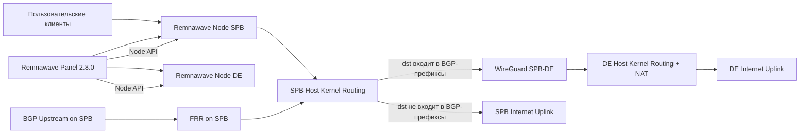

# Настройка Remnawave 2.8.0 для схемы SPB и DE

> [!WARNING]
> Это архивный исследовательский отчёт, а не действующий production-runbook.
> Описанный ниже вариант с WireGuard был впоследствии отклонён из-за риска
> блокировки в РФ и не должен применяться. Актуальная реализация использует
> Remnawave/Xray и VLESS-мост между нодами; нормативные требования и текущее
> состояние находятся в `CyberVPN_Premium_Smart_RU_Workflow_Architecture.md`,
> `CyberVPN_Premium_Smart_RU_Hardened_Rollout_TZ_2026_07_09.md` и
> `CYBERVPN_TASK1_TASK2_PRODUCTION_ARCHITECTURE.md`.

## Executive summary

Для вашей цели оптимальная схема выглядит так: **Remnawave Panel 2.8.0** управляет двумя нодами, но **маршрутизацию BGP и egress-логику нужно строить вне Remnawave**, на уровне Linux-хоста и отдельного BGP-демона. Для Remnawave 2.8.0 официально документированы панель, ноды, Xray-ориентированные функции, вебхуки, метрики и клиентские интеграции вокруг подписок, но не встроенный BGP-стек. Поэтому для приёма BGP на SPB и перенаправления этих префиксов через DE разумно использовать **FRR**, а не пытаться сделать это “внутри панели”. Remnawave Node 2.8.0 совместим с Xray-core **v26.6.27+**, а официальная compose-конфигурация панели использует `remnawave/backend:2`, PostgreSQL **18.4** и Valkey **9-alpine**; для детерминированного развёртывания версию панели нужно **вручную закрепить на 2.8.0**. citeturn34search5turn38search0turn33search0turn34search0turn24search3

Для собственно трафика пользователей лучший путь — **не policy-based routing через fwmark как основной механизм**, а **route-based routing**: на SPB BGP-префиксы, полученные от провайдера, должны устанавливаться в kernel RIB с next-hop на туннель до DE, так чтобы трафик к этим назначениям уходил в WireGuard/GRE-туннель и NAT’ился уже на DE. Весь прочий трафик будет уходить в обычный default route SPB. Policy routing (`ip rule`) имеет смысл как дополнительный слой или для последующей сегментации по пользователям/нодам/портам, но не как базовый механизм для динамического полного BGP-feed в двухсерверной схеме. FRR поддерживает route-maps, `set ip next-hop`, `set table`, ECMP (`maximum-paths`), BFD, GTSM (`ttl-security`), MD5 для BGP-сессий и фильтрацию через prefix-list/AS-path, что покрывает почти все ваши требования. citeturn42view0turn42view1turn20search6turn47view2turn45search2turn46view0turn42view2turn42view3

По приложениям **Happ** и **INCY** ключевой минимум уже понятен из их публичной документации: оба клиента умеют отображать использованный трафик и дату окончания подписки через заголовок `subscription-userinfo`; Happ также использует **Provider ID** для расширенной статистики использования и активных устройств, а INCY имеет отдельный **Premium API** с доменным SHA-256-хешем и HWID-хешем для кастомизации UI/настроек/лимитов устройств. В Remnawave 2.8.0 придётся делать либо **middleware-адаптер подписки**, либо небольшой форк/плагин панели, чтобы стабильно отдавать app-specific headers/body и принимать app-specific callbacks. Дополнительно важно учесть изменения 2.8.0: старые expiration events удалены и заменены на `user.expiration`, поле `isHwidLimited` в raw-подписке заменено на `hwidCheckup`, а эндпоинт `/api/system/tools/happ/encrypt` удалён. citeturn17view0turn17view1turn17view2turn17view3turn10search1turn10search2turn9view0turn38search3

## Предположения и рекомендуемая архитектура

Я исхожу из следующих предположений, потому что они не были заданы явно: реальные **AS-номера и списки префиксов** у провайдеров не указаны; **root-доступ на обоих серверах** есть; тип и модель **BGP-провайдеров** не указаны; панель будет размещена на SPB, а DE выступит нодой и egress-шлюзом; между SPB и DE будет поднят отдельный L3-туннель, для примеров ниже — **WireGuard**. Эти предположения нужны, чтобы дать конкретные конфиги и команды, а все значения ASN/IP ниже помечены как placeholders, которые вы замените при внедрении. Сама архитектура при этом полностью совместима с моделью Remnawave “Panel + Nodes”, потому что официально панель и нода — это разные компоненты, а нода является контейнером с Xray-core. citeturn34search5turn28search2

Для нового внедрения я рекомендую **FRR**, а не Quagga. FRR — актуально поддерживаемый форк Quagga, умеет работать с большими таблицами, BFD, современными route-map-операциями и активно документируется. Quagga сама по себе остаётся исторически важным пакетом, но для новой продовой схемы с dual-exit логикой и failover она хуже по поддержке и экосистеме. Встроенного документированного BGP-стека в Remnawave 2.8.0 нет: официально нода описана как контейнер с Xray-core, а новые функции 2.8.0 для ноды касаются Xray, плагинов и AS-list в плагинах, но не eBGP/FRR-уровня. Это значит, что BGP следует размещать на хосте рядом с remnawave-node, а не внутри панели. citeturn24search3turn24search1turn24search0turn34search5turn38search0

Ниже — рекомендуемая топология.



Логика потока данных такая: клиент подключается к **SPB node**; Xray создаёт исходящее соединение на SPB; Linux-таблица маршрутизации на SPB решает, что делать дальше; если destination попадает в набор BGP-префиксов, маршрут ведёт в туннель на DE и уже DE делает SNAT/MASQUERADE наружу; если destination не попадает в такие префиксы, пакет идёт обычным uplink SPB. Это позволяет не усложнять Xray/Remnawave-логику и использовать сильные стороны FRR и kernel routing. Linux policy routing через `ip rule` при этом остаётся вторичным инструментом, а не ядром схемы. `ip rule` вообще предназначен для policy routing в RPDB, тогда как классический путь в интернете остаётся destination-based routing; `throw`-route и отдельные таблицы можно использовать, если вы захотите позже усложнить политику. citeturn21search0turn21search1turn42view0turn42view1

Для выбора инструмента краткое сравнение выглядит так.

| Инструмент | Что умеет | Плюсы | Минусы | Рекомендация |
|---|---|---|---|---|
| **FRR** | Полный routing suite: BGP, route-maps, ECMP, BFD, policy features | Активно поддерживается, умеет large/full tables, есть официальный repo/doc | Чуть выше сложность, чем у legacy-решений | **Да, основной выбор** citeturn24search3turn25search1turn47view2 |
| **Quagga** | Исторический routing suite с BGP/OSPF/RIP | Простая для legacy-инсталляций | Уступает FRR по актуальности и сопровождению | Только при наличии legacy-наследия citeturn24search0turn24search1 |
| **Kernel + iproute2 без BGP-демона** | Статические таблицы/`ip rule` | Минимум зависимостей | Не умеет принимать/держать динамический eBGP feed | Для вашей задачи **нет** citeturn21search0turn21search1 |
| **“Встроенный Remnawave”** | Управление нодами/Xray/подписками/вебхуками, но не документированный eBGP | Хорош для прокси-уровня | Нет официально описанного встроенного BGP | Использовать только вместе с FRR/внешним routing stack citeturn34search5turn9view0 |

## Установка и настройка серверов

### SPB

На SPB вы размещаете панель и SPB-ноду. Для самой панели Remnawave официальный путь установки такой: создать `/opt/remnawave`, скачать `docker-compose-prod.yml` и `.env.sample` из репозитория backend, сгенерировать секьюрные секреты, затем поднять `docker compose up -d`. Документация отдельно подчёркивает, что панель нельзя напрямую выставлять в интернет и что она должна висеть на `127.0.0.1` за reverse proxy; для корректной работы подписок `/api/sub/` должен оставаться доступным публично, а доступ к остальной панели следует ограничить reverse proxy/SSO/IP ACL. Официальный compose использует `remnawave/backend:2`, PostgreSQL **18.4**, Valkey **9-alpine** и связывает порты панели и метрик только с `127.0.0.1`. Если вам нужен именно **2.8.0**, а не future `2.x`, поменяйте образ вручную на `remnawave/backend:2.8.0` или соответствующий `ghcr.io` tag. citeturn28search2turn33search0turn11search0turn30search13turn34search0turn34search1

Пример того, что надо изменить в `/opt/remnawave/docker-compose.yml` для пинования версии:

```yaml
services:
  remnawave:
    image: remnawave/backend:2.8.0
    container_name: remnawave
    hostname: remnawave
    ports:
      - 127.0.0.1:3000:${APP_PORT:-3000}
      - 127.0.0.1:3001:${METRICS_PORT:-3001}
```

Минимально важные переменные в `/opt/remnawave/.env` для вашей задачи — это домены, JWT-секреты, webhook и метрики. В 2.8.0/2.8.1 особенно важны `EXPIRATION_NOTIFICATIONS_ENABLED`, `EXPIRATION_NOTIFICATIONS`, `WEBHOOK_ENABLED`, `WEBHOOK_URL`, `WEBHOOK_SECRET_HEADER`, `METRICS_USER`, `METRICS_PASS`, а также сохранение `SERVICE_DISABLE_SRH_RECORDS=false`, если вы хотите иметь историю запросов подписок для app-level аналитики. Документация также напоминает, что изменения в `.env` требуют **recreate контейнеров**, а не обычного restart. citeturn32view0turn10search2turn28search0turn9view0

Практический `.env`-фрагмент под ваш кейс:

```dotenv
APP_PORT=3000
METRICS_PORT=3001

FRONT_END_DOMAIN=panel.example.com
PANEL_DOMAIN=panel.example.com
SUB_PUBLIC_DOMAIN=panel.example.com/api/sub

JWT_AUTH_SECRET=REPLACE_64B
JWT_API_TOKENS_SECRET=REPLACE_64B

IS_DOCS_ENABLED=true
SWAGGER_PATH=/docs
SCALAR_PATH=/scalar

WEBHOOK_ENABLED=true
WEBHOOK_URL=https://ops.example.com/remnawave/webhook
# Inject the webhook authentication header at deploy time; never commit its value.

EXPIRATION_NOTIFICATIONS_ENABLED=true
EXPIRATION_NOTIFICATIONS=[-72,-48,-24,24]

METRICS_USER=metrics
METRICS_PASS=REPLACE_64B

SERVICE_DISABLE_SRH_RECORDS=false
```

SPB-ноду для версии 2.8.0 **нужно генерировать из панели**, а не собирать по памяти: официальная инструкция для Remnawave Node говорит зайти в `Nodes -> Management`, добавить ноду, обратить внимание на `Node Port`, затем нажать `Copy docker-compose.yml` и развернуть его на сервере. Это важно, потому что node-compose зависит от сгенерированных panel/node credentials и текущего контракта ноды. Для “жёсткой” фиксации версии используйте ноду **2.8.0**, чтобы совпадать с релизом node и Xray-core `v26.6.27+`. citeturn34search5turn38search0

На SPB дополнительно нужно поставить WireGuard и FRR. Для FRR лучше использовать официальный Debian/Ubuntu-репозиторий FRRouting: на Debian 12/13 сейчас опубликованы, в частности, ветки **10.4** и **10.6**, а `frr-stable` указывает на последний стабильный релиз; для новой установки сегодня практичнее ставить `frr-10.6`, но синтаксис ниже остаётся валидным для stable 10.x. После установки FRR нужно явно включить daemons через `/etc/frr/daemons`, потому что после свежей установки FRR ничего не делает, пока вы не активируете нужные сервисы. citeturn25search1turn25search2turn49search0

Команды установки на SPB:

```bash
# WireGuard
apt update
apt install -y wireguard

# FRR official repo
curl -s https://deb.frrouting.org/frr/keys.gpg | sudo tee /usr/share/keyrings/frrouting.gpg > /dev/null
FRRVER="frr-10.6"
echo "deb [signed-by=/usr/share/keyrings/frrouting.gpg] https://deb.frrouting.org/frr $(lsb_release -s -c) $FRRVER" \
  | sudo tee /etc/apt/sources.list.d/frr.list

apt update
apt install -y frr frr-pythontools
```

Файл `/etc/frr/daemons` на SPB должен включать минимум `zebra`, `bgpd`, а если вы хотите BFD — ещё и `bfdd`. FRR документирует, что этот файл обычно находится именно в `/etc/frr/daemons`, а `vtysh.conf` фиксированно живёт в `/etc/frr/vtysh.conf`. citeturn49search0turn49search2

Пример:

```bash
# /etc/frr/daemons
zebra=yes
bgpd=yes
bfdd=yes
```

Параллельно создайте системные сетевые файлы:

```bash
# /etc/iproute2/rt_tables
100 de_egress
```

```bash
# /etc/sysctl.d/99-remna-routing.conf
net.ipv4.ip_forward=1
net.ipv6.conf.all.forwarding=1
```

Linux kernel официально документирует `ip_forward` как sysctl для включения форвардинга пакетов между интерфейсами; для IPv4 он по умолчанию выключен. FRR-документация для Linux также отдельно упоминает необходимость включить IPv4/IPv6 forwarding. citeturn27search0turn49search13

### DE

На DE вам нужна DE-нода Remnawave, WireGuard-туннель к SPB и NAT/forwarding. Саму ноду снова правильнее развернуть из сгенерированного panel-compose для node, а не собирать вручную. На уровне релиза нужно следить за тем, чтобы DE-нода была именно ветки **2.8.0**, потому что релиз ноды 2.8.0 обновил Xray-core до `v26.6.27`, заменил `supervisord` на `s6-overlay` и изменил внутреннюю организацию node runtime. citeturn34search5turn38search0

Пример WireGuard-конфигурации на SPB:

```ini
# /etc/wireguard/wg-de.conf
[Interface]
Address = 10.200.0.1/30
ListenPort = 51820
PrivateKey = SPB_PRIVATE_KEY
MTU = 1420

[Peer]
PublicKey = DE_PUBLIC_KEY
Endpoint = DE_PUBLIC_IP:51820
AllowedIPs = 10.200.0.2/32
PersistentKeepalive = 25
```

И на DE:

```ini
# /etc/wireguard/wg-spb.conf
[Interface]
Address = 10.200.0.2/30
ListenPort = 51820
PrivateKey = DE_PRIVATE_KEY
MTU = 1420

[Peer]
PublicKey = SPB_PUBLIC_KEY
AllowedIPs = 10.200.0.1/32
PersistentKeepalive = 25
```

Для MTU базовое безопасное стартовое значение у WireGuard-туннеля на VPS — **1420**, а затем его нужно подтвердить тестами PMTUD. Стандарты PMTUD для IPv4 и IPv6 — это RFC 1191 и RFC 8201; Linux `ip link` позволяет менять MTU через `ip link set dev ... mtu ...`. Идея здесь простая: сначала стартовать с безопасного MTU, не ломать PMTUD и только потом снижать/поднимать по фактическим тестам, если видите blackhole или фрагментацию. citeturn26search0turn26search1turn26search2

На DE для NAT есть два нормальных варианта: **nftables** и **iptables**. В современных дистрибутивах я бы ставил `nftables`, но если у вас уже всё на `iptables-nft` и команде удобно так, можно оставить iptables. Документация netfilter говорит, что `masquerade` — это частный случай SNAT, удобный для динамического адреса внешнего интерфейса; `iptables-extensions` отдельно напоминает, что при **статическом** IP лучше использовать **SNAT**, а не MASQUERADE. Для VPS с гарантированным статическим IP DE я бы выбрал SNAT; для “любой хостинг, любой uplink” — MASQUERADE. citeturn22search0turn22search1turn22search5

Рекомендуемый `nftables`-вариант на DE:

```nft
# /etc/nftables.conf
flush ruleset

table inet filter {
  chain input {
    type filter hook input priority filter; policy drop;
    ct state established,related accept
    iif "lo" accept
    tcp dport {22, 443} accept
    udp dport 51820 accept
  }

  chain forward {
    type filter hook forward priority filter; policy drop;
    ct state established,related accept
    iifname "wg-spb" oifname "eth0" accept
    iifname "eth0" oifname "wg-spb" ct state established,related accept
  }

  chain output {
    type filter hook output priority filter; policy accept;
  }
}

table ip nat {
  chain postrouting {
    type nat hook postrouting priority srcnat; policy accept;
    iifname "wg-spb" oifname "eth0" snat to DE_PUBLIC_IP
    # если IP не гарантирован статический:
    # iifname "wg-spb" oifname "eth0" masquerade
  }
}
```

И аналог на `iptables` для тех, кто хочет остаться на нём:

```bash
iptables -P FORWARD DROP
iptables -A FORWARD -m conntrack --ctstate ESTABLISHED,RELATED -j ACCEPT
iptables -A FORWARD -i wg-spb -o eth0 -j ACCEPT
iptables -A FORWARD -i eth0 -o wg-spb -m conntrack --ctstate ESTABLISHED,RELATED -j ACCEPT

# для статического IP
iptables -t nat -A POSTROUTING -i wg-spb -o eth0 -j SNAT --to-source DE_PUBLIC_IP

# для динамического IP
# iptables -t nat -A POSTROUTING -i wg-spb -o eth0 -j MASQUERADE
```

Сравнение NAT-подходов:

| Подход | Когда использовать | Плюсы | Минусы |
|---|---|---|---|
| **nftables + SNAT** | DE имеет стабильный публичный IP | Чётко, предсказуемо, современный стек | Нужно явно задать source IP citeturn22search1 |
| **nftables + masquerade** | DE IP может меняться | Проще при динамике uplink | Чуть менее детерминированно для строгого egress design citeturn22search0 |
| **iptables + SNAT** | Уже есть legacy-стек iptables | Совместимо со старыми playbooks | Менее современно, но рабоче citeturn22search2turn22search5 |
| **iptables + MASQUERADE** | Динамический uplink в legacy-стеке | Простая операция | Для статического IP manpage рекомендует лучше SNAT citeturn22search5 |

## BGP и маршрутизация

### Рекомендуемый основной вариант

Для вашей цели я рекомендую **не PBR**, а **входящий BGP route-map на SPB**, который меняет next-hop полученных маршрутов на адрес DE внутри WireGuard-туннеля. FRR официально поддерживает в route-map операции `set ip next-hop`, `set table`, `match ip address prefix-list`, `match as-path`, а также peer-security через MD5 (`neighbor ... password`) и GTSM (`ttl-security`). Это даёт всё необходимое, чтобы: принимать BGP у провайдера на SPB; при необходимости фильтровать/матчить префиксы; устанавливать для них next-hop на DE; тем самым заставлять Linux-ядро на SPB уводить трафик к этим destination prefixes через DE. В результате **остальной трафик**, не совпадающий с BGP-маршрутами, продолжит уходить через обычный default route SPB. citeturn42view0turn42view1turn42view2turn42view3turn46view0turn45search2

Пример `/etc/frr/frr.conf` на SPB с placeholder-значениями:

```frr
frr version 10.x
frr defaults traditional
hostname spb-gw
service integrated-vtysh-config
log syslog informational
!
router bgp 65010
 bgp router-id 203.0.113.10
 bgp fast-external-failover
 neighbor 198.51.100.1 remote-as 64501
 neighbor 198.51.100.1 description SPB_UPSTREAM_1
 neighbor 198.51.100.1 password REPLACE_BGP_MD5
 neighbor 198.51.100.1 ttl-security hops 1
 neighbor 198.51.100.1 timers 10 30
 neighbor 198.51.100.1 soft-reconfiguration inbound
 !
 address-family ipv4 unicast
  neighbor 198.51.100.1 activate
  neighbor 198.51.100.1 prefix-list PL-IN-ALL in
  neighbor 198.51.100.1 route-map RM-BGP-TO-DE in
 exit-address-family
!
ip prefix-list PL-IN-ALL seq 10 permit 0.0.0.0/0 le 32
!
route-map RM-BGP-TO-DE permit 10
 set ip next-hop 10.200.0.2
!
```

Если вам нужно матчить не “всё, что пришло из BGP” от конкретного peers, а подмножество, вы можете повесить более строгие `prefix-list` или `as-path` filters. Если later появятся несколько провайдеров/сессий, делайте отдельный `route-map` на каждого peers, а не общий “permit all”. Если вы планируете анонсировать свой ASN наружу и влиять на inbound traffic engineering, FRR поддерживает `set as-path prepend` и `neighbor ... local-as ... no-prepend replace-as dual-as`, но для вашей текущей задачи **import-steering** через DE эти механизмы вторичны. citeturn42view2turn42view3turn48view2turn48view0

### Почему не делать основной механизм на `ip rule`

`ip rule` и отдельные таблицы нужны, когда вы хотите принимать решение не только по destination, но и по source address, fwmark, входному интерфейсу или другим policy-критериям. Linux manpage прямо определяет `ip rule` как управление RPDB, то есть policy routing database. Для вашего конкретного кейса набор целевых префиксов уже приходит из BGP, а решение тоже чисто destination-based — значит, естественнее и надёжнее обновлять **маршруты**, а не отдельно строить набор marks/rules. PBR через `ip rule` здесь становится оправданным только в двух случаях: если вы хотите выделить отдельную таблицу egress-а для части нод/пользователей; если вы хотите жёстко изолировать туннельный маршрутный домен и не трогать main table. citeturn21search0turn21search1

Если же вы всё-таки захотите альтернативный PBR-вариант, FRR умеет `set table`, а также знает понятия PBR и non-standard route tables. Но тогда нужен второй механизм, который заставит нужные пользовательские потоки искать маршрут именно в этой таблице — через `ip rule`/fwmark или через FlowSpec/PBR. Для двухсерверной Remnawave-схемы это уже заметно сложнее и я бы не выбирал такой дизайн на первом этапе. citeturn42view1turn44view2turn44view0

### Фильтры, ECMP, AS-path и failover

По фильтрации безопасный минимум такой: на каждом eBGP peer задавать **MD5 password**, **ttl-security hops**, явный `prefix-list` inbound и, при необходимости, `maximum-prefix`. FRR отдельно предупреждает, что `maximum-prefix` разрушительнее, чем prefix-list, потому что при переполнении он рвёт саму BGP-сессию; на практике фильтрация префиксов более разумна, а `maximum-prefix` стоит использовать как аварийный стопор, а не основной policy-tool. citeturn46view0turn45search2turn48view3

ECMP сейчас вам не нужен, потому что DE один. Но если позже будет два DE-egress узла, FRR поддерживает `maximum-paths` для eBGP/ iBGP multipath. Аналогично, `local-as`, `replace-as` и prepend нужны только если вы начнёте делать сложный TE с провайдерами и собственным ASN. Для текущей цели это не требуется и не стоит сразу добавлять лишнюю изменчивость в AS_PATH. citeturn20search6turn48view2

По failover в двухсерверной схеме есть три разумных режима:

| Режим | Что происходит при падении DE/tunnel | Плюсы | Минусы |
|---|---|---|---|
| **Fail-closed** | BGP-направляемые через DE префиксы перестают быть доступны | Политика сохраняется строго | Частичная потеря связности |
| **Fail-open** | Автоматизация снимает DE-steering и трафик уходит через SPB | Максимум доступности | Временно нарушается исходная policy |
| **Future active-active** | Две DE-ноды + ECMP/BFD | И доступность, и масштаб | Существенно сложнее |

Для быстрой сходимости на уровне BGP используйте `bgp fast-external-failover` и BFD там, где peer это поддерживает. FRR документирует, что `bgp fast-external-failover` для eBGP по сути включён по умолчанию, а BFD даёт немедленное уведомление BGP при падении наблюдаемого peer. Если later захотите сделать tunnel-health influence на policy, можно добавить отдельную автоматику: health-check на SPB при падении туннеля выключает/заменяет входящий route-map и делает soft refresh BGP, переводя трафик в fail-open режим. citeturn47view3turn47view2

### Команды проверки и отладки

Для BGP и маршрутов на SPB полезны такие команды:

```bash
# FRR / BGP
vtysh -c "show bgp ipv4 unicast summary"
vtysh -c "show ip bgp summary wide"
vtysh -c "show ip bgp neighbors 198.51.100.1 received-routes"
vtysh -c "show ip bgp route-map RM-BGP-TO-DE"
vtysh -c "show ip route"

# Linux routing
ip route
ip route get 8.8.8.8
ip rule show

# Tunnel
wg show
ip link show wg-de

# Capture
tcpdump -ni wg-de host 8.8.8.8
tcpdump -ni eth0 host 8.8.8.8
```

FRR официально документирует команды семейства `show bgp ... summary`, `show [ip] bgp ... neighbors ... received-routes`, `show [ip] bgp ... route-map ...`, а Linux — `ip route` и `ip rule` для просмотра routing tables и RPDB. Для deep debug FRR полезны `debug bgp neighbor-events`, `debug bgp updates`, а в случае FlowSpec/PBR — `debug bgp pbr`. citeturn43view0turn43view1turn43view3turn21search0turn21search1turn44view1

Для DE важны проверки форвардинга и NAT:

```bash
sysctl net.ipv4.ip_forward
sysctl net.ipv6.conf.all.forwarding

nft list ruleset
# или:
iptables -S
iptables -t nat -S

ip route get 1.1.1.1
wg show
tcpdump -ni wg-spb
tcpdump -ni eth0
```

## Интеграция INCY и Happ

### Что already умеют приложения и что это значит для Remnawave

По публичной документации **Happ** и **INCY** оба приложения умеют показывать строку состояния подписки через `subscription-userinfo`, в которой передаются `upload`, `download`, `total`, `expire`. Для Happ это показано как отображение использованного трафика и даты окончания подписки; для INCY — как “Subscription status” с теми же полями. Значит, если ваша подписка или subscription-adapter стабильно отдаёт этот заголовок, обе программы смогут показать расход трафика и срок действия без отдельного app API. citeturn17view1turn17view0

По HWID Remnawave уже официально знает оба клиента: и Happ, и Incy перечислены среди приложений, которые поддерживают HWID Device Limit. Более того, Remnawave 2.7.5+ умеет возвращать клиенту специальные HWID-related headers (`x-hwid-active`, `x-hwid-not-supported`, `x-hwid-max-devices-reached`, `x-hwid-limit`), что полезно для app-side UX. В 2.8.0 raw subscription changed: вместо булевого `isHwidLimited` теперь приходит объект `hwidCheckup`, который даёт более детальное состояние проверки устройства. Это важно учесть в ваших интеграционных слоях и UI-патчах панели. citeturn10search1turn9view0

Для Happ важен **Provider ID**: документация описывает его как идентификатор, который связывает подписку с аккаунтом на happ-proxy.com, открывает расширенную статистику использования приложения и более точный учёт активных устройств. Документация отдельно говорит, что для advanced parameters и application settings management этот параметр обязателен. Happ также умеет принимать app-management-параметры через HTTP headers или body: `profile-title`, `subscription-userinfo`, `support-url`, `profile-web-page-url`, `new-url`, `new-domain`, `fallback-url`, маршрутизацию, forced-HWID и механизмы напоминаний об окончании подписки. Но в 2.8.0 эндпоинт панели `/api/system/tools/happ/encrypt` уже удалён, так что шифрование/генерацию нужных Happ-специфичных ссылок придётся выносить в отдельную утилиту или middleware. citeturn17view3turn18view0turn18view1turn18view2turn18view3turn18view4turn9view0

Для INCY кроме обычных subscription headers существует отдельный **Premium API**: приложение при добавлении подписки вычисляет SHA-256 от домена и запрашивает `/api/subscription/config?h=<sha256hex>&hwid=<sha256hex>`, а сервер возвращает зашифрованный AES-256-GCM ответ с настройками провайдера, logo/theme/settings и флагами premium/device-limit. Публичная документация INCY также показывает, что при Premium-подписке API-значения имеют приоритет над заголовками. Это означает простую развилку: если вам нужен только вывод трафика/expire/support/routing — достаточно HTTP headers/subscription body; если нужен полный provider UX в INCY — нужен отдельный Premium API-совместимый слой. citeturn17view2turn16search1turn16search13

### Что я рекомендую сделать в Remnawave-панели

На практике я рекомендую **не модифицировать core subscription generator Remnawave слишком глубоко**, а вставить между `/api/sub/...` и клиентом тонкий **subscription-adapter service**. Он будет: получать базовую подписку из Remnawave; определять приложение по `User-Agent` и HWID-related заголовкам; добавлять нужные app-specific response headers/body; для INCY при необходимости обслуживать Premium API-совместимый endpoint; для Happ — отдавать Provider ID и app-management параметры. Такой подход устойчивее к будущим обновлениям Remnawave, потому что в 2.8.0 уже были изменения вебхуков, raw subscription payload и удаление Happ encrypt endpoint. citeturn9view0turn10search2

Минимальный набор предлагаемых **изменений API** со стороны панели/адаптера:

```http
GET /api/apps/subscription-metadata/{shortUuid}?app=happ|incy
GET /api/apps/subscription-raw/{shortUuid}
GET /api/incy/subscription/config?h=<sha256hex>&hwid=<sha256hex>
POST /api/apps/provider-events/happ
POST /api/apps/provider-events/incy
```

Смысл такой: первый endpoint выдаёт уже собранный app-specific metadata bundle; второй — обеспечивает “внутренний” сырой доступ для adapter service; третий — совместим с INCY Premium API; остальные — факультативные callback/telemetry endpoins, если вы захотите полноценную device/statistics синхронизацию.

Для **DB-схемы** я бы не трогал core users table, а добавил новый модуль таблиц, жёстко опираясь на `userId BIGINT`, потому что 2.8.0 уже перевёл связанные таблицы с `userUuid` на `userId`. Пример минимального SQL-слоя:

```sql
create table app_provider_profiles (
  id bigserial primary key,
  app varchar(16) not null check (app in ('happ', 'incy')),
  provider_code varchar(64) not null,
  auth_key varchar(128),
  display_name varchar(128),
  enabled boolean not null default true,
  created_at timestamptz not null default now(),
  updated_at timestamptz not null default now()
);

create table app_provider_domains (
  id bigserial primary key,
  provider_profile_id bigint not null references app_provider_profiles(id) on delete cascade,
  domain text not null,
  domain_sha256 char(64),
  is_primary boolean not null default false,
  created_at timestamptz not null default now()
);

create table app_user_overrides (
  id bigserial primary key,
  user_id bigint not null,
  app varchar(16) not null check (app in ('happ', 'incy')),
  profile_title text,
  profile_description text,
  support_url text,
  profile_web_page_url text,
  provider_id text,
  autorouting_url text,
  routing_payload text,
  happ_new_url text,
  happ_new_domain text,
  happ_fallback_url text,
  force_hwid boolean not null default false,
  expiration_notifications boolean not null default true,
  created_at timestamptz not null default now(),
  updated_at timestamptz not null default now()
);

create table app_device_registry (
  id bigserial primary key,
  user_id bigint not null,
  app varchar(16) not null check (app in ('happ', 'incy')),
  hwid_hash char(64),
  hwid_raw_enc text,
  device_os varchar(32),
  os_version varchar(32),
  device_model varchar(128),
  first_seen_at timestamptz not null default now(),
  last_seen_at timestamptz not null default now(),
  source_ip inet
);

create table app_subscription_access_log (
  id bigserial primary key,
  user_id bigint,
  app varchar(16),
  short_uuid varchar(64),
  provider_profile_id bigint references app_provider_profiles(id),
  domain_sha256 char(64),
  hwid_hash char(64),
  request_ip inet,
  user_agent text,
  http_status int,
  created_at timestamptz not null default now()
);
```

Такой дизайн совместим с тем, что Remnawave уже умеет отправлять user- и user_hwid_devices-webhooks, а также с тем, что INCY использует `hwidHash`, чтобы проверять device limit, не зная оригинальный HWID. Для Happ, если вам нужна экосистемная совместимость, можно хранить raw HWID в зашифрованном виде (`hwid_raw_enc`) и параллельно индексировать hash. Для privacy-first схемы можно хранить только hash и минимальный device fingerprint. citeturn10search2turn16search4turn17view3turn9view0

### Примеры app-specific ответов

Минимально достаточный ответ для **Happ**:

```http
HTTP/1.1 200 OK
content-type: text/plain
profile-title: My VPN
subscription-userinfo: upload=0; download=1073741824; total=10737418240; expire=1790951622
support-url: https://t.me/support_bot
profile-web-page-url: https://vpn.example.com
providerid: HAPP_PROVIDER_ID
fallback-url: https://sub2.example.com/api/sub/abc123
subscription-always-hwid-enable: 1
notification-subs-expire: 1

vless://...
vless://...
```

Минимально достаточный ответ для **INCY**:

```http
HTTP/1.1 200 OK
content-type: text/plain
profile-title: My VPN
profile-description: Fast servers in Europe
profile-update-interval: 6
subscription-userinfo: upload=0;download=1073741824;total=10737418240;expire=1790951622
support-url: https://t.me/support_bot
profile-web-page-url: https://vpn.example.com
autorouting: https://cdn.example.com/routing/spb-de.json

vless://...
vless://...
```

Эти параметры прямо документированы у приложений как поддерживаемые через HTTP headers/body. У Happ advanced parameters и часть app settings требуют Provider ID; у INCY routing, metadata и Premium API documented отдельно. citeturn17view1turn18view0turn18view1turn18view3turn18view4turn17view0turn18view5turn18view7turn17view2

### Вебхуки и логирование для приложений

В Remnawave 2.8.0/2.8.1 наиболее ценные события для app integration — это `user.modified`, `user.traffic_reset`, `user.expiration`, `user_hwid_devices.added`, `user_hwid_devices.deleted`, а также `user.bandwidth_usage_threshold_reached`. Вебхуки подписываются через `.env`, подписываются заголовками `X-Remnawave-Signature` и `X-Remnawave-Timestamp`, а detailed payload schema доступна через OpenAPI-модели. Старые expiration events удалены, поэтому интеграции, которые раньше ждали `user.expires_in_72_hours`/`48`/`24` и `user.expired_24_hours_ago`, нужно переписать на `user.expiration`. citeturn10search2turn9view0

Для учёта трафика и подписок в приложениях я рекомендую фиксировать в журнале как минимум: `userId`, `shortUuid`, `app`, `request_ip`, `user_agent`, `hwid_hash`, `provider_id/provider_profile_id`, значения `upload/download/total/expire`, какой routing profile был отдан, и результат HTTP-ответа. Если хотите сохранить максимум совместимости с Remnawave 2.8.0, **не отключайте** subscription request history без необходимости, то есть оставляйте `SERVICE_DISABLE_SRH_RECORDS=false`, а свою app telemetry пишите параллельно в отдельные таблицы/stream. citeturn9view0turn32view0

## Проверка, отказоустойчивость и мониторинг

### План тестирования

Тестирование я бы разбил на пять фаз.

Сначала — **control plane**: убедиться, что `docker compose ps` у панели и нод зелёный, `GET /metrics` панели работает под basic auth, ноды видны в `Nodes -> Management`, а SPB/DE связаны через WireGuard. Remnawave официально предоставляет метрики на `METRICS_PORT`, sample Prometheus config и готовый Grafana-dashboard, а в 2.8.0/2.8.1 есть node-related metrics, включая `remnawave_node_status`, online users и load average. citeturn28search0turn9view0

Затем — **BGP plane**: на SPB должна установиться eBGP-сессия, а `show ip bgp summary wide` должен показывать prefixes received от upstream. После этого проверяете любой IP, заведомо входящий в BGP-learned prefix: `ip route get <dst>` на SPB должен показать next-hop на `10.200.0.2`/`wg-de`, а `tcpdump -ni wg-de host <dst>` должен фиксировать трафик. Для IP, не входящего в этот набор, `ip route get <dst>` должен показывать обычный uplink SPB. FRR документирует и summary-view, и received-routes, и filters-by-route-map/prefix-list. citeturn43view0turn43view1turn43view3

Третья фаза — **egress**: для BGP-направляемых целей внешний IP должен определяться как **DE**, для всех остальных — как **SPB**. На DE нужно видеть forwarded traffic с `wg-spb` на `eth0` и корректный NAT в conntrack/firewall state. Для пользователя это и есть основной acceptance criterion всей схемы. Официальное описание `masquerade`/SNAT у netfilter подтверждает, что postrouting NAT — правильное место для этого действия. citeturn22search0turn22search5

Четвёртая фаза — **app integration**: Happ и INCY должны отображать `traffic used` и `expire date` по `subscription-userinfo`, корректно видеть support/site links, а при включённом HWID — передавать ожидаемые заголовки/идентификаторы устройства. Если вы включили Happ Provider ID или INCY Premium API, проверяете ещё и provider-specific state: active devices/provider statistics/theme/settings. Remnawave нужно параллельно валидировать на получение webhook events `user.expiration` и `user_hwid_devices.*`. citeturn17view1turn17view0turn17view3turn17view2turn10search2

Пятая фаза — **negative/failure tests**: вручную рвёте WireGuard, затем BGP-сессию, затем отключаете uplink DE, затем временно запрещаете NAT на DE. В каждом сценарии заранее фиксируете ожидаемое поведение: fail-closed или fail-open. Это важно не только технически, но и организационно: команда эксплуатации должна знать, является ли “отсутствие связи только к части destination prefixes” нормальным, или автоматика обязана вернуть всё на SPB. citeturn47view3turn47view2

### Набор сценариев отказа

Практически значимые сценарии такие:

| Сценарий | Что ломается | Что проверять | Рекомендуемое действие |
|---|---|---|---|
| Падает eBGP peer на SPB | Не обновляется/исчезает BGP feed | `show bgp summary`, route count | Убедиться, что таблица очищается корректно и нет stale reroute |
| Падает туннель SPB-DE | BGP-rerouted трафик не доходит до DE | `wg show`, `ip route get`, `tcpdump` | Fail-closed или fail-open automation |
| Падает uplink DE | Туннель жив, но egress наружу не работает | `ip route get 1.1.1.1` на DE, NAT counters | Автоматически снимать reroute или принимать partial outage |
| Падает Remnawave Panel | Control plane down, data plane нод может жить | Docker logs, node status metrics | Separate SLO: panel outage не должен убивать текущий data-plane |
| Падает webhook receiver | Нет внешней app telemetry | Retries/queue/logs | Не должен ломать выдачу подписок |

Для мониторинга разумно использовать три слоя. Первый — **Remnawave metrics** с Prometheus/Grafana. Второй — **BGP checks**, например опрос `vtysh -c "show bgp ipv4 unicast summary json"` и алерт по state/prefix deltas. Третий — **path probes**: synthetic tests с SPB до наборов IP, которые должны идти через DE, и до наборов, которые должны идти напрямую через SPB. В экосистеме Remnawave также есть community tooling вроде Xray Checker и Whitebox для external availability monitoring. citeturn28search0turn28search1

## Безопасность, производительность и миграция

### Безопасность и производительность

Панель Remnawave не стоит публиковать целиком наружу. Официальная документация прямо рекомендует держать сервисы панели только на `127.0.0.1` и прятать их за reverse proxy; для `/api/sub/` можно оставить публичный доступ отдельным router’ом/ACL, а сам UI и admin endpoints ограничить IP allowlist, auth proxy или Zero Trust. Отдельная страница Panel Security предлагает Caddy, Cloudflare Zero Trust и TinyAuth for Nginx как supported способы дополнительной защиты панели. citeturn28search2turn30search13turn30search0

На BGP-границе рекомендую минимум: `neighbor ... password`, `ttl-security hops`, inbound prefix-list, понятные таймеры, отдельный description на каждого peers, soft-reconfiguration inbound только там, где действительно нужен policy reload/debug. Если позже будет много peers, помните примечание FRR про MD5 и `net.core.optmem_max` на Linux. `maximum-prefix` используйте как аварийный safeguard, а не как policy-фильтр. citeturn46view0turn45search2turn48view3

По производительности FRR официально позиционируется как пакет, способный работать с полными internet routing tables. На стороне панели Remnawave документация отдельно отмечает, что `API_INSTANCES` имеет смысл увеличивать только на больших установках — ориентир порядка **40k+ users**. Поэтому не надо заранее масштабировать panel API и усложнять BGP policy: сначала сделайте простой working design, потом профилируйте узкие места. citeturn24search3turn11search0

### Миграция и откат

По Remnawave 2.8.0/2.8.1 перед обновлением обязателен **полный backup БД и `.env`**. Официальный upgrade-гайд рекомендует обновлять сначала panel, потом nodes. Для 2.8.0+/2.8.1 надо учесть миграцию `userUuid -> userId` в `hwid_user_devices` и `user_subscription_request_history`; при очень больших таблицах часть данных может очищаться, а старые expiration webhook names больше не работают. Если у вас есть кастомный `notifications-config.yml`, нужно удалить устаревшие ключи событий, иначе панель не поднимется из-за строгой валидации конфига. citeturn9view0turn30search11

Практический план миграции я бы делал так. Сначала зафиксировать старые образы и сделать dump БД. Затем: обновить panel image до `2.8.0`, проверить `.env`, гарантировать включённый webhook secret и метрики, проверить custom notifications config, поднять panel, прогнать smoke tests по `/api/sub/...` и вебхукам, затем обновить ноды до `2.8.0`. После этого отдельно обновить или адаптировать ваш subscription-adapter под новые `user.expiration`, `hwidCheckup` и отсутствие `/api/system/tools/happ/encrypt`. Если что-то идёт не так, откат возможен только через возврат **и image tag, и dump БД**, потому что схема базы изменилась. citeturn9view0turn30search11turn38search3

### Список файлов и точные пути

Ниже — минимальный список файлов, которые реально придётся менять в вашей схеме.

| Сервер | Файл | Назначение |
|---|---|---|
| SPB | `/opt/remnawave/docker-compose.yml` | Пинование backend на `2.8.0`, базовый compose панели citeturn33search0turn34search0 |
| SPB | `/opt/remnawave/.env` | Домены, секреты, webhooks, expiration, metrics, docs citeturn32view0turn11search0 |
| SPB | `/opt/remnanode/docker-compose.yml` | Сгенерированный panel’ю compose SPB-ноды citeturn34search5 |
| SPB | `/etc/wireguard/wg-de.conf` | Туннель SPB → DE |
| SPB | `/etc/sysctl.d/99-remna-routing.conf` | `ip_forward`, IPv6 forwarding citeturn27search0turn49search13 |
| SPB | `/etc/frr/daemons` | Включение `zebra/bgpd/bfdd` citeturn49search0 |
| SPB | `/etc/frr/frr.conf` | BGP-конфигурация, route-maps, peer security, filters citeturn49search10turn24search3 |
| SPB | `/etc/frr/vtysh.conf` | Параметры vtysh при необходимости citeturn49search2 |
| SPB | `/etc/iproute2/rt_tables` | Дополнительные таблицы, если later включите PBR |
| DE | `/opt/remnanode/docker-compose.yml` | Сгенерированный panel’ю compose DE-ноды citeturn34search5 |
| DE | `/etc/wireguard/wg-spb.conf` | Туннель DE ← SPB |
| DE | `/etc/sysctl.d/99-remna-routing.conf` | Форвардинг пакетов citeturn27search0 |
| DE | `/etc/nftables.conf` | NAT/SNAT или MASQUERADE и FORWARD policy citeturn22search0turn22search1 |
| DE | `/etc/iptables/rules.v4` / `/etc/iptables/rules.v6` | Если выберете iptables вместо nftables |
| DE | `/etc/frr/daemons` и `/etc/frr/frr.conf` | Только если захотите BFD/FRR-side health on DE |

## Минимальное техническое задание

Ниже — короткое ТЗ в формате Markdown, без лишнего.

```md
# Техническое задание

## Цель

Настроить Remnawave 2.8.0 в схеме из двух серверов:
- SPB — основная пользовательская нода и место приёма BGP
- DE — дополнительная нода и интернет-egress для BGP-префиксов, получаемых на SPB

## Функциональные требования

1. Все BGP-префиксы, получаемые на SPB от внешних BGP-пиров, должны маршрутизироваться через туннель на DE.
2. Весь остальной пользовательский трафик должен выходить напрямую через SPB.
3. Remnawave Panel 2.8.0 должна управлять двумя нодами: SPB и DE.
4. Для Happ и INCY необходимо обеспечить:
   - отображение использованного трафика;
   - отображение даты окончания подписки;
   - поддержку HWID;
   - поддержку app-specific metadata через headers/body;
   - поддержку Provider ID / Premium API через отдельный adapter service.

## Технические требования

1. Использовать FRR как BGP-демон на SPB.
2. Использовать WireGuard как межсерверный туннель SPB-DE.
3. Использовать NAT/SNAT на DE для трафика, пришедшего из туннеля.
4. Версии:
   - Remnawave backend: 2.8.0
   - Remnawave node: 2.8.0
   - Xray-core on node: 26.6.27+
   - PostgreSQL: 18.4
   - Valkey: 9-alpine
   - FRR: stable 10.x, предпочтительно 10.6.x
5. Все secrets и webhooks должны быть заданы через `.env`.
6. Панель не должна быть публично доступна целиком; публичным должен быть только subscription path.

## Изменяемые файлы

### SPB
- `/opt/remnawave/docker-compose.yml`
- `/opt/remnawave/.env`
- `/opt/remnanode/docker-compose.yml`
- `/etc/wireguard/wg-de.conf`
- `/etc/sysctl.d/99-remna-routing.conf`
- `/etc/frr/daemons`
- `/etc/frr/frr.conf`
- `/etc/iproute2/rt_tables`

### DE
- `/opt/remnanode/docker-compose.yml`
- `/etc/wireguard/wg-spb.conf`
- `/etc/sysctl.d/99-remna-routing.conf`
- `/etc/nftables.conf` или `/etc/iptables/rules.v4`

## Критерии приёмки

1. BGP-сессия на SPB установлена и принимает маршруты.
2. Трафик к destination IP из BGP-префиксов идёт через DE.
3. Трафик к другим destination IP идёт через SPB.
4. Happ и INCY показывают traffic usage и expire date.
5. HWID-ограничения корректно работают для Happ и INCY.
6. Вебхуки Remnawave принимаются и обрабатываются внешним adapter service.
7. Есть документированный rollback через restore БД и возврат image tags.
```

### Итоговая рекомендация

Если свести всё к одному практическому решению, то оно такое: **оставить Remnawave 2.8.0 как систему управления панелью/нодами/подписками/вебхуками, а маршрутизацию BGP полностью вынести в хостовый FRR + Linux routing**; между SPB и DE поднять WireGuard; на SPB входящие BGP prefixes переписывать route-map’ом на next-hop DE; на DE делать SNAT/MASQUERADE; для Happ и INCY не ломать core panel, а поставить **subscription-adapter / metadata-gateway**, который добавляет app-specific headers, обслуживает Provider ID/Premium API и пишет отдельную app telemetry. Для вашего exact use case это самый прямой, управляемый и совместимый с Remnawave 2.8.0 путь. citeturn34search5turn33search0turn24search3turn17view1turn17view2turn17view3turn10search2turn9view0
