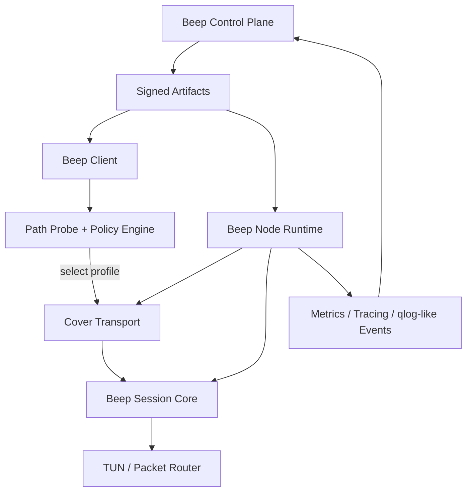

# Beep Architecture

## Design goals

`Beep` is designed around six constraints:

1. One stable session core must survive multiple outer transport generations.
2. The same client and node runtime must support both TCP-based and QUIC-based paths.
3. Policy changes must roll out as signed artifacts without forcing a binary upgrade.
4. Long-lived sessions must support resumption, rekey, and path changes cleanly.
5. Observability must be built into the protocol lifecycle, not bolted on later.
6. Rust implementation boundaries must allow swapping transport providers without rewriting the core.

## Layer model

The architecture is intentionally split into four layers:

### 1. Control plane

Responsible for:

- node identity and registration;
- issuance of access credentials and assignment data;
- distribution of signed runtime artifacts;
- staged rollout, canary, rollback, and health gates.

This layer does not carry user traffic.

### 2. Session core

Responsible for:

- end-user session establishment;
- authentication binding to node and policy;
- stream and datagram multiplexing;
- key schedule, key update, replay protection, and resumption;
- inner capability negotiation;
- error and telemetry semantics.

This is the part of `Beep` that should remain stable across several product generations.

### 3. Cover transport

Responsible for:

- outer connection establishment;
- HTTP or native transport framing;
- connection migration or fallback behavior that depends on the transport family;
- binding the session core to a live path.

This layer is replaceable.

### 4. Runtime and platform integration

Responsible for:

- TUN/TAP integration and packet I/O;
- desktop/mobile sidecar lifecycle;
- node process orchestration;
- FFI surface for UI clients;
- metrics export and tracing.

## High-level structure

## Primary components

### Beep Client

The client owns:

- local network context discovery;
- path scoring and sticky profile selection;
- resumption ticket storage;
- local TUN plumbing;
- upload of coarse session health signals.

The client must avoid oscillating between profiles on every connect attempt. Profile choice should be sticky per network class, for example per ASN plus access medium plus recent success history.

### Beep Node

The node is a multi-profile acceptor and relay. It owns:

- transport listeners for `cover_h2`, `cover_h3`, and optionally `native_fast`;
- session core termination;
- packet routing and policy enforcement;
- per-session and per-profile resource accounting;
- fine-grained failure classification for rollback signals.

The node should not embed rollout logic into ad hoc scripts. It needs a runtime coordinator that can atomically activate:

- a new `transport_profile`,
- a new `presentation_profile`,
- a new `policy_bundle`,
- a new `session_core_version`.

### Beep Control

The control plane provides:

- signed manifests;
- region and cohort assignment;
- rollout channels;
- artifact revocation;
- profile scoring feedback loops.

The control plane must treat data-plane artifacts as first-class objects, not as opaque text blobs.

### Beep Lab

`Beep Lab` is the validation environment for:

- standards interoperability;
- adverse path simulation;
- replay of previous failures;
- benchmark comparison across transports and policy revisions.

It is not optional. Without it, transport agility degrades into guesswork.

## Data flow

### Session establishment

1. Client loads signed artifacts.
2. Probe engine measures path capabilities.
3. Policy engine selects a candidate profile set.
4. Cover transport connects to the node.
5. Session core performs inner handshake and capability negotiation.
6. TUN traffic starts flowing once policy and routes are confirmed.

### Mid-session maintenance

During an established session, the system supports:

- rekey without teardown;
- policy refresh;
- route updates;
- congestion or path hint updates;
- resumption ticket refresh.

### Recovery and failover

Failures are classified in three buckets:

- pre-session failure: transport could not be established;
- session-open failure: outer transport succeeded but session core did not;
- in-session degradation: session opened, then QoS or reliability deteriorated.

This distinction matters because the next policy action differs:

- pre-session failures may trigger profile switching;
- session-open failures may trigger policy rollback;
- in-session failures may trigger rekey, resumption, or path migration depending on the transport.

## Artifact model

The architecture uses these signed objects:

| Artifact | Purpose |
| --- | --- |
| `session_core_version` | selects wire semantics and capability set |
| `transport_profile` | selects outer transport family and transport limits |
| `presentation_profile` | selects TLS/ALPN/HTTP settings and timeout behavior |
| `policy_bundle` | selects retry ladder, backoff, rollout rules, and network targeting |
| `probe_recipe` | defines what the client tests before selecting a profile |
| `assignment` | binds a client or cohort to allowed profiles and feature flags |

None of these artifacts should require a full application redeploy in the normal case.

## Compatibility strategy

`Beep` must assume the following from the start:

- not every network permits UDP reliably;
- not every path likes large `ClientHello` messages or unusual TLS extensions;
- not every environment benefits from QUIC;
- not every client platform exposes identical TUN or socket features.

Therefore the compatibility order is:

1. stable session core ABI,
2. stable artifact schemas,
3. swappable transport providers.

## Non-goals

The initial architecture explicitly does not attempt to solve:

- multipath QUIC in v1;
- kernel-bypass data planes in v1;
- exact third-party client impersonation as a required product feature;
- speculative transport generation systems as a shipping dependency.

These can be research tracks later, but they must not distort the first release.

