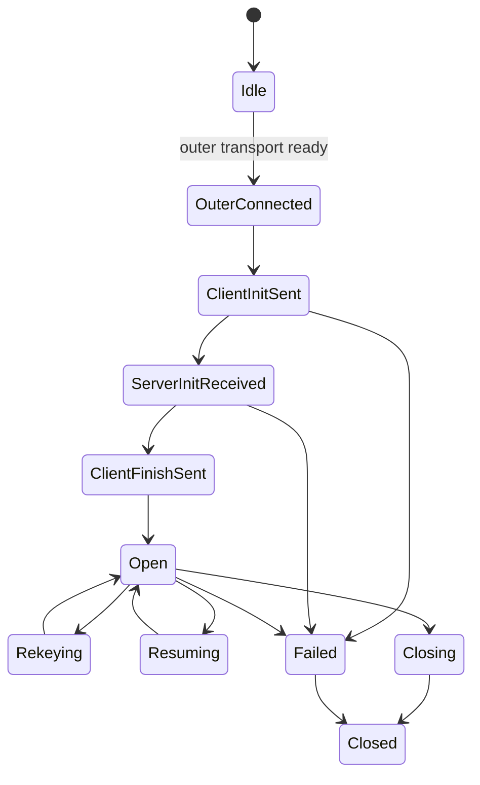

# Beep Session Core v1

## Purpose

The `Beep Session Core` is the protocol's stable inner layer. It carries the semantics that should remain valid regardless of whether the outer path is:

- HTTP/2 over TLS/TCP,
- HTTP/3 over QUIC using MASQUE building blocks,
- or a lower-overhead native transport for friendly networks.

The session core is where `Beep` is truly "our protocol".

## Design principles

### Stable semantics, replaceable transport

The session core must not depend on:

- a particular HTTP version,
- a particular TLS provider,
- outer support for ECH,
- a specific QUIC library.

### Short binary handshake

The inner handshake should be compact and binary, with explicit capability negotiation. It should not replicate a public TLS handshake inside the cover transport.

### Explicit versioning

Every session begins with explicit protocol version and feature negotiation. No field may be overloaded in ways that make wire evolution ambiguous.

### Forward compatibility

The wire format includes:

- reserved fields,
- reserved frame types,
- grease values,
- extension containers.

## Roles

### Client

Initiates a session on top of an already-established outer transport.

### Node

Accepts the session, enforces policy, and becomes the remote endpoint of the tunnel.

### Control plane

Does not participate in the data path, but issues credentials, policy bundles, and rollout assignments consumed by the session endpoints.

## Lifecycle



## Handshake outline

The session core starts only after the outer transport has been established. The transport exposes a bidirectional control channel plus optional datagram capability.

### Flight 1: `ClientInit`

Carries:

- `core_version`
- `supported_capabilities`
- `client_nonce`
- `auth_context`
- `key_share`
- optional `resumption_ticket`
- optional `path_token`
- `transport_binding`
- `grease`

`transport_binding` is a digest or transcript binding tying the session handshake to the already-established outer transport. This prevents replaying a valid inner handshake over an unrelated outer connection.

### Flight 2: `ServerInit`

Carries:

- `selected_version`
- `selected_capabilities`
- `server_nonce`
- `server_key_share`
- `node_identity`
- `session_limits`
- optional `retry_cookie`
- optional `resumption_accept`
- `policy_epoch`
- `grease`

The node may respond with a retry cookie when it wants a cheap DoS gate before committing more state.

### Flight 3: `ClientFinish`

Carries:

- handshake authenticator,
- proof of possession for the selected credential mode,
- acceptance of limits,
- optional client path hints,
- optional request for datagram and stream classes.

### Flight 4: `ServerFinish`

Carries:

- final authenticator,
- assigned session identifiers,
- route and DNS parameters,
- rekey policy,
- telemetry budget,
- resumption ticket material.

After `ServerFinish`, the session transitions to `Open`.

## Message model

The core wire format uses a compact TLV-like frame grammar with QUIC-style variable-length integers.

### Base frame header

```text
Frame {
  frame_type: varint,
  flags: u8,
  length: varint,
  payload: bytes[length],
}
```

Rules:

- unknown frame types with the `ignore` bit set are skipped;
- unknown critical frame types terminate the session with an explicit error;
- reserved frame types are exercised periodically in test builds to avoid ossification.

## Core frame families

### Handshake frames

- `CLIENT_INIT`
- `SERVER_INIT`
- `CLIENT_FINISH`
- `SERVER_FINISH`
- `RETRY`

### Session management frames

- `SESSION_UPDATE`
- `SESSION_CLOSE`
- `KEY_UPDATE`
- `TICKET_ISSUE`
- `PATH_HINT`

### Stream and datagram control frames

- `STREAM_OPEN`
- `STREAM_CLOSE`
- `FLOW_CREDIT`
- `DATAGRAM_CLASS`
- `DATAGRAM_DROP_NOTICE`

### Policy and routing frames

- `ROUTE_SET`
- `DNS_CONFIG`
- `MTU_HINT`
- `QOS_HINT`

### Telemetry frames

- `HEALTH_SUMMARY`
- `ERROR_REPORT`
- `TRACE_TOKEN`

These frames exist so the control plane can observe session behavior without depending only on outer-transport metrics.

## Cryptographic profile

The exact cryptographic provider can vary, but `v1` should standardize mandatory-to-implement primitives.

### Mandatory in v1

- KEM / key agreement: `X25519`
- AEAD: `ChaCha20-Poly1305`
- KDF: `HKDF-SHA256`
- signatures for control-plane artifacts and node identity: `Ed25519`

### Optional in v1, reserved for negotiated use

- hybrid key agreement: `X25519 + ML-KEM-768`
- AEAD: `AES-256-GCM`
- KDF: `HKDF-SHA384`
- future signature agility: `ML-DSA`

The key point is architectural, not cosmetic: the session core must negotiate these choices independently from the outer TLS handshake.

## Key schedule

The key schedule should derive distinct secrets for:

- control channel encryption,
- reliable stream traffic,
- unreliable datagram traffic,
- resumption ticket protection,
- telemetry-auth tagging,
- future rekey epochs.

A clean model is:

1. derive `handshake_secret` from the initial key exchange,
2. derive `session_master_secret`,
3. fan out labeled subkeys per traffic class and epoch.

This keeps rekey localized and auditable.

## Resumption

Resumption is a first-class feature, not an afterthought.

A resumption ticket should bind:

- client identity or cohort,
- node or cluster scope,
- policy epoch,
- capability subset,
- expiration,
- anti-replay context.

Resumption must never bypass policy changes. If the policy epoch moved incompatibly, the node may reject the ticket and force a full session open.

## Replay protection

The session core should combine:

- nonces from both sides,
- short ticket lifetimes,
- replay caches for sensitive ticket modes,
- transport binding hashes.

This is especially important if 0-RTT-like resumption is added later.

## DoS resistance

The handshake must have a cheap rejection path.

Recommended structure:

- parse a small prefix without allocating a full session object;
- optionally require a retry cookie;
- only allocate expensive session state after cookie and authenticator checks pass;
- rate-limit by node, source bucket, and policy cohort.

## Multiplexing model

The session core exposes two traffic classes:

### Reliable streams

Use for:

- DNS-over-tunnel control traffic,
- management channels,
- small request-response flows that benefit from reliability,
- control and policy updates.

### Unreliable datagrams

Use for:

- latency-sensitive traffic,
- raw packet carriage where reordering is acceptable,
- protocols that already implement their own recovery.

The session core must support both, even when the outer transport only offers a subset. On transports that lack datagram support, the runtime can map datagram-class traffic to framed reliable transport as a degraded mode with explicit policy awareness.

## Flow control

Flow control is negotiated at session open and updated dynamically.

The core should maintain:

- connection-level budget,
- stream-class budget,
- per-stream budget,
- datagram budget and burst caps.

Budgets must be observable in metrics because many production failures are caused by incorrect flow-control tuning, not by cryptography.

## Error model

Errors should be explicit, typed, and machine-aggregatable.

Suggested categories:

- `VERSION_NEGOTIATION_FAILED`
- `CAPABILITY_MISMATCH`
- `AUTH_FAILED`
- `REPLAY_REJECTED`
- `POLICY_REJECTED`
- `RESOURCE_LIMIT`
- `TRANSPORT_BINDING_FAILED`
- `REKEY_FAILED`
- `INTERNAL_ERROR`

Avoid stringly-typed free-form errors on the wire.

## Non-goals for v1

The session core v1 does not require:

- multipath scheduling,
- protocol-level padding semantics,
- built-in traffic morphing,
- raw IP routing policy languages on the wire,
- custom cryptographic novelty.

The goal is a compact, auditable, evolvable core.

